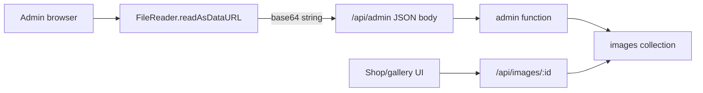
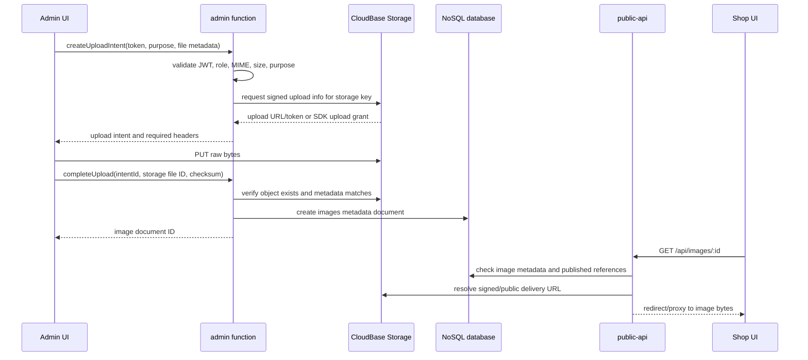
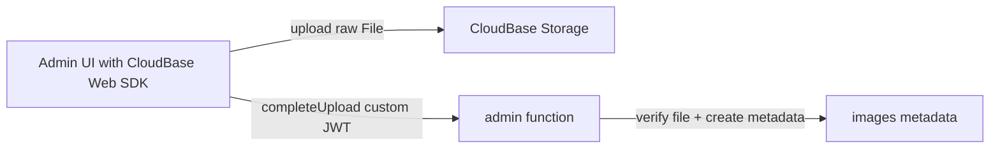
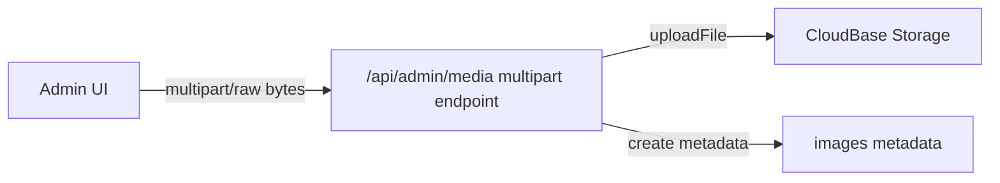
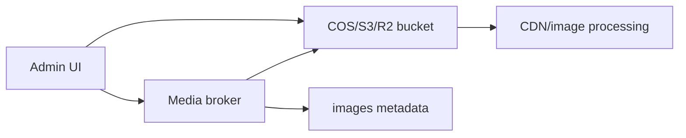
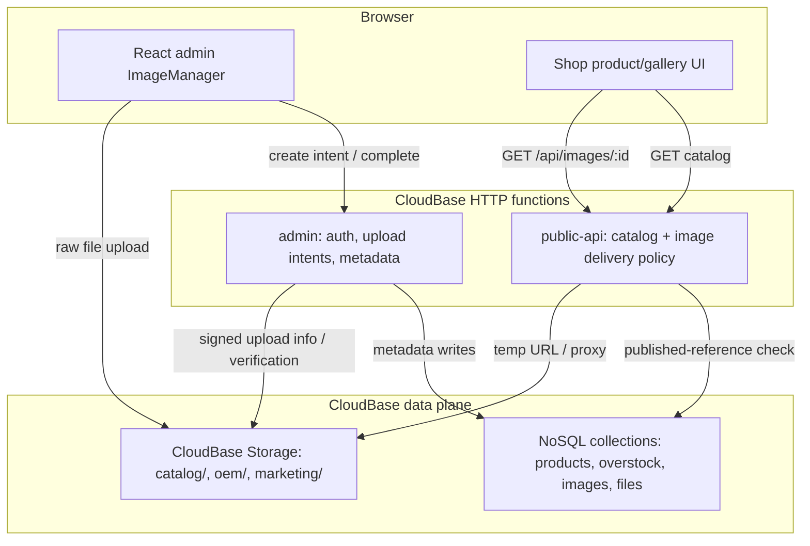

# Image Upload And Storage Design

Status: design proposal, no implementation in this branch
Scope: product images, catalog media, and adjacent uploaded files in the current CloudBase infrastructure
Last updated: 2026-06-26

## 1. Executive Summary

The current product image upload path should be replaced. It base64-encodes
browser files, embeds the bytes inside `/api/admin` JSON, and stores the bytes
inside the `images` collection. That approach is simple and useful for very small
inline assets, but it is structurally mismatched with normal product photos.

The recommended direction is a storage-first media architecture:

- Store media bytes in CloudBase Storage.
- Store media identity, ownership, purpose, variants, and lifecycle metadata in
  the database.
- Preserve the existing product `imageIds` contract so catalog records keep
  referring to image records, not raw file URLs.
- Keep a legacy base64 read path during migration, but do not use base64 for new
  product image uploads.
- Route different media classes through different policies when their size,
  privacy, format, or processing needs differ.

This means the answer is not "all images must use exactly the same upload
method." The durable model is a media asset service with a policy matrix:
product photos, thumbnails, SVG placeholders, OEM drawings, and future marketing
assets can share metadata conventions while choosing different upload transports
and storage namespaces.

## 2. Current Infra Facts

Repository facts:

- `apps/site` is an Astro static site with React islands for admin and shop UI.
- `apps/site/src/islands/admin/ImageManager.tsx` uploads selected product image
  files through `uploadImage()`.
- `apps/site/src/islands/admin/api.ts` converts each `File` to base64, then
  calls generic `createRecord('images', ...)` over `/api/admin`.
- `apps/functions/admin` exposes the custom admin API and authenticates with the
  app's JWT, not CloudBase Web Auth.
- `apps/functions/public-api` serves `/api/images/:id` by reading the `images`
  collection and returning base64 bytes as a binary response.
- `products.imageIds` and `overstock.imageIds` point to image document IDs.
- `files` uses the same base64-in-database pattern for OEM drawings.

Deployment facts from the existing CloudBase design docs:

- The deployed APIs are CloudBase HTTP access routes:
  - `/api/admin` -> `admin`
  - `/api` -> `public-api`
- The selected current environment is CloudBase NoSQL/classic mode.
- The CloudBase storage bucket exists and is private.
- The app currently uses function-mediated database access, not direct browser
  database writes.

Official CloudBase facts that matter to this design:

- CloudBase Storage is intended for unstructured data such as images, documents,
  audio, video, and files. It is backed by Tencent Cloud COS and includes CDN
  acceleration.
- Classic CloudBase Storage and PG Cloud Storage have different permission
  models. The current environment is classic mode, so this design targets classic
  mode first and keeps PG mode as a future migration concern.
- CloudBase Storage supports SDK and HTTP API upload flows, temporary/signed
  download URLs, public URLs, metadata, and image transform options.
- The HTTP storage API can provide upload information that the client can use to
  PUT bytes directly to storage.

## 3. Problem Statement

The deployed `/api/admin` route is the wrong transport for product image bytes.

Current upload flow:



Primary failure mode:

- Base64 adds about 33 percent overhead before JSON and envelope overhead.
- The gateway can reject the request before the application handler sees it.
- The effective product image cap is much lower than a normal catalog workflow
  needs.

Secondary issues:

- Database documents become heavy binary stores.
- List/get operations are more likely to move large hidden fields around.
- CDN/image transformation is harder to use cleanly.
- Upload, validation, derivative generation, public delivery, and lifecycle
  cleanup are all mixed into a generic CRUD action.

## 4. Design Goals

Goals:

- Support normal product images without routing bytes through `/api/admin` JSON.
- Keep catalog records stable: products should continue to store `imageIds`.
- Allow purpose-specific policies for size, format, visibility, and upload
  method.
- Keep admin authorization based on the current custom JWT unless a future auth
  migration explicitly changes that.
- Keep public image delivery safe: only images linked from published catalog
  records should be publicly retrievable.
- Support gradual migration from legacy base64 documents.
- Make verification and rollback straightforward.

Non-goals:

- Do not implement a quick body-limit increase as the primary fix.
- Do not require a full database migration to PostgreSQL.
- Do not expose private OEM drawings through public image routes.
- Do not replace the generic admin CRUD system for unrelated collections.

## 5. Media Classification Policy

Different files should use different policies. The architecture should make the
policy explicit instead of hiding it inside ad hoc upload code.

| Media class | Examples | Visibility | Typical size | Recommended storage | Upload method |
| --- | --- | --- | --- | --- | --- |
| Product catalog image | Headphones, overstock photos | Public after linked to published item | 100 KB to 10 MB source | CloudBase Storage, `catalog/` namespace | Admin-brokered direct upload |
| Product thumbnail/variant | Card image, admin preview, detail zoom image | Public if parent image is public | 20 KB to 500 KB | CloudBase Storage variant paths | Generated client-side first, server-side later if needed |
| Tiny inline/admin asset | Placeholder SVG, icon, color swatch | Public or internal | Under 20-50 KB | Static asset or base64 DB field | Base64 acceptable only by policy |
| OEM drawing/file | PDF, ZIP, CAD, drawing image | Private admin-only | 100 KB to 50 MB+ | CloudBase Storage, `oem/` namespace | Signed/direct upload with stricter intent, or CloudRun multipart if large |
| Marketing/site media | Hero photos, campaign media | Public | 100 KB to 20 MB | CloudBase Storage or static hosting | Storage upload plus metadata |
| Generated/exported artifact | Future catalogs, generated images | Mixed | Variable | Storage with lifecycle metadata | Backend write or async job |

Policy rules:

- Base64 is acceptable for deliberately tiny inline assets, test fixtures, and
  migration fallback.
- Product photos and OEM files should not use base64 for new writes.
- Public images should be resolved through an application route or signed/public
  URL policy, not by fabricating URLs in the browser.
- Every uploaded asset should have a purpose, owner/reference, MIME type, size,
  storage key, and lifecycle state.

## 6. Option A - Admin-Brokered Direct Upload To CloudBase Storage

This is the recommended target for product catalog images.

High-level flow:



Architecture:

- Add media-specific admin actions, for example:
  - `createMediaUploadIntent`
  - `completeMediaUpload`
  - `removeMediaAsset`
- Keep generic CRUD for metadata edits, but do not use it for media bytes.
- Store product image metadata in `images`.
- Add storage fields while preserving legacy fields:

```text
images
  _id
  name
  mimeType
  purpose: "catalog-image" | "thumbnail" | "marketing" | ...
  storageProvider: "cloudbase-storage" | "legacy-base64"
  storageFileId
  storagePath
  byteSize
  width
  height
  checksum
  variants: [
    { role, storageFileId, width, height, mimeType, byteSize }
  ]
  createdBy
  createdAt
  updatedAt
  data?              # legacy only
```

Delivery choices:

- P0 delivery: `/api/images/:id` verifies that the image is public, then returns
  a short-lived redirect to a CloudBase temp URL. This keeps app-level
  visibility rules while avoiding server-side byte streaming.
- Safer fallback: `/api/images/:id` proxies bytes from storage if redirect
  semantics or CORS are problematic.
- Later optimization: public catalog variants can use cacheable public/CDN URLs
  once access rules and invalidation are proven.

Why this fits current infra:

- Preserves the custom admin JWT model.
- Avoids sending raw bytes through `/api/admin`.
- Avoids adding direct browser database writes.
- Preserves product `imageIds` and public `/api/images/:id` compatibility.
- Works with the current CloudBase NoSQL/classic mode.

Tradeoffs:

| Dimension | Result |
| --- | --- |
| Scalability | Strong. Bytes go to object storage, not JSON functions or database docs. |
| Security | Strong if intents are short-lived and purpose-scoped. Existing admin roles remain source of truth. |
| Implementation effort | Medium. Requires new media actions, storage signing integration, metadata verification, and migration fallback. |
| UX | Good. Browser can show progress and retry raw upload independently. |
| Operational fit | Good. Uses existing CloudBase Storage and current HTTP functions. |
| Risk | The exact storage-signing mechanism must be validated in the current CloudBase classic environment before coding. |

Recommendation:

- Use Option A as the target architecture for product images.
- Validate upload-intent generation against the deployed CloudBase environment
  before implementation starts.
- Keep base64 reads only for legacy image records.

## 7. Option B - Direct Browser CloudBase Web SDK Upload

In this option, the admin UI initializes the CloudBase Web SDK and uploads files
directly with CloudBase's browser storage APIs.

High-level flow:



Strengths:

- Minimal backend byte handling.
- Uses CloudBase's intended browser storage path.
- Good upload progress support.

Costs in the current app:

- The app currently authenticates admins with a custom JWT, not CloudBase Web
  Auth.
- The deployed design notes say a publishable key is not currently present.
- Browser SDK upload also depends on safe domains/security rules being correct.
- This may introduce two auth/session models: app JWT for admin API and
  CloudBase Auth for storage.

Tradeoffs:

| Dimension | Result |
| --- | --- |
| Scalability | Strong. Bytes go directly to storage. |
| Security | Good only after CloudBase Auth/domain/storage rules are aligned with app roles. |
| Implementation effort | Medium to high because auth integration becomes part of the media work. |
| UX | Good. Native direct upload progress. |
| Operational fit | Mixed. It adds browser CloudBase SDK and CloudBase Auth concerns to an app that currently avoids direct browser CloudBase access. |
| Risk | Dual-auth drift: a user could have an app JWT state that does not match CloudBase storage permissions. |

Recommendation:

- Do not pick this as P0 unless the team wants to intentionally adopt CloudBase
  Web Auth for admin media operations.
- Keep it as a possible future simplification if CloudBase Auth becomes the
  main admin identity layer.

## 8. Option C - Server-Side Multipart Or Raw Binary Upload Endpoint

In this option, the browser sends multipart/form-data or raw binary to a media
endpoint, and the backend uploads to CloudBase Storage.

High-level flow:



Variants:

- Cloud Function multipart endpoint for moderate product images.
- CloudRun media gateway for larger OEM files, transformation jobs, malware
  scanning, or resumable uploads.

Strengths:

- Simple mental model with the current custom JWT.
- Backend can validate, transform, scan, and store in one transaction.
- Good for sensitive private uploads where direct browser storage access is not
  desired.

Costs:

- Bytes still traverse application compute.
- Cloud Function request limits can still become the bottleneck.
- Large files may need CloudRun, streaming parser support, and operational
  tuning.

Tradeoffs:

| Dimension | Result |
| --- | --- |
| Scalability | Medium in Cloud Functions, stronger if moved to CloudRun with streaming. |
| Security | Strong. Existing custom JWT remains the only browser-facing app credential. |
| Implementation effort | Medium for function, higher for CloudRun. |
| UX | Good enough for product images, better with upload progress and retry design. |
| Operational fit | Function variant is easy; CloudRun variant adds a new runtime. |
| Risk | A function endpoint may recreate a size ceiling, only higher than today. |

Recommendation:

- Use only when backend processing or stricter privacy is worth the compute hop.
- Consider CloudRun for OEM drawings and large private files, not for the first
  product-image fix unless signing direct uploads is blocked.

## 9. Option D - External Object Storage Or COS-First Media Service

In this option, media is moved to Tencent COS directly or to another object
store such as S3/R2, with the app storing keys and metadata.

High-level flow:



Strengths:

- Strongest portability and advanced storage/CDN feature choice.
- Mature direct-upload patterns, lifecycle policies, and image processing.
- Useful if the business expects many media-heavy workflows.

Costs:

- Adds another provider or a lower-level Tencent service boundary.
- Requires separate credentials, policies, lifecycle rules, observability, and
  deployment documentation.
- More operational surface than the current CloudBase-first app needs.

Tradeoffs:

| Dimension | Result |
| --- | --- |
| Scalability | Strong. |
| Security | Strong if policies are well managed, but more moving parts. |
| Implementation effort | High. |
| UX | Strong. |
| Operational fit | Lower for the current small CloudBase deployment. |
| Risk | Provider complexity can outrun the app's current needs. |

Recommendation:

- Keep as a future option if CloudBase Storage cannot meet image processing,
  CDN, lifecycle, or cost requirements.
- Do not choose it for the immediate product image fix.

## 10. Recommended Architecture

Choose Option A as the core architecture, implemented as a policy-based media
asset service.



Key decisions:

- `imageIds` remains the catalog relationship field.
- `images` becomes a media metadata collection, not a byte store.
- `data` remains supported only for `storageProvider = "legacy-base64"`.
- New product uploads use `storageProvider = "cloudbase-storage"`.
- Delivery goes through `/api/images/:id` first to preserve current public
  visibility checks.
- Generated variants are metadata children of one image record, not separate
  product references.
- Upload policies are purpose-scoped:
  - `catalog-image`
  - `catalog-thumbnail`
  - `oem-drawing`
  - `marketing-media`
  - `inline-small`

## 11. Variant And Format Strategy

Your idea is right: different image sizes, formats, and purposes should use
different storage keys and sometimes different upload/processing paths.

Recommended product image variants:

| Variant | Purpose | Format | Max dimension | Creation phase |
| --- | --- | --- | --- | --- |
| `original` | Audit/source, future reprocessing | Original MIME if allowed | Policy max, for example 4000 px edge | Upload |
| `detail` | Product detail/gallery zoom | WebP or JPEG | 1600-2000 px edge | Client-side P0, server-side later |
| `card` | Product cards and list pages | WebP or JPEG | 600-900 px edge | Client-side P0, server-side later |
| `thumb` | Admin thumbnails | WebP or JPEG | 200-320 px edge | Client-side P0 |

Format policy:

- Prefer WebP for generated display variants when browser support is acceptable.
- Preserve PNG only when transparency matters.
- Preserve SVG only for trusted/admin-provided vector assets after sanitization
  policy is decided.
- Treat GIF as legacy or special-case media; do not auto-convert animated GIFs
  without a product requirement.

Processing policy:

- P0 can generate `card` and `thumb` variants in the browser before upload.
- P1 can move variant generation to a backend job for consistent quality and
  future moderation.
- The original should be retained only if it has business value. If not, store a
  normalized high-quality `detail` variant as the highest-resolution source.

## 12. Security Model

Upload security:

- The admin function validates the app JWT and role before issuing an upload
  intent.
- Upload intents are short-lived, single-purpose, and include expected MIME,
  size range, storage namespace, and optional checksum.
- Completion verifies the object exists and matches the intent before metadata
  becomes active.
- Storage keys should be generated server-side. The browser should not choose
  arbitrary paths.

Read security:

- `/api/images/:id` continues to enforce catalog-public rules:
  - placeholder image is public
  - product/overstock images are public only when linked from published catalog
    records
  - unlinked images are not public
- OEM files remain separate from `/api/images/:id`.
- Admin-only downloads use admin-authenticated routes or private signed URLs.

Abuse controls:

- Enforce MIME allowlists and byte-size limits before upload.
- Store checksum/size for audit and duplicate detection.
- Consider rate limits on upload-intent creation.
- Consider file moderation/scanning before public visibility if real customer
  uploads become common.

## 13. Migration Strategy

Phase 0 - validation:

- Confirm the current CloudBase storage bucket, permissions, and available
  upload-signing method in the deployed test env.
- Confirm browser domain/security-domain requirements for the selected upload
  path.

Phase 1 - compatibility schema:

- Extend `images` schema to support metadata fields and `storageProvider`.
- Keep `data` optional for legacy base64 records.
- Update public image delivery to branch by provider:
  - `legacy-base64` -> existing DB byte response
  - `cloudbase-storage` -> storage temp URL redirect or proxy

Phase 2 - new upload path:

- Replace `uploadImage()` with the upload-intent flow.
- Update `ImageManager` to display progress, per-file errors, and variant
  generation status.
- Preserve returned image document IDs so product forms do not change shape.

Phase 3 - migration:

- Batch migrate old `images.data` records to CloudBase Storage.
- Update each image document with storage metadata.
- Keep a rollback window where both providers work.
- After enough production soak time, remove legacy base64 writes and eventually
  remove legacy base64 reads.

Phase 4 - OEM files:

- Apply the same storage-first model to `files` for OEM drawings.
- Decide whether public unauthenticated OEM submissions use signed direct upload
  with stricter anti-abuse controls or a CloudRun media gateway.

## 14. Implementation Boundaries

Frontend:

- `ImageManager.tsx` should become a media uploader, not a base64 encoder.
- `api.ts` should expose media-specific calls instead of using generic
  `createRecord('images', ...)` for bytes.
- Client-side variant generation can live beside the uploader, behind a clear
  policy function.

Admin function:

- Owns authorization, upload intent creation, upload completion, metadata
  creation, delete/orphan cleanup, and audit fields.
- Does not receive product image bytes in JSON.

Public API function:

- Owns public visibility checks and storage delivery indirection.
- Continues to protect unpublished and unlinked images.

Shared package:

- Updates collection registry for new metadata fields.
- Adds shared media purpose/type constants if useful.

Local server:

- Should emulate the storage-backed metadata flow enough for local development.
- It can store files on disk under a local media directory while preserving the
  same image metadata shape.

## 15. Option Decision Matrix

| Option | Best use | Fit now | Sustainability | Main concern |
| --- | --- | --- | --- | --- |
| A. Admin-brokered direct CloudBase Storage upload | Product catalog images | Best | High | Validate signing/upload-info path |
| B. Browser CloudBase Web SDK upload | Apps using CloudBase Auth in browser | Medium | High | Dual auth with current custom JWT |
| C. Server-side multipart/function upload | Private/sensitive files, moderate sizes | Medium | Medium | Compute/body-size ceiling |
| C2. CloudRun media gateway | Large OEM files, scanning, heavy processing | Later | High | New runtime and ops |
| D. External object storage/COS-first | Media-heavy future platform | Later | High | More provider/ops complexity |
| Legacy base64 | Tiny inline assets and migration fallback | Limited | Low for product photos | Size, DB bloat, gateway limits |

## 16. Open Questions Before Implementation

- Which exact CloudBase storage API should issue upload intents in the current
  classic NoSQL environment: Web SDK mediated flow, HTTP storage upload info, or
  server SDK/manager support?
- Should original product images be retained, or should the largest normalized
  display variant become the source of truth?
- What maximum upload size should product admins see in UI: 5 MB, 10 MB, or
  another business limit?
- Should SVG be allowed for product images after this change, or limited to
  trusted seed/static assets?
- Should OEM drawings move in the same implementation batch or a follow-up
  batch?
- Do we want temporary redirects from `/api/images/:id`, or function proxying
  for stricter URL opacity?

## 17. Recommended Next Implementation Plan

1. Validate CloudBase storage upload-intent mechanics in the deployed test env.
2. Add metadata-compatible `images` schema fields with legacy fallback.
3. Add admin media actions for intent, completion, and deletion.
4. Update public image delivery to support storage-backed records.
5. Update the admin uploader to use raw storage upload and progress states.
6. Add focused tests:
   - legacy base64 image still renders
   - unlinked storage image is not public
   - published product storage image resolves
   - upload completion rejects wrong MIME/size/storage key
7. Deploy to test and verify:
   - admin can upload normal product images
   - product card/detail/gallery render
   - unpublished/unlinked images stay private
   - old seeded/base64 images still render

## 18. References

- CloudBase Storage overview: https://docs.cloudbase.net/en/storage/introduce
- CloudBase Web SDK storage API: https://docs.cloudbase.net/en/api-reference/webv2/storage
- CloudBase server Node SDK storage API: https://docs.cloudbase.net/en/api-reference/server/node-sdk/storage
- CloudBase HTTP storage upload info: https://docs.cloudbase.net/en/http-api/storage/get-objects-upload-info
- Current admin upload code: `apps/site/src/islands/admin/api.ts`
- Current admin image UI: `apps/site/src/islands/admin/ImageManager.tsx`
- Current admin handler: `apps/functions/admin/src/handler.ts`
- Current public image delivery: `apps/functions/public-api/src/handler.ts`
