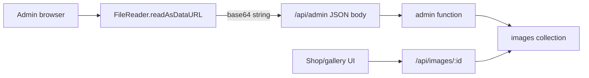
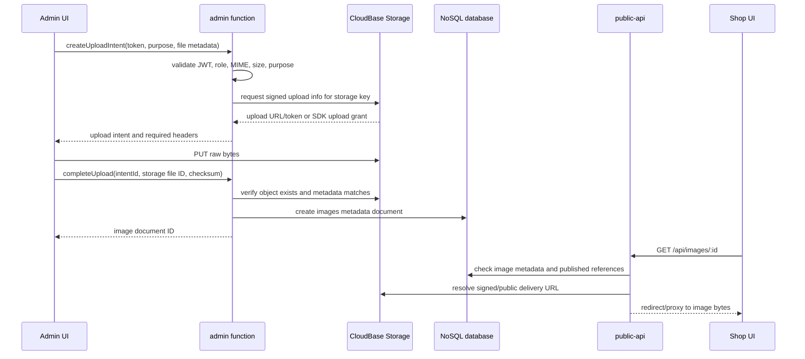
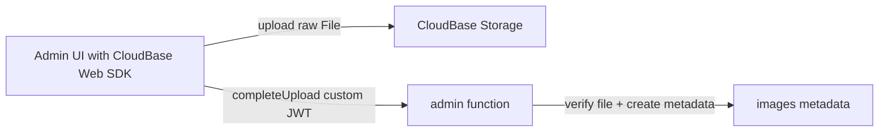
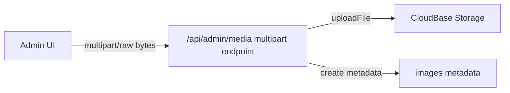
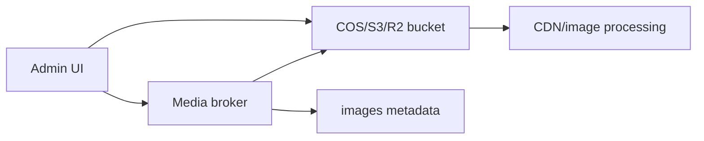
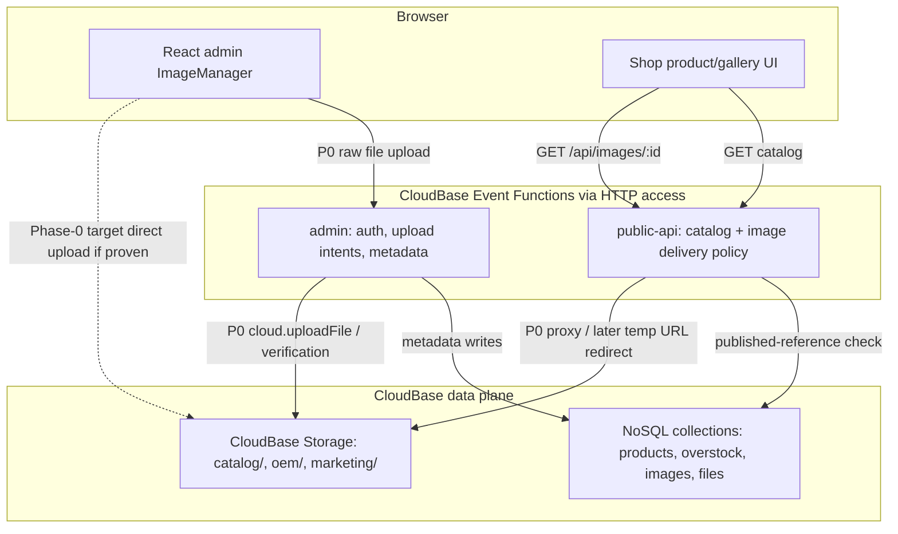

# Image Upload And Storage Design

Status: design proposal, review-hardened with CloudBase skill guidance; no implementation in this branch
Scope: product images, catalog media, and adjacent uploaded files in the current CloudBase infrastructure
Last updated: 2026-06-26

## 1. Executive Summary

The current product image upload path should be replaced. It base64-encodes
browser files, embeds the bytes inside `/api/admin` JSON, and stores the bytes
inside the `images` collection. That approach is simple and useful for very small
inline assets, but it is structurally mismatched with normal product photos.

The recommended direction is a storage-first media architecture:

- Store media bytes in CloudBase Storage.
- Store media identity, ownership, purpose, variants, and lifecycle metadata in
  the database.
- Preserve the existing product `imageIds` contract so catalog records keep
  referring to image records, not raw file URLs.
- Keep a legacy base64 read path during migration, but do not use base64 for new
  product image uploads.
- Route different media classes through different policies when their size,
  privacy, format, or processing needs differ.
- For the current infrastructure, ship P0 byte upload with Option C
  (server-side `cloud.uploadFile` behind the existing custom JWT), while
  adopting Option A's metadata and delivery architecture as the durable target.
- Gate browser-direct upload behind a Phase-0 spike because the current
  deployment docs say the browser publishable key is absent.

This means the answer is not "all images must use exactly the same upload
method." The durable model is a media asset service with a policy matrix:
product photos, thumbnails, SVG placeholders, OEM drawings, and future marketing
assets can share metadata conventions while choosing different upload transports
and storage namespaces.

## Review Source And Hardening Disposition

This pass checked the available GitHub review surfaces before hardening the
design:

- PR #1 exists for `dev/albertli/try01`, but GitHub API review scans returned no
  conversation comments, no review records, and no inline pull-request comments.
- The image-upload branch does not currently have a matching GitHub PR.
- Existing project review precedent lives in documents such as
  `docs/CICD_EXECUTION.md`, where review feedback is folded into hardened design
  and execution notes after a thread-aware scan.
- Remote review commit `cb75f78` was fetched from the design branch and folded
  into this final design. Its verdict was "approve with changes": keep the
  target metadata model, but re-rank the P0 byte transport to Option C.

The CloudBase-specific hardening in this revision comes from:

- CloudBase main skill guidance.
- CloudBase Storage Web SDK guidance.
- Cloud Functions guidance, especially the distinction between Event Functions
  exposed through HTTP access and native HTTP Functions.
- Existing deployment design guardrails around private storage, append-only
  migration, object cleanup, and media privacy smoke tests.

Disposition: no code changes are made here. The design is hardened in place so
the next implementation pass has clear CloudBase gates and fallback decisions.

## 2. Current Infra Facts

Repository facts:

- `apps/site` is an Astro static site with React islands for admin and shop UI.
- `apps/site/src/islands/admin/ImageManager.tsx` uploads selected product image
  files through `uploadImage()`.
- `apps/site/src/islands/admin/api.ts` converts each `File` to base64, then
  calls generic `createRecord('images', ...)` over `/api/admin`.
- `apps/functions/admin` exposes the custom admin API and authenticates with the
  app's JWT, not CloudBase Web Auth.
- `apps/functions/public-api` serves `/api/images/:id` by reading the `images`
  collection and returning base64 bytes as a binary response.
- `products.imageIds` and `overstock.imageIds` point to image document IDs.
- `files` uses the same base64-in-database pattern for OEM drawings.

Deployment facts from the existing CloudBase design docs:

- The deployed APIs are CloudBase HTTP access routes to Event Functions:
  - `/api/admin` -> `admin`
  - `/api` -> `public-api`
- The selected current environment is CloudBase NoSQL/classic mode.
- The CloudBase storage bucket exists and is private.
- The app currently uses function-mediated database access, not direct browser
  database writes.
- The current functions are not native CloudBase HTTP Functions. They use
  Event-Function-style handlers behind HTTP access, so this media design should
  not force a `scf_bootstrap` or port-9000 runtime migration unless the team
  intentionally chooses a dedicated media gateway.

Official CloudBase facts that matter to this design:

- CloudBase Storage is intended for unstructured data such as images, documents,
  audio, video, and files. It is backed by Tencent Cloud COS and includes CDN
  acceleration.
- Classic CloudBase Storage and PG Cloud Storage have different permission
  models. The current environment is classic mode, so this design targets classic
  mode first and keeps PG mode as a future migration concern.
- CloudBase Storage supports SDK and HTTP API upload flows, temporary/signed
  download URLs, public URLs, metadata, and image transform options.
- The HTTP storage API can provide upload information that the client can use to
  PUT bytes directly to storage.
- Browser-side storage work requires bucket readiness and security-domain
  readiness before frontend code is treated as complete.
- Temporary URLs are not durable identifiers. Store `fileID`, storage key, and
  metadata; resolve temporary delivery URLs on demand.

## 3. Problem Statement

The deployed `/api/admin` route is the wrong transport for product image bytes.

Current upload flow:



Primary failure mode:

- Base64 adds about 33 percent overhead before JSON and envelope overhead.
- The gateway can reject the request before the application handler sees it.
- The effective product image cap is much lower than a normal catalog workflow
  needs.

Secondary issues:

- Database documents become heavy binary stores.
- List/get operations are more likely to move large hidden fields around.
- CDN/image transformation is harder to use cleanly.
- Upload, validation, derivative generation, public delivery, and lifecycle
  cleanup are all mixed into a generic CRUD action.

## 4. Design Goals

Goals:

- Support normal product images without routing bytes through `/api/admin` JSON.
- Keep catalog records stable: products should continue to store `imageIds`.
- Allow purpose-specific policies for size, format, visibility, and upload
  method.
- Keep admin authorization based on the current custom JWT unless a future auth
  migration explicitly changes that.
- Keep public image delivery safe: only images linked from published catalog
  records should be publicly retrievable.
- Support gradual migration from legacy base64 documents.
- Make verification and rollback straightforward.
- Keep direct browser database access out of the P0/P1 design. Browser upload
  may touch storage only through an explicitly validated storage path.
- Keep the storage bucket private unless a later CDN/public-variant decision is
  separately reviewed.

Non-goals:

- Do not implement a quick body-limit increase as the primary fix.
- Do not require a full database migration to PostgreSQL.
- Do not expose private OEM drawings through public image routes.
- Do not replace the generic admin CRUD system for unrelated collections.

## 5. Media Classification Policy

Different files should use different policies. The architecture should make the
policy explicit instead of hiding it inside ad hoc upload code.

| Media class | Examples | Visibility | Typical size | Recommended storage | Upload method |
| --- | --- | --- | --- | --- | --- |
| Product catalog image | Headphones, overstock photos | Public after linked to published item | 100 KB to 10 MB source | CloudBase Storage, `catalog/` namespace | Admin-brokered direct upload |
| Product thumbnail/variant | Card image, admin preview, detail zoom image | Public if parent image is public | 20 KB to 500 KB | CloudBase Storage variant paths | Generated client-side first, server-side later if needed |
| Tiny inline/admin asset | Placeholder SVG, icon, color swatch | Public or internal | Under 20-50 KB | Static asset or base64 DB field | Base64 acceptable only by policy |
| OEM drawing/file | PDF, ZIP, CAD, drawing image | Private admin-only | 100 KB to 50 MB+ | CloudBase Storage, `oem/` namespace | Signed/direct upload with stricter intent, or CloudRun multipart if large |
| Marketing/site media | Hero photos, campaign media | Public | 100 KB to 20 MB | CloudBase Storage or static hosting | Storage upload plus metadata |
| Generated/exported artifact | Future catalogs, generated images | Mixed | Variable | Storage with lifecycle metadata | Backend write or async job |

Policy rules:

- Base64 is acceptable for deliberately tiny inline assets, test fixtures, and
  migration fallback.
- Product photos and OEM files should not use base64 for new writes.
- Public images should be resolved through an application route or signed/public
  URL policy, not by fabricating URLs in the browser.
- Every uploaded asset should have a purpose, owner/reference, MIME type, size,
  storage key, and lifecycle state.
- Do not store temporary download URLs in NoSQL. They expire and can leak access
  policy. Store durable storage identifiers only.
- If the project later moves to CloudBase PG storage, the upload API and
  permission model must change to the PG storage/RLS model; do not reuse classic
  CloudBase `app.uploadFile()` assumptions in PG mode.

## 6. Option A - Admin-Brokered Direct Upload To CloudBase Storage

This is the recommended target architecture for product catalog images, but not
the recommended P0 byte transport on the current stack. Adopt its metadata,
policy, and delivery model now. Gate browser-direct/admin-brokered PUT behavior
behind a Phase-0 spike against the deployed test EnvId.

High-level flow:



Architecture:

- Add media-specific admin actions, for example:
  - `createMediaUploadIntent`
  - `completeMediaUpload`
  - `removeMediaAsset`
- Generic CRUD may read/display safe media metadata, but raw storage fields,
  status transitions, and activation must be owned by dedicated media actions.
- Store product image metadata in `images`.
- Add storage fields while preserving legacy fields:

```text
images
  _id
  name
  mimeType
  purpose: "catalog-image" | "thumbnail" | "marketing" | ...
  storageProvider: "cloudbase-storage" | "legacy-base64"
  storageMode: "classic-nosql-storage" | "pg-storage" | "external"
  storageFileId
  storagePath
  byteSize
  width
  height
  checksum
  status: "pending" | "active" | "deleted" | "failed"
  uploadIntentId
  referenceCount
  variants: [
    { role, storageFileId, width, height, mimeType, byteSize }
  ]
  createdBy
  createdAt
  updatedAt
  data?              # legacy only
```

The shape above is the persistence model. It is not permission to expose every
field through generic `create`/`update` writes.

Delivery choices:

- P0 delivery: `/api/images/:id` verifies that the image is public, then proxies
  storage bytes through the existing `BinaryResult` response shape.
- P0 visibility should not keep the current O(catalog) scan on every image hit.
  Use a denormalized `publishedRefCount`/`isPublic` field or a reverse index.
- Later redirect optimization: add an explicit `RedirectResult`/3xx path to the
  public-api adapter, then return a short-lived CloudBase temp URL when that
  behavior is tested.
- Later CDN optimization: public catalog variants can use cacheable public/CDN
  URLs once access rules and invalidation are proven.
- Cache headers must respect the delivery mode. Signed/temp URL redirects should
  not be cached beyond the signed URL lifetime; public CDN variants may use
  longer caching only after their public policy is explicit.

Why this fits current infra:

- Preserves the custom admin JWT model.
- Avoids sending raw bytes through `/api/admin`.
- Avoids adding direct browser database writes.
- Preserves product `imageIds` and public `/api/images/:id` compatibility.
- Works with the current CloudBase NoSQL/classic mode.

Tradeoffs:

| Dimension | Result |
| --- | --- |
| Scalability | Strong. Bytes go to object storage, not JSON functions or database docs. |
| Security | Strong if intents are short-lived and purpose-scoped. Existing admin roles remain source of truth. |
| Implementation effort | Medium. Requires new media actions, storage signing integration, metadata verification, and migration fallback. |
| UX | Good. Browser can show progress and retry raw upload independently. |
| Operational fit | Good. Uses existing CloudBase Storage and current Event Functions exposed through HTTP access. |
| Risk | The exact storage-signing mechanism must be validated in the current CloudBase classic environment before coding. |

Recommendation:

- Use Option A as the target metadata and delivery architecture for product
  images.
- Do not make browser-direct upload a P0 dependency. Validate upload-intent
  generation against the deployed CloudBase environment as a Phase-0 spike.
- Keep base64 reads only for legacy image records.
- If the current classic CloudBase environment cannot safely broker direct
  upload info from the admin function, keep P0 on Option C. Do not loosen
  storage rules just to make browser upload work.

## 7. Option B - Direct Browser CloudBase Web SDK Upload

In this option, the admin UI initializes the CloudBase Web SDK and uploads files
directly with CloudBase's browser storage APIs.

High-level flow:



Strengths:

- Minimal backend byte handling.
- Uses CloudBase's intended browser storage path.
- Good upload progress support.

Costs in the current app:

- The app currently authenticates admins with a custom JWT, not CloudBase Web
  Auth.
- The deployed design notes say a publishable key is not currently present.
- Browser SDK upload also depends on safe domains/security rules being correct.
- This may introduce two auth/session models: app JWT for admin API and
  CloudBase Auth for storage.
- If this path is chosen, the implementation must first configure and verify
  CloudBase publishable key, exact security domains, storage bucket existence,
  and storage permission rules for the current EnvId.

Tradeoffs:

| Dimension | Result |
| --- | --- |
| Scalability | Strong. Bytes go directly to storage. |
| Security | Good only after CloudBase Auth/domain/storage rules are aligned with app roles. |
| Implementation effort | Medium to high because auth integration becomes part of the media work. |
| UX | Good. Native direct upload progress. |
| Operational fit | Mixed. It adds browser CloudBase SDK and CloudBase Auth concerns to an app that currently avoids direct browser CloudBase access. |
| Risk | Dual-auth drift: a user could have an app JWT state that does not match CloudBase storage permissions. |

Recommendation:

- Do not pick this as P0 unless the team wants to intentionally adopt CloudBase
  Web Auth for admin media operations.
- Keep it as a possible future simplification if CloudBase Auth becomes the
  main admin identity layer.

## 8. Option C - Server-Side Multipart Or Raw Binary Upload Endpoint

In this option, the browser sends multipart/form-data or raw binary to a media
endpoint, and the backend uploads to CloudBase Storage.

High-level flow:



Variants:

- Cloud Function multipart endpoint for moderate product images.
- CloudRun media gateway for larger OEM files, transformation jobs, malware
  scanning, or resumable uploads.
- Current Event Functions exposed via HTTP access can keep the existing handler
  model for metadata operations. Native HTTP Functions should be introduced only
  if streaming/multipart behavior requires a real HTTP server contract.

Strengths:

- Simple mental model with the current custom JWT.
- Backend can validate, transform, scan, and store in one transaction.
- Good for sensitive private uploads where direct browser storage access is not
  desired.

Costs:

- Bytes still traverse application compute.
- Cloud Function request limits can still become the bottleneck.
- Large files may need CloudRun, streaming parser support, and operational
  tuning.

Tradeoffs:

| Dimension | Result |
| --- | --- |
| Scalability | Medium in Cloud Functions, stronger if moved to CloudRun with streaming. |
| Security | Strong. Existing custom JWT remains the only browser-facing app credential. |
| Implementation effort | Medium for function, higher for CloudRun. |
| UX | Good enough for product images, better with upload progress and retry design. |
| Operational fit | Function variant is easy; CloudRun variant adds a new runtime. |
| Risk | A function endpoint may recreate a size ceiling, only higher than today. |

Recommendation:

- Use Option C as the P0 byte transport for product images on the current
  infrastructure.
- Keep custom JWT as the only browser credential, upload bytes server-side with
  CloudBase storage APIs, then write metadata through dedicated media actions.
- Consider CloudRun for OEM drawings, large private files, resumable uploads, or
  scanning workflows. Do not add CloudRun just to solve the first product-image
  limit.

## 9. Option D - External Object Storage Or COS-First Media Service

In this option, media is moved to Tencent COS directly or to another object
store such as S3/R2, with the app storing keys and metadata.

High-level flow:



Strengths:

- Strongest portability and advanced storage/CDN feature choice.
- Mature direct-upload patterns, lifecycle policies, and image processing.
- Useful if the business expects many media-heavy workflows.

Costs:

- Adds another provider or a lower-level Tencent service boundary.
- Requires separate credentials, policies, lifecycle rules, observability, and
  deployment documentation.
- More operational surface than the current CloudBase-first app needs.

Tradeoffs:

| Dimension | Result |
| --- | --- |
| Scalability | Strong. |
| Security | Strong if policies are well managed, but more moving parts. |
| Implementation effort | High. |
| UX | Strong. |
| Operational fit | Lower for the current small CloudBase deployment. |
| Risk | Provider complexity can outrun the app's current needs. |

Recommendation:

- Keep as a future option if CloudBase Storage cannot meet image processing,
  CDN, lifecycle, or cost requirements.
- Do not choose it for the immediate product image fix.

## 10. Recommended Architecture

Choose Option A's metadata and delivery model as the core architecture,
implemented as a policy-based media asset service. For P0 on the current stack,
use Option C's server-side byte transport inside that architecture.



Key decisions:

- `imageIds` remains the catalog relationship field.
- `images` becomes a media metadata collection, not a byte store.
- `data` remains supported only for `storageProvider = "legacy-base64"`.
- New product uploads use `storageProvider = "cloudbase-storage"`.
- Delivery goes through `/api/images/:id` first to preserve current public
  visibility checks.
- Generated variants are metadata children of one image record, not separate
  product references.
- Upload policies are purpose-scoped:
  - `catalog-image`
  - `catalog-thumbnail`
  - `oem-drawing`
  - `marketing-media`
  - `inline-small`

## 11. Variant And Format Strategy

Your idea is right: different image sizes, formats, and purposes should use
different storage keys and sometimes different upload/processing paths.

Recommended product image variants:

| Variant | Purpose | Format | Max dimension | Creation phase |
| --- | --- | --- | --- | --- |
| `original` | Audit/source, future reprocessing | Original MIME if allowed | Policy max, for example 4000 px edge | Upload |
| `detail` | Product detail/gallery zoom | WebP or JPEG | 1600-2000 px edge | Client-side P0, server-side later |
| `card` | Product cards and list pages | WebP or JPEG | 600-900 px edge | Client-side P0, server-side later |
| `thumb` | Admin thumbnails | WebP or JPEG | 200-320 px edge | Client-side P0 |

Format policy:

- Prefer WebP for generated display variants when browser support is acceptable.
- Preserve PNG only when transparency matters.
- Preserve SVG only for trusted/admin-provided vector assets after sanitization
  policy is decided.
- Treat GIF as legacy or special-case media; do not auto-convert animated GIFs
  without a product requirement.

Processing policy:

- P0 can generate `card` and `thumb` variants in the browser before upload.
- P1 can move variant generation to a backend job for consistent quality and
  future moderation.
- The original should be retained only if it has business value. If not, store a
  normalized high-quality `detail` variant as the highest-resolution source.

## 12. Security Model

Upload security:

- The admin function validates the app JWT and role before issuing an upload
  intent.
- Upload intents are short-lived, single-purpose, and include expected MIME,
  size range, storage namespace, and optional checksum.
- Completion verifies the object exists and matches the intent before metadata
  becomes active.
- Storage keys should be generated server-side. The browser should not choose
  arbitrary paths.
- Storage write permissions must stay scoped. A browser upload path may receive
  one object-specific upload grant or use a verified SDK permission model, but
  it must not require broad public write access to the bucket.
- MIME validation should not trust `File.type` alone. Validate extension, MIME,
  and lightweight file signature where practical before activation.
- SVG product uploads should be blocked or sanitized by a documented policy.
  Treat SVG as executable/vector content, not just an image byte stream.

Read security:

- `/api/images/:id` continues to enforce catalog-public rules:
  - placeholder image is public
  - product/overstock images are public only when linked from published catalog
    records
  - unlinked images are not public
- OEM files remain separate from `/api/images/:id`.
- Admin-only downloads use admin-authenticated routes or private signed URLs.
- Do not log temporary URLs, upload grants, JWTs, or storage credentials. Logs
  may include image ID, intent ID, storage key hash/prefix, and outcome.

Abuse controls:

- Enforce MIME allowlists and byte-size limits before upload.
- Store checksum/size for audit and duplicate detection.
- Consider rate limits on upload-intent creation.
- Consider file moderation/scanning before public visibility if real customer
  uploads become common.

## 13. CloudBase Hardening Gates

These gates are mandatory before implementation moves beyond a local spike.

| Gate | Required proof | Why it matters |
| --- | --- | --- |
| EnvId explicitness | Every storage, function, and management operation uses the canonical CloudBase EnvId. | Avoids accidental writes to a CLI-selected or developer-local environment. |
| Bucket readiness | Query or inspect the target storage bucket before browser upload work. | CloudBase upload APIs fail with bucket-missing errors; frontend retries do not fix missing resources. |
| Security-domain readiness | Verify the deployed site origin and local test origin in CloudBase security domains when using browser SDK upload. | Browser storage upload can fail from CORS/domain policy even when code is correct. |
| Function model boundary | Keep `admin` and `public-api` as Event Functions behind HTTP access unless a media gateway explicitly adopts native HTTP Function or CloudRun. | Prevents accidental runtime migration to `scf_bootstrap`/port 9000 just for metadata actions. |
| Storage permission boundary | Prove uploads work without public bucket write access and without direct browser NoSQL writes. | Keeps the custom JWT admin model as source of truth. |
| Delivery boundary | `/api/images/:id` must check published catalog references before resolving storage. | Preserves the current public privacy contract. |
| Temp URL handling | Store `fileID`/key only; generate temp URLs on demand and cap redirect caching by temp URL lifetime. | Prevents expired URLs in data and avoids long-lived leakage. |
| Migration safety | Use append-only object paths, idempotent metadata backfill, immutable backup, and orphan cleanup. | Allows rollback without deleting source bytes. |
| Deterministic privacy smoke | Test a published image, an unlinked image, and a missing image. | Replaces weak catch-all media smoke with the actual privacy boundary. |

Fallback rule:

- P0 baseline uses Option C. The browser-direct/admin-brokered upload grant may
  graduate to Option A's byte transport only if the Phase-0 spike passes all
  gates. If any gate fails, continue with Option C for product images or a
  CloudRun media gateway for large/private files. Do not weaken storage
  permissions to make browser upload work.

## 14. Migration Strategy

Phase 0 - validation:

- Confirm the current CloudBase storage bucket, permissions, and available
  upload-signing method in the deployed test env.
- Confirm browser domain/security-domain requirements for the selected upload
  path.
- Run a single end-to-end spike using the exact test EnvId before frontend work:
  intent -> raw upload -> object verification -> metadata activation -> public
  image resolution.
- Decide the classic-mode API path explicitly:
  - admin-brokered HTTP storage upload info, if safe and supported
  - browser CloudBase Web SDK upload, if CloudBase Auth/domain rules are
    intentionally adopted
  - server-side upload fallback, if direct upload cannot be proven

Phase 1 - compatibility schema:

- Extend `images` schema to support metadata fields and `storageProvider`.
- Keep `data` optional for legacy base64 records.
- Add `status` and `uploadIntentId` so incomplete uploads never become public.
- Update public image delivery to branch by provider:
  - `legacy-base64` -> existing DB byte response
  - `cloudbase-storage` -> storage temp URL redirect or proxy

Phase 2 - new upload path:

- Replace `uploadImage()` with the upload-intent flow.
- Update `ImageManager` to display progress, per-file errors, and variant
  generation status.
- Preserve returned image document IDs so product forms do not change shape.

Phase 3 - migration:

- Batch migrate old `images.data` records to CloudBase Storage.
- Update each image document with storage metadata.
- Keep a rollback window where both providers work.
- After enough production soak time, remove legacy base64 writes and eventually
  remove legacy base64 reads.
- Treat object writes as append-only during migration. Use UUID or
  content-addressed paths and do not overwrite existing storage paths.
- Delete uploaded objects as compensation if metadata activation fails, or mark
  them for orphan cleanup if synchronous delete is unavailable.

Phase 4 - OEM files:

- Apply the same storage-first model to `files` for OEM drawings.
- Decide whether public unauthenticated OEM submissions use signed direct upload
  with stricter anti-abuse controls or a CloudRun media gateway.

## 15. Implementation Boundaries

Frontend:

- `ImageManager.tsx` should become a media uploader, not a base64 encoder.
- `api.ts` should expose media-specific calls instead of using generic
  `createRecord('images', ...)` for bytes.
- Client-side variant generation can live beside the uploader, behind a clear
  policy function.

Admin function:

- Owns authorization, upload intent creation, upload completion, metadata
  creation, delete/orphan cleanup, and audit fields.
- Does not receive product image bytes in JSON.
- Remains an Event Function behind HTTP access unless the implementation
  explicitly introduces a separate media gateway.
- Must merge any future function config changes rather than assuming deploys can
  replace environment variables wholesale.

Public API function:

- Owns public visibility checks and storage delivery indirection.
- Continues to protect unpublished and unlinked images.

Shared package:

- Updates collection registry for new metadata fields.
- Adds shared media purpose/type constants if useful.

Local server:

- Should emulate the storage-backed metadata flow enough for local development.
- It can store files on disk under a local media directory while preserving the
  same image metadata shape.

## 16. Option Decision Matrix

| Option | Best use | Fit now | Sustainability | Main concern |
| --- | --- | --- | --- | --- |
| A. Admin-brokered direct CloudBase Storage upload | Target metadata/delivery architecture | Gated | High | Browser-direct grant unproven without publishable key |
| B. Browser CloudBase Web SDK upload | Apps using CloudBase Auth in browser | Later | High | Publishable key and dual-auth boundary |
| C. Server-side multipart/function upload | P0 product image byte transport | Best | Medium | Compute/body-size ceiling and first storage integration |
| C2. CloudRun media gateway | Large OEM files, scanning, heavy processing | Later | High | New runtime and ops |
| D. External object storage/COS-first | Media-heavy future platform | Later | High | More provider/ops complexity |
| Legacy base64 | Tiny inline assets and migration fallback | Limited | Low for product photos | Size, DB bloat, gateway limits |

## 17. Open Questions Before Implementation

- Which exact CloudBase storage API should issue upload intents in the current
  classic NoSQL environment: Web SDK mediated flow, HTTP storage upload info, or
  server SDK/manager support?
- Does the chosen path require CloudBase Web Auth/publishable key, or can the
  existing custom JWT admin function safely broker object-specific upload
  grants?
- Should original product images be retained, or should the largest normalized
  display variant become the source of truth?
- What maximum upload size should product admins see in UI: 5 MB, 10 MB, or
  another business limit?
- Should SVG be allowed for product images after this change, or limited to
  trusted seed/static assets?
- Should OEM drawings move in the same implementation batch or a follow-up
  batch?
- Do we want temporary redirects from `/api/images/:id`, or function proxying
  for stricter URL opacity?
- What lifecycle window should pending upload intents have before cleanup, for
  example 15 minutes or 24 hours?

## 18. Recommended Next Implementation Plan

1. Confirm bucket readiness, storage API availability, and function-side
   `cloud.uploadFile`/temp URL support in the deployed test env.
2. Confirm security-domain readiness and storage permission
   boundaries through MCP/console inspection before frontend implementation.
3. Add metadata-compatible `images` schema fields with legacy fallback.
4. Add admin media actions for intent, completion, and deletion.
5. Keep raw storage metadata out of generic `create`/`update` writes; media
   actions should use dedicated validation and trusted writers.
6. Add a visibility index or denormalized `publishedRefCount`/`isPublic` so
   storage delivery does not carry forward the current O(catalog) image scan.
7. Update public image delivery to support storage-backed records with P0 proxy
   delivery.
8. Update the admin uploader to send raw bytes to the server-side media endpoint
   with progress states.
9. Run the browser-direct upload grant spike separately. Promote to Option A
   byte transport only if the classic-mode auth/domain/storage path is proven.
10. Add focused tests:
   - legacy base64 image still renders
   - unlinked storage image is not public
   - published product storage image resolves
   - upload completion rejects wrong MIME/size/storage key
   - pending/incomplete upload is not public
   - bucket-missing or permission-denied failures surface as actionable admin UI
     errors
   - generic CRUD cannot forge `storageFileId` or activate pending media
11. Deploy to test and verify:
   - admin can upload normal product images
   - product card/detail/gallery render
   - unpublished/unlinked images stay private
   - old seeded/base64 images still render

## 19. Review Notes - Infra-Grounded Assessment

Reviewer pass added 2026-06-26. This section is an addendum: it hardens
the sections above, it records an independent review of them against the actual
code on this branch. Verdict: approve with changes. The problem diagnosis and the
target metadata model are correct. The option *ranking* should be re-ordered for
the current infrastructure so the first fix ships on Option C while Option A
remains the architectural north star.

### 19.1 Verdict

The design is structurally sound, and its "Current Infra Facts" were verified
against the code and found accurate. The one substantive correction:

- Decouple the *metadata architecture* (storage-first `images`, purpose
  policies, delivery indirection) from the *byte transport* (who PUTs the bytes).
- Adopt the metadata architecture now (this is Option A's durable core).
- Ship the byte transport as Option C (server-side `cloud.uploadFile`) for P0,
  not Option A's browser-direct upload, for the infra reasons below.

### 19.2 Infra-accuracy audit

Confirmed accurate against code:

- Base64 encode in browser then `createRecord('images')`:
  `apps/site/src/islands/admin/api.ts` (`fileToBase64`, `uploadImage`).
- `/api/images/:id` returns base64 binary from the DB:
  `apps/functions/public-api/src/handler.ts` (`getCatalogImage`).
- `files` uses the same base64-in-DB pattern for OEM drawings:
  `apps/functions/admin/src/handler.ts` (`submitProject`).
- Admin auth is custom JWT, not CloudBase Web Auth:
  `apps/functions/admin/src/handler.ts` (`verifySession`).
- Classic NoSQL mode, private bucket, no publishable key:
  `docs/CLOUDBASE_DEPLOYMENT_DESIGN.md`.

Four infra realities that change the ranking:

1. The storage plane is completely unintegrated. The hand-written ambient
   typings for `wx-server-sdk` declare only `init` and `database`, no
   `uploadFile`/`getTempFileURL`/`deleteFile` (`packages/db/src/wx-server-sdk.d.ts`).
   No storage SDK call exists anywhere in app code. Every storage option is
   greenfield; "Medium" effort under-counts the first-integration tax (typings,
   local-dev disk shim, deploy smoke).

2. Server-side `cloud.uploadFile` already works at runtime; browser-direct
   upload does not. `packages/db` depends on `wx-server-sdk`, which bundles
   `@cloudbase/node-sdk` (the storage-capable server SDK). So Option C's byte
   path runs on capabilities the function already has. Option A's browser PUT
   and all of Option B need a browser-usable storage credential, which in
   classic mode comes from the Web SDK session - i.e. the publishable key the
   deploy docs say is absent. This inverts the doc's confidence: Option A is
   rated "best fit now," but its defining mechanism is the least certain to
   exist on this stack, while Option C (rated "Medium") is the most readily
   implementable.

3. The public-api HTTP adapter has no redirect (3xx) path. It only emits 200
   (binary), 204, or error codes (`apps/functions/public-api/src/http-adapter.ts`).
   Option A's preferred "302 to a temp URL" is new adapter code; the "proxy"
   fallback fits the existing `BinaryResult` shape and is the lower-friction P0.
   On current infra the doc's primary/fallback order is reversed.

4. `buildWriteSchema` is `.strict()` and rejects unknown keys
   (`packages/shared/src/collections.ts`). Extending the `images` schema
   (Phase 1) is therefore mandatory, not optional - correct. But adding raw
   storage fields (`storageFileId`, `storageProvider`) to the registry also
   exposes them to the still-open generic `create`/`update` actions, letting a
   contributor forge an image-metadata document that points at an arbitrary
   storage object. Media actions should write via the registry-bypassing
   trusted writers (`createDoc`/`updateDoc`) with their own validation, and keep
   raw storage fields out of the generic write surface.

### 19.3 Re-ranked options for this infra

- Option A (admin-brokered direct upload): right architecture, wrong P0
  transport bet. Adopt its metadata + delivery model now; gate the browser-direct
  PUT behind a Phase-0 spike against the deployed test env. If the spike fails,
  A's byte path collapses into C, so do not let the P0 fix depend on it.
- Option B (browser Web SDK): correctly rejected for P0, and the blocker is
  stronger than "dual-auth drift" - the publishable key needed to initialize the
  browser SDK does not exist. Keep only if admin identity migrates to CloudBase
  Auth wholesale.
- Option C (server-side `cloud.uploadFile` endpoint): under-rated here, and the
  recommended P0. Only option whose byte path runs on current capabilities with
  no new auth surface (custom JWT stays the sole browser credential). Also fixes
  a deploy-parity trap: local allows `express.json({ limit: '20mb' })`
  (`apps/local-server/src/main.ts`) while production caps much lower, so an admin
  can upload locally what silently fails in prod. C2 (CloudRun) stays deferred to
  large OEM files.
- Option D (external COS/S3/R2): correctly deferred. Adds a second
  credential/lifecycle/observability surface to a single-env app.
- Legacy base64: keep as read-only compatibility plus tiny inline assets. The
  migration must retain the `legacy-base64` read branch (seeded SVGs and existing
  `images.data` documents depend on it).

### 19.4 Findings

| # | Severity | Issue | Recommended fix |
| --- | --- | --- | --- |
| 1 | P1 | Headline option (A) depends on a browser-direct upload grant unproven on classic mode without a publishable key. | Re-frame: A's metadata/delivery is the target; C's byte path is P0. Make the spike a Phase-0 gate, not a parallel "validate later." |
| 2 | P2 | `/api/images/:id` already does a full paginated scan of `products`+`overstock` per image hit to decide visibility; storage delivery keeps or amplifies this on every cache-miss. | Denormalize visibility (`isPublic`/`publishedRefCount` on the image doc, maintained on publish/unpublish) or a reverse index. Do not carry the O(catalog) scan into the new path. |
| 3 | P2 | Redirect delivery assumed primary, but the adapter has no 3xx path. | Ship proxy delivery as P0 (fits existing `BinaryResult`); add 302 later once a `RedirectResult` is added to the adapter union. |
| 4 | P2 | Storage metadata written through generic `.strict()` CRUD makes `storageFileId` forgeable. | Media actions write via `createDoc`/`updateDoc` with dedicated validation; keep raw storage fields out of the generic write surface. |
| 5 | P3 | Phase 4 (OEM `files`) implies parity, but production has no `/api/files/:id` route at all - it exists only in local-server and is deliberately absent in prod. | State that OEM storage delivery is net-new in prod (authenticated admin route), not a migration of an existing route. |
| 6 | P3 | Effort ratings omit the first-storage-integration tax (SDK typings, local-dev disk shim, deploy smoke). | Add a "first-integration cost" line to the tradeoff tables. |

### 19.5 Recommendation

1. Adopt the storage-first metadata architecture (Option A's model) now:
   `images` becomes metadata, `imageIds` unchanged, delivery stays behind
   `/api/images/:id`, `storageProvider` discriminates legacy vs storage.
2. Choose Option C (`cloud.uploadFile` server endpoint) as the P0 byte transport,
   not browser-direct.
3. Make "browser-direct upload grant in classic mode" a Phase-0 spike gate. If it
   works, graduate the transport to true Option A as an optimization; if not,
   nothing is lost because C already shipped the fix.
4. Fix the visibility scan (finding 2) in the same change, so the new delivery
   path does not inherit and worsen it.
5. Answer the max-upload-size open question explicitly and enforce it in the
   Option C endpoint, since that becomes the real production ceiling.

### 19.6 Decision

Approved with changes. The diagnosis and target metadata model are right; the
option ranking should be re-ordered for this infra so P0 ships on Option C while
Option A remains the architectural north star.

## 20. References

- CloudBase Storage overview: https://docs.cloudbase.net/en/storage/introduce
- CloudBase Web SDK storage API: https://docs.cloudbase.net/en/api-reference/webv2/storage
- CloudBase server Node SDK storage API: https://docs.cloudbase.net/en/api-reference/server/node-sdk/storage
- CloudBase HTTP storage upload info: https://docs.cloudbase.net/en/http-api/storage/get-objects-upload-info
- CloudBase function boundary guidance: `cloudbase/references/cloud-functions/SKILL.md`
- Current admin upload code: `apps/site/src/islands/admin/api.ts`
- Current admin image UI: `apps/site/src/islands/admin/ImageManager.tsx`
- Current admin handler: `apps/functions/admin/src/handler.ts`
- Current public image delivery: `apps/functions/public-api/src/handler.ts`
