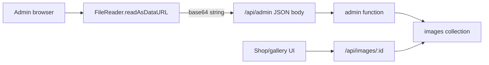
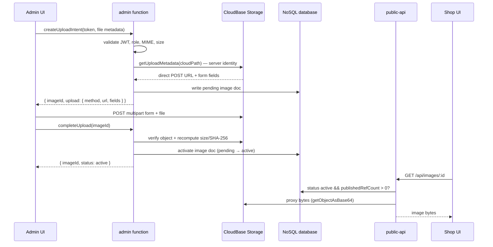
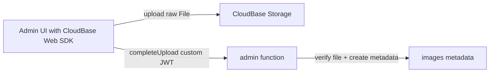
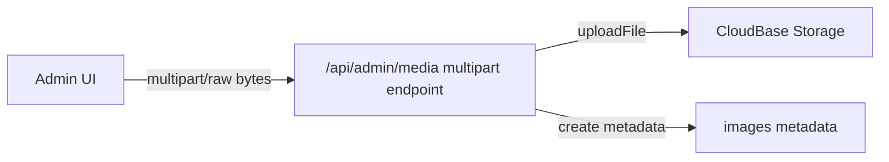
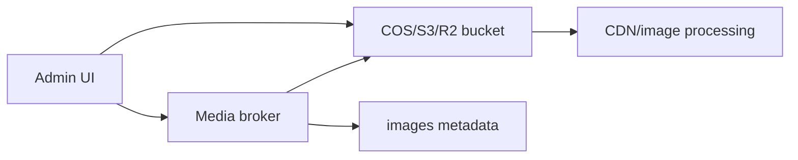
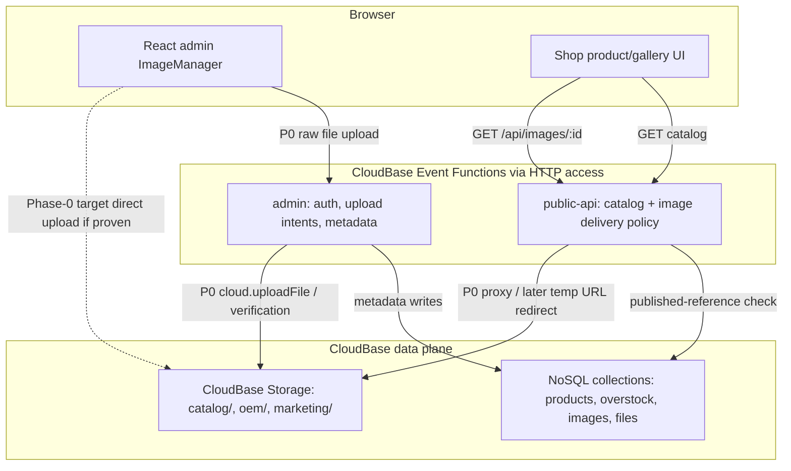
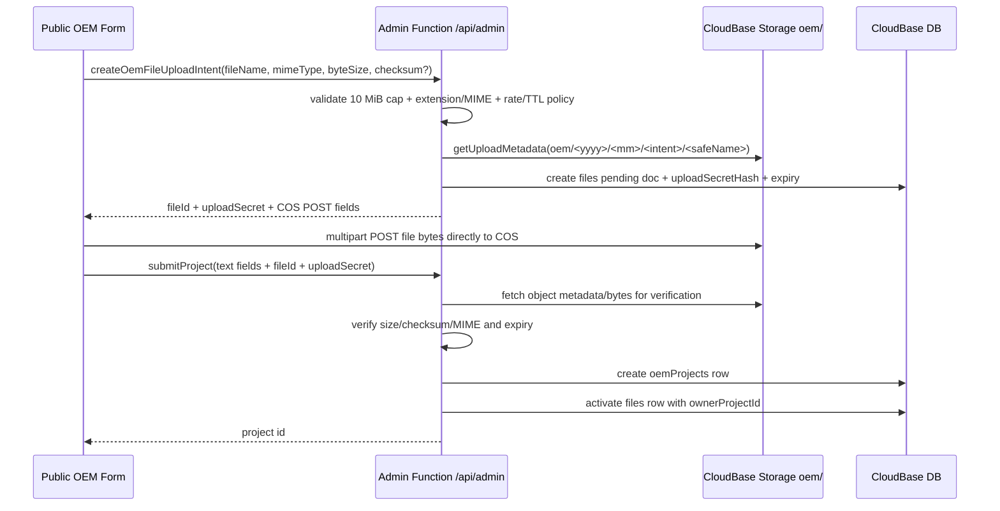
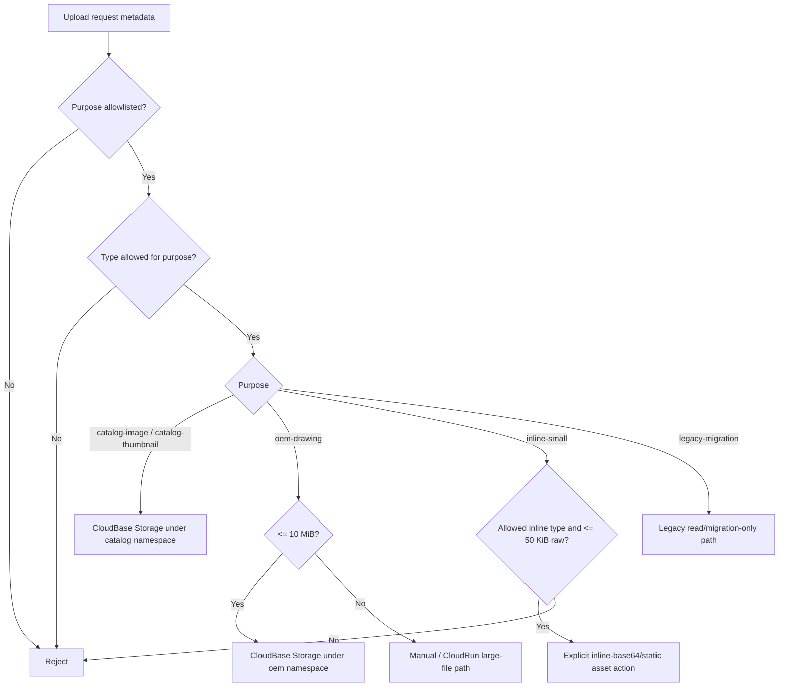

# Image Upload And Storage Design

Status: design proposal, review-hardened with CloudBase skill guidance and implementation-grade MIUs; no runtime implementation in this branch
Scope: product images, catalog media, and adjacent uploaded files in the current CloudBase infrastructure
Last updated: 2026-06-26

## 1. Executive Summary

The current product image upload path should be replaced. It base64-encodes
browser files, embeds the bytes inside `/api/admin` JSON, and stores the bytes
inside the `images` collection. That approach is simple and useful for very small
inline assets, but it is structurally mismatched with normal product photos.

The recommended direction is a storage-first media architecture:

- Store media bytes in CloudBase Storage.
- Store media identity, ownership, purpose, variants, and lifecycle metadata in
  the database.
- Preserve the existing product `imageIds` contract so catalog records keep
  referring to image records, not raw file URLs.
- Keep a legacy base64 read path during migration, but do not use base64 for new
  product image uploads.
- Route different media classes through different policies when their size,
  privacy, format, or processing needs differ.
- For the current infrastructure, start P0 byte upload with Option C
  (server-side `cloud.uploadFile` behind the existing custom JWT) only after a
  raw multipart/binary route-capacity probe passes. If the 100 KiB limit is
  route-wide, use direct storage upload info or CloudRun for P0 bytes while
  still adopting Option A's metadata and delivery architecture as the durable
  target.
- Gate browser-direct upload behind a Phase-0 spike because the current
  deployment docs say the browser publishable key is absent.

This means the answer is not "all images must use exactly the same upload
method." The durable model is a media asset service with a policy matrix:
product photos, thumbnails, SVG placeholders, OEM drawings, and future marketing
assets can share metadata conventions while choosing different upload transports
and storage namespaces.

## Review Source And Hardening Disposition

This pass checked the available GitHub review surfaces before hardening the
design:

- PR #1 exists for `dev/albertli/try01`, but GitHub API review scans returned no
  conversation comments, no review records, and no inline pull-request comments.
- The image-upload branch does not currently have a matching GitHub PR.
- Existing project review precedent lives in documents such as
  `docs/CICD_EXECUTION.md`, where review feedback is folded into hardened design
  and execution notes after a thread-aware scan.
- Remote review commit `cb75f78` was fetched from the design branch and folded
  into this final design. Its verdict was "approve with changes": keep the
  target metadata model, and make Option C the first P0 byte-transport
  candidate subject to deployed route-capacity proof.

The CloudBase-specific hardening in this revision comes from:

- CloudBase main skill guidance.
- CloudBase Storage Web SDK guidance.
- Cloud Functions guidance, especially the distinction between Event Functions
  exposed through HTTP access and native HTTP Functions.
- Existing deployment design guardrails around private storage, append-only
  migration, object cleanup, and media privacy smoke tests.

Disposition: no code changes are made here. The design is hardened in place so
the next implementation pass has clear CloudBase gates and fallback decisions.

## 2. Current Infra Facts

Repository facts:

- `apps/site` is an Astro static site with React islands for admin and shop UI.
- `apps/site/src/islands/admin/ImageManager.tsx` uploads selected product image
  files through `uploadImage()`.
- `apps/site/src/islands/admin/api.ts` converts each `File` to base64, then
  calls generic `createRecord('images', ...)` over `/api/admin`.
- `apps/functions/admin` exposes the custom admin API and authenticates with the
  app's JWT, not CloudBase Web Auth.
- `apps/functions/public-api` serves `/api/images/:id` by reading the `images`
  collection and returning base64 bytes as a binary response.
- `products.imageIds` and `overstock.imageIds` point to image document IDs.
- `files` uses the same base64-in-database pattern for OEM drawings.

Deployment facts from the existing CloudBase design docs:

- The deployed APIs are CloudBase HTTP access routes to Event Functions:
  - `/api/admin` -> `admin`
  - `/api` -> `public-api`
- The selected current environment is CloudBase NoSQL/classic mode.
- The CloudBase storage bucket exists and is private.
- The app currently uses function-mediated database access, not direct browser
  database writes.
- The current functions are not native CloudBase HTTP Functions. They use
  Event-Function-style handlers behind HTTP access, so this media design should
  not force a `scf_bootstrap` or port-9000 runtime migration unless the team
  intentionally chooses a dedicated media gateway.

Official CloudBase facts that matter to this design:

- CloudBase Storage is intended for unstructured data such as images, documents,
  audio, video, and files. It is backed by Tencent Cloud COS and includes CDN
  acceleration.
- Classic CloudBase Storage and PG Cloud Storage have different permission
  models. The current environment is classic mode, so this design targets classic
  mode first and keeps PG mode as a future migration concern.
- CloudBase Storage supports SDK and HTTP API upload flows, temporary/signed
  download URLs, public URLs, metadata, and image transform options.
- The HTTP storage API can provide upload information that the client can use to
  PUT bytes directly to storage.
- Browser-side storage work requires bucket readiness and security-domain
  readiness before frontend code is treated as complete.
- Temporary URLs are not durable identifiers. Store `fileID`, storage key, and
  metadata; resolve temporary delivery URLs on demand.

## 3. Problem Statement

The deployed `/api/admin` route is the wrong transport for product image bytes.

Current upload flow:



Primary failure mode:

- Base64 adds about 33 percent overhead before JSON and envelope overhead.
- The gateway can reject the request before the application handler sees it.
- The effective product image cap is much lower than a normal catalog workflow
  needs.

Secondary issues:

- Database documents become heavy binary stores.
- List/get operations are more likely to move large hidden fields around.
- CDN/image transformation is harder to use cleanly.
- Upload, validation, derivative generation, public delivery, and lifecycle
  cleanup are all mixed into a generic CRUD action.

## 4. Design Goals

Goals:

- Support normal product images without routing bytes through `/api/admin` JSON.
- Keep catalog records stable: products should continue to store `imageIds`.
- Allow purpose-specific policies for size, format, visibility, and upload
  method.
- Keep admin authorization based on the current custom JWT unless a future auth
  migration explicitly changes that.
- Keep public image delivery safe: only images linked from published catalog
  records should be publicly retrievable.
- Support gradual migration from legacy base64 documents.
- Make verification and rollback straightforward.
- Keep direct browser database access out of the P0/P1 design. Browser upload
  may touch storage only through an explicitly validated storage path.
- Keep the storage bucket private unless a later CDN/public-variant decision is
  separately reviewed.

Non-goals:

- Do not implement a quick body-limit increase as the primary fix.
- Do not require a full database migration to PostgreSQL.
- Do not expose private OEM drawings through public image routes.
- Do not replace the generic admin CRUD system for unrelated collections.

## 5. Media Classification Policy

Different files should use different policies. The architecture should make the
policy explicit instead of hiding it inside ad hoc upload code.

| Media class | Examples | Visibility | Typical size | Recommended storage | Upload method |
| --- | --- | --- | --- | --- | --- |
| Product catalog image | Headphones, overstock photos | Public after linked to published item | 100 KB to 10 MB source | CloudBase Storage, `catalog/` namespace | Admin-brokered direct upload |
| Product thumbnail/variant | Card image, admin preview, detail zoom image | Public if parent image is public | 20 KB to 500 KB | CloudBase Storage variant paths | Generated client-side first, server-side later if needed |
| Tiny inline/admin asset | Placeholder SVG, icon, color swatch | Public or internal | Under 20-50 KB | Static asset or base64 DB field | Base64 acceptable only by policy |
| OEM drawing/file | PDF, ZIP, CAD, drawing image | Private admin-only | 100 KB to 10 MB P0; larger later | CloudBase Storage, `oem/` namespace | Public form direct-to-storage intent; CloudRun only for larger/scanned files |
| Marketing/site media | Hero photos, campaign media | Public | 100 KB to 20 MB | CloudBase Storage or static hosting | Storage upload plus metadata |
| Generated/exported artifact | Future catalogs, generated images | Mixed | Variable | Storage with lifecycle metadata | Backend write or async job |

Policy rules:

- Base64 is acceptable for deliberately tiny inline assets, test fixtures, and
  migration fallback.
- Product photos and OEM files should not use base64 for new writes. ZIP is a
  normal OEM attachment type, not an image workaround; a realistic ZIP must not
  be tunneled through JSON/base64.
- Public images should be resolved through an application route or signed/public
  URL policy, not by fabricating URLs in the browser.
- Every uploaded asset should have a purpose, owner/reference, MIME type, size,
  storage key, and lifecycle state.
- Do not store temporary download URLs in NoSQL. They expire and can leak access
  policy. Store durable storage identifiers only.
- If the project later moves to CloudBase PG storage, the upload API and
  permission model must change to the PG storage/RLS model; do not reuse classic
  CloudBase `app.uploadFile()` assumptions in PG mode.

Upload transport decision policy:

Transport is selected by **purpose first, file type second, and size third**.
Size alone must never downshift a product/OEM file into base64.

| Purpose | Allowed types | P0 size cap | Upload transport | Notes |
| --- | --- | --- | --- | --- |
| `catalog-image` | `image/jpeg`, `image/png`, `image/webp` | 10 MiB | CloudBase Storage direct COS POST | Used for all new product photos, even if the image is tiny. Keeps one lifecycle, checksum, cleanup, preview, and public-delivery model. |
| `catalog-thumbnail` | generated `jpeg`/`png`/`webp` variants | derived from source | CloudBase Storage variant path | Generated metadata follows the parent source image. Do not store product thumbnails as DB base64 unless they are legacy records. |
| `oem-drawing` | PDF, ZIP/RAR, CAD extensions, drawing `png`/`jpeg`/`webp` | 10 MiB P0 | CloudBase Storage direct COS POST under `oem/` | Private admin-only lifecycle. Never tunnel OEM bytes through `/api/admin` JSON/base64. |
| `inline-small` | SVG/icon/swatch-style `svg`/`png`/`webp` only | 50 KiB raw max | Static asset or explicit base64 field | Only for deliberate inline/admin assets, seeded fixtures, and compatibility. Must use a named action/schema; never generic CRUD. |
| `marketing-media` | `jpeg`/`png`/`webp` and future video if approved | 20 MiB design cap | Storage or static hosting | Public media needs a separate publishing/cache policy. Not a fallback for catalog/OEM. |

Base64 eligibility contract:

1. The caller must name `purpose: 'inline-small'` or an explicit legacy
   migration path. No other purpose may choose base64 for a new write.
2. The type must be allowlisted for inline rendering. ZIP, PDF, CAD, OEM files,
   and product photos are ineligible even when under 50 KiB.
3. The raw byte size must be at or below `INLINE_SMALL_MAX_BYTES = 50 * 1024`.
   The server validates raw bytes, not base64 string length alone.
4. The write surface must be a dedicated action with its own schema. Generic
   `createRecord`/`updateRecord` stays unable to write `data` or storage fields.
5. Reads can keep `legacy-base64` compatibility, but new catalog/OEM writes must
   converge on storage so cleanup, audit, delivery, and migration stay coherent.

This policy does **not** break the current storage-backed catalog-image design.
It preserves MIU-Upload as the only new product-image write path and keeps OEM
attachments in MIU-08's private `files` lifecycle. A future small-inline feature
would be a separate action/MIU, not a fallback inside `createUploadIntent`.

## 6. Option A - Admin-Brokered Direct Upload To CloudBase Storage

This is the recommended target architecture for product catalog images, but not
the recommended P0 byte transport on the current stack. Adopt its metadata,
policy, and delivery model now. Gate browser-direct/admin-brokered PUT behavior
behind a Phase-0 spike against the deployed test EnvId.

High-level flow:



Architecture:

- Add media-specific admin actions, for example:
  - `createMediaUploadIntent`
  - `completeMediaUpload`
  - `removeMediaAsset`
- Generic CRUD may read/display safe media metadata, but raw storage fields,
  status transitions, and activation must be owned by dedicated media actions.
- Store product image metadata in `images`.
- Add storage fields while preserving legacy fields:

```text
images
  _id
  name
  mimeType
  purpose: "catalog-image" | "thumbnail" | "marketing" | ...
  storageProvider: "cloudbase-storage" | "legacy-base64"
  storageMode: "classic-nosql-storage" | "pg-storage" | "external"
  storageFileId
  storagePath
  byteSize
  width
  height
  checksum
  status: "pending" | "active" | "deleted" | "failed"
  uploadIntentId
  referenceCount
  variants: [
    { role, storageFileId, width, height, mimeType, byteSize }
  ]
  createdBy
  createdAt
  updatedAt
  data?              # legacy only
```

The shape above is the persistence model. It is not permission to expose every
field through generic `create`/`update` writes.

Delivery choices:

- P0 delivery: `/api/images/:id` verifies that the image is public, then proxies
  storage bytes through the existing `BinaryResult` response shape.
- P0 visibility should not keep the current O(catalog) scan on every image hit.
  Use a denormalized `publishedRefCount`/`isPublic` field or a reverse index.
- Later redirect optimization: add an explicit `RedirectResult`/3xx path to the
  public-api adapter, then return a short-lived CloudBase temp URL when that
  behavior is tested.
- Later CDN optimization: public catalog variants can use cacheable public/CDN
  URLs once access rules and invalidation are proven.
- Cache headers must respect the delivery mode. Signed/temp URL redirects should
  not be cached beyond the signed URL lifetime; public CDN variants may use
  longer caching only after their public policy is explicit.

Why this fits current infra:

- Preserves the custom admin JWT model.
- Avoids sending raw bytes through `/api/admin`.
- Avoids adding direct browser database writes.
- Preserves product `imageIds` and public `/api/images/:id` compatibility.
- Works with the current CloudBase NoSQL/classic mode.

Tradeoffs:

| Dimension | Result |
| --- | --- |
| Scalability | Strong. Bytes go to object storage, not JSON functions or database docs. |
| Security | Strong if intents are short-lived and purpose-scoped. Existing admin roles remain source of truth. |
| Implementation effort | Medium. Requires new media actions, storage signing integration, metadata verification, and migration fallback. |
| UX | Good. Browser can show progress and retry raw upload independently. |
| Operational fit | Good. Uses existing CloudBase Storage and current Event Functions exposed through HTTP access. |
| Risk | The exact storage-signing mechanism must be validated in the current CloudBase classic environment before coding. |

Recommendation:

- Use Option A as the target metadata and delivery architecture for product
  images.
- Do not make browser-direct upload a P0 dependency. Validate upload-intent
  generation against the deployed CloudBase environment as a Phase-0 spike.
- Keep base64 reads only for legacy image records.
- If the current classic CloudBase environment cannot safely broker direct
  upload info from the admin function, keep P0 on Option C only if raw
  multipart/binary route capacity is proven. If not, use CloudRun for the media
  gateway. Do not loosen storage rules just to make browser upload work.

## 7. Option B - Direct Browser CloudBase Web SDK Upload

In this option, the admin UI initializes the CloudBase Web SDK and uploads files
directly with CloudBase's browser storage APIs.

High-level flow:



Strengths:

- Minimal backend byte handling.
- Uses CloudBase's intended browser storage path.
- Good upload progress support.

Costs in the current app:

- The app currently authenticates admins with a custom JWT, not CloudBase Web
  Auth.
- The deployed design notes say a publishable key is not currently present.
- Browser SDK upload also depends on safe domains/security rules being correct.
- This may introduce two auth/session models: app JWT for admin API and
  CloudBase Auth for storage.
- If this path is chosen, the implementation must first configure and verify
  CloudBase publishable key, exact security domains, storage bucket existence,
  and storage permission rules for the current EnvId.

Tradeoffs:

| Dimension | Result |
| --- | --- |
| Scalability | Strong. Bytes go directly to storage. |
| Security | Good only after CloudBase Auth/domain/storage rules are aligned with app roles. |
| Implementation effort | Medium to high because auth integration becomes part of the media work. |
| UX | Good. Native direct upload progress. |
| Operational fit | Mixed. It adds browser CloudBase SDK and CloudBase Auth concerns to an app that currently avoids direct browser CloudBase access. |
| Risk | Dual-auth drift: a user could have an app JWT state that does not match CloudBase storage permissions. |

Recommendation:

- Do not pick this as P0 unless the team wants to intentionally adopt CloudBase
  Web Auth for admin media operations.
- Keep it as a possible future simplification if CloudBase Auth becomes the
  main admin identity layer.

## 8. Option C - Server-Side Multipart Or Raw Binary Upload Endpoint

In this option, the browser sends multipart/form-data or raw binary to a media
endpoint, and the backend uploads to CloudBase Storage.

High-level flow:



Variants:

- Cloud Function multipart endpoint for moderate product images.
- CloudRun media gateway for larger OEM files, transformation jobs, malware
  scanning, or resumable uploads.
- Current Event Functions exposed via HTTP access can keep the existing handler
  model for metadata operations. Native HTTP Functions should be introduced only
  if streaming/multipart behavior requires a real HTTP server contract.

Strengths:

- Simple mental model with the current custom JWT.
- Backend can validate, transform, scan, and store in one transaction.
- Good for sensitive private uploads where direct browser storage access is not
  desired.

Costs:

- Bytes still traverse application compute.
- Cloud Function request limits can still become the bottleneck.
- Large files may need CloudRun, streaming parser support, and operational
  tuning.

Tradeoffs:

| Dimension | Result |
| --- | --- |
| Scalability | Medium in Cloud Functions, stronger if moved to CloudRun with streaming. |
| Security | Strong. Existing custom JWT remains the only browser-facing app credential. |
| Implementation effort | Medium for function, higher for CloudRun. |
| UX | Good enough for product images, better with upload progress and retry design. |
| Operational fit | Function variant is easy; CloudRun variant adds a new runtime. |
| Risk | A function endpoint may recreate a size ceiling, only higher than today. |

Recommendation:

- Use Option C as the P0 byte transport for product images on the current
  infrastructure only if a deployed multipart/raw body probe proves the route
  can carry the selected product-image max size.
- Keep custom JWT as the only browser credential, upload bytes server-side with
  CloudBase storage APIs, then write metadata through dedicated media actions.
- Consider CloudRun for OEM drawings, large private files, resumable uploads, or
  scanning workflows. Do not add CloudRun just to solve the first product-image
  limit.

## 9. Option D - External Object Storage Or COS-First Media Service

In this option, media is moved to Tencent COS directly or to another object
store such as S3/R2, with the app storing keys and metadata.

High-level flow:



Strengths:

- Strongest portability and advanced storage/CDN feature choice.
- Mature direct-upload patterns, lifecycle policies, and image processing.
- Useful if the business expects many media-heavy workflows.

Costs:

- Adds another provider or a lower-level Tencent service boundary.
- Requires separate credentials, policies, lifecycle rules, observability, and
  deployment documentation.
- More operational surface than the current CloudBase-first app needs.

Tradeoffs:

| Dimension | Result |
| --- | --- |
| Scalability | Strong. |
| Security | Strong if policies are well managed, but more moving parts. |
| Implementation effort | High. |
| UX | Strong. |
| Operational fit | Lower for the current small CloudBase deployment. |
| Risk | Provider complexity can outrun the app's current needs. |

Recommendation:

- Keep as a future option if CloudBase Storage cannot meet image processing,
  CDN, lifecycle, or cost requirements.
- Do not choose it for the immediate product image fix.

## 10. Recommended Architecture

Choose Option A's metadata and delivery model as the core architecture,
implemented as a policy-based media asset service. For P0 on the current stack,
use Option C's server-side byte transport inside that architecture only if the
deployed route-capacity probe passes; otherwise keep the same metadata model and
swap the byte transport to direct storage upload info or CloudRun.



Key decisions:

- `imageIds` remains the catalog relationship field.
- `images` becomes a media metadata collection, not a byte store.
- `data` remains supported only for `storageProvider = "legacy-base64"`.
- New product uploads use `storageProvider = "cloudbase-storage"`.
- Delivery goes through `/api/images/:id` first to preserve current public
  visibility checks.
- Generated variants are metadata children of one image record, not separate
  product references.
- Upload policies are purpose-scoped:
  - `catalog-image`
  - `catalog-thumbnail`
  - `oem-drawing`
  - `marketing-media`
  - `inline-small`

## 11. Variant And Format Strategy

Your idea is right: different image sizes, formats, and purposes should use
different storage keys and sometimes different upload/processing paths.

Recommended product image variants:

| Variant | Purpose | Format | Max dimension | Creation phase |
| --- | --- | --- | --- | --- |
| `original` | Audit/source, future reprocessing | Original MIME if allowed | Policy max, for example 4000 px edge | Upload |
| `detail` | Product detail/gallery zoom | WebP or JPEG | 1600-2000 px edge | Client-side P0, server-side later |
| `card` | Product cards and list pages | WebP or JPEG | 600-900 px edge | Client-side P0, server-side later |
| `thumb` | Admin thumbnails | WebP or JPEG | 200-320 px edge | Client-side P0 |

Format policy:

- Prefer WebP for generated display variants when browser support is acceptable.
- Preserve PNG only when transparency matters.
- Preserve SVG only for trusted/admin-provided vector assets after sanitization
  policy is decided.
- Treat GIF as legacy or special-case media; do not auto-convert animated GIFs
  without a product requirement.

Processing policy:

- P0 can generate `card` and `thumb` variants in the browser before upload.
- P1 can move variant generation to a backend job for consistent quality and
  future moderation.
- The original should be retained only if it has business value. If not, store a
  normalized high-quality `detail` variant as the highest-resolution source.

## 12. Security Model

Upload security:

- The admin function validates the app JWT and role before issuing an upload
  intent.
- Upload intents are short-lived, single-purpose, and include expected MIME,
  size range, storage namespace, and optional checksum.
- Completion verifies the object exists and matches the intent before metadata
  becomes active.
- Storage keys should be generated server-side. The browser should not choose
  arbitrary paths.
- Storage write permissions must stay scoped. A browser upload path may receive
  one object-specific upload grant or use a verified SDK permission model, but
  it must not require broad public write access to the bucket.
- MIME validation should not trust `File.type` alone. Validate extension, MIME,
  and lightweight file signature where practical before activation.
- SVG product uploads should be blocked or sanitized by a documented policy.
  Treat SVG as executable/vector content, not just an image byte stream.

Read security:

- `/api/images/:id` continues to enforce catalog-public rules:
  - placeholder image is public
  - product/overstock images are public only when linked from published catalog
    records
  - unlinked images are not public
- OEM files remain separate from `/api/images/:id`.
- Admin-only downloads use admin-authenticated routes or private signed URLs.
- Do not log temporary URLs, upload grants, JWTs, or storage credentials. Logs
  may include image ID, intent ID, storage key hash/prefix, and outcome.

Abuse controls:

- Enforce MIME allowlists and byte-size limits before upload.
- Store checksum/size for audit and duplicate detection.
- Consider rate limits on upload-intent creation.
- Consider file moderation/scanning before public visibility if real customer
  uploads become common.

## 13. CloudBase Hardening Gates

These gates are mandatory before implementation moves beyond a local spike.

| Gate | Required proof | Why it matters |
| --- | --- | --- |
| EnvId explicitness | Every storage, function, and management operation uses the canonical CloudBase EnvId. | Avoids accidental writes to a CLI-selected or developer-local environment. |
| Bucket readiness | Query or inspect the target storage bucket before browser upload work. | CloudBase upload APIs fail with bucket-missing errors; frontend retries do not fix missing resources. |
| Security-domain readiness | Verify the deployed site origin and local test origin in CloudBase security domains when using browser SDK upload. | Browser storage upload can fail from CORS/domain policy even when code is correct. |
| Function model boundary | Keep `admin` and `public-api` as Event Functions behind HTTP access unless a media gateway explicitly adopts native HTTP Function or CloudRun. | Prevents accidental runtime migration to `scf_bootstrap`/port 9000 just for metadata actions. |
| Storage permission boundary | Prove uploads work without public bucket write access and without direct browser NoSQL writes. | Keeps the custom JWT admin model as source of truth. |
| Delivery boundary | `/api/images/:id` must check published catalog references before resolving storage. | Preserves the current public privacy contract. |
| Temp URL handling | Store `fileID`/key only; generate temp URLs on demand and cap redirect caching by temp URL lifetime. | Prevents expired URLs in data and avoids long-lived leakage. |
| Migration safety | Use append-only object paths, idempotent metadata backfill, immutable backup, and orphan cleanup. | Allows rollback without deleting source bytes. |
| Deterministic privacy smoke | Test a published image, an unlinked image, and a missing image. | Replaces weak catch-all media smoke with the actual privacy boundary. |

Fallback rule:

- P0 baseline uses Option C only after MIU-00 proves raw/multipart gateway
  capacity. The browser-direct/admin-brokered upload grant may graduate to
  Option A's byte transport only if the Phase-0 spike passes all gates. If
  server upload fails the route-capacity gate, continue with direct storage
  upload info or a CloudRun media gateway. Do not weaken storage permissions to
  make browser upload work.

## 14. Migration Strategy

Phase 0 - validation:

- Confirm the current CloudBase storage bucket, permissions, and available
  upload-signing method in the deployed test env.
- Confirm browser domain/security-domain requirements for the selected upload
  path.
- Run a single end-to-end spike using the exact test EnvId before frontend work:
  intent -> raw upload -> object verification -> metadata activation -> public
  image resolution.
- Decide the classic-mode API path explicitly:
  - admin-brokered HTTP storage upload info, if safe and supported
  - browser CloudBase Web SDK upload, if CloudBase Auth/domain rules are
    intentionally adopted
  - server-side upload fallback, if direct upload cannot be proven

Phase 1 - compatibility schema:

- Extend `images` schema to support metadata fields and `storageProvider`.
- Keep `data` optional for legacy base64 records.
- Add `status` and `uploadIntentId` so incomplete uploads never become public.
- Update public image delivery to branch by provider:
  - `legacy-base64` -> existing DB byte response
  - `cloudbase-storage` -> storage temp URL redirect or proxy

Phase 2 - new upload path:

- Replace `uploadImage()` with the upload-intent flow.
- Update `ImageManager` to display progress, per-file errors, and variant
  generation status.
- Preserve returned image document IDs so product forms do not change shape.

Phase 3 - migration:

- Batch migrate old `images.data` records to CloudBase Storage.
- Update each image document with storage metadata.
- Keep a rollback window where both providers work.
- After enough production soak time, remove legacy base64 writes and eventually
  remove legacy base64 reads.
- Treat object writes as append-only during migration. Use UUID or
  content-addressed paths and do not overwrite existing storage paths.
- Delete uploaded objects as compensation if metadata activation fails, or mark
  them for orphan cleanup if synchronous delete is unavailable.

Phase 4 - OEM files:

- Apply the same storage-first model to `files` for OEM drawings and bundled
  ZIP/PDF/CAD attachments.
- Use the proven CloudBase Storage upload-credential primitive for the public
  OEM form, but with a separate public-intent contract, 10 MiB P0 max, strict
  extension/MIME allowlist, expiry, and pending-intent cleanup.
- Keep CloudRun media gateway as the later path for files above 10 MiB,
  resumable uploads, malware scanning, or heavy transformations.

## 15. Implementation Boundaries

Frontend:

- `ImageManager.tsx` should become a media uploader, not a base64 encoder.
- `api.ts` should expose media-specific calls instead of using generic
  `createRecord('images', ...)` for bytes.
- Client-side variant generation can live beside the uploader, behind a clear
  policy function.

Admin function:

- Owns authorization, upload intent creation, upload completion, metadata
  creation, delete/orphan cleanup, and audit fields.
- Does not receive product image bytes in JSON.
- Remains an Event Function behind HTTP access unless the implementation
  explicitly introduces a separate media gateway.
- Must merge any future function config changes rather than assuming deploys can
  replace environment variables wholesale.

Public API function:

- Owns public visibility checks and storage delivery indirection.
- Continues to protect unpublished and unlinked images.

Shared package:

- Updates collection registry for new metadata fields.
- Adds shared media purpose/type constants if useful.

Local server:

- Should emulate the storage-backed metadata flow enough for local development.
- It can store files on disk under a local media directory while preserving the
  same image metadata shape.

## 16. Option Decision Matrix

> ⚠️ SUPERSEDED by MIU-00 validation (§24). The "Fit now" column below is the
> original pre-validation analysis and is now INVERTED: Option C (server-side
> upload) is **shelved** — the deployed HTTP route caps request bodies at 100 KiB
> — and the **admin-brokered variant of Option A is the P0 transport** (browser
> raw-PUT to COS with a server-minted credential). Option B stays rejected (no
> publishable key). Read the rows as historical option analysis, not current
> ranking.

| Option | Best use | Fit now | Sustainability | Main concern |
| --- | --- | --- | --- | --- |
| A. Admin-brokered direct CloudBase Storage upload | Target metadata/delivery architecture | Gated | High | Browser-direct grant unproven without publishable key |
| B. Browser CloudBase Web SDK upload | Apps using CloudBase Auth in browser | Later | High | Publishable key and dual-auth boundary |
| C. Server-side multipart/function upload | P0 product image byte transport | Best | Medium | Compute/body-size ceiling and first storage integration |
| C2. CloudRun media gateway | Large OEM files, scanning, heavy processing | Later | High | New runtime and ops |
| D. External object storage/COS-first | Media-heavy future platform | Later | High | More provider/ops complexity |
| Legacy base64 | Tiny inline assets and migration fallback | Limited | Low for product photos | Size, DB bloat, gateway limits |

## 17. Open Questions Before Implementation

- Which exact CloudBase storage API should issue upload intents in the current
  classic NoSQL environment: Web SDK mediated flow, HTTP storage upload info, or
  server SDK/manager support?
- Does the chosen path require CloudBase Web Auth/publishable key, or can the
  existing custom JWT admin function safely broker object-specific upload
  grants?
- Should original product images be retained, or should the largest normalized
  display variant become the source of truth?
- What maximum upload size should product admins see in UI: 5 MB, 10 MB, or
  another business limit?
- Should SVG be allowed for product images after this change, or limited to
  trusted seed/static assets?
- Should OEM drawings move in the same implementation batch or a follow-up
  batch?
- Do we want temporary redirects from `/api/images/:id`, or function proxying
  for stricter URL opacity?
- What lifecycle window should pending upload intents have before cleanup, for
  example 15 minutes or 24 hours?

## 18. Recommended Next Implementation Plan

> ⚠️ Transport steps SUPERSEDED by §24. Step 1's `cloud.uploadFile` server path
> and steps 8-9 (server-side raw-byte upload + "browser-direct spike, promote
> only if proven") are obsolete: MIU-00 decided the P0 transport is
> admin-brokered direct upload (browser raw-PUT to COS), MIU-03 server-upload is
> shelved, and the browser-direct path is no longer a deferred spike. The
> metadata/delivery steps (3-7, 10-11) still stand.

1. Confirm bucket readiness, storage API availability, and function-side
   `cloud.uploadFile`/temp URL support in the deployed test env.
2. Confirm security-domain readiness and storage permission
   boundaries through MCP/console inspection before frontend implementation.
3. Add metadata-compatible `images` schema fields with legacy fallback.
4. Add admin media actions for intent, completion, and deletion.
5. Keep raw storage metadata out of generic `create`/`update` writes; media
   actions should use dedicated validation and trusted writers.
6. Add a visibility index or denormalized `publishedRefCount`/`isPublic` so
   storage delivery does not carry forward the current O(catalog) image scan.
7. Update public image delivery to support storage-backed records with P0 proxy
   delivery.
8. Update the admin uploader to send raw bytes to the selected media transport
   with progress states.
9. Run the browser-direct upload grant spike separately. Promote to Option A
   byte transport only if the classic-mode auth/domain/storage path is proven.
10. Add focused tests:
   - legacy base64 image still renders
   - unlinked storage image is not public
   - published product storage image resolves
   - upload completion rejects wrong MIME/size/storage key
   - pending/incomplete upload is not public
   - bucket-missing or permission-denied failures surface as actionable admin UI
     errors
   - generic CRUD cannot forge `storageFileId` or activate pending media
11. Deploy to test and verify:
   - admin can upload normal product images
   - product card/detail/gallery render
   - unpublished/unlinked images stay private
   - old seeded/base64 images still render

## 19. Review Notes - Infra-Grounded Assessment

Reviewer pass added 2026-06-26. This section is an addendum: it hardens
the sections above, it records an independent review of them against the actual
code on this branch. Verdict: approve with changes. The problem diagnosis and the
target metadata model are correct. The option *ranking* should be re-ordered for
the current infrastructure so the first fix prefers Option C when route capacity
is proven, while Option A remains the architectural north star.

### 19.1 Verdict

The design is structurally sound, and its "Current Infra Facts" were verified
against the code and found accurate. The one substantive correction:

- Decouple the *metadata architecture* (storage-first `images`, purpose
  policies, delivery indirection) from the *byte transport* (who PUTs the bytes).
- Adopt the metadata architecture now (this is Option A's durable core).
- Ship the byte transport as Option C (server-side `cloud.uploadFile`) for P0
  only after a raw/multipart route-capacity probe passes, not Option A's
  browser-direct upload, for the infra reasons below.

### 19.2 Infra-accuracy audit

Confirmed accurate against code:

- Base64 encode in browser then `createRecord('images')`:
  `apps/site/src/islands/admin/api.ts` (`fileToBase64`, `uploadImage`).
- `/api/images/:id` returns base64 binary from the DB:
  `apps/functions/public-api/src/handler.ts` (`getCatalogImage`).
- `files` uses the same base64-in-DB pattern for OEM drawings:
  `apps/functions/admin/src/handler.ts` (`submitProject`).
- Admin auth is custom JWT, not CloudBase Web Auth:
  `apps/functions/admin/src/handler.ts` (`verifySession`).
- Classic NoSQL mode, private bucket, no publishable key:
  `docs/CLOUDBASE_DEPLOYMENT_DESIGN.md`.

Four infra realities that change the ranking:

1. The storage plane is completely unintegrated. The hand-written ambient
   typings for `wx-server-sdk` declare only `init` and `database`, no
   `uploadFile`/`getTempFileURL`/`deleteFile` (`packages/db/src/wx-server-sdk.d.ts`).
   No storage SDK call exists anywhere in app code. Every storage option is
   greenfield; "Medium" effort under-counts the first-integration tax (typings,
   local-dev disk shim, deploy smoke).

2. Server-side `cloud.uploadFile` already works at runtime; browser-direct
   upload does not. `packages/db` depends on `wx-server-sdk`, which bundles
   `@cloudbase/node-sdk` (the storage-capable server SDK). So Option C's byte
   path runs on capabilities the function already has. Option A's browser direct write
   and all of Option B need a browser-usable storage credential, which in
   classic mode comes from the Web SDK session - i.e. the publishable key the
   deploy docs say is absent. This inverts the doc's confidence: Option A is
   rated "best fit now," but its defining mechanism is the least certain to
   exist on this stack, while Option C (rated "Medium") is the most readily
   implementable.

3. The public-api HTTP adapter has no redirect (3xx) path. It only emits 200
   (binary), 204, or error codes (`apps/functions/public-api/src/http-adapter.ts`).
   Option A's preferred "302 to a temp URL" is new adapter code; the "proxy"
   fallback fits the existing `BinaryResult` shape and is the lower-friction P0.
   On current infra the doc's primary/fallback order is reversed.

4. `buildWriteSchema` is `.strict()` and rejects unknown keys
   (`packages/shared/src/collections.ts`). Extending the `images` schema
   (Phase 1) is therefore mandatory, not optional - correct. But adding raw
   storage fields (`storageFileId`, `storageProvider`) to the registry also
   exposes them to the still-open generic `create`/`update` actions, letting a
   contributor forge an image-metadata document that points at an arbitrary
   storage object. Media actions should write via the registry-bypassing
   trusted writers (`createDoc`/`updateDoc`) with their own validation, and keep
   raw storage fields out of the generic write surface.

### 19.3 Re-ranked options for this infra

- Option A (admin-brokered direct upload): right architecture, wrong P0
  transport bet. Adopt its metadata + delivery model now; gate the browser-direct
  PUT behind a Phase-0 spike against the deployed test env. If the spike fails,
  A's byte path collapses into C, so do not let the P0 fix depend on it.
- Option B (browser Web SDK): correctly rejected for P0, and the blocker is
  stronger than "dual-auth drift" - the publishable key needed to initialize the
  browser SDK does not exist. Keep only if admin identity migrates to CloudBase
  Auth wholesale.
- Option C (server-side `cloud.uploadFile` endpoint): under-rated here, and the
  recommended first P0 candidate. Only option whose storage write path runs on
  current capabilities with no new auth surface (custom JWT stays the sole
  browser credential). But it still depends on route capacity: local allows
  `express.json({ limit: '20mb' })` (`apps/local-server/src/main.ts`) while
  production caps much lower, so MIU-00 must prove multipart/raw capacity before
  C is accepted as product-image P0. If that proof fails, C2 (CloudRun) or direct
  storage upload info moves forward.
- Option D (external COS/S3/R2): correctly deferred. Adds a second
  credential/lifecycle/observability surface to a single-env app.
- Legacy base64: keep as read-only compatibility plus tiny inline assets. The
  migration must retain the `legacy-base64` read branch (seeded SVGs and existing
  `images.data` documents depend on it).

### 19.4 Findings

| # | Severity | Issue | Recommended fix |
| --- | --- | --- | --- |
| 1 | P1 | Headline option (A) depends on a browser-direct upload grant unproven on classic mode without a publishable key. | Re-frame: A's metadata/delivery is the target; C's byte path is P0. Make the spike a Phase-0 gate, not a parallel "validate later." |
| 2 | P2 | `/api/images/:id` already does a full paginated scan of `products`+`overstock` per image hit to decide visibility; storage delivery keeps or amplifies this on every cache-miss. | Denormalize visibility (`isPublic`/`publishedRefCount` on the image doc, maintained on publish/unpublish) or a reverse index. Do not carry the O(catalog) scan into the new path. |
| 3 | P2 | Redirect delivery assumed primary, but the adapter has no 3xx path. | Ship proxy delivery as P0 (fits existing `BinaryResult`); add 302 later once a `RedirectResult` is added to the adapter union. |
| 4 | P2 | Storage metadata written through generic `.strict()` CRUD makes `storageFileId` forgeable. | Media actions write via `createDoc`/`updateDoc` with dedicated validation; keep raw storage fields out of the generic write surface. |
| 5 | P3 | Phase 4 (OEM `files`) implies parity, but production has no `/api/files/:id` route at all - it exists only in local-server and is deliberately absent in prod. | State that OEM storage delivery is net-new in prod (authenticated admin route), not a migration of an existing route. |
| 6 | P3 | Effort ratings omit the first-storage-integration tax (SDK typings, local-dev disk shim, deploy smoke). | Add a "first-integration cost" line to the tradeoff tables. |

### 19.5 Recommendation

1. Adopt the storage-first metadata architecture (Option A's model) now:
   `images` becomes metadata, `imageIds` unchanged, delivery stays behind
   `/api/images/:id`, `storageProvider` discriminates legacy vs storage.
2. Choose Option C (`cloud.uploadFile` server endpoint) as the P0 byte transport
   only after MIU-00 proves multipart/raw route capacity; otherwise choose direct
   storage upload info or CloudRun.
3. Make "browser-direct upload grant in classic mode" a Phase-0 spike gate. If it
   works, graduate the transport to true Option A as an optimization; if not,
   nothing is lost because C already shipped the fix.
4. Fix the visibility scan (finding 2) in the same change, so the new delivery
   path does not inherit and worsen it.
5. Answer the max-upload-size open question explicitly and enforce it in the
   selected transport, since that becomes the real production ceiling.

### 19.6 Decision

Approved with changes. The diagnosis and target metadata model are right; the
option ranking should be re-ordered for this infra so P0 prefers Option C only
after route-capacity proof while Option A remains the architectural north star.

## 20. Low-Level Implementation MIU Plan

This section is the implementation handoff. An MIU is a minimum implementable
unit: small enough to code, review, test, and deploy independently, but detailed
enough that the implementer should not need to invent architecture while
building.

The MIUs below are intentionally ordered. Do not start UI replacement before
MIU-00 proves the storage and byte-transport path in the real CloudBase test
EnvId.

Implementation rule:

- Keep this branch design-only.
- Start implementation from this branch into a separate implementation PR when
  approved.
- Use the existing custom JWT as the P0 browser credential.
- Keep `imageIds` unchanged for products and overstock.
- Keep legacy base64 reads until migration is complete.
- Do not ship a body-limit increase or larger base64 JSON envelope as the fix.
- Treat Option C as P0 only if MIU-00 proves the selected raw multipart/binary
  transport can carry the chosen catalog image max size through CloudBase HTTP
  access. If the 100 KiB cap is route-wide, skip Option C for product images and
  promote direct storage upload info or CloudRun.

### 20.1 MIU Execution Order

| Order | MIU | Outcome |
| --- | --- | --- |
| 0 | Storage and transport readiness | Proves CloudBase bucket, server SDK, route body limit, and delivery primitives |
| 1 | Media data contract | Adds safe metadata schema without generic storage-field forgery |
| 2 | Media storage adapter | Adds CloudBase and local-disk storage backends |
| 3 | Admin product image upload | SUPERSEDED (§24) — folded into the MIU-Upload admin-brokered direct-upload MIU; server multipart shelved |
| 4 | Public delivery and visibility index | Serves storage images only when published and removes O(catalog) scan |
| 5 | Admin UI uploader | Drives the admin-brokered upload-intent flow (NOT raw files through `/api/admin`); keeps `imageIds` stable (§24) |
| 6 | Migration and cleanup | Moves existing `images.data` documents to storage safely |
| 7 | Browser-direct upload | PROMOTED to P0 (§24) — the admin-brokered direct upload IS the transport, not a deferred spike |
| 8 | OEM Cloud Storage upload | Moves public OEM attachments off base64 JSON into private `oem/` storage with 10 MiB P0 policy and admin-only delivery |
| 9 | Deploy and smoke hardening | Adds CloudBase deploy gates and media privacy smoke tests |
| 10 | Upload transport policy gate | Adds a shared decision gate so base64 is only eligible for `inline-small`/legacy paths and catalog/OEM stay storage-backed |
| 11 | Edge rate-limit + throttling | Public-endpoint abuse controls at the gateway with shared-state counters and `429`/`Retry-After` (from §27.2-2) |
| 12 | Quarantine state machine | Formal `pending→active→failed` with hash-logged rejections and a scan hook (from §27.2-3) |
| 13 | Async media processing | Queue-fronted server-side variant/scan jobs so uploads do not block (from §27.2-4) |
| 14 | Media observability | Upload/orphan/abuse/CDN-stale metrics (from §27.2-5) |
| 15 | Public-CDN delivery | Cacheable public variants with a defined invalidation strategy (from §27.2-6) |

### 20.2 MIU-00 - CloudBase Storage And Transport Readiness

Runtime problem:

- The repo has no storage integration today. `packages/db/src/wx-server-sdk.d.ts`
  declares database APIs only.
- The measured `/api/admin` JSON path rejects payloads around 100 KiB in the
  deployed environment.
- Server-side upload fixes base64 overhead only if the CloudBase HTTP access
  route can carry raw multipart/binary bodies at the chosen product-image limit.

Data shape:

```ts
export interface MediaCapabilityReport {
  envId: string;
  bucketReady: boolean;
  serverSdkStorageReady: boolean;
  tempUrlReady: boolean;
  deleteReady: boolean;
  adminJsonLimitBytes: number;
  adminMultipartLimitBytes: number;
  chosenCatalogImageMaxBytes: number;
  recommendedTransport: 'server-upload' | 'native-http-function-upload' | 'direct-storage-upload' | 'cloudrun-media-gateway';
  checkedAt: string;
}
```

Technology constraints:

- Every probe must use the explicit test EnvId, not an implicit CLI default.
- Functions stay Event Functions behind CloudBase HTTP access unless this MIU
  proves the need for CloudRun or native HTTP Function.
- CloudBase HTTP access matches by path PREFIX, not exact path (cross-check
  correction C5; see §23): `public-api` serves `/api/health`,
  `/api/<collection>`, and `/api/images/:id` all under the single `/api` route
  via internal segment dispatch (`apps/functions/public-api/src/http-adapter.ts`).
  So the existing `/api/admin` prefix already reaches the `admin` function for
  `/api/admin/media`.
- A new gateway route is therefore a design CHOICE (e.g. a separate function to
  escape the admin function body-size/compute ceiling), not a routing necessity.
  If upload stays on `/api/admin` with `multipart/form-data`, the adapter must
  dispatch by `Content-Type`. If a dedicated function is chosen, add its route
  to `scripts/deploy-cloudbase-test.mjs`.

Design and flow:

1. Inspect CloudBase environment, bucket, and function routes for the canonical
   EnvId.
2. Add a throwaway local spike or script that initializes the server SDK with
   `TCB_ENV`, uploads a tiny buffer to `media-smoke/<uuid>.txt`, resolves a temp
   URL, downloads or proxies it, then deletes it.
3. Probe deployed HTTP access with:
   - current JSON body at 100 KiB, 256 KiB, 1 MiB
   - multipart/raw body at 256 KiB, 1 MiB, 5 MiB
4. Record whether server-side upload is actually viable for
   `CATALOG_IMAGE_MAX_BYTES`.
5. Decide transport (cross-check correction C4 / §22.3-2 — four branches; see §23):
   - If multipart/raw passes the chosen product limit, use MIU-03 server upload.
   - Else, probe whether a native CloudBase HTTP Function (distinct from the
     current Event-Function-behind-HTTP-access) raises the body cap enough to
     keep server upload viable; if so, route product-image upload through it.
   - Else, if multipart/raw is still capped around 100 KiB, use MIU-07 direct
     storage upload info for product images.
   - Else introduce CloudRun for a media gateway. Decide early whether to
     provision a publishable key or accept CloudRun, so MIU-00 cannot dead-end.

Code translation:

- Extend the ambient CloudBase type declarations before production code relies
  on them:

```ts
interface UploadFileResult {
  fileID: string;
}

interface TempFileUrlResult {
  fileID: string;
  tempFileURL: string;
  maxAge?: number;
}

interface DownloadFileResult {
  fileContent: Buffer;
}

interface Cloud {
  init(options: { env: string }): void;
  database(): Database;
  uploadFile(options: {
    cloudPath: string;
    fileContent: Buffer | Uint8Array | NodeJS.ReadableStream;
  }): Promise<UploadFileResult>;
  getTempFileURL(options: {
    // Verified against installed @cloudbase/node-sdk@2.10.0 (wrapped by
    // wx-server-sdk@3.0.4): the parameter is a UNION array, not string[].
    // (Cross-check correction C1; see §23.)
    fileList: (string | { fileID: string; maxAge?: number })[];
  }): Promise<{ fileList: TempFileUrlResult[] }>;
  downloadFile(options: { fileID: string }): Promise<DownloadFileResult>;
  deleteFile(options: { fileList: string[] }): Promise<{ fileList: unknown[] }>;
}
```

- Add a smoke script, not production behavior, for the first proof:
  `scripts/smoke-media-storage.mjs`.
- Update `scripts/smoke-cloudbase-deploy.mjs` after the real implementation so
  media checks become part of deploy verification.

Tests and evidence:

- Local unit test for any capability-report parser.
- Manual or scripted CloudBase output showing:
  - bucket exists
  - server SDK can upload, temp-url, download, delete
  - deployed route multipart/raw capacity is known
  - chosen transport is recorded in the implementation PR description

Exit criteria:

- A committed design/update note or implementation PR comment includes
  `MediaCapabilityReport`.
- P0 transport is selected from evidence, not preference.
- If route cap is still around 100 KiB, no implementation MIU may proceed with
  server-side product image uploads through that route.

### 20.3 MIU-01 - Media Data Contract And Safe Write Surface

Runtime problem:

- `images` currently means "base64 byte document."
- `buildWriteSchema(def).strict()` rejects unknown keys, so storage metadata
  must be modeled deliberately.
- Adding writable `storageFileId` to the registry would let generic
  `create`/`update` forge storage-backed image records.

Data shape:

```ts
export const MEDIA_PURPOSES = [
  'catalog-image',
  'catalog-thumbnail',
  'marketing-media',
  'oem-drawing',
  'inline-small',
] as const;

export const IMAGE_STORAGE_PROVIDERS = ['legacy-base64', 'cloudbase-storage', 'local-disk'] as const;

export interface ImageVariantMetadata {
  role: 'original' | 'detail' | 'card' | 'thumb';
  storageProvider: 'cloudbase-storage' | 'local-disk';
  storageFileId: string;
  storagePath: string;
  mimeType: string;
  byteSize: number;
  width?: number;
  height?: number;
  checksumSha256?: string;
}

export interface ImageMetadataDoc {
  _id: string;
  name: string;
  mimeType: string;
  purpose: 'catalog-image' | 'catalog-thumbnail' | 'marketing-media' | 'inline-small';
  storageProvider: 'legacy-base64' | 'cloudbase-storage' | 'local-disk';
  storageMode?: 'classic-nosql-storage' | 'pg-storage' | 'local-disk';
  storageFileId?: string;
  storagePath?: string;
  byteSize?: number;
  width?: number;
  height?: number;
  checksumSha256?: string;
  status: 'pending' | 'active' | 'failed' | 'deleted';
  publishedRefCount: number;
  variants?: ImageVariantMetadata[];
  data?: string; // legacy-base64 only
  createdBy?: string;
  createdAt?: string;
  updatedAt?: string;
}
```

Technology constraints:

- Registry fields marked `readOnly: true` are excluded from generic writes.
- Dedicated media actions may write server-managed fields with
  `createDoc`/`updateDoc` only after Zod validation in
  `apps/functions/admin/src/handler.ts`.
- The admin table can read safe metadata, but new byte or storage writes must
  not use generic `createRecord('images', ...)`.

Design and flow:

1. Update `packages/shared/src/collections.ts` so `images` becomes "media image
   metadata" while keeping legacy `data`.
2. Mark storage identifiers, status, byte counts, checksum, `data`, variants,
   `publishedRefCount`, and audit fields as read-only in the generic registry.
3. Add shared media constants/types either in `packages/shared/src/media.ts` or
   a nearby shared module exported from `@vibelingan-channel/shared`.
4. Add admin-only validation schemas in the handler or a media module:
   - upload request schema
   - stored metadata schema
   - status transition schema
5. Keep `files` legacy until MIU-08; do not quietly expose OEM storage fields in
   this product-image MIU.

Code translation:

```ts
{
  name: 'images',
  label: 'Images',
  description: 'Image asset metadata referenced by catalog items.',
  searchableFields: ['name'],
  hideFromNav: true,
  fields: [
    { name: 'name', label: 'Name', type: 'string', required: true },
    { name: 'mimeType', label: 'MIME Type', type: 'string', required: true },
    { name: 'purpose', label: 'Purpose', type: 'select', options: MEDIA_PURPOSES, readOnly: true },
    { name: 'storageProvider', label: 'Storage Provider', type: 'string', readOnly: true },
    { name: 'storageFileId', label: 'Storage File ID', type: 'string', readOnly: true },
    { name: 'storagePath', label: 'Storage Path', type: 'string', readOnly: true },
    { name: 'byteSize', label: 'Byte Size', type: 'number', readOnly: true },
    { name: 'checksumSha256', label: 'Checksum', type: 'string', readOnly: true },
    { name: 'status', label: 'Status', type: 'select', options: ['pending', 'active', 'failed', 'deleted'], readOnly: true },
    { name: 'publishedRefCount', label: 'Published Refs', type: 'number', readOnly: true },
    { name: 'variants', label: 'Variants', type: 'json', readOnly: true, hideInTable: true },
    { name: 'data', label: 'Legacy Data (base64)', type: 'text', readOnly: true, hideInTable: true },
  ],
}
```

Tests:

- `buildWriteSchema(images).parse({ name, mimeType })` still works if needed for
  generic safe edits.
- `buildWriteSchema(images).parse({ storageFileId: 'x' })` rejects.
- `buildWriteSchema(images).parse({ data: '...' })` rejects for generic writes.
- Media-specific validation accepts only supported purpose/MIME/status values.

Exit criteria:

- Generic CRUD cannot activate media, forge storage keys, or write base64 bytes.
- Legacy records with `data` still read through public delivery.

### 20.4 MIU-02 - Media Storage Adapter

Runtime problem:

- CloudBase SDK calls should not leak through admin handler, public handler, UI
  code, and migration scripts separately.
- Local development needs storage-backed behavior without CloudBase.

Data shape:

```ts
export interface PutMediaObjectInput {
  namespace: 'catalog' | 'oem' | 'marketing' | 'smoke';
  logicalId: string;
  fileName: string;
  mimeType: string;
  content: Buffer | Uint8Array | NodeJS.ReadableStream;
}

export interface StoredMediaObject {
  storageProvider: 'cloudbase-storage' | 'local-disk';
  storageMode: 'classic-nosql-storage' | 'local-disk';
  storageFileId: string;
  storagePath: string;
  byteSize?: number;
}

export interface MediaStorageAdapter {
  putObject(input: PutMediaObjectInput): Promise<StoredMediaObject>;
  getObjectAsBase64(fileId: string): Promise<{ body: string; byteSize?: number }>;
  getTempUrl(fileId: string, maxAgeSeconds?: number): Promise<{ url: string; expiresAt?: string }>;
  deleteObject(fileId: string): Promise<void>;
}
```

Technology constraints:

- Prefer a separate `packages/media-storage` package. It keeps object storage
  separate from `@vibelingan-channel/db`, but the workspace already includes
  `packages/*`, so the package addition is low ceremony.
- If implementation wants a smaller first patch, an interim
  `packages/db/src/media-storage.ts` facade is acceptable only if the export
  stays narrow and can be moved later without touching handlers.
- CloudBase implementation uses server privileges only inside functions and
  scripts. Browser code never imports it.

Design and flow:

1. Add `packages/media-storage/package.json`, `src/index.ts`,
   `src/cloudbase.ts`, and `src/local-disk.ts`.
2. Add `setMediaStorage(adapter)` and `mediaStorage()` singleton mirroring the
   database adapter pattern.
3. Wire CloudBase storage in both `apps/functions/admin/src/index.ts` and
   `apps/functions/public-api/src/index.ts` using the explicit `TCB_ENV`.
4. Wire local disk storage in `apps/local-server/src/main.ts` under
   `data/media/`.
5. Keep generated storage paths server-side:

```text
catalog/<yyyy>/<mm>/<imageId>/<variantRole>-<safeName>
oem/<yyyy>/<mm>/<projectId>/<fileId>-<safeName>
marketing/<yyyy>/<mm>/<assetId>/<safeName>
smoke/<uuid>.txt
```

Code translation:

```ts
export function catalogStoragePath(input: {
  imageId: string;
  role: 'original' | 'detail' | 'card' | 'thumb';
  fileName: string;
  now?: Date;
}): string {
  const now = input.now ?? new Date();
  const yyyy = String(now.getUTCFullYear());
  const mm = String(now.getUTCMonth() + 1).padStart(2, '0');
  return `catalog/${yyyy}/${mm}/${input.imageId}/${input.role}-${safeFileName(input.fileName)}`;
}
```

Tests:

- Local disk adapter writes, reads base64, temp-url stubs, and deletes.
- CloudBase adapter has a smoke-only integration test or script gated by
  explicit `TCB_ENV`.
- Path builder sanitizes quotes, slashes, backslashes, control chars, and empty
  names.
- Public/admin functions fail cold-start with a clear message if media storage
  is not configured for a storage-backed code path.

Exit criteria:

- Admin, public-api, local-server, and migration scripts can depend on one media
  storage interface.
- No browser bundle imports CloudBase server SDK.

### 20.5 MIU-03 - Admin Product Image Upload (SUPERSEDED — folded into MIU-Upload)

> SUPERSEDED by MIU-00 validation (§24). Server-side multipart upload through
> `/api/admin` is impossible on this infra (100 KiB route cap), so the original
> server-multipart request shape, `uploadImageAction` code, and FormData tests that
> lived here were REMOVED to avoid a copy-paste trap. MIU-03 is folded with MIU-07
> into one admin-brokered direct-upload MIU.
>
> Authoritative as-built design: **§20.7 (MIU-Upload)**; live-env evidence +
> preconditions: `docs/IMAGE_UPLOAD_EXECUTION.md` §"Upload-credential mechanism"
> (createUploadIntent → server `getUploadMetadata` → browser raw COS `PUT` →
> completeUpload verify+activate) and §"MIU-Upload preconditions".
>
> Carry-over policy (still enforced by the upload MIU):
> - Catalog MIME allowlist + max size from `@vibelingan-channel/shared`
>   (`CATALOG_IMAGE_MIME_TYPES`, `CATALOG_IMAGE_MAX_BYTES`); SVG blocked for new uploads.
> - The `images` row starts `status: 'pending'`, `publishedRefCount: 0`, and only
>   flips to `active` after the object is verified — pending/failed rows never public.
> - On activation failure, delete the uploaded object (compensation) or mark it for
>   orphan cleanup. Compute `checksumSha256` server-side (§22.3-6).

### 20.6 MIU-04 - Public Delivery And Published Visibility Index

Runtime problem:

- `getCatalogImage()` currently scans all published `products` and `overstock`
  pages on every image request.
- Storage-backed delivery would carry this cost into every cache miss.
- Public delivery must support both `legacy-base64` and `cloudbase-storage`.

Data shape:

```ts
interface ImageVisibilityFields {
  status: 'pending' | 'active' | 'failed' | 'deleted';
  publishedRefCount: number;
}
```

Technology constraints:

- `publishedRefCount` is canonical. `isPublic` may be added as a convenience
  field, but public delivery should decide from `publishedRefCount > 0` plus
  `status === 'active'`.
- Increment/decrement should be atomic in CloudBase where possible.
- The placeholder image remains public by explicit ID.

Design and flow:

1. Extend `DbAdapter` with a narrow trusted increment operation, or add a
   purpose-specific helper that can atomically increment one numeric field.
2. Add CloudBase implementation using `db.command.inc(delta)` and update the
   ambient type declarations.
3. Add local JSON implementation by read-modify-write.
4. In admin `createAction`, `updateAction`, `batchUpdateAction`, and
   `removeAction`, detect catalog document image visibility deltas:
   - old published image IDs
   - new published image IDs
   - increment newly public image IDs
   - decrement no-longer-public image IDs
5. Backfill `publishedRefCount` for existing image IDs from the current catalog
   before public delivery depends on the field.
6. Do not let public-api scan catalogs for new storage-backed images.
7. Legacy base64 records may use the old scan only as a temporary compatibility
   fallback when `publishedRefCount` is absent. Once backfill runs, ref count is
   canonical for both providers.
8. Public delivery branches:
   - placeholder -> existing static/base64 behavior
   - legacy-base64 active/public -> existing `BinaryResult`
   - cloudbase-storage active/public -> storage proxy `BinaryResult`
   - pending/unlinked/deleted/missing -> `404`

Code translation:

```ts
function publishedImageIdSet(doc: CollectionDoc | null): Set<string> {
  if (!doc || doc.published !== true || !Array.isArray(doc.imageIds)) return new Set();
  return new Set(doc.imageIds.map(String).filter(Boolean));
}

async function applyImageVisibilityDelta(before: CollectionDoc | null, after: CollectionDoc | null) {
  const oldIds = publishedImageIdSet(before);
  const newIds = publishedImageIdSet(after);
  for (const id of newIds) if (!oldIds.has(id)) await incrementImageRefCount(id, 1);
  for (const id of oldIds) if (!newIds.has(id)) await incrementImageRefCount(id, -1);
}
```

```ts
export async function getCatalogImage(imageId: string): Promise<ApiResult<unknown> | BinaryResult> {
  if (imageId === PLACEHOLDER_IMAGE_ID) return placeholderImage();
  const doc = await get('images', imageId);

  if (!doc) return err('NOT_FOUND', 'Image not found');

  const provider = String(doc.storageProvider ?? 'legacy-base64');
  const refCount = Number(doc.publishedRefCount ?? 0);
  const hasRefCount = Number.isFinite(refCount) && Object.hasOwn(doc, 'publishedRefCount');

  if (provider === 'legacy-base64') {
    const visible = hasRefCount ? refCount > 0 : await legacyImageIsPublicFallback(imageId);
    if (!visible || typeof doc.data !== 'string') return err('NOT_FOUND', 'Image not found');
    return legacyBase64Image(doc);
  }

  if (doc.status !== 'active' || refCount <= 0) return err('NOT_FOUND', 'Image not found');

  if (doc.storageProvider === 'cloudbase-storage' && typeof doc.storageFileId === 'string') {
    const object = await mediaStorage().getObjectAsBase64(doc.storageFileId);
    return storageBinaryImage(doc, object.body);
  }
  return err('NOT_FOUND', 'Image not found');
}
```

Tests:

- Legacy base64 image linked from a published product still renders.
- Storage-backed image linked from a published product renders.
- Storage-backed image linked only from an unpublished product returns `404`.
- Storage-backed image not linked from any catalog returns `404`.
- Pending storage image returns `404` even if referenced.
- Updating a product from unpublished to published increments image refs.
- Removing an image ID or unpublishing a product decrements image refs.
- Batch update publish/unpublish updates refs.
- `/api/files/:id` still returns `404` from public-api.

Exit criteria:

- No O(catalog) scan remains in `getCatalogImage()` for the new path.
- Public image privacy has deterministic unit and deployed smoke coverage.

### 20.7 MIU-Upload — Admin-Brokered Direct Upload (was MIU-03 + MIU-05 + MIU-07)

The single upload MIU. The old server-multipart (MIU-03), `FormData`-through-
`/api/admin` (MIU-05), and CloudBase Web-SDK (MIU-07) paths are all folded here —
§24 records why (the 100 KiB function-route cap and the absent browser CloudBase
identity). **One upload path everywhere:** the browser `POST`s a multipart form
straight to CloudBase Storage using a server-minted, single-object, short-lived
credential. The custom JWT stays the only browser credential — no local-folder
upload path, no CloudBase Web SDK in the browser.

**Server contract — U1, IMPLEMENTED** (`apps/functions/admin/src/handler.ts`):

1. `createUploadIntent` — body = catalog-image metadata validated by
   `catalogImageUploadSchema` (`fileName`; `mimeType` ∈ {jpeg, png, webp};
   `byteSize` int > 0, ≤ 10 MiB; optional client `checksumSha256`; `purpose`).
   The action:
   - authorizes `canEditCollection(role, 'images')` (admin/contributor);
   - picks a server-controlled `cloudPath`
     (`catalog/<yyyy>/<mm>/<uploadIntentId>/original-<safeName>`), where
     `uploadIntentId` is a fresh UUID — so the credential is minted with no prior
     DB write;
   - mints the credential **first** via `mediaStorage().getUploadCredential(cloudPath)`
     (a mint failure therefore leaves no orphan doc, and no bytes exist yet);
   - writes a `pending` `images` doc with server-owned fields only
     (`storageProvider: 'cloudbase-storage'`, `storageMode: 'classic-nosql-storage'`,
     `storagePath`, `storageFileId`, `status: 'pending'`, `publishedRefCount: 0`,
     `uploadIntentId`, `byteSize`, optional `checksumSha256`);
   - returns `{ imageId, uploadIntentId, storageFileId, upload: { method: "POST",
     url, fields } }`, where `fields` = `Signature`, `x-cos-security-token`,
     `x-cos-meta-fileid`, `key`, appended before the `file` form part.
2. Browser `POST`s multipart `FormData` to `upload.url` with those fields and the
   file. Bytes go browser → COS directly; the 100 KiB function cap is never on the
   path.
3. `completeUpload` — body = `{ imageId }`. Verifies the object is retrievable,
   **recomputes `byteSize` + SHA-256 SERVER-side** (never trusts the client;
   §22.3-6), and flips the doc `pending → active`. A SIZE or CHECKSUM verification
   failure marks the doc `failed` (and best-effort deletes the object); an object
   that is not yet retrievable leaves the doc `pending` (retryable — see Lifecycle
   below). Re-completing an already-finalized doc returns `CONFLICT`.

**Credential provider (dependency-injected)** —
`MediaStorageAdapter.getUploadCredential(cloudPath)`:
- CloudBase impl wraps the server-only `getUploadMetadata`
  (`POST /v1/storages/get-objects-upload-info`) and maps its result to
  `{ uploadUrl, method: "POST", formFields, storageFileId }`. The installed
  `@cloudbase/node-sdk@2.10.0` shape is `{ data: { url, authorization, token,
  fileId, cosFileId } }`; `wx-server-sdk@3.0.4` does not expose
  `getUploadMetadata`, so the injected storage SDK is the node-sdk `CloudBase`
  instance, not the wx-server-sdk wrapper. Throws on incomplete metadata.
- local-disk impl **throws** — local-disk is a dev convenience for byte DELIVERY
  only, never an upload target.
- This keeps the credential mint the single env-bound piece; the two admin actions
  are unit-tested with fakes.

**Local development:** `local-server` mints REAL CloudBase credentials when
`TCB_ENV` is set — `setMediaStorage(createCloudBaseMediaStorage(cloudStorageSdk()))`
via a dynamic import (so CloudBase SDKs stay out of the default dev run) — so the
upload flow works locally too. Without `TCB_ENV` it wires local-disk for delivery
only and uploads fail loudly. The DB stays file-backed either way.

**Lifecycle:** `pending` (intent) → `active` (verified). Only a SIZE or CHECKSUM
verification failure marks the doc `failed` (and best-effort deletes the bad
object). An object that is not yet retrievable at `completeUpload` (transient /
eventually-consistent miss, or a POST that has not landed) is left `pending` and
is **retryable** — it is NOT dead-ended to `failed`. A `pending` doc whose POST
or `completeUpload` never arrives is never public (delivery gates on
`status === 'active'` && `publishedRefCount > 0`, §20.6) and is reaped by orphan
cleanup (§20.8 / MIU-06).

**MIU-05 — Admin UI uploader (U2, drives this flow):** replace `uploadImage()`
with `createUploadIntent` → direct COS multipart `POST` → `completeUpload`. Keep the
product form value shape `imageIds: string[]`; show per-file
pending/uploading/succeeded/failed with retry, preserving successful IDs in order;
restrict the file picker to jpeg/png/webp (matching `catalogImageUploadSchema`);
do NOT import the CloudBase Web SDK.

> **Preview path (U2b exit criterion):** previews must NOT use the public
> `/api/images/:id` — that route is `publishedRefCount`-gated and so 404s a
> freshly-uploaded (active, refCount 0) or unpublished image. Preview through the
> admin-authenticated **`getImagePreview`** action (auth = `canReadCollection('images')`,
> NO refCount gate) which serves legacy `data` rows and **`active`, recognized-provider
> storage rows** (those passed `completeUpload` verification) — `pending`/`failed`/
> `deleted`/unknown-provider rows are refused so the endpoint cannot be used to fetch
> unverified/oversized or rejected objects. The just-uploaded (pre-activation) preview
> uses `URL.createObjectURL(file)` client-side. local-server must mirror production by
> delegating `/api/images/:id` to `getCatalogImage` (so local dev does not mask the
> public gate). MIU-05 is not complete until this admin-auth preview + local-server
> parity land and review.

**Still env-gated (MIU-09):** a real pre-signed-credential mint and the bucket
**CORS gate** — allow browser-origin `POST` to the COS form endpoint from the site
origin. The signature, token, file id, and object key are multipart fields rather
than custom request headers. Evidence + preconditions: `docs/IMAGE_UPLOAD_EXECUTION.md`
§"Upload-credential mechanism" / §"MIU-Upload preconditions".

### 20.8 MIU-06 - Legacy Image Migration And Orphan Cleanup

Runtime problem:

- Existing `images.data` documents and seeded SVG/base64 records must keep
  rendering during and after deployment.
- Migration must be rollback-safe and idempotent.

Data shape:

```ts
interface ImageMigrationCheckpoint {
  imageId: string;
  oldProvider: 'legacy-base64';
  newProvider: 'cloudbase-storage';
  storageFileId: string;
  storagePath: string;
  checksumSha256?: string;
  migratedAt: string;
}
```

Technology constraints:

- Use append-only storage paths. Never overwrite an existing object path.
- Keep a backup of original base64 data until the rollback window closes.
- Do not delete `data` in the first migration pass.
- Migration tooling must target an explicit environment and should be dry-run
  capable. In the current implementation this is the admin-only
  `migrateLegacyImages` action invoked against a specific `/api/admin` endpoint,
  rather than a standalone local script.

Design and flow:

1. Add an admin-only migration operator path (`migrateLegacyImages` action, or a
   wrapper script around that action) with dry-run support and explicit env/URL
   targeting.
2. Iterate `images` where `data` is a string and `storageProvider` is missing or
   `legacy-base64`.
3. Decode base64 to bytes, validate size/MIME, compute SHA-256.
4. Upload to an append-only catalog migration path generated server-side.
5. Update image metadata to include staged migration storage fields, but keep
   `data`. If metadata staging fails after upload, best-effort delete the object
   and report any rollback-delete failure explicitly.
6. Set `storageProvider` to `cloudbase-storage` only after public delivery has
   passed storage-backed tests. Until then, either keep `legacy-base64` or write
   `migrationStorageFileId` as a staged field.
7. Add orphan cleanup that deletes storage objects for failed pending images
   older than the selected TTL.

Tests:

- Dry run reports counts and planned storage paths without writing.
- Running migration twice does not create duplicate active objects.
- Corrupt base64 marks the image skipped/failed without stopping the batch.
- Legacy public image still renders before, during, and after migration.
- Rollback can switch provider back to `legacy-base64` while `data` remains.

Exit criteria:

- Migration is idempotent.
- Source bytes are retained through the rollback window.
- Orphan cleanup is safe and logs deleted storage keys without temp URLs.

### 20.9 MIU-07 - Browser-Direct Upload (PROMOTED to P0 — see MIU-Upload)

> No longer a deferred spike. MIU-00 proved server upload impossible (100 KiB cap)
> AND the Web SDK path unavailable here (no publishable key, anonymous login off), so
> admin-brokered direct upload IS the P0 transport. The original
> Web-SDK/publishable-key `MediaUploadIntent` spike code was REMOVED so no
> implementer points at the wrong (Web SDK) mechanism.
>
> Authoritative as-built design: **§20.7 (MIU-Upload)** — the admin function mints
> a pre-signed COS credential via `getUploadMetadata` /
> `POST /v1/storages/get-objects-upload-info` (server identity); the browser
> raw-`PUT`s with that signature; the custom JWT stays the only browser credential.
> Live-env evidence + the CORS/origin precondition: `docs/IMAGE_UPLOAD_EXECUTION.md`
> §"Upload-credential mechanism" / §"MIU-Upload preconditions".

### 20.10 MIU-08 - OEM Cloud Storage Upload And Private Delivery

Runtime problem:

- `files` and OEM drawings still use base64. The public OEM page reads the
  selected file with `FileReader.readAsDataURL`, sends `drawingData` inside
  `/api/admin` JSON, and hits CloudBase `EXCEED_MAX_PAYLOAD_SIZE` for realistic
  files.
- A 9-10 MiB OEM ZIP is a normal business input. After base64 expansion and JSON
  overhead it becomes a 12-14 MiB request body, so the gateway rejects it before
  `submitProject` can run. Increasing the JSON cap or shrinking test fixtures is
  not a durable fix.
- ZIP/PDF/CAD/drawing-image attachments are private OEM files, not catalog
  images. They must not enter the `images` collection, public `/api/images/:id`,
  or product-image `publishedRefCount` path.
- Production public-api intentionally has no `/api/files/:id`; local-only file
  downloads are not prod parity.

Decision:

- P0 accepts **one OEM attachment up to 10 MiB** from the public OEM form.
- Accepted classes: PDF, ZIP, RAR, common CAD exports (`step`, `stp`, `igs`,
  `iges`, `dwg`, `dxf`), and drawing images (`png`, `jpeg`, `webp`).
- The browser uploads bytes directly to CloudBase Storage under `oem/` using a
  server-minted, single-object COS multipart POST credential. The function only
  receives small JSON metadata and the finalization request.
- CloudRun media gateway is deferred to a later MIU for files above 10 MiB,
  resumable upload, malware scanning, or conversion/preview jobs.

Data shape:

```ts
interface FileMetadataDoc {
  _id: string;
  name: string;
  mimeType: string;
  purpose: 'oem-drawing';
  storageProvider: 'cloudbase-storage' | 'local-disk' | 'legacy-base64';
  storageMode?: 'classic-nosql-storage' | 'local-disk';
  storageFileId?: string;
  storagePath?: string;
  byteSize?: number;
  checksumSha256?: string;
  status: 'pending' | 'active' | 'failed' | 'deleted';
  uploadIntentId?: string;
  uploadSecretHash?: string; // server-only; never returned to public clients
  uploadExpiresAt?: string;
  ownerProjectId?: string;
  data?: string; // legacy-base64 only; no new writes
  createdAt?: string;
  updatedAt?: string;
}
```

New constants and policy:

```ts
export const OEM_FILE_MAX_BYTES = 10 * 1024 * 1024;
export const OEM_UPLOAD_INTENT_TTL_MS = 15 * 60 * 1000;
export const OEM_MAX_PENDING_INTENTS_PER_SOURCE = 3;
export const OEM_UPLOAD_RATE_WINDOW_MS = 60 * 1000;
export const OEM_UPLOAD_RATE_MAX_PER_WINDOW = 5;
export const OEM_FILE_EXTENSIONS = [
  'pdf',
  'zip',
  'rar',
  'png',
  'jpg',
  'jpeg',
  'webp',
  'step',
  'stp',
  'igs',
  'iges',
  'dwg',
  'dxf',
] as const;
```

- Validate both extension and MIME when the browser provides a useful MIME.
- Permit `application/octet-stream` only for an allowed CAD extension; never use
  octet-stream as a blanket bypass.
- Object-size enforcement is SERVER-SIDE at finalization, not at the COS policy.
  The verified `@cloudbase/node-sdk` `getUploadMetadata` credential used here
  CANNOT express a `content-length-range` condition, so the intent-time `byteSize`
  is only an advisory hint. `submitProject` single-winner claims the intent BEFORE
  downloading, then recomputes size + SHA-256 from the fetched bytes and
  rejects/deletes over-`OEM_FILE_MAX_BYTES` bytes. `content-length-range` is
  retained ONLY as a future option if switching to a lower-level COS/STS policy
  that can actually bind object length.
- Normalize and store the original filename separately from the storage path.
  Storage paths are always server-generated with `objectStoragePath({
  namespace: 'oem', ... })`.
- Public intent creation is an abuse surface. P0 requires a coarse per-source
  rate limit, a concurrent pending-intent cap, a short expiry, and cleanup of
  expired pending objects. If CloudBase Event Functions cannot derive a trusted
  client IP consistently, use the best available gateway/source signal plus
  `submissionId` and global minute counters; do not leave the endpoint unlimited.
- `uploadSecret` exists to prevent anonymous Client A from finalizing Client B's
  guessed/enumerated pending `fileId`. Store only `uploadSecretHash`, compare in
  constant time, and consume it exactly once on successful `submitProject`.
- After upload, sniff cheap magic bytes for ZIP (`PK\x03\x04`) and PDF (`%PDF`)
  before activation. CAD may remain extension-gated until the CloudRun scanning
  path exists.

Public upload flow:



Server actions:

1. `createOemFileUploadIntent`
   - Public action, no admin JWT.
   - Accepts `fileName`, `mimeType`, `byteSize`, optional `checksumSha256`, and
     an optional client `submissionId` for best-effort idempotency.
   - Rejects files above `OEM_FILE_MAX_BYTES` with a clear validation message.
   - Applies intent abuse controls before minting credentials:
     per-source/window rate limit, max concurrent pending intents, and a global
     emergency cap if source identity is unavailable.
   - Mints upload credentials through the **same verified `@cloudbase/node-sdk`
     upload-metadata path used by MIU-09**, not `wx-server-sdk`.
   - Binds the returned COS POST policy to exactly one server-chosen object key.
     (The current `getUploadMetadata` credential cannot bind object length; size
     is enforced server-side at finalization — see above.)
   - Creates a `files` row with `status: 'pending'`, `purpose: 'oem-drawing'`,
     storage metadata, `uploadIntentId`, `uploadSecretHash`, and
     `uploadExpiresAt`.
   - Returns only the `fileId`, one-time `uploadSecret`, and COS POST fields.

2. `submitProject`
   - Keeps the no-file path.
   - For the new file path, accepts `drawingFileId`, `uploadIntentId`, and
     `uploadSecret` instead of `drawingData`.
   - Validates the pending file row, expiry, secret hash (constant-time), storage
     provider, and storage path prefix FIRST. Then takes a single-winner
     consume-once claim (atomic `incrementField` on `finalizeClaim`) BEFORE
     downloading the object or running any destructive validation, so a caller
     holding the one-time secret cannot fire parallel finalizations to amplify
     repeated ~10 MiB object downloads or race the fail/delete path. Losers return
     `CONFLICT` with no storage call. A not-readable object is terminal for the
     (now consumed) intent — the row is failed + best-effort deleted and the
     client re-uploads (releasing the claim would be racy; COS is read-after-write
     consistent so this is rare).
   - Recomputes server-side `byteSize` and `checksumSha256`; client metadata is
     only a hint.
   - Performs ZIP/PDF magic-byte sniffing after reading the object. Mismatch
     marks the row `failed` and best-effort deletes the object.
   - Creates the `oemProjects` row, then activates the `files` row and sets
     `ownerProjectId`. Because the DB facade has no transaction/create-with-id
     primitive today, implementation must include compensation/idempotency tests:
     if activation fails after project creation, the project row must be
     removed or marked without `drawing` and the error must be surfaced instead
     of reporting success.
   - Does not accept `drawingData` for new writes. Keep legacy `drawingData`
     only behind an explicit temporary compatibility branch if required by old
     clients, with a small cap and clear deprecation.

3. `getOemFileDownloadUrl`
   - Admin-authenticated action.
   - Validates the caller can read `oemProjects`/`files`, the file is
     `purpose: 'oem-drawing'`, `status: 'active'`, provider is recognized, and
     `ownerProjectId` is present.
   - P0 returns a short-lived temp URL from `mediaStorage().getTempUrl(...)`
     plus sanitized filename/MIME metadata. Use the shortest practical TTL
     (target 60 seconds; never store it in the DB) because MIU-00 observed that
     CDN edges can outlive object deletion.
   - That temp URL is a RAW COS presigned link: CloudBase `getTempFileURL`
     cannot attach a `Content-Disposition`, so the header cannot be set on the
     temp-URL path. The action therefore returns `fileName`/`mimeType`/
     `contentDisposition` as a client CONTRACT, and the admin UI enforces the
     attachment download CLIENT-SIDE: it fetches the temp URL's bytes and saves
     them via an object-URL `<a download={fileName}>` (see
     `apps/site/src/islands/admin/oem-download.ts`). Do NOT `window.open` the
     temp URL — that inline-renders image/PDF drawings, drops the real filename,
     and can be silently popup-blocked. Failures (non-OK/CORS/network) surface to
     the admin, never silent. Fetching the temp URL cross-origin requires the COS
     bucket to allow GET from the site origin (bucket CORS / security-domain — an
     ops prerequisite, same as the browser upload POST).
   - The returned filename is sanitized server-side (strip CR, LF, quotes, path
     separators, and control characters) before it reaches the client contract.
     If a future proxy/header path is added it must also force
     `Content-Disposition: attachment`.
   - Do not stream large OEM bytes through JSON/base64. A future CloudRun proxy
     can replace temp URLs if hard-delete privacy becomes stricter than the
     short-TTL P0; Event Function base64 proxy is not acceptable for 10 MiB OEM.
     The old local `/api/files/:id` route remains local/legacy only until
     replaced.

4. Cleanup
   - Extend orphan cleanup or add an OEM-specific cleanup action to reap expired
     `files.status === 'pending'` rows and delete their storage objects.
   - Failed verification marks the row `failed` and best-effort deletes the
     object; cleanup retries deletion later.

Frontend/API flow:

- `ProjectForm.astro` stops calling `readFileAsBase64` for OEM attachments.
- Client-side validation shows the 10 MiB limit before upload.
- The file input copy should say the form accepts PDF/ZIP/CAD/drawing images up
  to 10 MiB. If several files are needed, compress them into one ZIP under 10
  MiB; larger packages need the CloudRun/later path or manual follow-up.
- The browser shows progress for the direct COS POST and only calls
  `submitProject` after the storage upload succeeds.
- Admin `RecordForm`/OEM Requests uses an authenticated download action, not
  the absent production `/api/files/:id` route.

Tests:

- `ProjectForm`/API helper no longer serializes selected OEM files as base64.
- `createOemFileUploadIntent` rejects over-10 MiB files and unsupported
  extension/MIME combinations before any DB write.
- Public intent creation enforces rate/window caps, pending-intent caps,
  expiry, and cleanup; unlimited anonymous intent minting is a failing test.
- `submitProject` takes the single-winner `finalizeClaim` BEFORE downloading the
  object; a concurrent same-secret loser returns `CONFLICT` with no storage read,
  no delete, and no row mutation. Server-side size + SHA-256 recompute is the
  authoritative size gate (the credential cannot bind object length).
- Intent mint failure leaves no pending row.
- Successful intent writes a pending `files` row under `oem/`.
- `submitProject` with a valid uploaded ZIP creates an OEM request and active
  `files` metadata linked by `oemProjects.drawing`.
- `submitProject` rejects expired, wrong-secret, wrong-prefix, missing-object,
  over-cap-landed, checksum-mismatch, and wrong-status file rows.
- `submitProject` consumes the upload secret once; replay with the same secret
  fails.
- ZIP/PDF magic-byte mismatch fails verification and triggers best-effort
  deletion.
- If project creation or file activation partially fails, compensation prevents
  a false success and leaves an operator-visible state.
- Public `/api/files/:id` remains unavailable in production.
- Admin-authenticated OEM download URL succeeds; unauthenticated download URL
  request fails; filename/header sanitization prevents CRLF/inline rendering.
- The admin download UI honours the returned filename contract: `downloadOemFile`
  fetches the minted temp URL and saves it under the returned `fileName` (not the
  opaque storage key), and a fetch/CORS or mint failure rejects (surfaced to the
  admin) without saving a partial file (`oem-download.test.ts`).
- Deployed browser smoke uploads the 9 MiB PNG ZIP fixture through the public
  OEM form and verifies no `EXCEED_MAX_PAYLOAD_SIZE`.

Exit criteria:

- A 9-10 MiB ZIP uploaded from the public OEM page succeeds in the deployed test
  environment.
- Network traces show `/api/admin` only carries small JSON; bytes go directly to
  CloudBase Storage.
- `files.data` is not written for new OEM attachments.
- OEM implementation has its own size/security policy and does not weaken the
  catalog image/public-delivery model.
- No accidental public route exposes private drawings.

### 20.11 MIU-09 - Deploy, Smoke, And Review Hardening

Runtime problem:

- Local behavior already differs from production body limits.
- CloudBase deploys can drift in routes, function config, and runtime env.
- Media privacy needs deterministic deploy smoke, not only unit tests.

Design and flow:

1. Update `scripts/deploy-cloudbase-test.mjs` only if the selected transport
   needs new routes or env vars.
2. Merge existing function env config when adding media env vars. Do not erase
   console-side values accidentally.
3. Update `scripts/smoke-function-artifacts.mjs` if new packages must be bundled
   into function artifacts.
4. Update `scripts/smoke-cloudbase-deploy.mjs` to verify:
   - admin route still returns controlled `401` without token
   - public health still works
   - legacy image still renders
   - uploaded storage image linked to published product renders
   - uploaded storage image unlinked or unpublished returns `404`
   - `/api/files/__missing__` remains a route absence check, not the privacy
     proof
5. Request another review focused on:
   - storage permission boundary
   - generic CRUD forgery prevention
   - public image privacy
   - deploy route/env drift

Implementation checks:

```text
pnpm --filter @vibelingan-channel/shared typecheck
pnpm --filter @vibelingan-channel/db typecheck
pnpm --filter @vibelingan-channel/media-storage typecheck
pnpm --filter @vibelingan-channel/fn-admin test
pnpm --filter @vibelingan-channel/fn-public-api test
pnpm build:functions
pnpm smoke:functions
pnpm smoke:cloudbase
```

Exit criteria:

- Implementation PR includes the CloudBase capability report, unit-test output,
  function artifact smoke, deployed media smoke, and exact max upload size.
- Any selected fallback is explicit: server upload, direct storage upload, or
  CloudRun.

### 20.12 MIU-10 - Upload Transport Policy Gate

Runtime problem:

- The platform now has multiple media/file purposes: product images, generated
  variants, OEM files, marketing media, legacy base64 records, and tiny inline
  assets.
- Choosing transport by size alone is tempting ("small file -> base64"), but it
  would reintroduce dual write paths for catalog/OEM and undo the storage
  lifecycle, cleanup, checksum, preview, and privacy contracts already proven by
  MIU-Upload/MIU-09.
- Base64 is still useful for deliberately tiny inline/admin assets and legacy
  reads. It should remain an explicit, narrow provider instead of becoming an
  accidental fallback.

Data shape:

```ts
export type UploadPurpose =
  | 'catalog-image'
  | 'catalog-thumbnail'
  | 'oem-drawing'
  | 'inline-small'
  | 'marketing-media'
  | 'legacy-migration';

export type UploadTransport =
  | 'cloudbase-storage-direct'
  | 'cloudbase-storage-generated'
  | 'inline-base64'
  | 'legacy-base64-readonly'
  | 'manual-or-cloudrun-large-file';

export interface UploadTransportInput {
  purpose: UploadPurpose;
  fileName: string;
  mimeType: string;
  byteSize: number;
  actorSurface: 'admin' | 'public-oem' | 'system-migration';
}

export interface UploadTransportDecision {
  transport: UploadTransport;
  maxBytes: number;
  namespace?: 'catalog' | 'catalog-variants' | 'oem' | 'marketing';
  reason: string;
}
```

Technology constraint:

- CloudBase HTTP-access JSON bodies are not a byte transport for large files.
  MIU-00 proved the route cap; MIU-09 proved browser -> COS multipart POST.
- CloudBase Storage uploads require a real bucket/security-domain/CORS setup and
  a server-minted credential. The browser must not fabricate URLs or write
  storage metadata directly.
- Base64 expands bytes by roughly one third and stores payloads in the database,
  so it is inappropriate for mutable product/OEM media even when a single file
  happens to be small.

Design and flow:



Best-practice fix:

Add a shared pure policy helper (for example in `packages/shared/src/media.ts`
or `packages/shared/src/upload-policy.ts`) and require all new upload actions to
call it before minting credentials or reading bytes.

```ts
export const INLINE_SMALL_MAX_BYTES = 50 * 1024;
export const CATALOG_IMAGE_MAX_BYTES = 10 * 1024 * 1024;
export const OEM_FILE_MAX_BYTES = 10 * 1024 * 1024;

export function chooseUploadTransport(input: UploadTransportInput): UploadTransportDecision {
  const normalized = normalizeUploadInput(input);

  if (normalized.purpose === 'catalog-image') {
    assertAllowedMime(normalized.mimeType, ['image/jpeg', 'image/png', 'image/webp']);
    assertMaxBytes(normalized.byteSize, CATALOG_IMAGE_MAX_BYTES);
    return {
      transport: 'cloudbase-storage-direct',
      maxBytes: CATALOG_IMAGE_MAX_BYTES,
      namespace: 'catalog',
      reason: 'catalog images use one storage-backed lifecycle for all new writes',
    };
  }

  if (normalized.purpose === 'oem-drawing') {
    assertAllowedOemType(normalized.fileName, normalized.mimeType);
    if (normalized.byteSize > OEM_FILE_MAX_BYTES) {
      return {
        transport: 'manual-or-cloudrun-large-file',
        maxBytes: OEM_FILE_MAX_BYTES,
        namespace: 'oem',
        reason: 'P0 OEM direct upload is capped at 10 MiB; larger/private scanning path is CloudRun/manual',
      };
    }
    return {
      transport: 'cloudbase-storage-direct',
      maxBytes: OEM_FILE_MAX_BYTES,
      namespace: 'oem',
      reason: 'OEM files are private storage objects, not base64 JSON payloads',
    };
  }

  if (normalized.purpose === 'inline-small') {
    assertAllowedMime(normalized.mimeType, ['image/svg+xml', 'image/png', 'image/webp']);
    assertMaxBytes(normalized.byteSize, INLINE_SMALL_MAX_BYTES);
    return {
      transport: 'inline-base64',
      maxBytes: INLINE_SMALL_MAX_BYTES,
      reason: 'only deliberate tiny inline assets may use base64 for new writes',
    };
  }

  throw new UploadPolicyError('unsupported upload purpose');
}
```

Alternatives rejected:

- **Base64 for all files under a threshold.** Rejected because a tiny catalog
  photo or OEM drawing would bypass the canonical storage lifecycle and create
  dual delivery/cleanup/security paths.
- **Storage for every single byte, including seeded icons.** Rejected because
  tiny inline fixtures/admin assets are a legitimate low-risk base64/static use
  case and do not need the direct-COS flow.
- **Let each UI decide.** Rejected because upload eligibility is a security and
  cost policy; it must be enforced server-side/shared, not by component code.

Code translation:

- `createUploadIntent` for product images calls `chooseUploadTransport(...)` and
  requires `transport === 'cloudbase-storage-direct'` with namespace `catalog`.
- `createOemFileUploadIntent` calls the same helper and requires
  `transport === 'cloudbase-storage-direct'` with namespace `oem`; if the helper
  returns `manual-or-cloudrun-large-file`, the UI shows a controlled "too large
  for self-service upload" message instead of falling back to base64.
- Any future `saveInlineAsset` action is separate and requires
  `transport === 'inline-base64'`. Generic CRUD still cannot write `data`.
- Migration code may read `legacy-base64` and write storage-backed metadata, but
  no new catalog/OEM action may choose `legacy-base64`.

Risk and tests:

- Unit tests:
  - tiny `catalog-image` JPEG still returns `cloudbase-storage-direct`, not
    `inline-base64`.
  - tiny `oem-drawing` PNG and tiny ZIP still return `cloudbase-storage-direct`.
  - 9-10 MiB OEM ZIP returns `cloudbase-storage-direct`.
  - 11 MiB OEM ZIP returns `manual-or-cloudrun-large-file` / controlled reject.
  - `inline-small` SVG/PNG/WebP under 50 KiB returns `inline-base64`.
  - `inline-small` PDF/ZIP/CAD/product photo rejects even under 50 KiB.
  - unknown MIME/purpose rejects before any DB or credential mint.
- Integration tests:
  - product/OEM upload actions refuse to mint credentials unless the policy
    returns the expected storage transport.
  - no generic registry write can set `data`, `storageFileId`, `storagePath`, or
    lifecycle status.

Exit criteria:

- Shared policy helper and tests land before any new base64 write feature or
  OEM implementation.
- Product image and OEM upload call sites use the helper and have regression
  coverage for small-file cases.
- Documentation and execution log explicitly state that base64 remains supported
  for legacy reads and `inline-small` only; it is not a fallback for catalog/OEM.

### 20.13 Enrichment MIUs - P1 operational-maturity backlog (from §27 audit)

These formalize the §27.2 architecture-pattern enrichment items as tracked MIUs.
They are **P1 operational-maturity**, not P0 blockers; most depend on the core
upload/OEM MIUs landing first. Each is backlog-level scope here and gets a full
LLD when scheduled.

Decision (team, 2026-06-30): **no dedicated review/cleanup scheduler.** The
pending-intent / orphan reaper (§27.2-1) is folded into MIU-08 as **opportunistic
cleanup** — a sampled sweep performed inside `createOemFileUploadIntent` /
`createUploadIntent` (and the existing admin cleanup action), not a standalone
timer service. CloudBase's native scheduled-trigger is reserved as a future
option only if piggyback sweeps prove insufficient at volume.

| MIU | Scope | Pattern | Depends on | Priority |
| --- | --- | --- | --- | --- |
| MIU-11 | Move OEM/public rate + pending caps to a gateway/OPA edge rule where possible; keep the in-function cap as backstop using the atomic `incrementField` (shared DB state, never per-instance memory); reject with `429` + `Retry-After`. | Rate Limiting / Throttling | MIU-08 | P1 (high — public surface) |
| MIU-12 | Formal `pending→active→failed` quarantine state machine; log every rejection with the already-computed content SHA-256; expose a scan hook (CloudRun) for the OEM/file class. | Quarantine | MIU-08, MIU-Upload | P1 |
| MIU-13 | When variant generation / scanning / bulk legacy migration move server-side, front them with a queue and an async (poll/webhook) contract so upload latency is decoupled and spikes are leveled. | Async Request-Reply + Queue-Based Load Leveling | MIU-04, MIU-06 | P2 (post-P0) |
| MIU-14 | Structured media metrics: upload success/failure rate, pending-orphan count, rate-limit rejections, CDN-stale-after-delete incidents, migration progress. Weakest current dimension. | Observability | core upload MIUs | P1 |
| MIU-15 | Optional cacheable public catalog variants via CDN with a defined invalidation strategy (content-addressed keys or explicit purge) before any public URL is served. | Static Content Hosting | MIU-04 | P2 (post-P0) |

Opportunistic-cleanup note (replaces the §27.2-1 scheduler): each intent-create
performs a small bounded sweep (e.g. up to N expired `pending` rows past
`uploadExpiresAt`), deleting their storage objects and marking rows `deleted`.
This keeps abuse cleanup running without any external scheduler, at the cost of
slightly lazier reaping under low traffic — acceptable for P0/P1.

## 21. References

- CloudBase Storage overview: https://docs.cloudbase.net/en/storage/introduce
- CloudBase Web SDK storage API: https://docs.cloudbase.net/en/api-reference/webv2/storage
- CloudBase server Node SDK storage API: https://docs.cloudbase.net/en/api-reference/server/node-sdk/storage
- CloudBase HTTP storage upload info: https://docs.cloudbase.net/en/http-api/storage/get-objects-upload-info
- CloudBase HTTP access for cloud functions: https://docs.cloudbase.net/en/service/access-cloud-function
- CloudBase function boundary guidance: `cloudbase/references/cloud-functions/SKILL.md`
- Current admin upload code: `apps/site/src/islands/admin/api.ts`
- Current admin image UI: `apps/site/src/islands/admin/ImageManager.tsx`
- Current admin handler: `apps/functions/admin/src/handler.ts`
- Current public image delivery: `apps/functions/public-api/src/handler.ts`

## 22. CloudBase-Validated Review (MIU Pass)

Second review pass added 2026-06-26. This pass reviewed the hardened design plus
the Section 20 MIU plan, and validated the load-bearing CloudBase mechanics
against the official CloudBase knowledge base (cloud-functions skill,
cloud-storage-web skill, and CloudBase docs search). It is an append-only
addendum; it does not change Sections 1-21.

Verdict: approve with minor changes. The revision is implementation-ready. It
addresses every prior review finding, and its P0 byte path is a documented
CloudBase pattern rather than an unproven assumption. Two findings (22.3-1 and
22.3-2) should be folded into MIU-00 before implementation starts.

### 22.1 Prior findings disposition

| Prior finding | Resolution in this revision | Status |
| --- | --- | --- |
| P1 - Option A transport unproven on classic mode | MIU-00 readiness gate; Option C is P0 only if MIU-00 proves route capacity; MIU-07 isolates browser-direct with no P0 dependency | Resolved |
| P2 - O(catalog) scan per image read | MIU-04 adds `publishedRefCount` maintained atomically via `db.command.inc`, with backfill and legacy fallback | Resolved |
| P2 - no 3xx redirect path in adapter | MIU-04 ships proxy delivery (`getObjectAsBase64` to `BinaryResult`), avoiding the missing redirect path | Resolved |
| P2 - forgeable `storageFileId` via generic CRUD | MIU-01 marks storage fields read-only; dedicated actions use `createDoc`/`updateDoc`; tests assert generic writes reject `storageFileId`/`data` | Resolved |
| P3 - OEM has no prod delivery route | MIU-08 adds an authenticated admin delivery route, scoped separately | Resolved |
| P3 - first-integration cost omitted | MIU-00 and MIU-02 budget SDK typings, local-disk shim, and smoke | Resolved |

### 22.2 CloudBase validation results

Each load-bearing CloudBase claim was checked against official guidance.

| Design claim or gate | Doc verdict |
| --- | --- |
| Server function writes bytes to storage via SDK, frontend resolves a temp URL (MIU-03 + MIU-04 P0) | Confirmed. This is a canonical documented recipe (server SDK writes to storage, frontend uses `getTempFileURL`). |
| `wx-server-sdk` can perform storage operations server-side (MIU-00/02) | Confirmed. The existing `wx-server-sdk` dependency wraps storage; a second SDK is not required for P0. |
| HTTP-access functions can receive multipart/binary bodies (MIU-03) | Confirmed. The function `event` carries `multipart/form-data` and binary PUT bodies. Only the body-size cap is open, which is why MIU-00 measures it. |
| Private bucket requires proxy or temp URL; store `fileID` not URL (Section 13) | Confirmed. Public URLs return 403 on private buckets; temp URLs are signed and short-lived. |
| Browser-direct upload needs security domains plus a publishable key (MIU-07, Section 13) | Confirmed. Security-domain config, CloudBase Auth identity, and a publishable key are all required; this project has none, so the spike gating is correct. |
| Do not weaken storage permissions to enable browser upload (Section 13) | Confirmed. By default only authenticated users may upload or delete. |
| Env var updates must merge, not overwrite (MIU-09) | Confirmed. Matches the documented requirement to read-merge-update function env vars. |

Section 13 hardening gates are well aligned with platform reality.

### 22.3 New findings

P2 (fold into MIU-00 before implementation):

1. `getTempFileURL` typing mismatch. MIU-00 declares
   `getTempFileURL({ fileList: string[] })`, but the project imports
   `wx-server-sdk`, whose signature is
   `getTempFileURL({ fileList: [{ fileID, maxAge }] })` (object form). As written
   the typing drops `maxAge` or fails to type-check. `uploadFile({ cloudPath,
   fileContent })` and `deleteFile({ fileList: string[] })` are correct; note
   `deleteFile` caps at 50 files per call. Fix: pin the SDK in MIU-00 and match
   the object-form signature.

2. MIU-00 should also probe the native HTTP Function path. CloudBase documents a
   distinct native HTTP Function type positioned for file upload, separate from
   the Event-Functions-behind-HTTP-access that `admin`/`public-api` use today.
   MIU-00's fallback chain (server upload -> direct storage -> CloudRun) should
   add a fourth branch: does converting or adding a native HTTP Function raise
   the body cap enough to keep server upload viable without CloudRun? Decide
   early whether to provision a publishable key or accept CloudRun, so MIU-00
   cannot dead-end if server upload fails the capacity gate.

P3:

3. Avoid double `cloud.init`. `packages/db/src/cloudbase-adapter.ts` already calls
   `cloud.init({ env })` guarded by an `initialized` flag. The MIU-02 media
   storage adapter must share that single init, not re-init in each function
   `index.ts`. `cloud.DYNAMIC_CURRENT_ENV` is the standard env auto-resolver if
   explicit env is ever dropped.

4. Proxy delivery re-inflates and re-routes bytes. MIU-04's base64 proxy is a
   sound P0 (it correctly avoids the missing redirect path), but it adds about
   33 percent response inflation and routes bytes back through compute on every
   cache miss. Schedule the temp-URL redirect (add a `RedirectResult` to the
   adapter union) as an explicit fast-follow, not a permanent choice.

5. Legacy SVG versus the new SVG block. MIU-03 blocks `image/svg+xml` for new
   uploads (correct, since SVG is active content), but seeded assets are SVGs and
   the current uploader accepts SVG. MIU-06 must carry legacy SVGs through the
   `legacy-base64` read path and not run them through MIU-03's upload MIME
   allowlist.

6. Compute checksum server-side. MIU-03 stores `checksumSha256` from the client
   but never verifies it. On server-side upload the function holds the bytes and
   should compute the SHA-256 itself rather than trust the client value. For
   MIU-07 browser-direct, the post-upload verify is already required.

### 22.4 Gate decision

Approved with minor changes. None of the new findings block. Fold 22.3-1 and
22.3-2 into MIU-00 before implementation; treat 22.3-3 through 22.3-6 as
implementation notes for their respective MIUs.

## 23. Implementation Cross-Check Corrections (2026-06-26)

Third pass added 2026-06-26 immediately before implementation. The Section 20
MIU plan and both review addenda (§19, §22) were cross-checked against the
actual code on this branch and the installed SDK type definitions (six parallel
auditors). Verdict: approve with adjustments. The architecture and MIU
sequencing are sound, and every enabling mechanism already exists in code:

- the `readOnly` registry flag (`packages/shared/src/collections.ts:36-37`,
  excluded from `buildWriteSchema().strict()` at lines 244-246/283-290), with
  the `users.passwordHash` production precedent;
- the trusted `createDoc`/`updateDoc` writers that bypass the registry
  (`packages/db/src/index.ts:110-126`);
- the idempotent `initCloudBase` guard (`packages/db/src/cloudbase-adapter.ts`);
- the transitively-available storage SDK (no new dependency).

The corrections below supersede the cited lines/sections. They are copy-paste /
mislabel fixes, not architectural changes.

Verified SDK facts (installed `@cloudbase/node-sdk@2.10.0`, wrapped by
`wx-server-sdk@3.0.4`):

- `uploadFile({ cloudPath, fileContent })` -> `{ fileID, requestId, statusCode }`.
- `getTempFileURL({ fileList: (string | { fileID, maxAge? })[] })` ->
  `{ fileList: [{ fileID, status, errMsg, maxAge, tempFileURL }], requestId }`.
- `deleteFile({ fileList: string[] })` (no SDK-side count cap; chunk in code).
- `downloadFile({ fileID, tempFilePath? })`.

| ID | Supersedes | Correction | Owning MIU |
| --- | --- | --- | --- |
| C1 | §20.2 ambient type (`getTempFileURL`); §22.3-1 | Parameter is `fileList: (string \| { fileID, maxAge? })[]` (a UNION), NOT `string[]` (doc) and NOT object-only (§22.3-1). MIU-02 wrapper calls `getTempFileURL({ fileList: [{ fileID, maxAge }] })`. Fixed inline in §20.2. | MIU-00 typings, MIU-02 |
| C2 | §22.2 row "Env var updates must merge" (labeled "Confirmed") | Mislabeled. `scripts/deploy-cloudbase-test.mjs` `updateFunctionConfig` passes only `envVariables: def.envVariables` and never reads existing env — it OVERWRITES. The merge is REQUIRED, NOT YET IMPLEMENTED. MIU-09 must fetch existing env (`getFunctionDetail`), deep-merge (script wins), and pass the merged set BEFORE any media env var is added. | MIU-09 |
| C3 | §22.3-1 "deleteFile caps at 50" | The 50-file cap is a CloudBase server-side limit, not SDK-enforced (installed type is `fileList: string[]`, no chunking). MIU-02 must chunk delete batches itself. | MIU-02 |
| C4 | §20.2 `recommendedTransport` + "Decide transport" | Added the 4th transport branch (native CloudBase HTTP Function) per §22.3-2 so MIU-00 cannot dead-end if multipart server upload fails the capacity gate. Fixed inline in §20.2. | MIU-00 |
| C5 | §2 / §20.2 routing note | CloudBase HTTP access is PREFIX-matched, not exact-path. `/api/admin/media` already reaches `admin` via the `/api/admin` prefix; a new gateway route is a design choice, not a necessity. Fixed inline in §20.2. | MIU-03 |

Threaded review notes (were only in §22.3; assigned here so §20 implementers see them):

- §22.3-3 (MIU-02): reuse the exported idempotent `initCloudBase` from
  `packages/db/src/cloudbase-adapter.ts`; do NOT re-init per function `index.ts`.
- §22.3-4 (MIU-04): proxy delivery re-inflates bytes ~33% and routes through
  compute on every cache miss. Add a tracked fast-follow to introduce a
  `RedirectResult` (302 to temp URL) once MIU-04 ships proxy P0.
- §22.3-5 (MIU-06): MIU-03 blocks `image/svg+xml` for new uploads, but seeded
  assets and the current uploader accept SVG. MIU-06 must carry legacy SVGs
  through the `legacy-base64` read path and NOT run them through MIU-03's upload
  MIME allowlist. Add an explicit step + test.
- §22.3-6 (MIU-03): compute `checksumSha256` server-side from the received
  buffer rather than trusting the client value; store the computed value.

MIU-01 implementation note: the `readOnly` mechanism is REUSED, not built. Because
`writableFields` filters read-only fields BEFORE `zodForField` compiles `select`
enums, a read-only `select` is NOT enum-enforced on write; the dedicated media
action's own Zod schema must enforce `purpose`/`status`/MIME.

Environment blocker for env-gated MIUs (MIU-00, MIU-03 server-upload smoke,
MIU-07, MIU-09): the deployed probe is not runnable without CloudBase
credentials, and there is an env-var name mismatch — app runtime + `.env(.example)`
define `TCB_ENV`, but `scripts/deploy-cloudbase-test.mjs` and
`scripts/smoke-cloudbase-deploy.mjs` `requireEnv('TCB_ENV_ID')`. Reconcile the
name and add it to `.env.example` so these scripts fail loudly, not silently.

Sequencing. Local-codeable now (no CloudBase env): MIU-01, MIU-02 (local-disk +
typings), MIU-05, MIU-04 (logic). Env-gated: MIU-00, MIU-03 server-upload smoke,
MIU-07, MIU-09. Recommended start: MIU-01 -> MIU-02 -> MIU-05 -> MIU-04, then
the env-gated block once credentials are available.

## 24. Validation & Execution (see execution log)

Execution and live-env validation are kept out of this design doc — see
`docs/IMAGE_UPLOAD_EXECUTION.md` for the MIU progress ledger, the validated
`MediaCapabilityReport`, the per-claim probe evidence, and the transport /
upload-credential decisions.

Decisions from MIU-00 validation (2026-06-29) that now bind this plan:

- P0 byte transport = **admin-brokered direct-storage-upload**: the browser POSTs
  bytes straight to CloudBase Storage using a server-minted direct form credential
  (`getUploadMetadata` / `POST /v1/storages/get-objects-upload-info`); the custom
  JWT stays the only browser credential. Server-side upload (Option C / MIU-03 as
  written) is **shelved** — the HTTP access route hard-caps request bodies at
  100 KiB.
- The old **MIU-03 + MIU-07 fold into one** admin-brokered direct-upload MIU
  (intent -> pre-signed COS POST form -> complete+verify).
- Env confirmed **classic NoSQL**; storage bucket is **private** (proxy/temp-URL
  delivery, reinforcing the MIU-04 proxy P0); `admin`/`public-api` stay Event
  Functions behind HTTP access. Web SDK browser upload is unavailable here
  (no publishable key, anonymous login off) — empirically confirming §19 P1.
- CloudBase SDK boundaries are now a hard verification gate, not a type-only
  assumption. See `docs/CLOUDBASE_SDK_CONTRACT_VERIFICATION.md` and
  `pnpm verify:cloudbase-sdk`; in particular, `wx-server-sdk` must not be typed
  as an upload-metadata provider unless its installed runtime actually exposes
  that method.

## 25. Review - OEM Cloud Storage Upload MIU (2026-06-30)

Review of commit `4e61394` (the redefined §20.10 MIU-08 — OEM Cloud Storage
Upload And Private Delivery) against the proven product-image upload primitive
and the live-env facts in `docs/IMAGE_UPLOAD_EXECUTION.md`. Append-only addendum;
does not change §1-24.

Verdict: approve with changes. The design is sound and correctly reuses the
proven node-sdk upload-credential primitive, but it opens a **public,
unauthenticated** direct-to-storage path — a materially higher-risk surface than
the admin-only product-image upload — and the abuse controls are named but not
yet specified. Finding 25-1 must be in the OEM MIU's own scope, not deferred.

### 25.1 What is right (keep)

- OEM files are correctly kept out of the `images` collection, public
  `/api/images/:id`, and the `publishedRefCount` path — separate `files` doc,
  `purpose: 'oem-drawing'`, admin-only delivery.
- Credentials are minted through the **same verified `@cloudbase/node-sdk`
  upload-metadata path used by MIU-09**, not `wx-server-sdk` (which was proven to
  lack the method). Consistent with the SDK contract gate.
- Server recomputes `byteSize`/`checksumSha256` after upload; client metadata is
  a hint only. Matches §22.3-6.
- The no-transaction compensation/idempotency hazard (project row created, file
  activation fails) is explicitly called out with a required test. Good.
- `application/octet-stream` is accepted only for an allowed CAD extension, not
  as a blanket bypass.

### 25.2 Findings

| # | Severity | Issue | Recommended fix |
| --- | --- | --- | --- |
| 25-1 | P1 | `createOemFileUploadIntent` is public (no JWT). An anonymous caller can mint unlimited intents and PUT 10 MiB objects into the private bucket — a storage-cost/DoS and bucket-pollution vector. The flow diagram says "rate/TTL policy" but the server-action spec does not define one. | Make abuse control part of the OEM MIU scope, not a later item: per-source rate limit on intent creation, a cap on concurrent `pending` intents per IP/`submissionId`, short `uploadExpiresAt` (e.g. 15 min), and aggressive pending-intent cleanup. Without a per-IP limiter in Event Functions, gate via a coarse counter (e.g. per-minute) or OPA/gateway rule. |
| 25-2 | P2 | Size is validated from client-claimed `byteSize` at intent time and re-verified after upload, but the COS POST credential itself may not bound object size — oversize bytes can land before the server rejects them (cost already incurred). | Bind the COS POST policy's `content-length-range` to `OEM_FILE_MAX_BYTES` so COS rejects oversize at upload, before the object lands. |
| 25-3 | P2 | Delivery inconsistency: OEM (the most-private class) uses a temp-URL via `getOemFileDownloadUrl`, but product images (less sensitive) use **proxy** delivery (MIU-04) specifically to avoid the CDN-cache-after-delete leak MIU-00 observed. A signed OEM URL can linger at the CDN edge after the file is deleted/withdrawn. | Prefer proxy delivery for OEM (most sensitive), or use a very short TTL and document why edge-cache exposure is acceptable. At minimum reconcile with the MIU-00 CDN-cache caveat explicitly. |
| 25-4 | P2 | `uploadSecret` is introduced without an explicit threat model. Since intents are public, its value is preventing one anonymous client from finalizing/attaching another's `pending` fileId (anti-hijack of a guessed/enumerated fileId). | State the threat it closes; confirm `uploadSecretHash` is compared in constant time and the secret is single-use (consumed/rotated on `submitProject`). |
| 25-5 | P3 | Admin download uses the public-supplied original filename in `Content-Disposition`; CRLF/quote injection and inline-render are risks. | Sanitize the filename (the local `/api/files/:id` already strips `["\r\n]`) and always serve `Content-Disposition: attachment`, never inline. |
| 25-6 | P3 | Validation is extension + MIME only; ZIP/PDF carry a cheap magic-byte signature (`PK\x03\x04`, `%PDF`). | Add a lightweight magic-byte sniff for PDF/ZIP after upload; CAD formats may stay extension-gated. Malware scanning correctly stays deferred to the CloudRun path. |

### 25.3 Gate decision

Approved with changes. 25-1 (public-upload abuse controls) is a blocker for the
OEM MIU implementation and must be specified before code. 25-2 through 25-4 are
P2s to resolve in the same MIU; 25-5/25-6 are implementation notes. The core
architecture — public intent, server-chosen path, post-upload verification,
admin-only delivery — is correct and ready to build on once 25-1 is specified.

Disposition update: §20.10 now folds these findings into the authoritative OEM
MIU body: public intent rate/pending caps, COS `content-length-range`, short-TTL
private delivery caveat, constant-time single-use upload secret, filename
sanitization, and ZIP/PDF magic-byte sniffing are all required in MIU-08.

## 26. Review - Upload Transport Policy Gate (2026-06-30)

Review of commit `2e089d4` ("add upload transport policy gate"). Verdict:
approved — it resolves all six §25 findings and adds a useful purpose-first
transport gate (new MIU-10). Append-only; does not change §1-25.

### 26.1 §25 findings — all resolved

| §25 finding | Resolution in `2e089d4` |
| --- | --- |
| 25-1 P1 public-intent abuse/DoS | New constants `OEM_UPLOAD_INTENT_TTL_MS`, `OEM_MAX_PENDING_INTENTS_PER_SOURCE`, `OEM_UPLOAD_RATE_WINDOW_MS`/`_MAX_PER_WINDOW`; intent creation enforces per-source/window rate limit, pending cap, expiry, cleanup, and a global emergency cap when source IP is untrusted; "unlimited anonymous minting" is a failing test. |
| 25-2 P2 oversize lands before check | The `getUploadMetadata` credential cannot bind object length, so size is enforced SERVER-SIDE at finalization: `submitProject` single-winner claims before download, then recomputes size + SHA-256 and rejects/deletes over-`OEM_FILE_MAX_BYTES` bytes. `content-length-range` is a future option only if moving to a lower-level COS/STS policy. |
| 25-3 P2 OEM temp-URL vs proxy / CDN cache | Shortest-practical TTL (target 60 s), never stored, with an explicit MIU-00 CDN-edge-outlives-delete caveat and a CloudRun-proxy upgrade path noted. |
| 25-4 P2 uploadSecret threat model | Stated (anti-hijack of a guessed/enumerated `fileId`); `uploadSecretHash` compared in constant time and consumed once; replay test added. |
| 25-5 P3 download filename safety | Forces `Content-Disposition: attachment` and strips CR/LF/quotes/path-seps/control chars; tested. |
| 25-6 P3 magic-byte sniff | ZIP (`PK\x03\x04`) / PDF (`%PDF`) sniff after upload, mismatch → `failed` + best-effort delete; CAD stays extension-gated until CloudRun scanning. |

### 26.2 Transport policy gate (new, good)

The purpose-first decision table (catalog-image / oem-drawing / inline-small /
marketing) plus the five-point base64-eligibility contract is a sound guardrail:
base64 is reachable only via an explicit `inline-small`/legacy action with a
50 KiB raw-byte cap, so size can never silently downshift a product/OEM file into
base64. It does not alter MIU-Upload or MIU-08.

### 26.3 Residual notes (nits, non-blocking)

- The rate/pending counters are shared mutable state hit from a public endpoint;
  implement them with the existing atomic `incrementField` primitive (MIU-04
  phase A), not read-modify-write, or two concurrent intents can both pass the
  cap. The global minute counter is the real backstop since Event Functions
  cannot fully trust a client IP — call that out in the implementing MIU.
- 60 s download TTL is deliberately aggressive; fine because the URL is minted on
  the admin's click, but make it a named constant so it is tunable.

Gate decision: approved, no blockers. The loop's §25 → `2e089d4` round-trip is
complete; OEM MIU-08 is ready to implement against the hardened spec.

## 27. Architecture-Pattern Audit (cloud-design-patterns, 2026-06-30)

Beyond line-by-line technical review, this is an architecture audit of the whole
media design against the 42 industry cloud-design patterns, to answer one
question: **is the MIU low-level design sufficient, or should it be enriched?**

Verdict: the LLD is **sufficient to build P0 and is pattern-compliant — no G2
blockers**. It is unusually detailed for an LLD (data shapes, flows, tests, exit
criteria per MIU). The enrichment opportunities below are **operational-maturity**
items, mostly post-P0; exactly one (27.2-1, cleanup scheduling) is a P0-adjacent
hole because an abuse-control reaper that is never triggered does not run.

### 27.1 Patterns already applied well (do not re-open)

| Pattern | Where | Constraint satisfied |
| --- | --- | --- |
| Valet Key | Admin-brokered pre-signed COS POST (§24, MIU-08) | Minimum scope: single server-chosen key, `content-length-range`, short TTL, single-use secret. Never wildcard. |
| Compensating Transaction | Upload→activate and project→file-activate failure paths (MIU-03/06/08) | Each compensating step is idempotent; orphan cleanup retries. |
| Strangler Fig | `legacy-base64` reads coexist with storage writes, then retire (§14, MIU-06) | The delivery facade branches by provider — never serves old and new for the same request. |
| Anti-Corruption Layer | `MediaStorageAdapter` (`packages/media-storage`) | CloudBase SDK shapes do not leak into handlers; returns domain `StoredMediaObject`. |
| Gateway Routing | CloudBase HTTP access prefix dispatch (C5) | Routing only; no business rules in the gateway. |
| Health Endpoint Monitoring | `/api/health` | Unauthenticated, as required. |

### 27.2 Enrichment opportunities (ranked)

| # | Pattern | Gap | Enrichment |
| --- | --- | --- | --- |
| 27.2-1 | Scheduler Agent Supervisor | The pending-intent / orphan reaper (MIU-06/08) is defined as an *action* but no MIU says **who triggers it**. Unscheduled, expired-pending cleanup and abuse-mitigation never actually run. | Define a trigger: a CloudBase **timer-triggered** function (or piggyback cleanup on each intent-create with a sampled sweep). State cadence + batch size. This is the one P0-adjacent item. |
| 27.2-2 | Rate Limiting / Throttling | OEM public rate/pending caps live **inside** the Event Function (per-service), counters risk per-instance state, and rejection isn't specified as `429 + Retry-After`. | Enforce at the **edge** (gateway/OPA rule) where possible; keep the in-function cap as backstop using the **atomic `incrementField`** (shared DB state, not per-instance memory — same hard constraint as Circuit Breaker); return `429` + `Retry-After`. |
| 27.2-3 | Quarantine | `pending→active` is an implicit quarantine and magic-byte sniff exists, but the failure path isn't a formal logged-with-content-hash quarantine, and malware scanning is deferred. | Formalize the `pending→active→failed` state machine; log every rejection with the content SHA-256 (already computed); name the CloudRun scan as the quarantine deepening for the file class. |
| 27.2-4 | Async Request-Reply + Queue-Based Load Leveling | Server-side variant generation, scanning, and bulk legacy migration are described as synchronous/batch. At volume they will block uploads or spike compute. | When variant/scan moves server-side (P1), specify an **async job** (poll/webhook) fronted by a **queue** so upload latency is decoupled and spikes are leveled. |
| 27.2-5 | Observability (cross-cutting) | The design is strong on *what not to log* (secrets/temp URLs) but light on *what to measure*. | Define metrics: upload success/failure rate, orphan/pending count, rate-limit rejections, CDN-stale-after-delete incidents, migration progress. This is the weakest dimension across the whole design. |
| 27.2-6 | Static Content Hosting | The later public-CDN variant optimization (§6) needs an invalidation strategy before it ships. | Define cache-invalidation up front (content-addressed keys or explicit purge) when the public-CDN path is taken; not needed for the private-proxy P0. |

### 27.3 G2 check

No hard blockers. The two near-constraints — rate-limit counters must be
shared-state (not per-instance memory) and retries must stay idempotent — are
already required by the design (atomic `incrementField`; overwrite-key PUT,
`imageId`-keyed completion, `submissionId`). Keep them enforced in code review.

Bottom line: do not enrich the P0 LLD further to start building — it is enough.
Fold 27.2-1 (cleanup scheduling) into the OEM/migration MIUs now, and treat
27.2-2 through 27.2-6 as the explicit operational-maturity backlog for P1.
