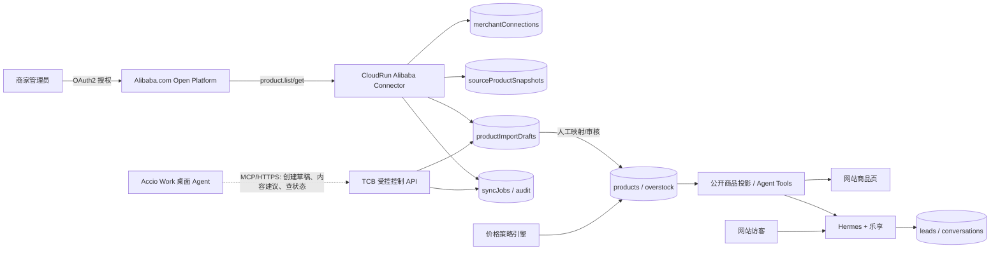

# Accio、Alibaba.com 与 TCB Agent 跨平台集成深度调研

日期：2026-07-28  
结论强度：商品 API 的公开技术合同已验证；目标账户权限、数据再利用许可、Accio Connector 与店铺询盘能力仍需账户内/商务验证  
适用范围：Alibaba.com 国际站商家，不等同于 1688、淘宝、天猫或 AliExpress

## 1. 结论先行

### 1.1 最终建议

**不要把 Accio 放进网站线上客服或商品同步的关键路径。** 推荐架构是：

1. **Alibaba.com Open Platform** 负责商家授权与商品数据读取，这是已有字段、分页、修改时间和 OAuth 合同的系统接口。
2. **CloudBase 控制平面** 保存每个商家的连接、同步游标、源快照、导入草稿、价格规则、发布版本和审计记录。
3. **现有已定方案 Hermes + 乐享 + CloudBase 控制平面** 只查询本站已审核发布的商品投影，回答访客 MOQ、价格档位、交期、认证和 OEM 能力。未来若更换 Agent runtime，必须在 `ConversationEngine` 边界另做 ADR。
4. **Accio Work** 作为商家员工的可选桌面助手：做选品、趋势研究、内容改写、图片/页面生成，或通过本平台 MCP/API 创建待审核草稿；不承担 24/7 运行、商品真相源或询盘消息总线。

核心判断不是“Agent 能不能聊天”，而是四个独立合同：

| 场景 | 可行性 | 正确实现 | Accio 的角色 |
|---|---:|---|---|
| 网站 Agent 了解商家 Alibaba 商品 | 文档技术面高；上线待授权 | Open Platform 拉取 -> 本站审核商品投影 -> RAG/tool query | 可选内容增强，不是数据源 |
| Alibaba 商品批量导入本站 | 文档技术面高；上线待授权 | `product.list/get/schema.render` -> IMPORT_DRAFT -> 人工发布 | 可选操作助手 |
| 本站给不同客户展示不同价格 | 高 | 本站确定性价格政策 + 身份/客户分群 | 不应由 Accio/LLM 决价 |
| 本站询盘同步回 Alibaba 消息中心 | 未证实/偏低 | 先向 Open Platform 确认私信/询盘 API；否则进本站 CRM/销售队列 | 不能据现有证据承诺 |
| Accio 与 TCB Agent 直接双向通信 | 部分可行 | Accio Work 作为 MCP Client 调本平台受控工具 | 未发现 Accio Agent Server/A2A API |
| 网站 24/7 客服直接部署 Accio | 不建议 | 使用既有 CloudRun BFF + Hermes + 乐享服务端 | Accio Work 是本地桌面运行 |

### 1.2 对当前几个关键疑问的直接回答

**是否要开 Accio 账户？** 只有要试用 Accio Work 的内部运营能力时才需要。下载 macOS/Windows 客户端、登录 Accio 账户、创建 Agent，再在 Connector/Plugin 中检查目标账号是否真的出现 Alibaba.com 授权能力。开账户不会自动得到一个可部署到 TCB 的 Agent API。

**Accio Agent 怎么部署？** 官方当前形态是本地优先的 Electron 桌面客户端。定时任务在本机运行，电脑关机时不会执行；官方公开文档没有 Linux 容器、CloudRun、Cloud Function 或无头 Agent Server 部署合同。因此它不适合作为网站生产客服后端。

**怎么与 TCB 沟通？** 有证据支持的方向是 Accio Work 作为 MCP Client；“远程 MCP/HTTPS 的具体 transport、认证、工具 allowlist 与审计能力”仍需 Gate 3 实测。反方向，即 TCB Agent 调用 Accio Agent，目前未发现公开 REST API、入站 Webhook、MCP Server 或跨厂商 A2A 合同。

**能交流什么？** 推荐只开放低风险、结构化工具：列出本商家导入草稿、创建/更新草稿、提交审核、查询同步状态、生成内容建议。不要开放原始 App Secret/token、跨商家搜索、直接发布、直接改价、批量删除或客户 PII。

## 2. Accio 实际是什么

### 2.1 经典 Accio

经典 Accio 是面向买家/采购团队的 AI 采购产品，官方能力包括找产品、找供应商、趋势/市场分析、新品概念、供应商比较和 AI 辅助询价。Agent Mode 把采购需求推进到最终询价。

它可以帮助买方向供应商发询价，但这不等于它能：

- 读取某个商家 Seller Center 的完整私有商品目录。
- 把你们网站访客询盘写回商家 Alibaba.com 消息中心。
- 向 TCB 暴露稳定的商品 API 或 Agent API。

### 2.2 Accio Work

Accio Work 是较新的本地 Agent 平台，能力比经典 Accio 更广：本地文件、终端、浏览器、外部 API、MCP、Skills、Plugins、团队 Agent、定时任务和 IM Channels。

它的正确定位是“员工电脑上的 Agent 工作台”，不是“可嵌入 SaaS 的托管 Agent 后端”：

- 官方只列 macOS/Windows Electron 客户端。
- Automations 在本地运行；关机后不执行，重启后补偿部分 missed runs。
- Channels 面向微信/企微、钉钉、飞书、Telegram、Discord，且默认有 Pairing；没有网站 Widget 的通用 HTTP 入站合同。
- Webhook 当前证据是自动化结果的出站通知，不是远程调用 Agent 的入站 API。
- MCP 证据明确指向“连接 external tool servers”，即 Accio Work 是 MCP Client。

### 2.3 Alibaba Connector 的现状

Accio Work release notes 确实出现过：

- Alibaba.com account authorization via Connectors。
- Alibaba.com Q&A / Business Advisor。
- `Alibaba Publish Skill`。
- Smart Assistant、shop publishing、store published versions、storefront editor。

但最新 Connector 指南又把 Alibaba 与 Shopify 放在 Coming Soon，而 Available Now 只列 Gmail、GitHub、Twitter、LinkedIn、Instagram。可能是区域/账号灰度、专用插件、文档滞后或功能回滚。

因此，在目标客户账户完成以下实测前，不能把 Accio Connector 写入销售承诺：

1. Connector 卡是否真实出现。
2. 授权页显示哪些 scope。
3. Agent 工具清单有哪些商品读取/发布动作。
4. 能否列出全部已上架商品并分页。
5. 是否返回 SKU、图片、MOQ、价格、交期、认证、修改时间。
6. 是否有增量游标或事件，而非每次重新浏览页面。
7. 数据能否通过结构化 API/MCP 导出到本平台。

## 3. Alibaba.com 官方能力核验

### 3.1 “没有 CSV”不等于“没有元数据接口”

Alibaba.com 国际站有正式 Open Platform。本次从官方公开 API 树读取到 12 类、235 个方法，其中商品 47、交易 29、物流 21、RFQ 7。

商品导入所需的核心接口已经存在：

| API | 用途 | 与本项目的关系 |
|---|---|---|
| `alibaba.icbu.product.list` | 商品概要分页查询，支持状态、上下架、类目、名称、分组、修改时间窗口 | 增量扫描与删除/下架识别 |
| `alibaba.icbu.product.get` | 单商品完整详情 | 标题、描述、图片、属性、MOQ、FOB、SKU、库存、交期等 |
| `alibaba.icbu.product.schema.render` | 读取商品发布 schema 与已有填写数据 | 处理复杂类目与完整编辑字段 |
| `alibaba.icbu.product.schema.add` | 新发商品 | 后期可选的反向发布 |
| `alibaba.icbu.product.schema.update` | 增量更新传入字段 | 后期可选的受控回写 |
| `product.inventory.get/update` | 库存读写 | 若业务真的展示库存，再单独接入 |
| `photobank.*` | 图片银行查询/上传 | 处理图片时遵守素材许可与平台规则 |

`product.list` 每页最多 30，最多查询到第 5000 个商品，并支持 `gmt_modified_from/to` 缩小时间范围。这提供了增量同步的技术基础，但公开文档没有稳定二级排序/游标合同；生产实现必须按 §4.3 把每个时间桶收敛到单页，否则阻断，不能仅靠翻页推进水位。

`product.get` 已验证返回：结构化卖点/FAQ、属性、主图和详情图、描述、MOQ、FOB 区间、币种、付款方式、供货能力、交期、港口、包装、批发价格、SKU、阶梯价、库存、定制项与公开详情 URL。

### 3.2 接入身份与授权

官方支持两种开发者：

- **自研型**：Alibaba.com 卖家给自己的店铺开发；适合单个合作商家的验证项目。
- **商用型**：你们把软件提供给多个卖家；需走外贸服务市场，卖家购买后授权。

应用类目决定权限包。商家 `B2B国际站企业对接` 默认可获得国际站基础、订单管理、物流权限包；服务商需先通过 `fuwu.alibaba.com` 的类目资质审核，再申请权限。即使 API 文档公开，目标应用的权限状态也必须审批为“有效”。

商品/订单被官方明确列为用户隐私数据，调用流程是 OAuth 2.0 authorization code：

```text
商家点击“连接 Alibaba.com”
  -> Alibaba 登录与授权页
  -> callback 获得短期 code
  -> 服务端 /auth/token/create
  -> 加密保存 access_token + refresh_token
  -> 带 app_key、timestamp、HMAC sign 调商品 API
```

token 有效期必须读取响应中的 `expires_in/refresh_expires_in`，不能硬编码示例值。自研应用可按规则刷新；商用 ISV 的授权期限与商家购买服务期限绑定。

### 3.3 询盘不是 RFQ

公开 API 树未发现普通店铺私信、TradeManager 或买家询盘正文的明显读写接口。`rfq.search/rfqdetail.get/quotation.post` 是供应商查公开采购需求并报价，不是商家消息中心。

因此首期把本站询盘写入自己的 `leads/conversations` 和销售队列，通过邮件/企微/CRM 通知。只有 Alibaba 官方书面确认并给应用授予相应消息权限后，才增加“同步回 Alibaba”能力。

## 4. 推荐目标架构



### 4.1 服务边界

| 组件 | 部署 | 职责 |
|---|---|---|
| OAuth callback + Connector API | CloudRun/HTTP Function | code 换 token、刷新、签名调用、授权状态/到期错误处理 |
| Sync worker | CloudRun + 定时触发 | 分页、修改时间高水位、重试、幂等、限流、快照 |
| Import review | 现有 React Admin | 字段映射、冲突处理、价格规则、素材审核、发布 |
| Catalog projection | 现有 public API | 只返回已发布且允许该访客看到的字段/价格 |
| Website Agent | 现有已定 Hermes + 乐享路线 | 调结构化商品工具，不直接持有 Alibaba token；CloudBase 负责业务控制平面 |
| Accio bridge | 可选远程 MCP Server/HTTPS | 仅内部草稿与状态工具，不给 App Secret/token |

本项目既有 ADR 已选择 BFF + Hermes + 乐享 + CloudBase 控制平面；本报告不重开该决策。CloudBase Agent SDK 证明 TCB 具备 AG-UI HTTP Agent 能力，但只有未来通过单独 ADR 替换 `ConversationEngine` 时才使用。无论底层 runtime 如何，Accio Work 都不进入访客请求链路。

### 4.2 建议数据模型

当前仓库 `products/overstock` 只有 `published: boolean`，没有导入草稿和来源状态。不要只给 `products` 加一个 `externalSourceId` 就开始同步；至少需要：

- `merchantConnections`：`tenantId`、provider、授权账号、加密 token 引用、scope/权限包、expiresAt、状态、授权终止检测时间。
- `syncCursors`：`tenantId`、resource、windowStart/windowEnd、lastModifiedWatermark、上次完整扫描时间。
- `syncJobs`：`tenantId`、类型、状态、扫描窗口、页数、读取/新增/更新/失败数、错误、traceId、幂等键。
- `sourceProductSnapshots`：`tenantId`、source product ID、sourceModifiedAt、原始字段 hash、最小必要原始快照、删除/下架标志。
- `productImportDrafts`：`tenantId`、规范化字段、映射警告、素材状态、reviewStatus、目标 collection/ID、sourceVersion、localVersion、mergeBase、fieldOwnership/overrides。
- `pricePolicies`：`tenantId`、客户段、币种、数量阶梯、有效期、优先级、审批版本。
- `products/overstock`：`tenantId`、已审核发布投影与来源 lineage，不保存 token 或未经审核的整包原始数据。

所有表/集合、对象存储路径、搜索/向量索引和审计记录都必须带服务端解析的 `tenantId`。至少强制唯一键 `(tenantId, provider, sourceProductId)`、所有父子关系的 tenant 一致性、repository 层 mandatory tenant predicate；若使用 PostgreSQL，再用 RLS/复合外键做第二道边界。任何缺 tenant 条件的查询在测试与运行时失败，而不是靠开发约定。

状态建议：

```text
DISCOVERED -> MAPPED -> NEEDS_REVIEW -> APPROVED -> PUBLISHED
                |             |
                v             v
              BLOCKED       REJECTED

Source update after local edit -> CONFLICT -> human chooses source/local/merge
```

### 4.3 增量同步算法

1. 作业开始时固定 `windowEnd = provider/server time - safetyLag`；读取上次成功 `windowStart` 并减去 overlap，扫描期间不移动上界。
2. 调 `product.list(gmt_modified_from=windowStart, gmt_modified_to=windowEnd, page_size=30)` 读取 `total_item`。只要 `total_item > 30`，就按秒级时间中点递归拆分窗口；相邻窗口共享边界秒并依靠 ID/hash 幂等去重，避免未知的端点包含语义造成边界漏数。
3. 每个最终时间桶必须满足 `total_item <= 30` 并只请求第一页，因此不会跨页依赖未记录的二级排序。若最小一秒桶仍有 `total_item > 30`，job 标记 `BLOCKED_UNSTABLE_TIE`；上线前必须向 Alibaba 获得稳定游标/快照/排序合同，不能继续翻页或推进 watermark。5000 上限因此也是硬阻断，不是截断点。
4. 对每个 ID 调 `product.get` 或 `schema.render`，保存 source hash 与 `sourceModifiedAt`；边界 overlap 允许重复读取，由幂等键去重。
5. 以 `(tenantId, provider, sourceProductId, sourceModifiedAt, sourceHash)` 作为处理幂等边界。
6. 新商品创建 `IMPORT_DRAFT`。源更新通过 `mergeBase + sourceVersion + localVersion` 做三方比较；只刷新 source-owned 且未人工 override 的字段，其他进入 `CONFLICT` 并用 expectedVersion/CAS 保存审核决定。
7. 定期做全量 reconciliation，识别已下架/删除商品；默认不自动删除本站商品，只标记来源失效并通知审核。
8. 只有所有单页子窗口与详情任务全部成功后推进 watermark；部分失败可重放，不跳过失败桶。

连接状态至少为 `ACTIVE -> REAUTH_REQUIRED -> DISCONNECTED`。当前官方证据只有 token 创建、刷新和到期，没有 revoke endpoint/撤权事件合同。任何 401/授权错误立即暂停该 tenant 的同步与 MCP 写工具，销毁无效 secret 引用并请求重新授权；用户主动断开或合同终止时停止作业并按保留政策删除缓存。具体撤权检测方式是 Gate 0 验收项，不能提前宣称平台支持主动 revoke。

## 5. 价格分层应该怎么做

Alibaba 上的价格是**来源事实**，本站价格是**本平台商业政策**，两者必须分层：

```text
sourceFacts: FOB / wholesale tiers / currency / MOQ / sourceModifiedAt
pricePolicy: customer segment / quantity / markup / FX / validFrom / validTo / approval
publishedPrice: policyVersion + calculated tiers + audit snapshot
```

本仓库已有 `unitPrice`、`wholesalePrice`、`vipPrice`，可以作为输出字段，但不应让 LLM 根据对话临时决定。推荐确定性优先级：合同客户价 > VIP 规则 > 批发数量阶梯 > 公价。客户段必须由服务端根据已认证账号/合同映射解析；匿名或未知身份只返回公价或转询盘，不能由模型提交 segment。每次展示记录 tenant、resolvedSegment、policyVersion、币种、有效期和输入数量。

网站 Agent 可以：

- 查询当前访客有权看到的价格档位。
- 解释 MOQ、数量阶梯和影响因素。
- 不确定时创建询盘/转人工。

网站 Agent 不可以：

- 读取成本、margin、其他客户合同价。
- 自行打折或承诺最终报价。
- 把 Alibaba FOB 原样当成所有客户的网站售价。

## 6. Accio 与 TCB 的可选协作方式

### 6.1 推荐：Accio Work 调你们的 MCP/API

若 Gate 3 证明 Accio Work 支持所需远程 transport、服务端认证、工具 allowlist 与审计，再给它配置一个每商家授权的远程 MCP Server；在确认数据保留和模型处理条款前只使用合成商品。工具保持小而明确：

- `list_import_drafts(status, limit)`
- `get_import_draft(draftId)`
- `create_content_suggestion(draftId, locale, audience)`
- `update_import_draft(draftId, patch, expectedVersion)`
- `submit_draft_for_review(draftId, expectedVersion)`
- `get_sync_job(jobId)`

全部工具必须：tenant 从服务端凭证解析，不接受模型传入任意 tenantId；写操作带 version/CAS；高风险操作要求人工确认；返回最小字段；完整审计 actor、tool、input hash、result、时间。

### 6.2 不推荐：Agent-to-Agent 自由聊天同步

自然语言对话没有 schema、幂等、分页、版本、冲突和删除语义。可以用来讨论“请为这批商品生成英文卖点”，不能用来证明“237 个 SKU 已完整同步且无重复”。系统间传递应是 API/MCP 工具调用和结构化 job result，聊天只做上层编排。

### 6.3 不采用：Accio 浏览器持续抓 Seller Center

Alibaba 官方规范明确禁止以任何方式爬取平台及关联平台数据，开发者协议也禁止代理自动登录。浏览器 Agent 即使能复用已登录 Chrome，也不能作为规避 Open Platform 的方案。

## 7. 多租户与合规硬边界

Alibaba 入驻规则明确要求获授权商家数据只能展示和用于**同一卖家**，不允许分享给其他组织/个人，也不允许聚合多店铺数据。因此：

- 每个商家的 OAuth 授权、token、数据、索引、Agent 工具调用与审计必须 tenant-scoped。
- 不建立跨商家共享商品池，不用多个商家的私有数据训练统一模型。
- RAG 检索先锁定 tenant，再检索；禁止模型决定 tenantId。
- App Secret 只在服务端 Secret Manager；Access/Refresh Token 加密保存。主动 revoke 机制尚未由官方资料证实，先以连接禁用、授权错误停机、密钥销毁和到期/重授权处理。
- 数据最小化；用户退订、撤回或合作终止时执行可证明的删除流程。
- 商品图片、详情、商标、证书仍需商家确认版权/使用权。OAuth 只授权数据访问，不自动转让素材知识产权。
- 将联系人、询盘、订单等数据发送给 Accio 或第三方 LLM 前，需单独确认授权范围、转委托协议、跨境传输与模型保留政策。

## 8. 建议 PoC：先证明数据合同，不先买大方案

### Gate 0：账号与资格（1–2 周，外部等待可能更久）

1. 选一个真实 Alibaba.com 付费商家主账号。
2. 在 Open Platform 注册开发者、创建 `B2B国际站企业对接` 应用。
3. 确认“国际站基础权限包”为有效，并验证四个 API 权限。
4. 完成 OAuth callback；证明 token 可刷新、到期/授权错误可触发停机；另向 Alibaba 确认主动 revoke/撤权事件合同。
5. 向 Alibaba 书面确认商品数据用于该商家本站展示与 Agent 问答的许可边界。

### Gate 1：只读导入（2–3 周）

- 同步 20–50 个商品。
- 覆盖标题、图片、属性、SKU、MOQ、价格、交期、详情、上下架和修改时间。
- 所有商品只进入 `IMPORT_DRAFT`，不自动公开。
- 验证重跑零重复、更新可识别、下架不误删、失败可恢复。

### Gate 2：价格与 Agent（2–3 周）

- 为 3 类客户配置公价/批发/VIP 规则。
- 由人工审核发布 10 个商品。
- 网站 Agent 只使用结构化工具回答 30 个 golden questions。
- 验收：无跨客户价格泄露、无未发布商品泄露、无 LLM 自造价格。

### Gate 3：Accio Work 可选实验（不阻塞主线，3–5 天）

- 开 Accio Work 账户，确认目标地区/套餐里 Alibaba Connector 是否实际可用。
- 记录授权 scope 和工具清单。
- 先以合成数据验证远程 transport、认证、工具 allowlist、审计与重试，再配置本平台只读/草稿 MCP 工具，完成一次“选品 -> 内容建议 -> 草稿 -> 人工审核”。
- 若只有浏览器操作而无结构化 Connector 输出，不进入生产架构。

### PoC 退出条件

以下任一项失败，停止开发并回到商务/平台确认：

- 商品 API 权限申请不通过。
- 授权条款不允许在独立站展示或用于该商家 Agent 问答。
- 图片/认证材料权利不清晰。
- 无法按租户隔离、撤权和删除。
- 询盘同步被当作首期硬需求，但 Alibaba 不提供相应官方权限。

## 9. 必须问 Alibaba/Accio 的问题

### Alibaba Open Platform

1. 我们作为多商户 SaaS 应申请哪一类服务市场类目，审核材料与费用是什么？
2. `product.list/get/schema.render` 属于哪个权限包，目标账号默认是否有效？
3. 调用频率、日配额、并发、错误重试与封禁阈值是什么？
4. 是否有商品创建/更新/下架 push topic？若没有，推荐轮询间隔是什么？
5. 是否存在店铺买家询盘/消息 API？名称、权限包、保留与回复规则是什么？
6. 商家授权商品数据能否展示在该商家自有独立站，并用于该商家专属客服 Agent 检索？
7. 图片、详情、认证文件的跨站缓存和再展示需要哪些额外许可？
8. 多商家 SaaS 在不聚合、不共享的前提下，允许怎样的逻辑/物理隔离？

### Accio Work

1. Alibaba Connector 当前在哪些地区、套餐和账号类型可用？为什么 Connector 指南仍标 Coming Soon？
2. Connector 的 OAuth scopes 与全部工具名是什么？
3. 能否结构化列出商家全部商品、SKU、价格、MOQ、图片和修改时间？
4. 是否有通用 Agent REST API、入站 Webhook、MCP Server 或 A2A 支持？
5. scheduled Team Webhook 的 payload、鉴权、重试、签名和幂等合同是什么？
6. Cloud Desktop 是否可 24/7 托管，SLA、区域、密钥与审计能力是什么？
7. 用户数据和第三方 Connector 数据会被发送到哪些模型/区域，保留多久，是否用于训练？
8. 能否限制 Agent 只调用指定 MCP tools，并导出完整工具审计日志？

## 10. 证据与不确定性

### 官方已证实

- Accio/Accio Work 的产品定位、本地运行、MCP Client、Channels、Automations 与出站通知能力；远程 transport/认证合同尚未验证。
- Alibaba.com 国际站 Open Platform 的开发者类型、权限申请、OAuth、token 与商品 API 的公开字段合同；目标应用是否获批尚未验证。
- 平台禁止爬取、同一卖家数据隔离、目的限制、加密审计、删除与知识产权要求。

### 尚未证实

- Accio Alibaba Connector 在目标账户是否可用及其具体 scope/工具。
- Accio 是否提供可供 TCB 反向调用的 Agent API/A2A。
- Alibaba.com 是否有申请制但未出现在公开 API 树中的店铺询盘消息 API。
- 商品 push topic、应用级配额与当前审核周期。
- 主动 revoke endpoint/撤权事件，以及同秒超过 30 条修改时的稳定游标/快照/排序合同。

### 最强反对意见

“既然 Accio 已经有 Alibaba Publish Skill，直接让它做完最省事。”这对内部人工辅助可能成立，但不能替代生产数据合同：公开文档对 Connector 可用性相互冲突，桌面 schedule 不满足 24/7，且没有已验证的分页、增量、幂等、撤权、SLA 和入站 API。即使未来 Accio 补齐这些能力，它也应作为 Open Platform 之上的操作层，而不是商品和客户数据的唯一真相源。

## 11. 官方来源

- Accio 首页与 About：`https://www.accio.com/`、`https://www.accio.com/about-us`
- Accio Work Help Center：`https://www.accio.com/work/doc`
- Accio Work Connectors：`https://www.accio.com/work/doc?slug=connectors-guide`
- Accio Work Browser：`https://www.accio.com/work/doc?slug=browser-use-guide`
- Accio Work Automations：`https://www.accio.com/work/doc?slug=automations-guide`
- Accio Work Channels：`https://www.accio.com/work/doc?slug=channels-guide`
- Accio Work Release Notes：`https://www.accio.com/work/doc?slug=changelog`
- Alibaba Open Platform 简介：`https://open.alibaba.com/doc/doc.htm#/?docId=7`
- API 权限申请：`https://open.alibaba.com/doc/doc.htm#/?docId=44`
- 卖家 OAuth 授权：`https://open.alibaba.com/doc/doc.htm#/?docId=72`
- 入驻管理规则：`https://open.alibaba.com/doc/doc.htm#/?docId=48`
- 个人信息规范：`https://open.alibaba.com/doc/doc.htm#/?docId=49`
- 开发者协议：`https://terms.alicdn.com/legal-agreement/terms/common_product_agreement/20240606111558176/20240606111558176.html`
- API 文档与公开 API 树：`https://open.alibaba.com/doc/api.htm`、`https://open.alibaba.com/handler/share/apidoc/getApiCategoryMixed.json`
