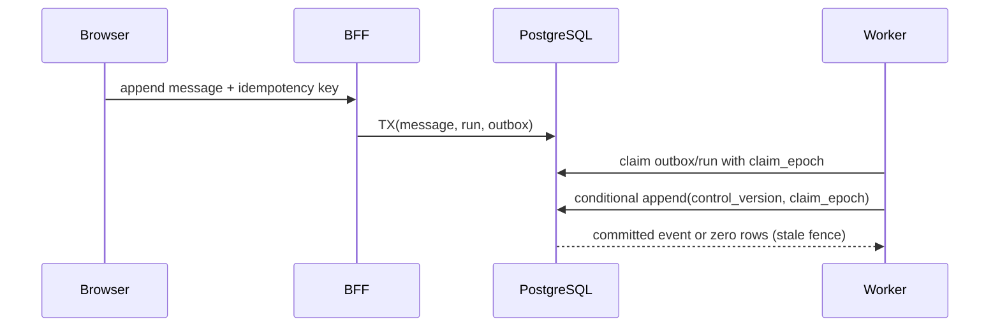
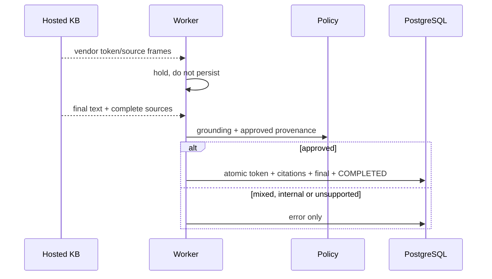
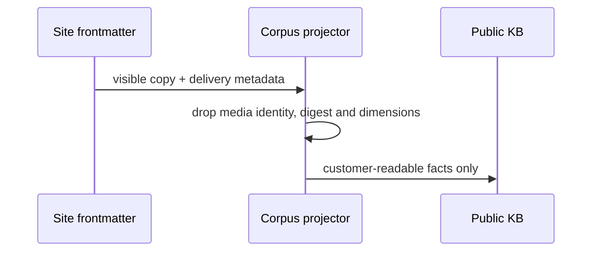
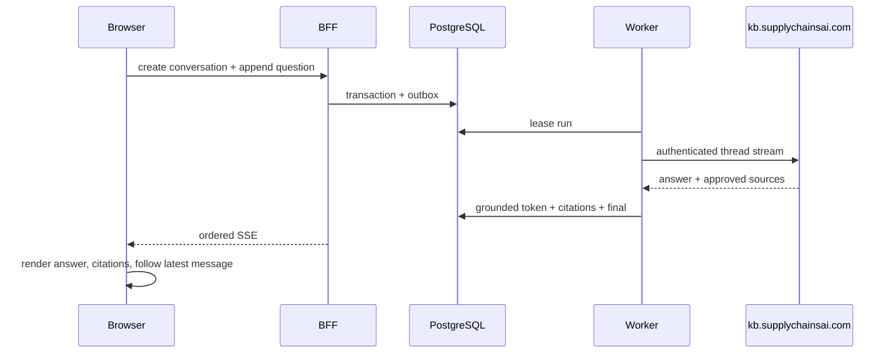

# AI assistant implementation trace

**Branch:** `feat/ai-assistant-platform-design`
**Mode:** solo MIU implementation
**Scope:** application code, local/CI runtime, migrations and deploy manifests.
Billable cloud purchases and production credential/corpus mutations remain release gates.

## MIU 2a-2d - transactional assistant substrate

### Runtime problem

The repository can probe PostgreSQL but has no durable assistant schema, BFF,
worker, migration runner or fenced write path. A visitor message therefore has
no atomic path from HTTP request to durable run/outbox work, and a stale worker
has no database-enforced barrier preventing output after takeover.

Current risky shape:

```text
Browser -> (no BFF) -> production KB developer API
PostgreSQL -> empty database used only by a disposable probe
```

### Data shape

| Value | Example | Lifetime | Scope |
| --- | --- | --- | --- |
| Conversation credential | random 256-bit bearer, SHA-256 at rest | bounded TTL | one conversation |
| Control version | `7` | conversation lifetime | one conversation |
| Run claim epoch | `3` | one worker lease | one run |
| Event sequence | `42` | retained/tombstoned | one conversation |
| Outbox item | `start_run` | until processed/dead-lettered | one transaction |

### Technology constraint

PostgreSQL `READ COMMITTED` and a single conditional statement are required for
the takeover fence. A read-then-write implementation can pass ordinary tests
while a stale worker commits after a human takes control. CloudRun containers
are stateless, listen on the injected `PORT`, and cannot hold authoritative
conversation state on local disk.

### Design / flow



### Best-practice fix

- Versioned SQL migrations with forward and rollback commands.
- Database constraints for conversation/run ownership, one live run, message
  idempotency, closed event types and system-payload non-disclosure.
- One conditional SQL statement for compare-and-set control transitions.
- One conditional SQL statement for fenced, gapless event append.
- BFF-issued opaque credentials; only hashes are stored.
- Separate stateless BFF and worker containers.

### Alternatives rejected

- CloudBase NoSQL for assistant control state: rejected because the live contract
  required by the state machine is already proven against PostgreSQL.
- Browser-to-KB access: rejected because the KB token is instance-wide.
- Fence check followed by an insert: rejected because takeover can race between
  the two statements.
- Deleting events for retention: rejected because it breaks gapless replay;
  payload tombstoning preserves sequence identity.

### Code translation

```ts
const event = await store.appendEventFenced({
  conversationId,
  runId,
  expectedControlVersion,
  claimEpoch,
  type: 'token',
  payload: { text },
});
// A null result is a normal stale-worker loss, never permission to retry the
// same payload outside the fence.
```

### Risk / test

Tests are written against the public store and HTTP seams. They prove migration
idempotence, direct-writer constraint rejection, concurrent gapless append,
idempotent message replay, credential scope/expiry, CORS refusal and SSE resume.

Commands:

```bash
AI_POSTGRES_PORT=55433 docker compose -f docker-compose.ai.yml stop ai-worker
DATABASE_URL=postgres://ai:ai@localhost:55433/ai_assistant pnpm --filter @vibelingan-channel/ai-store test
DATABASE_URL=postgres://ai:ai@localhost:55433/ai_assistant pnpm test:ai:runtime
AI_POSTGRES_PORT=55433 docker compose -f docker-compose.ai.yml up -d --no-build ai-worker
```

### Business correction

- Ownership: every row is scoped by `conversation_id`; event/run ownership is a
  composite foreign key.
- Actor: anonymous visitors hold a short-lived single-conversation credential;
  workers use server-only database credentials.
- Durable state: PostgreSQL; ephemeral state: plaintext bearer and open SSE
  connections.
- Value: request abuse limits are reserve-first and fail-closed; production
  spend thresholds remain a named release decision rather than an invented value.
- Concurrency: database versions, claim epochs and uniqueness arbitrate races.
- External provider: AnythingLLM is behind a server-only adapter and cannot
  authorize a state write.
- User-visible truth: only committed events are streamed.

## MIU 3 - hosted KB adapter reconciliation and pre-publication gate

### Runtime problem

The merged branch contained two independent AnythingLLM adapters. The package
entry exported the smaller implementation while the conformance-tested adapter
was present but unused. More importantly, the worker committed vendor token and
citation events before the final grounding and source-publication decision.
An answer rejected at the end could therefore already have disclosed its text.

### Data shape

| Value | Example | Lifetime | Scope |
| --- | --- | --- | --- |
| Provider source identity | document title from the final frame | one citation | one provider document |
| Approved source prefix | `channelkb` | deployment | one public corpus contract |
| Buffered vendor output | tokens and source frames | one provider run | worker memory only |
| Published event set | token, citations, final or error | retained | one conversation |
| Credential attestation | truncated SHA-256 + workspace + rotation | deployment | worker startup gate |

### Technology constraint

The hosted fork sends citations only in its final frame. It also reports local
`file:` paths and may mix approved and non-approved documents. True progressive
streaming is therefore incompatible with a fail-closed public-source decision:
publishing early text would make the final policy check cosmetic.

### Design / flow



### Best-practice fix

- One adapter is exported from the package root and checked by the shared
  conformance suite.
- Runtime imports use narrow `ai-engine` subpaths, preventing the test harness
  and `node:test` from entering the worker bundle.
- Builds load the emitted BFF/worker artifact so a TypeScript-successful but
  unstartable bundle fails CI.
- Remote HTTP is refused by default; its diagnostic override is forbidden in
  the production manifest.
- Worker startup verifies credential/workspace/rotation attestation and proves
  that the workspace has no agent/tool surface.
- Document title is retained as provenance, reader title is display-only, and
  `file:` URLs never cross the adapter boundary.
- Mixed approved/unapproved evidence refuses the whole answer. The worker
  publishes nothing before that decision, then commits the approved event set,
  assistant turn and run completion in one fenced transaction.

### Alternatives rejected

- Filter out only the bad citation: rejected because the answer prose may
  already contain a claim derived from it.
- Prefix-match the display title: rejected because provider descriptions can be
  `Unknown` or change independently of document identity.
- Replay every withheld vendor chunk after approval: rejected because it
  creates hundreds of database transactions without restoring real-time UX.
- Trust `/api/ping`: rejected because it does not exercise auth, generation,
  citation or tool-surface controls.

### Risk / test

Tests prove mixed-source refusal, zero pre-final publication, hosted-fork
provenance normalization, tool-surface refusal, remote-HTTP refusal, bundle
loadability and manifest parity. A live Phase 1 acceptance additionally proved:

- an approved hosted-KB answer produces exactly `token`, `citation`, `final`;
- the citation uses the approved source namespace and exposes no `file:` URL;
- a query for the gateway test document produces `error` only, with zero token
  and zero citation leakage.

### Business correction

- Ownership: the repository owns publicability and durable publication; the KB
  owns retrieval/generation but cannot authorize an event write.
- Actor: visitors talk only to the BFF; only the worker holds the instance-wide
  KB credential.
- Durable state: approved/refused conversation events in PostgreSQL. Ephemeral
  state: unapproved provider chunks in worker memory.
- Value boundary: a cited answer is useful only when its source is approved for
  this customer-facing channel; citation presence alone is insufficient.
- Concurrency: database claim epochs and control versions still fence the final
  approved write after the provider call.
- External provider: the installed fork is treated as untrusted input with an
  observed, not assumed, compatibility contract.
- User-visible truth: visitors see either the exact approved final answer and
  sources, or a bounded refusal. They never see text later retracted by policy.

## MIU 4 - public corpus projection excludes delivery metadata

### Runtime problem

The hosted workspace is intentionally public-only, but the ingest flattener
walked every non-layout YAML field. Product image delivery records therefore
became searchable prose such as `image id`, `sha256`, `image width` and
`image height`. Those values are needed by the website renderer, not by a
customer answer, and must not cross the public knowledge boundary.

Current risky shape:

```text
site YAML { public copy, imageId, sha256, dimensions }
  -> generic recursive flatten
  -> customer-facing KB document
```

### Data shape

| Value | Example | Lifetime | Scope |
| --- | --- | --- | --- |
| Customer-visible fact | `MOQ from 500 units` | content release | public page and KB |
| Media object identity | 32-character `imageId` | storage object | renderer/backend only |
| Integrity digest | 64-character `sha256` | derivative lifetime | build/validation only |
| Display dimensions | `825 x 776` | asset version | renderer only |

### Technology constraint

The source documents are structured frontmatter used by both rendering and
delivery. A generic recursive text projection cannot infer that every stored
field is publishable merely because the containing page is public. The KB is a
second delivery surface and needs its own explicit projection boundary.

### Design / flow



### Best-practice fix

Extend the corpus noise allowlist with the exact media delivery keys used by
the current site: `sources`, `imageId`, `imageWidth`, `imageHeight`, `width`,
`height` and `sha256`. Keep customer-facing copy such as product names, proof
points and MOQ values. The projection test carries both categories in one
fixture so dropping the whole product record cannot make it pass.

### Alternatives rejected

- Upload the rendered HTML: rejected because navigation and layout chrome would
  dominate retrieval and the reviewed structured-source contract would be lost.
- Block only hash-looking values: rejected because internal identifiers and
  dimensions are not all hashes, while a legitimate public fact may contain a
  number or checksum-like string.
- Accept the metadata because the page is public: rejected because these fields
  are not rendered as customer claims and provide no answer value.

### Code translation

```js
const NOISE_KEYS = new Set([
  'sources',
  'imageId',
  'imageWidth',
  'imageHeight',
  'width',
  'height',
  'sha256',
]);
```

### Risk / test

The focused test proves visible title and MOQ survive while image identity,
digest and dimensions do not. A second dry-run scans all four real source
documents for the forbidden output labels before remote ingest.

```bash
node --test scripts/ai-ingest-content.test.mjs
pnpm exec node scripts/ai-ingest-content.mjs --dry-run
```

### Business correction

- Ownership: public copy is owned by the published site; storage identity stays
  with the internal media subsystem.
- Actor: customers may retrieve the projected facts; only backend/build code
  consumes storage identifiers and integrity digests.
- Durable data: the KB stores projected public text, never the media registry.
- External provider: AnythingLLM receives only the explicit public projection.
- User-visible truth: answers cite facts a visitor can read on the linked page,
  not implementation metadata that happens to share its YAML file.

## MIU 5 - hosted KB to browser tracer bullet

### Business correction

- Actor: an anonymous buyer on the public Supply Chains AI site.
- Smallest action: ask one product question and receive one useful answer with
  links they can inspect.
- Durable state: conversation, visitor message, run provenance and ordered
  public events in local PostgreSQL.
- External boundary: the worker alone holds the hosted KB credential; the BFF
  and browser never receive it.
- Failure correction: liveness is insufficient. Startup requires live v2
  evidence for auth, public retrieval, sync generation, SSE generation,
  citations, corpus generation and disabled tool surface.

### Verified flow



Observed on 2026-09-01 with desktop and 390x844 mobile browser sessions. Two
consecutive questions reused one conversation, produced cited answers and kept
the latest mobile response visible.
