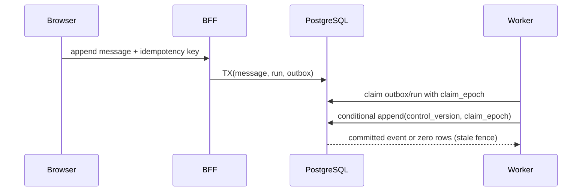

# AI assistant implementation trace

**Branch:** `feat/ai-assistant-platform-design`
**Mode:** solo MIU implementation
**Scope:** application code, local/CI runtime, migrations and deploy manifests.
Billable cloud purchases and production credential/corpus mutations remain release gates.

## MIU 2a-2d - transactional assistant substrate

### Runtime problem

The repository can probe PostgreSQL but has no durable assistant schema, BFF,
worker, migration runner or fenced write path. A visitor message therefore has
no atomic path from HTTP request to durable run/outbox work, and a stale worker
has no database-enforced barrier preventing output after takeover.

Current risky shape:

```text
Browser -> (no BFF) -> production KB developer API
PostgreSQL -> empty database used only by a disposable probe
```

### Data shape

| Value | Example | Lifetime | Scope |
| --- | --- | --- | --- |
| Conversation credential | random 256-bit bearer, SHA-256 at rest | bounded TTL | one conversation |
| Control version | `7` | conversation lifetime | one conversation |
| Run claim epoch | `3` | one worker lease | one run |
| Event sequence | `42` | retained/tombstoned | one conversation |
| Outbox item | `start_run` | until processed/dead-lettered | one transaction |

### Technology constraint

PostgreSQL `READ COMMITTED` and a single conditional statement are required for
the takeover fence. A read-then-write implementation can pass ordinary tests
while a stale worker commits after a human takes control. CloudRun containers
are stateless, listen on the injected `PORT`, and cannot hold authoritative
conversation state on local disk.

### Design / flow



### Best-practice fix

- Versioned SQL migrations with forward and rollback commands.
- Database constraints for conversation/run ownership, one live run, message
  idempotency, closed event types and system-payload non-disclosure.
- One conditional SQL statement for compare-and-set control transitions.
- One conditional SQL statement for fenced, gapless event append.
- BFF-issued opaque credentials; only hashes are stored.
- Separate stateless BFF and worker containers.

### Alternatives rejected

- CloudBase NoSQL for assistant control state: rejected because the live contract
  required by the state machine is already proven against PostgreSQL.
- Browser-to-KB access: rejected because the KB token is instance-wide.
- Fence check followed by an insert: rejected because takeover can race between
  the two statements.
- Deleting events for retention: rejected because it breaks gapless replay;
  payload tombstoning preserves sequence identity.

### Code translation

```ts
const event = await store.appendEventFenced({
  conversationId,
  runId,
  expectedControlVersion,
  claimEpoch,
  type: 'token',
  payload: { text },
});
// A null result is a normal stale-worker loss, never permission to retry the
// same payload outside the fence.
```

### Risk / test

Tests are written against the public store and HTTP seams. They prove migration
idempotence, direct-writer constraint rejection, concurrent gapless append,
idempotent message replay, credential scope/expiry, CORS refusal and SSE resume.

Commands:

```bash
AI_POSTGRES_PORT=55433 docker compose -f docker-compose.ai.yml stop ai-worker
DATABASE_URL=postgres://ai:ai@localhost:55433/ai_assistant pnpm --filter @vibelingan-channel/ai-store test
DATABASE_URL=postgres://ai:ai@localhost:55433/ai_assistant pnpm test:ai:runtime
AI_POSTGRES_PORT=55433 docker compose -f docker-compose.ai.yml up -d --no-build ai-worker
```

### Business correction

- Ownership: every row is scoped by `conversation_id`; event/run ownership is a
  composite foreign key.
- Actor: anonymous visitors hold a short-lived single-conversation credential;
  workers use server-only database credentials.
- Durable state: PostgreSQL; ephemeral state: plaintext bearer and open SSE
  connections.
- Value: request abuse limits are reserve-first and fail-closed; production
  spend thresholds remain a named release decision rather than an invented value.
- Concurrency: database versions, claim epochs and uniqueness arbitrate races.
- External provider: AnythingLLM is behind a server-only adapter and cannot
  authorize a state write.
- User-visible truth: only committed events are streamed.
