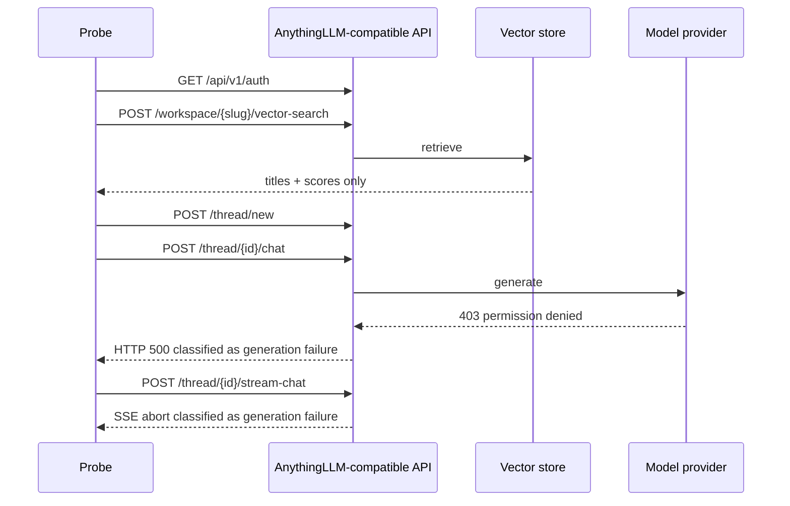

# Production KB and CloudRun/PostgreSQL runbook

**Status:** local BFF/worker/store/widget implemented and verified; production release blocked
**Evidence date:** 2026-08-25 (Asia/Tokyo)
**Scope:** Channel public website assistant only

This runbook joins the local Docker substrate, the supplied production
AnythingLLM-compatible KB, and the proposed CloudBase Run + TencentDB PostgreSQL
deployment. It contains no credential, public IP, workspace UUID, database
password, or private network identifier.

## Outcome first

| Surface | Observed result | Release meaning |
| --- | --- | --- |
| Local PostgreSQL 16 | Healthy on an overrideable high port; S0-S11 and application integration tests PASS | Durable store and migration path implemented |
| Local BFF + worker | Containers healthy; authenticated create/message/SSE round trip PASS | Production-shaped runtime is implemented locally |
| Public widget | Real-browser create/message/SSE/citation flow PASS on the three allowed public routes | UI is implemented; production endpoint remains gated |
| Local AnythingLLM | Container and `/api/ping` healthy | Runtime shape works; model E2E is not proven without a local model key |
| Production KB auth | PASS | Supplied developer token is valid |
| Production vector search | PASS, four results returned | Retrieval is separately callable from generation |
| Production sync chat | FAIL: HTTP 500 wrapping upstream model 403 | Model/provider permission is broken |
| Production SSE chat | Transport responds, then `type=abort` with the same upstream 403 | SSE route exists; successful token streaming is not proven |
| Production citations | Zero, because generation aborts | `supportsCitations` remains unproven |
| Public-corpus isolation | FAIL: `hermes-skills-*` appeared in results | This workspace must not serve public website traffic |
| Transport security | FAIL: remote service is plain HTTP on a public high port | Rotate the exposed token and require HTTPS before reuse |
| CloudBase environment | PASS: Shanghai, Standard plan, prepaid through 2027-07-31 | Existing environment is usable, but it is not pay-as-you-go |
| CloudBase database mode | NoSQL only; PostgreSQL is not provisioned | Use a separate pay-as-you-go TencentDB PostgreSQL for the bounded integration window |
| Existing `ai-probe` CloudRun | Control plane says normal; public HTTPS returned 503 after scale-from-zero | Historical SSE proof remains useful, but current runtime health is FAIL |
| Existing CloudRun VPC | No VPC/subnet attached; public egress enabled | It cannot yet prove the private PostgreSQL path |

The strongest surviving risk is not database configuration. It is that a
powerful instance-wide developer token and non-public corpus are currently
reachable through a plaintext public endpoint. Fix that boundary before adding
the website BFF.

## MIU KB-PROBE - split retrieval health from generation health

### Runtime problem

The supplied examples joined thread creation, retrieval, model generation and
SSE into one curl sequence. A failed answer therefore did not say whether the
KB, model provider, or stream transport was broken.

### Data shape

| Value | Example | Lifetime | Scope |
| --- | --- | --- | --- |
| Base URL | `https://kb.example.com` | deployment | server-side only |
| Developer API key | secret, never printed | rotateable | instance-wide control token |
| Workspace slug | opaque identifier | workspace | one probe target |
| Probe thread | generated timestamp name | diagnostic | one workspace |
| Probe report | auth/retrieval/chat/SSE status | build evidence | contains no credential or source chunks |

### Technology constraint

AnythingLLM exposes vector search independently from chat. Its chat endpoints
can report an upstream provider error either as HTTP 500 JSON or as an SSE
`abort` event. The probe must preserve both outcomes instead of treating every
non-answer as a dead KB.

### Design / flow



### Best-practice fix

`scripts/probe-anythingllm.mjs` now:

- refuses to send a bearer token to remote HTTP unless a bounded diagnostic
  explicitly sets `ALLOW_INSECURE_ANYTHINGLLM=true`;
- checks auth, workspace lookup and vector retrieval before chat;
- creates one named probe thread, then checks sync and SSE chat;
- handles both HTTP-error and SSE-abort failure shapes;
- emits only sanitized source titles/scores, never the API key or chunks.

### Alternatives rejected

- Browser-to-KB calls: rejected because the developer token is instance-wide
  and must never enter browser code.
- Recording raw responses: rejected because source chunks can contain internal
  material and logs can become a second leak.
- Treating `200 /api/ping` as readiness: rejected because the observed model
  path still returns 403.

### Risk / test

```bash
node --test scripts/probe-anythingllm.test.mjs
cp .env.ai-probe.example .env.ai-probe
# Fill the gitignored file from an approved secret source.
pnpm test:ai:kb
```

The tests cover remote-HTTP refusal, retrieval/chat separation, both chat
failure shapes, and key non-disclosure.

## Local setup

### 1. Configure without committing secrets

```bash
cp .env.ai.example .env.ai
```

Set `GENERIC_OPEN_AI_API_KEY` from an approved local secret store, generate the
three signing values, and choose `AI_POSTGRES_PORT` if the default is occupied.
Do not print a secret to the terminal merely to copy it into the file.

### 2. Start the application runtime

```bash
AI_POSTGRES_PORT=55433 pnpm dev:ai
docker compose -f docker-compose.ai.yml ps
pnpm smoke:ai:bff
pnpm smoke:ai:worker
```

The verified machine needed `AI_POSTGRES_PORT=55433` because another project
already owned `55432`; the other container was preserved. The default runtime
uses the deterministic fake engine so the full outbox/SSE path can be checked
without a provider key. For optional local KB work, `pnpm dev:ai:full` starts
AnythingLLM, which resolved
to image digest
`sha256:a5de2ba74bf28dfadeb2e09fab202efbd358c4a7127d040373f2588eea928bea`.
`latest` is acceptable for this local probe only; production must pin a reviewed
version and digest.

### 3. Verify PostgreSQL

```bash
DATABASE_URL=postgres://ai:ai@localhost:55433/ai_assistant pnpm test:ai:store
DATABASE_URL=postgres://ai:ai@localhost:55433/ai_assistant pnpm test:ai:runtime
```

Observed S0-S11 all passed, including READ COMMITTED, blocked conditional-update
predicate re-evaluation, rollback, partial uniqueness and multi-statement
transactions.

`packages/ai-store/src/migrations` is now the durable schema source of truth.
The BFF and worker apply it idempotently at startup; the CLI provides explicit
up/down commands. No business-data seed is required: conversations, opaque
credentials, runs, messages, events, outbox work and rate-limit buckets are
created through the same application paths used in production.

## Production KB findings and required corrections

### What is working

- API authentication succeeds.
- Workspace lookup succeeds.
- `/vector-search` returns ranked results, closing ADR-002 question 1 for this
  installed fork.
- The thread create, sync chat and SSE routes exist.
- System settings report `generic-openai`, a ZenMux-compatible base path, native
  embeddings and LanceDB. Secret setting values are returned as booleans, not
  raw strings.

### What is broken

- Both chat routes fail with upstream `403 You have no permission to access this
  resource`. The current model permission/model selection must be repaired at
  the provider; changing retrieval code will not fix this.
- Successful token streaming and citations remain unverified until generation
  succeeds.
- Vector results include `hermes-skills-*`. That is direct evidence that the
  workspace is not an isolated, approved public FAQ corpus.

### Secret and authority audit

1. The full bearer value visible in the supplied screenshot is a secret. Rotate
   it after this diagnostic and delete/redact shared copies where possible.
2. The token is an instance developer API key, not a workspace-scoped read-only
   token. The same authenticated surface can read system configuration and
   enumerate workspaces, and the Swagger surface documents administrative and
   mutation routes. Keep it only in the BFF/worker secret boundary.
3. Plain HTTP sends the bearer in plaintext over the network path. Put the KB
   behind HTTPS before issuing the replacement token; the committed probe
   enforces this by default.
4. The public website needs a dedicated workspace containing only approved
   publishable material. A positive public query, a negative internal query,
   and a forbidden write must all be standing release probes.
5. Do not commit the production IP, workspace slug or any API/provider key.
   Deployment documentation uses placeholders; real identifiers live in the
   protected deployment inventory.

## CloudBase Run + TencentDB PostgreSQL production shape

```text
Browser
  -> HTTPS CloudBase Run Chat BFF (public ingress)
       -> AnythingLLM retrieval/generation service (private/VPC or HTTPS)
       -> TencentDB PostgreSQL private endpoint :5432
  -> separate CloudBase Run worker
       -> same private PostgreSQL endpoint
```

### Network decisions

- Use the same region and VPC for CloudBase Run and TencentDB PostgreSQL.
- Give CloudBase Run a dedicated subnet; the database may use another subnet in
  the same VPC.
- Enable CloudBase Run private-network attachment and use the database private
  host with explicit port `5432`.
- Allow PostgreSQL TCP 5432 only from the approved CloudBase Run subnet/security
  boundary. Do not enable a public database address for production.
- Keep CloudBase Run public egress enabled initially because the current model
  and KB are public third-party endpoints. If public egress is later disabled,
  add a NAT gateway and route before rollout or those calls will fail.
- Public ingress and public egress are separate switches. The BFF may retain an
  HTTPS public entry while its outbound path uses VPC/NAT controls.

### Live CloudBase inspection (read-only)

Device authorization was completed and the exact environment was inspected on
2026-08-25 without changing any cloud resource:

| Item | Observed fact | Interpretation |
| --- | --- | --- |
| Environment | `ap-shanghai`, status normal, Standard plan | Reuse the environment; do not create a replacement by assumption |
| Billing | Prepaid, credit deduction, no auto-renew, expiry 2027-07-31 | The existing environment is not the proposed hourly PostgreSQL purchase |
| Runtime backend | NoSQL true; PostgreSQL and MySQL false | Confirms that PostgreSQL must be a separate TencentDB instance or separately approved environment |
| CloudRun inventory | One function-mode `ai-probe`, 1 CPU / 2 GiB, min 0 / max 5 | It is evidence infrastructure, not the production BFF or worker |
| Network | VPC/subnet empty, internal access closed, public egress enabled | No private-database connectivity has been proved |
| Runtime check | HTTPS root timed out once, then returned HTTP 503 after about 17 seconds | Control-plane `normal` and successful historical deployment do not establish current health |

The exact environment ID, storage names, image registry path and future private
network identifiers stay in the protected deployment inventory rather than this
repository.

These points follow the current CloudBase VPC, internal-link and egress guides,
plus TencentDB PostgreSQL's security-group guide:

- <https://docs.cloudbase.net/run/deploy/networking/vpc>
- <https://docs.cloudbase.net/run/deploy/networking/internal-link>
- <https://docs.cloudbase.net/run/deploy/networking/egress>
- <https://cloud.tencent.com/document/product/409/54749>

### Initial pay-for-use profile

The following is a starting hypothesis, not a production sizing claim:

| Service | CPU / memory | Min / max instances | Why |
| --- | --- | --- | --- |
| BFF during private integration | 0.5 CPU / 1 GiB | 0 / 3 | low spend; cold starts accepted |
| Worker during private integration | 0.5 CPU / 1 GiB | 0 / 2 | no idle worker spend |
| BFF at customer pilot | 0.5 CPU / 1 GiB | 1 / measured max | remove first-token cold-start penalty |

CloudBase fixes memory at twice CPU and permits scale-to-zero or a warm minimum.
Move from zero to one warm BFF only after measuring cold-start and first-token
latency. The existing `ai-probe` is larger (1 CPU / 2 GiB, min 0 / max 5), but
its current 503 means it is not sizing evidence for the production service.
TencentDB PostgreSQL supports hourly postpaid billing and can be
released after a bounded integration window; actual instance/storage prices
must be taken from the logged-in calculator at purchase time.

- CloudBase pricing: <https://tcb.cloud.tencent.com/pricing>
- CloudBase Run service settings:
  <https://docs.cloudbase.net/run/deploy/service-setting>
- TencentDB PostgreSQL billing:
  <https://cloud.tencent.com/document/product/409/49577>
- TencentDB PostgreSQL release behavior:
  <https://cloud.tencent.com/document/product/409/48036>

### Configuration inventory (values stay outside Git)

| Variable / identifier | Where it belongs |
| --- | --- |
| `DATABASE_URL` | BFF and worker protected runtime environment |
| `ANYTHINGLLM_BASE_URL` | BFF/worker runtime environment; HTTPS/private only |
| `ANYTHINGLLM_API_KEY` | BFF/worker protected runtime environment |
| `AI_KNOWLEDGE_CREDENTIAL_ID` | non-secret approved attestation identity; worker startup must match it |
| `AI_IP_HASH_SECRET` | BFF protected runtime environment; HMAC-pseudonymizes rate-limit subjects |
| `AI_WORKER_LEASE_SECONDS` | worker runtime; must exceed maximum stream duration by at least five seconds |
| `VPC_ID`, CloudRun subnet ID | protected deployment inventory |
| TencentDB instance ID, private host, port, database | protected deployment inventory |
| provider model/key and spend cap | protected runtime/provider console |
| non-secret service names and health URLs | deployment handoff |

CloudBase documents direct environment-variable injection into containers. No
first-class CloudBase Run secret-reference contract was verified in this pass,
so do not put secret values in a committed manifest. Inject them through the
protected deployment path, or use an approved external secret manager with
runtime retrieval and document that contract separately.

### Live provisioning gate

Before any cloud write:

1. **Done, read-only:** authorize CloudBase and inspect the exact environment.
2. **Done, read-only:** confirm Shanghai, prepaid Standard plan, NoSQL-only
   runtime, the existing `ai-probe`, and the absence of VPC attachment.
3. Diagnose or retire the stale `ai-probe`; do not treat its control-plane
   `normal` status as a production health check.
4. Select and record exact VPC/subnet/security-group identifiers without
   credentials.
5. Obtain explicit budget approval for the additional pay-as-you-go TencentDB
   PostgreSQL window.
6. Provision, migrate and run S0-S11 from the deployed BFF/worker path.
7. Verify private 5432 connectivity, TLS policy, pooling, rollback and failure
   behavior; then release the temporary instance if the approved window ends.

No cloud resource was created, purchased, updated or deleted during this pass.
