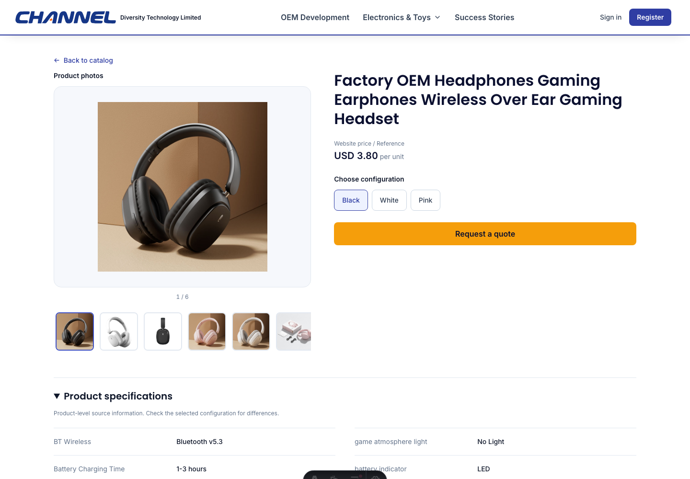
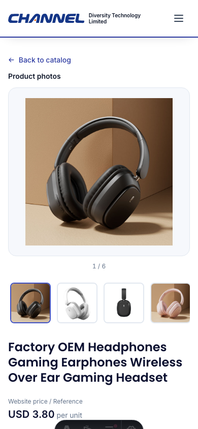

# Client Product Detail UI Update

Date: 2026-09-16
Branch: feat/alibaba-wiring-closeout; starting commit 38331057544ee0031b25d82db7e30502e38d4acf
PR: https://github.com/vibelingan/channel/pull/55 (open at start)

Status: local UI acceptance passed; remote test/main promotion not performed.

## Final Local Results

| Check | Observed result |
| --- | --- |
| Site unit tests | 420 passed, 0 failed, 1 explicitly opt-in browser test skipped |
| Package/Astro, root and E2E types | Passed; Astro 0 errors, 0 warnings, 8 hints |
| Biome | 599 files, no errors |
| Project craft gates | Exit 0; 12 unchanged baseline items, 0 new findings, 0 execution errors |
| Production public browser suite | 41 passed |
| Production catalog/Chromium/WebKit suite | 67 passed, no retries after focus correction |
| Production formal journeys | 6 passed, retries disabled; exit 0 |
| Local Admin lifecycle and editor | 5 + 11 passed in the non-formal lane |
| Focus regression repetition | WebKit 568x320: 5 passed with retries disabled |
| Real-photo visual replay | Chromium 320x568, 390x844, 1440x1000 passed and screenshots inspected |

The last six formal cases were rerun on a fresh disposable database and fresh
production build after correcting a test's radio-vs-select assumption for the
55-configuration fixture. The focused runner retained the standard runner's
readiness, origin, build and process/database cleanup logic; it omitted only
the already-passing public and catalog groups. Temporary copy:
`/tmp/channel-formal-focused.mjs`; final log `/tmp/channel-formal-focused.log`.
The checked-in full reproduction remains:
`CI=true E2E_RECORD_ARTIFACTS=1 E2E_CATALOG_FORMAL=1 node scripts/run-catalog-admin-local-e2e.mjs`.

Real-photo replay fetched one anonymous published v3 DTO and six JPEGs (424,313
bytes total), retained the original revision and URLs, and replayed those bytes
into the actual local DEV page. All six thumbnails decoded at each viewport;
photo browsing retained the SKU and canonical URL. No horizontal overflow,
page/console errors or attempted writes were observed. Supplier notes were
visible without expansion. This sample has no description images: description
image behavior is covered separately by unit and production browser fixtures,
not claimed as real-photo coverage. The Astro DEV toolbar in these screenshots
does not ship in the production build. No network-performance claim is made.

Local machine-readable evidence:
`output/playwright/client-real-visual/summary.json` and viewport/full-page PNGs.

The project gate was run through
`/Users/SeanCai/Desktop/projects/dev-pipeline/tools/run-craft-gates.sh --changed-files /tmp/channel-ui-changed-files.txt --json`.
An earlier mistaken invocation of the global knowledge-library linter reported
rule-document frontmatter errors; that output is not a project code-gate result.
No baseline, rule exemption, global knowledge file or Git hook was changed.

## Client Request

- Show supplier notes and product description images directly, without opening
  collapsed controls.
- Display product photos without requiring a View product gallery link. More
  images can use the existing horizontal thumbnail scroller.
- Keep the existing desktop gallery-left/information-right layout. The main
  information area contains title, price reference, configuration choices and
  Request a quote, in that order. Remove surrounding category/key-fact and
  verbose selected-configuration panels from this area.
- Keep full specifications and notes below. On mobile, images precede title,
  price, options and the quote action. Natural scrolling is allowed; do not
  shrink text or crop information merely to force everything into one screen.
- Validate locally, publish and verify test, then merge the feature PR to main.
  Never merge test history into the main-based feature. Preserve concurrent AI
  and catalog architecture worktrees.

## Implementation Boundaries

- No backend, source observations, publication rules, pricing authority, currency
  conversion, quote transport or database changes are intended.
- One unified gallery lists explicitly assigned SKU photos first, followed by
  deduplicated general product photos. A selection without assigned photos can
  immediately display general photos, labelled as general rather than claiming
  to depict the selected configuration. Broken/unresolved assigned photos do not
  silently switch to another color. Photo browsing never changes selected SKU.
- Notes and description images use visible sections/headings instead of details
  toggles. Offscreen description images retain native lazy loading, async decoding,
  existing image caps and authenticated/public URL boundaries.
- Compact reference prices preserve website-pricing precedence, separate product
  and variant scopes and currencies, and exact minor-unit formatting. Unknown
  prices remain quote requests. Tier ranges are reference ranges, not promises
  that every quantity qualifies for the lowest price.
- Quantity and customization remain inside the quote dialog. There is one main
  CTA. No-SKU products use the supported product-level customization intent;
  invalid/pending selections and disabled Admin preview inquiries remain blocked.
- The previous country-picker Escape and touch regression remains unchanged.

## Verification Plan

1. Render regressions: visible notes/images, safe text, primary order, exact price
   authority, unavailable/mixed-currency prices, no-SKU quote and disabled states.
2. Gallery regressions: missing assignment displays general image; assigned image
   first; no toggle; general thumbnail does not select another SKU; unresolved
   private/failed assignment does not expose raw data or wrong-color fallback.
3. Browser: desktop and mobile order/layout, horizontal gallery scrolling, notes
   and description images visible without interaction, compact price on ordinary
   detail/Admin preview, quote quantity/customization and country-picker behavior.
4. Local production-build catalog/Admin and formal persisted RFQ lanes, types,
   lint, site tests and full same-SHA CI before release.
5. Before updating test, inspect latest main/test and shared deployment identity.
   An earlier isolated test merge must be re-created or updated with this final
   verified UI; never publish its older pending merge result.
6. After test deploy, verify actual SHA, ordinary public detail and Admin preview,
   and both explicitly approved live acceptance scopes before main merge.

## Current Evidence

- Parent-observed complete site run: 421 tests, 419 passed, 1 failed, 1 skipped
  (exit 1). The failure was the old detail-gallery nine-image assertion against
  the new twelve-photo merged gallery. It is not a passing full-suite result.
- Updated that assertion to verify all merged photos, deduplication and source
  order while separately retaining the legacy nine-image bound. Focused rerun:
  25 passed, 0 failed, 1 opt-in browser test skipped (exit 0).
- Added a browser submission regression for no-SKU customization with no invented
  variant ID, plus 320px coverage, visible main-region assertions and the desktop
  46/54 ratio check. E2E TypeScript and scoped Biome both passed (exit 0).
- Complete non-formal production-build local runner: public 41 passed, catalog
  66 passed plus 1 flaky WebKit case, font 1 passed, local seed 1 passed, Admin
  lifecycle 5 passed, editor 11 passed. Total 125 passed plus 1 retried case.
  Final log confirmed owned processes and temporary database cleanup.
- The flaky 568x320 WebKit case lost trigger focus after closing the quote.
  Move focus restoration from the immediate close callback (background could
  still be inert) to the next frame after closed state commits. Cancel the frame
  on reopening/unmount. The same WebKit case passed five consecutive DEV runs
  with retries disabled. The next production-build catalog run passed all 67
  tests with no retries, including this case and the country Escape regressions.
- Final site unit run after the focus fix: 421 tests, 420 passed, 0 failed,
  1 opt-in browser test skipped; exit 0. All package/Astro types passed; Astro
  reported 0 errors, 0 warnings, 8 hints. Biome checked 599 files with no errors.
- Formal production run: public 41 passed, catalog 67 passed, formal 4 passed
  and 2 failed. Real buyer RFQ persistence and Admin follow-up passed. The two
  failures expected nine photos for a seeded preview containing one assigned
  photo plus nine distinct general photos. Corrected the expected ten and added
  exact general-photo order, distinct accessible roles and preserved SKU checks.
  The next run passed five formal cases and exposed the radio-vs-select test
  assumption. After correcting that selector, all six formal cases passed on a
  fresh production build and disposable database. Earlier failed runs are retained
  as diagnostic history, not counted as passing acceptance.
- Parent opened the local preview and inspected 390px/1440px layout screenshots.
  Those screenshots use synthetic one-pixel images and only prove layout.
  Integrated-browser real-image replay was unreliable and did not qualify as
  visual acceptance. The separate independent Playwright capture subsequently
  passed all three exact viewports and was inspected; see Final Local Results.
- Static independent UI review found no further high-confidence pricing,
  private-media or inquiry-state regressions after the no-SKU correction.
- Tests are updated to assert the new client-requested behavior rather than
  deleting SKU identity, error-state or privacy checks.
- No commit, push, test deployment or main merge of this UI update has occurred.

## Concurrent AI Work

The owner warned on 2026-09-16 that another agent can merge AI work into test or
main at any time. Before either branch update, fetch current remote refs and
inspect added commits, open AI PR state and active deployment runs. Do not reuse
the previously prepared test merge as a release candidate. Preserve all incoming
AI changes and revalidate the actual combined tree when its base changes.

Use normal fast-forward-protected pushes only: a race that advances remote test
must reject this push, followed by a fresh merge/review/validation. Never force
push, reset shared branches or switch another agent's working tree. Merge only
the reviewed main-based feature PR into main, never test ancestry. Recheck the
deployed SHA after acceptance, since passing a superseded deployment does not
validate the currently running environment. Existing deployment serialization
must also cover any concurrent AI writer to the same target before publishing.

## Deviations

The removed secondary customization CTA is available as a checkbox within the
existing quote dialog, retaining functionality while satisfying the one-button
main-area requirement. No-SKU products must still reach this intent directly.
General and SKU photos share one gallery but have distinct accessible labels;
general product pictures must not be represented as a selected SKU photo.