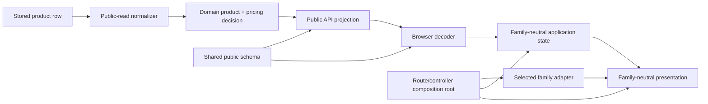

# Catalog Architecture Hardening

## Decision

Adopt a Catalog kernel with ports/adapters and a route-level composition root. Extract behavior behind
characterization tests, switch one call site at a time, and retire old owners only after parity.

## Dependency Rule

Allowed compile-time direction:

`route/controller -> family adapter + application + presentation -> domain contracts`

Infrastructure implements application/domain ports and may import the shared public schema. Domain
and application import no React, Astro, localized content, route, or family module. Presentation may
import React and family-neutral domain/application contracts, but no concrete family. Family adapters
may import domain contracts and family content, but no application state or shared JSX. The
route/controller selects an adapter and passes it into presentation alongside application state.

## Contract Owners

| Owner | Contract | Consumers |
|---|---|---|
| `scripts/verify-catalog-architecture.mjs` | rooted graph, reservations, known owners, duplicate governance | every migration acceptance gate; extended at MIU 29 |
| `packages/shared/src/catalog/index.ts` | `PublicProductSchema`, canonical family, `CatalogPageSchema`, `CatalogPage<T>` via `./catalog` export | projection, decoder, adapters, factories, E2E |
| `packages/shared/src/catalog/normalize-public-product.ts` | `normalizePublicProduct(row): NormalizedPublicProductResult`; public-read only | Public projection |
| `packages/shared/src/catalog/resolve-pricing.ts` | `resolveCatalogPricing(input, alibabaAdapter): CatalogPricingDecision` | cards, details, SEO view model |
| `packages/shared/src/catalog/alibaba-pricing-adapter.ts` | canonical provider-linked availability/tiers/quote conversion | pricing resolver only |
| `apps/functions/public-api/src/catalog/project-public-product.ts` | normalized row -> `PublicProduct`; publication/privacy policy | list/id/slug handlers |
| `apps/site/src/catalog/infrastructure/catalog-api.ts` | HTTP/envelope/schema decode | application controller |
| `apps/site/src/islands/shop/api.ts` + `catalog-types.ts` | thin legacy routing adapter; explicit Overstock inventory/clearance DTO and decoder only | `_overstock.astro`, `_overstock-item.astro`, and retained compatibility components |
| `apps/site/src/catalog/application/catalog-list-state.ts` | request generations, dedupe, pagination, selection/focus commands | route controller |
| `apps/site/src/catalog/presentation/*` | family-neutral rendering only | route controller |
| `apps/site/src/catalog/families/catalog-family-adapter.ts` | exported `CatalogFamilyAdapter` interface and guard | four family adapters, registry |
| `apps/site/src/catalog/families/registry.ts` | exactly one completed adapter per canonical family | route controller |
| `apps/site/src/islands/shop/CatalogFamilyPage.tsx` | composition of adapter + application + presentation | `headphones.astro`, `ai-gadgets.astro`, `toys.astro`, `misc.astro` |
| `apps/site/src/islands/shop/SkuDetailPage.tsx` | SKU fetch/status orchestration around shared view | `products/item.astro` |

## Public-Read Normalization

Normalization runs after a row has been selected for a public read and before projection. It returns a
new value and diagnostics; it never writes storage, changes Admin validation, or makes corrupt rows
acceptable to write paths. Missing family plus a recognized legacy Headphones category may infer
`headphones`. Explicit invalid family fails closed. Malformed optional pricing/media is omitted with a
diagnostic when required public fields remain valid. Publication/archive policy stays in projection,
not normalization.

## Public Schema Order

The schema/envelope MIU creates `packages/shared/src/catalog/index.ts` and the package `./catalog`
export before projection and decoder. It owns exact required/optional fields, canonical family,
`CatalogPage`, nested pricing/media bounds, and unknown-key rejection. Projection uses `parse` as an
output assertion; the browser gateway uses `safeParse` to reject malformed network responses. The
subpath does not import database/UI types or forecast exports for future files; later files extend the
subpath only through explicit released-to-active transfer after they exist.

MIU 36 closes the legacy duplicate authority after Catalog consumers migrate. `api.ts` delegates
`/api/products` fetching/decoding to `catalog-api.ts` and shared schemas; `catalog-types.ts` may re-export
shared Catalog types but cannot declare Product, Alibaba pricing, or `CatalogPage` independently. Only
explicit `OverstockProduct`/`OverstockCatalogPage` inventory and clearance fields plus their decoder
remain local. The verifier rejects unassigned consumers and any second Catalog validator.

## Pricing Decision

`resolveCatalogPricing` first asks whether provider link identity exists. If linked, it delegates to
the Alibaba adapter and returns `kind: 'alibaba'` with `available`, `unavailable`, or `quote` provider
state. It never consults manual/scalar fallbacks for that product. Only unlinked products proceed to
manual tiers, scalar wholesale/unit, then quote-required. A common view model feeds the compatibility
bridge, live `CatalogFamilyGrid.catalogProductPrice` replacement, card, Headphones inline detail, SKU
detail, and SEO/JSON-LD. Each migration MIU owns no more than three files.

## Family Composition

MIU 15 exports `CatalogFamilyAdapter` before any implementation. MIUs 16-19 implement each real family;
MIU 20 registers all four only after those adapters exist; MIU 22 migrates the controller afterward.
The interface contains family key, labels, filter capabilities, grouping, facts, and empty copy. It
does not contain fetching, reducer state, React, or pricing. Completeness derives from canonical
`PRODUCT_FAMILY_OPTIONS`, not a fake fifth family.

## Old Owner Migration And Retirement

| Old owner | New owner | Call-site switch | Retirement evidence | Rollback |
|---|---|---|---|---|
| `apps/site/src/islands/shop/api.ts`/`catalog-types.ts` Catalog validators/types | shared public schema + `catalog-api.ts` decoder | MIU 36 delegates `/api/products`; Overstock contract remains explicit | focused shared-decode parity; no duplicate Product/Alibaba/CatalogPage declaration; every consumer classified | restore pre-MIU-36 adapters at prior reviewed SHA |
| `apps/site/src/islands/shop/catalog-pricing.ts` | shared resolver + Alibaba adapter | pricing view-model adapter | precedence matrix and all consumer parity; zero live policy calls | restore each consumer to old helper while keeping new owner unused |
| `CatalogFamilyGrid.catalogProductPrice` | shared resolver decision | MIU 09 grid switch; MIU 33 retirement | source + render parity; zero policy/reference search | restore grid function at pre-switch SHA |
| `HeadphonesProductCard.tsx` pricing/card policy | `CatalogCard.tsx` | Headphones adapter route composition | card markup/action/geometry/pricing parity | route/controller selects old Headphones card |
| `HeadphonesProductDetail.tsx` generic detail policy | `CatalogDetail.tsx` | Headphones adapter route composition | `_id`, focus, media, facts, pricing parity | route/controller selects old detail |
| `HeadphonesCatalog.tsx` + `headphonesCatalogState.ts` generic list state | application state + `CatalogGrid.tsx` | `HeadphonesPage.tsx`/controller | stale/abort/filter/page/focus behavior parity | route shell selects old controller/state pair |
| `SkuDetailPage.tsx` local pricing/media mapping | shared detail view model | SKU page import | SKU render/retry/not-found/pricing parity | restore old local mapping |
| `catalog-seo.ts` local pricing mapping | shared SEO pricing view model | item route/SEO helper import | canonical/JSON-LD/MOQ/price parity | restore old SEO mapper |

Old owners coexist only while their call sites are not switched. A switch is atomic per consumer;
dual execution is forbidden. Deletion waits for direct/type/string/dynamic/barrel/test/mock searches,
module-graph zero-consumer evidence, behavior parity, site/function builds, and deployed test smoke.

The denominator also includes `api.test.ts`, `quantity-tier-pricing.test.ts`,
`sku-detail-tier-pricing.test.ts`, `FeaturedProducts`,
its `electronics-toys.astro` route consumer, `AlibabaCatalogPricingBlock`, Admin `PreviewModal`, and
`tests/e2e/public.spec.ts`; it also roots `products/item.astro` and all four family Astro route consumers
to their integration owners. The underscore-route chain
`ProductGrid -> ProductCard -> PriceBlock/StockBadge` plus `ProductDetail` and `OverstockDetail` is
permanently retained under MIU 36's explicit non-live Overstock compatibility contract. `_overstock.astro` and
`_overstock-item.astro` are read-only references to that owner because those pages are intentionally
excluded from the build and remain rollback evidence. Every Catalog consumer must use the shared
contract; every retained Overstock consumer must use the explicit compatibility contract, leaving zero
unassigned consumers. Zero consumers applies only to files designated
for full retirement: `CatalogFamilyGrid`, `HeadphonesProductCard`, `HeadphonesProductDetail`,
`headphonesCatalogState`, `HeadphonesCatalog`, and `HeadphonesPage`.

## Reservation And Deployment Control

MIU 04 is active for local validation with four exact owner files. MIUs 01-03 are released and MIU 05
remains planned.
Activation and release follow the lifecycle in `TASK_REGISTRY.json`. Shared
files have one owner and later consumer/reference entries, or an explicit release/activation transfer.
Select-owned Admin files remain blocked in MIUs 26-28 until final-code WebKit and the full D1 suite pass.
MIUs 39-43 finish and test the deploy script, API/route smoke, and browser smoke before authorization.
MIU 44 produces `RELEASE_MANIFEST.json` plus its validator/test after independent review; MIU 45 consumes
that exact artifact before credentials and owns `.github/workflows/deploy-test.yml`. It disables push
deployment, retains static `cloudbase-deploy-test` serialization, and derives build identity from each
checked-out deploy or rollback commit. D2 is immediately before MIU 46, the sole mutation. MIU 47 only
executes reviewed smoke and records evidence. Production is rejected.

## Hosting Topology

The active `/headphones` route remains built and must return 200; no MIU may prune it or expect a 404.
Underscore-prefixed Overstock legacy routes remain excluded from Astro output. The deploy path retains
the current targeted allowlist for `/overstock`, `/overstock-item`, temporarily hidden `/teardown-lab`
and `/blue-ocean`, plus retired media. Smoke asserts separate route statuses and existing media outcomes.
Existing deployment incident authority remains in
`docs/ENGINEERING_CRAFT.md` and `docs/CICD_PRODUCTION_PLAN.md`; this ADR does not redefine it.

## Final Evidence Model

The manifest records independently reviewed/pushed implementation and rollback commits before D2.
MIU 46 records the requested implementation commit and observed deployed release ID, plus the requested
rollback commit and observed rollback release ID if rollback runs. MIU 47 verifies the resulting release.
MIUs 48-49 then
create a docs-only closure commit that records the implementation/deployed SHA and observed deployment
evidence; the closure commit is not deployed and cannot embed its own SHA. After that commit is pushed,
registry/tool output records closure local/remote equality externally. A separate branch/PR status field
may resolve to `HEAD`; it is not deployment evidence and does not introduce self-reference.

## Mechanical Gates

- MIU 01 builds the TypeScript/JavaScript module graph and rejects forbidden layer edges/cycles,
  reservation violations, unrooted discovery, and duplicate governance before migration begins.
- Run behavioral tests for visibility, normalization, pricing, stale requests, focus, and parity.
- Derive family, schema, pricing, route, SEO, Admin, test, and smoke consumers from canonical registries
  and changed owner exports; do not rely on a hand-maintained token list.
- The architecture verifier and its test own the executable duplicate-governance assertion; knowledge
  documents are consumers and cannot become a second authority.
- Validate task claims against live local refs, remote refs, `git worktree list`, exact file
  reservations, dependency SHAs, reviewed SHA, and legal state transitions.
