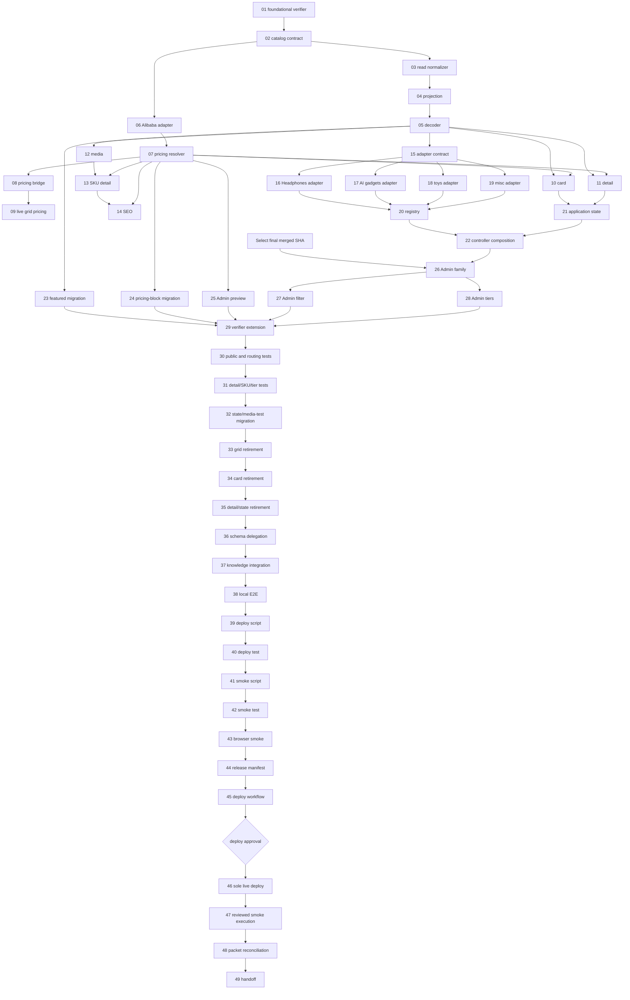

# Catalog Architecture Hardening MIU Breakdown

Status: published; MIUs 01-11 released; MIU 12 active for local implementation and validation.

## External Gates

- **D1 Select merge (partially evidenced; MIU-scoped, not a task dependency):** merge
  `78506d525eefcd6410ff0d85a1a020d834f4ab02` is on `origin/main`, test deployment
  `026e18b45c2bf8b61d54049e7a58bdf22466bfaa` succeeded, and focused live E2E passed 9/9.
  Final-code WebKit validation was unavailable and is not claimed, so MIUs 26-28 remain blocked.
- **D2 sole LIVE mutation:** immediately after MIU 45's workflow, manifest, deploy, and smoke code are
  independently reviewed and pushed, and immediately before MIU 46, a human approves the immutable
  manifest's reviewed implementation SHA and rollback SHA plus `confirm_live`. Production, self-report-only
  approval, and arbitrary commands or targets are unauthorized.

## Reservation Lifecycle

- MIU 12 is the sole active MIU. MIUs 01-11 are released, and MIUs 26-28 remain blocked by D1.
- Activation follows `TASK_REGISTRY.json`: verify dependencies, gates, live refs/worktrees, and zero
  conflicting active owner claims, then atomically mark one MIU `active`. Completion marks it `released`
  before any explicit successor transfer activates.
- `Files` names owner files only. A shared file used later is named in `What it does` as a
  consumer/reference; a later edit requires a recorded `released -> active` transfer. The registry
  validator derives files from this document and live references rather than trusting JSON alone.

## MIU 1: Foundational Catalog module-graph and reservation verifier

- **Block:** INFRASTRUCTURE
- **Files:** `scripts/verify-catalog-architecture.mjs`, `scripts/verify-catalog-architecture.test.mjs`, `config/change-impact/catalog.yaml`
- **Type:** new-file
- **Depends on:** none
- **Reservation state:** `released`; previous state `active`.
- **What it does:**
  - Implements `verifyCatalogArchitecture(root, registry, gitProbe): ArchitectureIssue[]` before the
    first migration. It parses imports/re-exports/dynamic imports, enforces dependency direction,
    validates task reservations/live refs/worktrees, and rejects duplicate governance owners.
  - Its initial denominator names all known current schema, pricing, family, route, Admin, SEO, test,
    workflow, smoke, and legacy owners. A later migration MIU may transfer these released files and
    extend completed-denominator/retirement expectations; no earlier acceptance relies on that extension.
- **Build/Deploy/Runtime impact:** CI/planning Node runtime only; network is required for remote refs.
- **Test plan (TDD - write FIRST):**
  - Assert a forbidden edge/cycle, second pricing/family/knowledge owner, unrooted discovery, or two
    active exact-file owners returns the exact path pair; sibling worktrees must be ignored.
  - Assert stale SHA/worktree, illegal transition, missing derived consumer, glob-only plan, or local-only
    completion returns its named issue while a released-to-active transfer passes.
- **Done when:**
  - Synthetic graph/reservation/duplicate mutations and the released MIU lifecycle validate.
  - Repository typecheck/lint/build and the verifier command pass before MIU 02 may activate.

## MIU 2: Shared Catalog public schema and envelope subpath

- **Block:** BACKEND
- **Files:** `packages/shared/src/catalog/index.ts`, `packages/shared/src/catalog/index.test.ts`, `packages/shared/package.json`
- **Type:** new-file
- **Depends on:** MIU 1
- **Reservation state:** `released`; previous state `active`.
- **What it does:**
  - Creates the dedicated `@vibelingan-channel/shared/catalog` export. Its index owns strict
    `PublicProductSchema`, inferred `PublicProduct`, `CatalogPageSchema`, and `CatalogPage<T>` with
    required `_id`, name, and canonical family before every server/browser consumer.
  - Owns the public envelope (`items`, `total`, `page`, `pageSize`) and unknown-key rejection without
    importing database, HTTP, React, Astro, the root barrel, or family-content types.
- **Build/Deploy/Runtime impact:** Shared runtime for Public API, local server, and site build contexts.
- **Test plan (TDD - write FIRST):**
  - Assert oldest Headphones and one current DTO per real family parse without optional fields.
  - Assert valid envelopes parse while unknown/private keys and malformed required/envelope fields fail.
- **Done when:**
  - Schema tests pass and no second public network contract exists.
  - Shared tests/typecheck and an isolated subpath import compile; no future file is exported.

## MIU 3: Public-read product normalizer

- **Block:** BACKEND
- **Files:** `packages/shared/src/catalog/normalize-public-product.ts`, `packages/shared/src/catalog/normalize-public-product.test.ts`, `packages/shared/src/catalog-product.ts`
- **Type:** new-file
- **Depends on:** MIU 02
- **Reservation state:** `released`; previous state `active` is tracked by corrective evidence `1e4523c9f1fd67f469a94b46dab13a8a8ddc7e67`.
- **What it does:**
  - Implements `normalizePublicProduct(row): NormalizedPublicProductResult` using MIU 02's
    `packages/shared/src/catalog/index.ts` contract as an immutable public-read transformation returning
    canonical input plus diagnostics or a fail-closed rejection.
  - Infers Headphones only for missing family plus recognized legacy category; explicit invalid family
    rejects, and Admin/write contracts are never normalized.
- **Build/Deploy/Runtime impact:** Shared runtime consumed only by Public API projection.
- **Test plan (TDD - write FIRST):**
  - Assert a frozen oldest Headphones row normalizes without mutation and remains `_id` detail-capable.
  - Assert explicit invalid family rejects and non-Headphones rows drop stale legacy category.
- **Done when:**
  - Historical/current immutability and fail-closed tests pass.
  - Shared/Public API compile/build and graph proves projection is the only production consumer.

## MIU 4: Schema-checked Public API projection

- **Block:** BACKEND
- **Files:** `apps/functions/public-api/src/catalog/project-public-product.ts`, `apps/functions/public-api/src/handler.ts`, `apps/functions/public-api/src/handler.test.ts`, `apps/local-server/src/catalog-routes.test.ts`, `packages/shared/package.json`
- **Type:** refactor
- **Depends on:** MIUs 02, 03
- **Reservation state:** `released`; previous state `active`. `packages/shared/package.json` transferred from released MIU 02 to expose MIU 03's normalizer without a deep import or module cycle. The local parity test is an observed consumer owned by the MIU 04 done criterion.
- **What it does:**
  - Implements `projectPublicProduct(row): PublicProduct | null`, consuming MIU 02's schema/envelope from
    `packages/shared/src/catalog/index.ts` and MIU 03's normalizer for list/ID/slug paths.
  - Optional slug/SKU/pricing/media never drops a published valid row; private fields never escape.
- **Build/Deploy/Runtime impact:** Public function runtime; fresh package and bare cold start required.
- **Test plan (TDD - write FIRST):**
  - Assert list, ID, and slug projection are deeply equal and exclude private fields.
  - Assert malformed optional pricing survives omitted while explicit corrupt family returns null.
- **Done when:**
  - Handler/projection/local parity tests pass with oldest/all-family fixtures.
  - Function typecheck, build/package, and bare cold-start smoke pass.

## MIU 5: Browser PublicProduct decoder and typed factories

- **Block:** FRONTEND
- **Files:** `apps/site/src/catalog/infrastructure/catalog-api.ts`, `apps/site/src/catalog/infrastructure/catalog-api.test.ts`, `apps/site/src/test/factories/catalog.ts`
- **Type:** new-file
- **Depends on:** MIUs 02, 04
- **Reservation state:** `released`; previous state `active`. Browser/SSR validation was local only.
- **What it does:**
  - Exposes `fetchCatalogPage(query, signal): Promise<CatalogPage<PublicProduct>>`, consuming MIU 02's
    schema/envelope from `packages/shared/src/catalog/index.ts` without redeclaring fields.
  - Supplies complete typed `createPublicProduct(overrides: Partial<PublicProduct>)` fixtures for oldest
    Headphones and four current families; no `as any` or fake family.
  - Uses `apps/site/src/islands/shop/api.test.ts` as a read-only legacy decoder characterization
    reference; MIU 30 owns its migration after the denominator verifier lands.
- **Build/Deploy/Runtime impact:** Browser/SSR site runtime and production Astro/Vite build.
- **Test plan (TDD - write FIRST):**
  - Assert valid response order is preserved and abort signal reaches fetch.
  - Assert malformed required/envelope data rejects while omitted optional data decodes.
- **Done when:**
  - Gateway tests use the shared schema and complete real-interface factories.
  - Site tests/typechecks, SSR import, and production build pass.

## MIU 6: Alibaba provider pricing adapter

- **Block:** BACKEND
- **Files:** `packages/shared/src/catalog/alibaba-pricing-adapter.ts`, `packages/shared/src/catalog/alibaba-pricing-adapter.test.ts`, `packages/shared/src/catalog/index.ts`
- **Type:** new-file
- **Depends on:** MIU 02
- **Reservation state:** `released`; previous state `active`. `packages/shared/src/catalog/index.ts` transferred from MIU 02 and transfers next to MIU 07 after release.
- **What it does:**
  - Defines `AlibabaPricingAdapter.resolve(link, provider): AlibabaPricingDecision` with available,
    unavailable, and quote states normalized from current provider fields.
  - Link identity is canonical; absent/malformed provider pricing stays Alibaba-owned and never reads fallback
    fields. The completed adapter is exported by this MIU from `packages/shared/src/catalog/index.ts`.
- **Build/Deploy/Runtime impact:** Shared runtime consumed by site/SEO; verify shared and site builds.
- **Test plan (TDD - write FIRST):**
  - Assert linked tier/amount data maps to bounded minor-unit decisions and stable MOQ/range.
  - Assert linked missing/unavailable/malformed data never includes manual/scalar fallback.
- **Done when:**
  - Provider matrix passes and only this adapter interprets Alibaba pricing fields.
  - Shared/site typechecks and production site build pass.

## MIU 7: Canonical Catalog pricing resolver

- **Block:** BACKEND
- **Files:** `packages/shared/src/catalog/resolve-pricing.ts`, `packages/shared/src/catalog/resolve-pricing.test.ts`, `packages/shared/src/catalog/index.ts`
- **Type:** new-file
- **Depends on:** MIU 06
- **Reservation state:** `released`; previous state `active`. `packages/shared/src/catalog/index.ts` transferred from released MIU 06.
- **What it does:**
  - Implements `resolveCatalogPricing(product, alibabaAdapter): CatalogPricingDecision` from the
    `AlibabaPricingDecision` contract in `packages/shared/src/catalog/alibaba-pricing-adapter.ts`, returning
    `alibaba | manual-tiered | scalar | quote-required`.
  - Delegates linked inputs first; only unlinked products consider manual tiers, scalar wholesale/unit, then quote.
    This MIU transfers and extends `packages/shared/src/catalog/index.ts` to export only files now present.
- **Build/Deploy/Runtime impact:** Shared runtime for site presentation and SEO build contexts.
- **Test plan (TDD - write FIRST):**
  - Assert unlinked precedence including zero, negative, non-integer, empty, and malformed values.
  - Assert linked unavailable returns `alibaba` and spies prove fallback branches are untouched.
- **Done when:**
  - Resolver matrix and exhaustive consumer typing pass.
  - Shared/site typechecks and production build pass with one resolver owner.

## MIU 8: Current catalog-pricing compatibility bridge

- **Block:** FRONTEND
- **Files:** `apps/site/src/islands/shop/catalog-pricing.ts`, `apps/site/src/islands/shop/alibaba-catalog-pricing.test.ts`
- **Type:** refactor
- **Depends on:** MIU 07
- **Reservation state:** `released`; previous state `active`. Compatibility validation was local only.
- **What it does:**
  - Reimplements current exported helpers as thin adapters over `resolveCatalogPricing` from
    `packages/shared/src/catalog/resolve-pricing.ts`, preserving signatures while call sites migrate.
  - Maps legacy amount/range/MOQ/quote output without local precedence; rollback restores prior helper body.
  - Uses `apps/site/src/islands/shop/quantity-tier-pricing.test.ts` only as a read-only characterization
    reference. MIU 31 owns its atomic migration after both `CatalogFamilyGrid` and
    `HeadphonesProductDetail` replacement contracts exist.
- **Build/Deploy/Runtime impact:** Site compatibility runtime; existing island tests and site build apply.
- **Test plan (TDD - write FIRST):**
  - Assert old/new outputs are identical for every provider/manual/scalar/quote fixture.
  - Assert linked unavailable remains provider-owned and emits no manual/scalar display.
- **Done when:**
  - Compatibility parity passes and no policy branch remains outside shared owners.
  - Site typechecks/build pass and old signatures remain available for rollback.

## MIU 9: Live CatalogFamilyGrid pricing-owner migration

- **Block:** FRONTEND
- **Files:** `apps/site/src/islands/shop/CatalogFamilyGrid.tsx`, `apps/site/src/islands/shop/catalog-family-render.test.ts`, `apps/site/src/headphones-source-contract.test.ts`
- **Type:** refactor
- **Depends on:** MIU 08
- **Reservation state:** `released`; previous state `active`. Hydrated/SSR parity validation was local only.
- **What it does:**
  - Replaces live `CatalogFamilyGrid.catalogProductPrice(product): CatalogPricingDecision` policy with
    `resolveCatalogPricing` from `packages/shared/src/catalog/resolve-pricing.ts`; the grid only renders its decision.
  - Preserves exact amount/range/MOQ/quote markup for Alibaba/manual/scalar/quote fixtures; rollback restores
    the prior function body until MIU 33 receives the released file for retirement.
- **Build/Deploy/Runtime impact:** Hydrated and SSR family-grid runtime plus production Astro/Vite build.
- **Test plan (TDD - write FIRST):**
  - Assert the old and new grid outputs are equal for all pricing decisions, including linked unavailable.
  - Assert source/behavior tests fail when `catalogProductPrice` regains precedence or fallback policy.
- **Done when:**
  - Grid parity passes and `CatalogFamilyGrid.tsx` has no independent pricing-policy branch.
  - Site typecheck, unit suite, SSR import, and production site build pass.

## MIU 10: Family-neutral CatalogCard pricing parity

- **Block:** FRONTEND
- **Files:** `apps/site/src/catalog/presentation/CatalogCard.tsx`, `apps/site/src/catalog/presentation/catalog-card.test.ts`, `apps/site/src/islands/shop/HeadphonesProductCard.tsx`
- **Type:** refactor
- **Depends on:** MIUs 05, 07
- **Reservation state:** `released`; previous state `active`. Hydrated/SSR card parity validation was local only.
- **What it does:**
  - Defines `CatalogCard({ product, pricing, facts, onActivate, deepLink? })`, consuming
    `CatalogPricingDecision` from `packages/shared/src/catalog/resolve-pricing.ts`; activation uses `_id`.
  - Switches Headphones card call site without family imports in presentation; old card remains a rollback wrapper.
    Its named input adapter preserves the pre-migration card's unit-price display and treats a nullish removed
    Alibaba link as absent, while linked products and the generic card still consume the canonical resolver decision.
- **Build/Deploy/Runtime impact:** Hydrated/SSR card rendering and responsive site build.
- **Test plan (TDD - write FIRST):**
  - Assert slugless oldest row renders, calls `onActivate(_id)`, and emits no unusable deep link.
  - Assert pricing/MOQ/action geometry matches old rendering for all decisions and uneven titles.
- **Done when:**
  - Render/geometry parity passes and presentation has no family/provider conditionals.
  - Site typechecks/build pass with rollback wrapper retained until retirement proof.

## MIU 11: Family-neutral CatalogDetail pricing parity

- **Block:** FRONTEND
- **Files:** `apps/site/src/catalog/presentation/CatalogDetail.tsx`, `apps/site/src/catalog/presentation/catalog-detail.test.ts`, `apps/site/src/islands/shop/HeadphonesProductDetail.tsx`
- **Type:** refactor
- **Depends on:** MIUs 05, 07
- **Reservation state:** `released`; previous state `active`. Hydrated/SSR detail parity validation was local only.
- **What it does:**
  - Defines `CatalogDetail({ product, pricing, facts, media, onBack })` using `CatalogPricingDecision` from
    `packages/shared/src/catalog/resolve-pricing.ts` for inline `_id` detail with no family import.
  - Switches Headphones generic detail while preserving the old component as rollback wrapper.
- **Build/Deploy/Runtime impact:** Hydrated inline detail, SSR markup, site typecheck/build.
- **Test plan (TDD - write FIRST):**
  - Assert slugless oldest Headphones opens by `_id` and Back restores exact origin focus.
  - Assert Alibaba unavailable/manual/scalar/quote markup semantics match old detail.
- **Done when:**
  - Detail pricing/facts/media/focus parity passes without concrete family imports.
  - Site typechecks/build pass and rollback path remains callable.

## MIU 12: Family-neutral media journey

- **Block:** FRONTEND
- **Files:** `apps/site/src/catalog/application/catalog-media.ts`, `apps/site/src/catalog/application/catalog-media.test.ts`, `apps/site/src/islands/shop/ProductMedia.tsx`
- **Type:** refactor
- **Depends on:** MIUs 02, 05
- **Reservation state:** `active`; local media-state and SSR/hydration validation only.
- **What it does:**
  - Implements `createCatalogMediaState(sources)` and `advanceFailedMedia(state, sourceId)`, consuming
    `PublicProduct` media fields from MIU 02's `packages/shared/src/catalog/index.ts`, for trim,
    dedupe, order, nine-item bound, active identity, and terminal fallback.
  - `ProductMedia` consumes state/commands without family or pricing decisions; SSR/hydration share sequence.
  - `Gallery.tsx` is a consumer/reference, not a fourth MIU owner; reviewed correction `ed58f66`
    delegates effective URL deduplication and the nine-item bound to the application owner.
- **Build/Deploy/Runtime impact:** Browser image/gallery runtime and SSR site build.
- **Test plan (TDD - write FIRST):**
  - Assert blank/duplicate/ten-source input yields first nine unique valid sources in order.
  - Assert repeated failures advance once, preserve selection identity, and terminate at fallback.
- **Done when:**
  - Reducer/render/browser assertions pass and `ProductMedia` plus the Gallery consumer stop normalizing independently.
  - Site typechecks/build pass in SSR and hydrated contexts.

## MIU 13: SKU detail view-model migration

- **Block:** FRONTEND
- **Files:** `apps/site/src/catalog/presentation/SkuDetailPage.tsx`, `apps/site/src/islands/shop/SkuDetailPage.tsx`, `apps/site/src/islands/shop/sku-detail-render.test.ts`
- **Type:** refactor
- **Depends on:** MIUs 07, 11, 12
- **Reservation state:** `planned`.
- **What it does:**
  - Defines `SkuDetailPageView({ product, pricing, facts, media, status })` using pricing from
    `packages/shared/src/catalog/resolve-pricing.ts` and media state from
    `apps/site/src/catalog/application/catalog-media.ts`.
  - Switches the SKU call site atomically while existing island retains fetch/retry/not-found orchestration.
  - Uses `apps/site/src/islands/shop/sku-detail-tier-pricing.test.ts` as read-only characterization of
    the legacy SKU pricing view; MIU 31 owns its migration to the new view/decision contract.
  - Treats `apps/site/src/pages/products/item.astro` as the rooted read-only route consumer of the
    existing island; this MIU owns the integration point while the Astro route requires no edit.
- **Build/Deploy/Runtime impact:** Direct SKU browser/SSR route and production site build.
- **Test plan (TDD - write FIRST):**
  - Assert inline and SKU render equal pricing/MOQ/facts/media for the same product.
  - Assert loading, retry success, malformed response, and not-found retain existing states/actions.
- **Done when:**
  - SKU parity/status tests pass and local pricing/media policy is removed from the call site.
  - Site typechecks, route build, and production build pass.

## MIU 14: Catalog SEO pricing parity

- **Block:** FRONTEND
- **Files:** `apps/site/src/catalog/presentation/catalog-seo-view.ts`, `apps/site/src/lib/catalog-seo.ts`, `apps/site/src/lib/catalog-seo.test.ts`
- **Type:** refactor
- **Depends on:** MIUs 07, 13
- **Reservation state:** `planned`.
- **What it does:**
  - Implements `toCatalogSeoView(product, pricing): CatalogSeoView` using `CatalogPricingDecision` from
    `packages/shared/src/catalog/resolve-pricing.ts` for canonical and JSON-LD offer fields.
  - Switches SEO mapping without making addressability/indexability a visibility gate; rollback is independent.
- **Build/Deploy/Runtime impact:** Astro build-time metadata/JSON-LD and production-origin build.
- **Test plan (TDD - write FIRST):**
  - Assert visible pricing and JSON-LD amount/currency/MOQ agree for every decision.
  - Assert slugless product has no canonical enhancement but remains valid for inline detail.
- **Done when:**
  - SEO parity/generated HTML assertions pass with no local pricing precedence.
  - Site typecheck and production-origin Astro build pass without placeholder canonicals.

## MIU 15: CatalogFamilyAdapter contract owner

- **Block:** FRONTEND
- **Files:** `apps/site/src/catalog/families/catalog-family-adapter.ts`, `apps/site/src/catalog/families/catalog-family-adapter.test.ts`
- **Type:** new-file
- **Depends on:** MIUs 02, 05
- **Reservation state:** `planned`.
- **What it does:**
  - Exports `interface CatalogFamilyAdapter { family; labels; filterCapabilities; group(product);
    facts(product); emptyCopy }` using `PublicProduct` and canonical family from MIU 02's
    `packages/shared/src/catalog/index.ts`; this exact owner/export precedes every adapter and registry.
  - Exports contract guards `assertCatalogFamilyAdapter(adapter): void`; contains no React, route, application,
    pricing, media, or concrete-family imports and precedes every implementation.
- **Build/Deploy/Runtime impact:** Site compile-time/runtime contract consumed by all adapters and route build.
- **Test plan (TDD - write FIRST):**
  - Assert a complete typed adapter passes and missing family/labels/capabilities fails by exact field.
  - Assert the module graph rejects React, application, presentation, pricing, and concrete-family imports.
- **Done when:**
  - Interface/guard tests pass and all future adapter MIUs import this exact contract file.
  - Site typecheck, unit suite, and production route build pass.

## MIU 16: Headphones family adapter

- **Block:** FRONTEND
- **Files:** `apps/site/src/catalog/families/headphones.ts`, `apps/site/src/catalog/families/headphones.test.ts`, `apps/site/src/i18n/headphones.ts`
- **Type:** new-file
- **Depends on:** MIU 15
- **Reservation state:** `planned`.
- **What it does:**
  - Exports `headphonesAdapter: CatalogFamilyAdapter` from
    `apps/site/src/catalog/families/catalog-family-adapter.ts` with legacy filters/grouping, labels, facts, and empty copy.
  - Contains no React, fetching, application state, media normalization, pricing, or family inference.
- **Build/Deploy/Runtime impact:** Site content/config runtime and production build; route topology unchanged.
- **Test plan (TDD - write FIRST):**
  - Assert wired/office/bluetooth legacy categories map to existing labels/grouping/facts.
  - Assert graph has no React/application/presentation imports and unknown category degrades safely.
- **Done when:**
  - Adapter/content tests pass for oldest/current Headphones without copied generic behavior.
  - Site/i18n typechecks and production build pass.

## MIU 17: AI gadgets family adapter

- **Block:** FRONTEND
- **Files:** `apps/site/src/catalog/families/ai-gadgets.ts`, `apps/site/src/catalog/families/ai-gadgets.test.ts`, `apps/site/src/i18n/catalog.ts`
- **Type:** new-file
- **Depends on:** MIU 15
- **Reservation state:** `planned`; owns `apps/site/src/i18n/catalog.ts` for later adapter consumers.
- **What it does:**
  - Exports `aiGadgetsAdapter: CatalogFamilyAdapter` from
    `apps/site/src/catalog/families/catalog-family-adapter.ts` with route labels, filters, facts, and empty behavior.
  - Declares no legacy category and imports no React/application/presentation/pricing module.
- **Build/Deploy/Runtime impact:** AI-gadgets route configuration and site build.
- **Test plan (TDD - write FIRST):**
  - Assert canonical AI-gadgets product projects expected labels/facts and no legacy filter.
  - Assert empty/long-copy output contains no JSX or state fields.
- **Done when:**
  - Adapter/graph tests pass with only allowed content/domain edges.
  - Site typecheck and production route build pass.

## MIU 18: Toys family adapter

- **Block:** FRONTEND
- **Files:** `apps/site/src/catalog/families/toys.ts`, `apps/site/src/catalog/families/toys.test.ts`
- **Type:** new-file
- **Depends on:** MIUs 15, 17
- **Reservation state:** `planned`; `apps/site/src/i18n/catalog.ts` is a read-only consumer reference owned by MIU 17.
- **What it does:**
  - Exports `toysAdapter: CatalogFamilyAdapter` from
    `apps/site/src/catalog/families/catalog-family-adapter.ts`; `/electronics-toys` and `/toys` select it
    without creating another domain family.
  - Encodes labels, filters, facts, and empty behavior only; no category/state/pricing/media policy.
- **Build/Deploy/Runtime impact:** Toys family and `/electronics-toys` route-alias configuration/build.
- **Test plan (TDD - write FIRST):**
  - Assert each approved route key selects canonical adapter and expected labels/facts.
  - Assert unsupported category/filter input is omitted and cannot alter visibility.
- **Done when:**
  - Adapter/route-selection tests pass without copied generic implementation.
  - Site typecheck and both route builds pass.

## MIU 19: Misc family adapter

- **Block:** FRONTEND
- **Files:** `apps/site/src/catalog/families/misc.ts`, `apps/site/src/catalog/families/misc.test.ts`
- **Type:** new-file
- **Depends on:** MIUs 15, 17
- **Reservation state:** `planned`; `apps/site/src/i18n/catalog.ts` is a read-only consumer reference owned by MIU 17.
- **What it does:**
  - Exports `miscAdapter: CatalogFamilyAdapter` from
    `apps/site/src/catalog/families/catalog-family-adapter.ts` with misc labels, facts, filters, and empty copy.
  - Contains no registry/controller/state/presentation/pricing logic and safely omits unsupported facts.
- **Build/Deploy/Runtime impact:** All family route composition and production site build.
- **Test plan (TDD - write FIRST):**
  - Assert canonical misc products project expected labels/facts and unsupported fields are omitted.
  - Assert graph rejects React/application/presentation/pricing/registry imports.
- **Done when:**
  - Misc behavior/graph tests pass without synthetic registration.
  - Shared/site typechecks and family route build pass.

## MIU 20: Canonical family-adapter registry

- **Block:** FRONTEND
- **Files:** `apps/site/src/catalog/families/registry.ts`, `apps/site/src/catalog/families/registry.test.ts`
- **Type:** new-file
- **Depends on:** MIUs 02, 16, 17, 18, 19
- **Reservation state:** `planned`.
- **What it does:**
  - Implements `getCatalogFamilyAdapter(family): CatalogFamilyAdapter` using the interface from
    `apps/site/src/catalog/families/catalog-family-adapter.ts` and registers each completed family adapter once.
  - Derives required keys from the canonical family set owned by MIU 02 at
    `packages/shared/src/catalog/index.ts`; no fifth family or fallback adapter is accepted.
- **Build/Deploy/Runtime impact:** All family route composition and production site build.
- **Test plan (TDD - write FIRST):**
  - Assert registry keys exactly equal canonical families and each adapter resolves once.
  - Assert missing, duplicate, unknown, or pre-adapter registration fails by exact family.
- **Done when:**
  - Four-family completeness passes and registry imports only completed adapter modules.
  - Shared/site typechecks, unit tests, and production family route build pass.

## MIU 21: Family-neutral list/detail application state

- **Block:** FRONTEND
- **Files:** `apps/site/src/catalog/application/catalog-list-state.ts`, `apps/site/src/catalog/application/catalog-list-state.test.ts`
- **Type:** refactor
- **Depends on:** MIUs 05, 10, 11, 12
- **Reservation state:** `planned`.
- **What it does:**
  - Defines pure `reduceCatalogState(state, command): CatalogState` for query/filter/page, stale/abort,
    dedupe, selection, gallery, and origin-focus token.
  - Consumes gateway result types from `apps/site/src/catalog/infrastructure/catalog-api.ts`; imports no
    React/family module, while old Headphones state remains untouched until MIU 33 retirement.
- **Build/Deploy/Runtime impact:** Hydrated state for all family routes and site production build.
- **Test plan (TDD - write FIRST):**
  - Assert aborted/stale generations cannot commit and load-more dedupes preserving order/page.
  - Assert filter reset keeps family and open/back preserves selection/gallery/focus token.
- **Done when:**
  - Reducer/compatibility tests pass with no React/family import in application.
  - Site typecheck/build pass with aliases available for rollback.

## MIU 22: Route/controller composition root migration

- **Block:** FRONTEND
- **Files:** `apps/site/src/islands/shop/CatalogFamilyPage.tsx`, `apps/site/src/islands/shop/HeadphonesPage.tsx`
- **Type:** refactor
- **Depends on:** MIUs 20, 21
- **Reservation state:** `planned`.
- **What it does:**
  - `CatalogFamilyPage({ family, content })` consumes `getCatalogFamilyAdapter` from
    `apps/site/src/catalog/families/registry.ts`, owns React hooks, drives gateway/application,
    and supplies adapter projections plus state to shared presentation.
  - Consumes `apps/site/src/catalog/infrastructure/catalog-api.ts` and
    `apps/site/src/catalog/application/catalog-list-state.ts`; switches Headphones atomically while
    application/presentation never import adapters and rollback selects the old path.
  - Owns integration for rooted read-only consumers `apps/site/src/pages/headphones.astro`,
    `apps/site/src/pages/ai-gadgets.astro`, `apps/site/src/pages/toys.astro`, and
    `apps/site/src/pages/misc.astro`; those route shells require no edit.
- **Build/Deploy/Runtime impact:** Hydration/SSR on all family routes and site build.
- **Test plan (TDD - write FIRST):**
  - Assert each real family renders adapter content while sharing state/card/detail modules.
  - Assert oldest Headphones filter -> card -> detail -> Back restores exact focus/page state.
- **Done when:**
  - Controller/browser parity passes and graph confirms route-only composition edges.
  - Site typechecks and production family route build pass with rollback documented.

## MIU 23: Electronics-toys FeaturedProducts route and public-contract migration

- **Block:** FRONTEND
- **Files:** `apps/site/src/islands/shop/FeaturedProducts.tsx`, `apps/site/src/islands/shop/featured-products.test.ts`, `apps/site/src/pages/electronics-toys.astro`
- **Type:** refactor
- **Depends on:** MIUs 02, 05, 10
- **Reservation state:** `planned`.
- **What it does:**
  - Replaces live legacy decoder/type use with the gateway from MIU 5 and the schema from MIU 2,
    rendering through `CatalogCard` where applicable.
  - Migrates the `electronics-toys.astro` consumer with `FeaturedProducts` and preserves
    abort/retry/loading/empty behavior; slugless products remain visible without unusable links.
- **Build/Deploy/Runtime impact:** Electronics-toys hydrated hub and production site build.
- **Test plan (TDD - write FIRST):**
  - Assert malformed envelopes reject and aborted requests do not commit.
  - Assert slugless/current products render with `_id` identity and only addressable products deep-link.
- **Done when:**
  - FeaturedProducts and its electronics-toys route consumer have no old module import and behavior parity passes.
  - Site typecheck, unit tests, SSR import, and production build pass.

## MIU 24: AlibabaCatalogPricingBlock shared-resolver migration

- **Block:** FRONTEND
- **Files:** `apps/site/src/islands/shop/AlibabaCatalogPricingBlock.tsx`, `apps/site/src/islands/shop/alibaba-catalog-pricing.test.ts`
- **Type:** refactor
- **Depends on:** MIUs 02, 07, 08
- **Reservation state:** `planned`; test ownership transfers after MIU 08 releases it.
- **What it does:**
  - Removes direct `catalog-pricing.ts`/`catalog-types.ts` policy imports and renders MIU 07's
    `CatalogPricingDecision` exported from `packages/shared/src/catalog/index.ts`.
  - Preserves Alibaba available/unavailable/quote markup and never introduces manual/scalar fallback.
- **Build/Deploy/Runtime impact:** Live Catalog pricing block in SSR/hydrated site builds.
- **Test plan (TDD - write FIRST):**
  - Assert provider decisions match current amount/range/MOQ/quote markup.
  - Assert linked unavailable never renders manual/scalar values.
- **Done when:**
  - The block has no legacy pricing/type import and parity passes.
  - Site typecheck, unit tests, SSR import, and production build pass.

## MIU 25: Admin PreviewModal Catalog pricing migration

- **Block:** FRONTEND
- **Files:** `apps/site/src/islands/admin/PreviewModal.tsx`, `apps/site/src/islands/admin/preview-modal.test.ts`
- **Type:** refactor
- **Depends on:** MIUs 02, 07
- **Reservation state:** `planned`; independent of D1 and Select-owned files.
- **What it does:**
  - Converts preview-safe product data to MIU 02's public contract and renders MIU 07's pricing decision,
    removing the live `../shop/api.ts` formatter dependency while retaining authenticated image preview.
  - Preserves unpublished status, object-URL cleanup, close/edit actions, and provider ownership.
- **Build/Deploy/Runtime impact:** Authenticated Admin preview island and production site build.
- **Test plan (TDD - write FIRST):**
  - Assert provider/manual/scalar/quote preview output and unpublished image loading.
  - Assert close/edit and URL revoke side effects fire once, including failed image fetch.
- **Done when:**
  - PreviewModal has no legacy shop import and behavior tests pass.
  - Site/Admin typecheck, unit tests, and production build pass.

## MIU 26: Post-merge Admin family control integration

- **Block:** FRONTEND
- **Files:** `apps/site/src/islands/admin/RecordForm.tsx`, `apps/site/src/islands/admin/CollectionView.tsx`, `apps/site/src/islands/admin/product-form.test.ts`
- **Type:** refactor
- **Depends on:** MIU 22 and external D1
- **Reservation state:** `blocked`; the merge/deploy/Chromium evidence is recorded, but final-code WebKit remains outstanding.
- **What it does:**
  - Applies only controlled updates against final merged `Select.tsx`; parent prefill/change/reset and required
    validation/focus map to MIU 02's canonical family, and Headphones-to-other clears category once.
  - Consumes the recorded final merge and D1 validation evidence without creating a claim, clone, or
    registry for Select.
- **Build/Deploy/Runtime impact:** Authenticated Admin islands/site build; merged Select suite applies.
- **Test plan (TDD - write FIRST):**
  - Assert controlled prefill/change/reset, required validation/focus, and exact submitted family.
  - Assert Arrow/Home/End/Escape/Enter/Space, outside pointer, no-JS, Chromium, and WebKit behavior.
- **Done when:**
  - Final merged SHA plus controlled update/reset evidence and inherited Select suite pass.
  - Site/Admin typechecks, unit/browser tests, and production build pass.

## MIU 27: Post-merge Admin catalog-filter integration

- **Block:** FRONTEND
- **Files:** `apps/site/src/islands/admin/FilterBuilder.tsx`, `tests/e2e/catalog-admin.spec.ts`
- **Type:** refactor
- **Depends on:** MIU 26 and external D1
- **Reservation state:** `blocked` until the final Select merge and full inherited D1 suite pass; only then transferred from the released Select task and marked `planned`.
- **What it does:**
  - Uses the final merged Select contract for canonical family operands while preserving
    `family AND search AND userExpression`; `CollectionView.tsx` is a read-only MIU 26 reference.
  - Keeps filtering independent of tier editing and never normalizes writes.
- **Build/Deploy/Runtime impact:** Admin filter runtime, disposable E2E, Chromium/WebKit, and site build.
- **Test plan (TDD - write FIRST):**
  - Assert family change/reset retains user expression/search and emits canonical args.
  - Assert validation/focus, all required keys, outside pointer, no-JS, Chromium, and WebKit semantics.
- **Done when:**
  - Filter E2E and unchanged merged Select suite pass with exact payloads.
  - Site/E2E typechecks and production build pass.

## MIU 28: Post-merge Admin quantity-tier integration

- **Block:** FRONTEND
- **Files:** `apps/site/src/islands/admin/QuantityTierPricingEditor.tsx`, `tests/e2e/admin-product-form.spec.ts`
- **Type:** refactor
- **Depends on:** MIU 26 and external D1
- **Reservation state:** `blocked` until the final Select merge and full inherited D1 suite pass; only then transferred from the released Select task and marked `planned`.
- **What it does:**
  - Uses the final merged Select contract for currency/options while preserving integer minor-unit payloads,
    rows, controlled reset, validation, and focus; product-form test is a read-only MIU 26 reference.
  - Keeps Alibaba-linked fields read-only and tier editing independent of filters.
- **Build/Deploy/Runtime impact:** Admin product form, disposable E2E, Chromium/WebKit, and site build.
- **Test plan (TDD - write FIRST):**
  - Assert add/edit/remove/reset submits exact boundaries, amounts, and currency.
  - Assert linked fields, required keys, outside pointer, no-JS, Chromium, and WebKit match merged Select.
- **Done when:**
  - Tier E2E and unchanged merged Select suite pass with exact requests.
  - Site/E2E typechecks and production build pass.

## MIU 29: Migration denominator and retirement verifier extension

- **Block:** TESTING
- **Files:** `scripts/verify-catalog-architecture.mjs`, `scripts/verify-catalog-architecture.test.mjs`, `config/change-impact/catalog.yaml`
- **Type:** refactor
- **Depends on:** MIUs 01, 14, 20, 22, 23, 24, 25, 27, 28
- **Reservation state:** `planned`; all files transfer from released MIU 01 before activation.
- **What it does:**
  - Extends MIU 01's already-enforced verifier with completed migration and retirement expectations; it does
    not create a second verifier or defer any earlier criterion.
  - Declares `catalog-pricing.ts`, `ProductGrid`, `ProductCard`, `PriceBlock`, `ProductDetail`,
    `OverstockDetail`, and `StockBadge` permanent compatibility adapters. `api.ts` and `catalog-types.ts`
    remain denominator references until MIU 36 owns their implementation; there Catalog decoding delegates
    to the shared owner and only an explicit Overstock DTO/decoder compatibility contract remains local.
  - `_overstock.astro` and `_overstock-item.astro` are permanent read-only references to the Overstock
    contract because the underscore pages are intentionally unbuilt rollback evidence, not zero-consumer targets.
- **Build/Deploy/Runtime impact:** CI/change-impact only; optional env unset and no live mutation.
- **Test plan (TDD - write FIRST):**
  - Add an unlisted live legacy consumer or duplicate owner and assert exact paths.
  - Assert every remaining consumer resolves either to shared Catalog or the explicit Overstock contract.
  - Assert the two underscore page references remain non-live and exempt from zero-consumer retirement,
    while fully migrated files and duplicate Product/Alibaba/CatalogPage schema declarations are not.
- **Done when:**
  - Derived denominator covers routes, tests/mocks, SEO, Admin, workflow, smoke, and every named legacy owner.
  - Verifier tests, lint/typecheck, function package, site build, and discovery pass.

## MIU 30: Public and routing test shared-contract migration

- **Block:** TESTING
- **Files:** `tests/e2e/public.spec.ts`, `tests/e2e/helpers/catalog-factory.ts`, `apps/site/src/islands/shop/alibaba-routing-render.test.ts`
- **Type:** refactor
- **Depends on:** MIUs 02, 04, 05, 29
- **Reservation state:** `planned`.
- **What it does:**
  - Replaces direct `catalog-types.ts` imports and ad hoc mocks with MIU 02's
    `packages/shared/src/catalog/index.ts` contract and complete typed factory overrides in public E2E and
    Alibaba card-routing characterization.
  - Preserves public API health/list/detail/privacy and Alibaba routing assertions, and adds oldest/all-family envelopes.
- **Build/Deploy/Runtime impact:** Playwright compile/discovery and public API test fixtures only.
- **Test plan (TDD - write FIRST):**
  - Assert oldest and all-family mocks satisfy the real schema without `as any`.
  - Assert malformed envelope/private field fixtures fail before browser execution.
- **Done when:**
  - Public E2E and the routing test have no legacy type import and complete typed fixtures pass.
  - E2E typecheck, Playwright discovery, Chromium, and WebKit pass.

## MIU 31: Legacy card/detail/SKU pricing test migration

- **Block:** TESTING
- **Files:** `apps/site/src/islands/shop/quantity-tier-pricing.test.ts`, `apps/site/src/islands/shop/headphones-detail-render.test.ts`, `apps/site/src/islands/shop/sku-detail-tier-pricing.test.ts`
- **Type:** refactor
- **Depends on:** MIUs 08, 09, 10, 11, 13, 24, 30
- **Reservation state:** `planned`; owns migration of the quantity-tier characterization referenced by MIU 08 and the SKU characterization referenced by MIU 13.
- **What it does:**
  - Migrates characterization assertions from `CatalogFamilyGrid`, `HeadphonesProductDetail`, and legacy
    `SkuDetailPage` to the shared pricing decision, `CatalogDetail`, and `SkuDetailPageView`.
  - Consumes `SkuDetailPageView` directly from its exact MIU 13 source,
    `apps/site/src/catalog/presentation/SkuDetailPage.tsx`; the direct MIU 13 dependency is mandatory.
  - Preserves Alibaba routing, provider suppression, manual-tier, amount/range/MOQ/quote, detail, and SKU parity.
- **Build/Deploy/Runtime impact:** Site unit-test graph only; no application or live runtime.
- **Test plan (TDD - write FIRST):**
  - Assert new card/detail/SKU presentation reproduces every old provider/manual/scalar/quote fixture.
  - Assert restoring any retired-component import fails MIU 29's consumer denominator.
- **Done when:**
  - All three tests have no `CatalogFamilyGrid`, `HeadphonesProductDetail`, retiring SKU-view, or legacy
    product-schema import and retain assertion coverage.
  - Site typecheck, unit tests, and production build pass.

## MIU 32: Legacy state/media/source test migration

- **Block:** TESTING
- **Files:** `apps/site/src/islands/shop/headphonesCatalogState.test.ts`, `apps/site/src/islands/shop/product-media.test.ts`, `apps/site/src/i18n/headphones-content.test.ts`
- **Type:** refactor
- **Depends on:** MIUs 11, 12, 21, 31
- **Reservation state:** `planned`.
- **What it does:**
  - Migrates state assertions to `catalog-list-state`, media assertions to `CatalogDetail`/`ProductMedia`,
    and source-contract assertions away from `HeadphonesProductDetail` while retaining permanent
    underscore-route `ProductDetail` coverage.
  - Preserves stale/abort/dedupe/focus, bounded media/fallback, and localized-content completeness checks.
- **Build/Deploy/Runtime impact:** Site unit-test and i18n contract graph only; no live runtime.
- **Test plan (TDD - write FIRST):**
  - Assert equivalent state/media/content behavior through the new owners.
  - Assert a reintroduced old state/detail import fails MIU 29's denominator.
- **Done when:**
  - All three tests have no fully retiring-owner import and permanent compatibility assertions remain.
  - Site/i18n typecheck, unit tests, and production build pass.

## MIU 33: CatalogFamilyGrid full retirement

- **Block:** FRONTEND
- **Files:** `apps/site/src/islands/shop/CatalogFamilyGrid.tsx`, `apps/site/src/islands/shop/catalog-family-render.test.ts`, `apps/site/src/headphones-source-contract.test.ts`
- **Type:** refactor
- **Depends on:** MIUs 09, 22, 29, 30, 31, 32
- **Reservation state:** `planned`; files transfer from released MIU 09 before activation.
- **What it does:**
  - Removes the fully migrated grid after controller/SKU consumers use shared presentation.
  - Records direct/type/string/dynamic/require/re-export/barrel/test/mock zero-consumer evidence and rollback SHA.
- **Build/Deploy/Runtime impact:** Live family-grid SSR/hydration and site build.
- **Test plan (TDD - write FIRST):**
  - Assert all-family and pricing parity before deletion.
  - Restore one import and assert MIU 29's verifier names it.
- **Done when:**
  - CatalogFamilyGrid alone has zero consumers and is removed atomically.
  - Site typecheck, unit/browser tests, SSR import, and production build pass.

## MIU 34: HeadphonesProductCard full retirement

- **Block:** FRONTEND
- **Files:** `apps/site/src/islands/shop/HeadphonesProductCard.tsx`, `apps/site/src/islands/shop/HeadphonesCatalog.tsx`, `apps/site/src/islands/shop/headphones-catalog-render.test.ts`
- **Type:** refactor
- **Depends on:** MIUs 10, 22, 29, 31, 33
- **Reservation state:** `planned`; card file transfers from released MIU 10.
- **What it does:**
  - Switches final card/controller/test consumers to `CatalogCard` and route composition, then removes the
    fully migrated card and obsolete controller wrapper.
  - Records zero-consumer searches and rollback SHA; permanent underscore adapters remain untouched.
- **Build/Deploy/Runtime impact:** Headphones list SSR/hydration and production site build.
- **Test plan (TDD - write FIRST):**
  - Assert oldest/current card action, geometry, pricing, and focus parity.
  - Restore one card import and assert exact verifier failure.
- **Done when:**
  - Fully migrated card/controller owners have zero consumers and are removed.
  - Site typecheck, unit/browser tests, SSR import, and production build pass.

## MIU 35: HeadphonesProductDetail and state full retirement

- **Block:** FRONTEND
- **Files:** `apps/site/src/islands/shop/HeadphonesProductDetail.tsx`, `apps/site/src/islands/shop/headphonesCatalogState.ts`, `apps/site/src/islands/shop/HeadphonesPage.tsx`
- **Type:** refactor
- **Depends on:** MIUs 11, 21, 22, 29, 32, 34
- **Reservation state:** `planned`; detail file transfers from released MIU 11.
- **What it does:**
  - Switches final detail/state/page consumers to `CatalogDetail`, `catalog-list-state`, and the controller,
    then removes only the fully migrated old owners.
  - Records complete reference searches and rollback SHA; tests/mocks move with their owning MIUs.
- **Build/Deploy/Runtime impact:** Headphones list/detail SSR/hydration and site build.
- **Test plan (TDD - write FIRST):**
  - Assert oldest list/filter/detail/Back/focus behavior before and after the switch.
  - Restore one old detail/state import and assert exact verifier failure.
- **Done when:**
  - Detail/state/page have zero consumers and are removed atomically.
  - Site typecheck, unit/browser tests, SSR import, and production build pass.

## MIU 36: Legacy storefront delegation and Overstock boundary

- **Block:** FRONTEND
- **Files:** `apps/site/src/islands/shop/api.ts`, `apps/site/src/islands/shop/catalog-types.ts`, `apps/site/src/islands/shop/api.test.ts`
- **Type:** refactor
- **Depends on:** MIUs 02, 05, 23, 24, 25, 29, 30, 31, 32, 35
- **Reservation state:** `planned`; MIU 05 and MIU 29 hold only read-only characterization/denominator references, so this is the first implementation reservation for all three files.
- **What it does:**
  - Makes `@vibelingan-channel/shared/catalog` the only `/api/products` Product, Alibaba pricing,
    `CatalogPage`, envelope, and runtime-validation authority. `api.ts` delegates product fetch/decode to
    the gateway/shared schemas from MIU 5; `catalog-types.ts` re-exports shared Catalog types only where rollback
    compatibility still requires the old import path.
  - Removes independent Product, Alibaba, and CatalogPage declarations/validators from both legacy files.
    It isolates the genuinely different Overstock DTO and decoder behind explicit `OverstockProduct`,
    `OverstockCatalogPage`, and Overstock-only fetch contracts in these files; no shared Catalog consumer
    may import those compatibility types.
  - Assigns every remaining direct/type/string/dynamic/require/re-export/barrel/test/mock consumer to either
    the shared Catalog contract or the explicit Overstock contract and records a zero-unassigned-consumer denominator.
    The retained Overstock consumers are exactly `apps/site/src/islands/shop/ProductGrid.tsx`,
    `apps/site/src/islands/shop/ProductCard.tsx`, `apps/site/src/islands/shop/PriceBlock.tsx`,
    `apps/site/src/islands/shop/ProductDetail.tsx`, `apps/site/src/islands/shop/OverstockDetail.tsx`, and
    `apps/site/src/islands/shop/StockBadge.tsx`, reached only from the two underscore page references.
- **Build/Deploy/Runtime impact:** Thin storefront compatibility runtime for intentionally unbuilt Overstock pages plus site test/build contexts; `/api/products` behavior delegates to shared owners.
- **Test plan (TDD - write FIRST):**
  - In `api.test.ts`, assert malformed `/api/products` Product/Alibaba/envelope shapes are rejected by the
    shared schema path and that the legacy modules contain no independent Catalog declaration/validator.
  - Assert valid Overstock inventory/clearance payloads decode through the explicit compatibility contract,
    while a Catalog consumer importing an Overstock DTO or any unassigned consumer fails the verifier.
- **Done when:**
  - Direct/type/string/dynamic/require/re-export/barrel/test/mock searches classify every remaining consumer;
    the fully retired denominator is zero and only the two underscore pages consume Overstock compatibility.
  - Shared/site typechecks, focused API tests, unit tests, SSR import, production build, and MIU 29 verifier pass.

## MIU 37: Existing engineering-craft and incident integration

- **Block:** INFRASTRUCTURE
- **Files:** `docs/ENGINEERING_CRAFT.md`, `docs/catalog-category-expansion/EXECUTION.md`, `docs/catalog-architecture-hardening/KNOWLEDGE_SYSTEM.md`
- **Type:** modify-existing
- **Depends on:** MIUs 29, 35, 36
- **Reservation state:** `planned`.
- **What it does:**
  - Extends only existing trigger/rules with verified provider-identity and graph evidence linked to teaching commits.
  - Updates the existing incident index with impact, missed-test mechanism, assertion, reviewed SHA, and
    invalidation paths; creates no new authority or verifier.
- **Build/Deploy/Runtime impact:** Documentation/CI discovery only; no application or live runtime.
- **Test plan (TDD - write FIRST):**
  - Assert every rule link resolves to an existing assertion and reviewed SHA.
  - Assert a duplicate authority or `docs/knowledge/catalog` introduction fails MIU 01's verifier.
- **Done when:**
  - Existing authorities contain only evidence-backed additions and fresh-clone links resolve.
  - Documentation guard, lint/typecheck, repository build, and verifier pass.

## MIU 38: Local Catalog E2E and build matrix

- **Block:** TESTING
- **Files:** `tests/e2e/catalog-family-routes.spec.ts`, `tests/e2e/sku-detail.spec.ts`
- **Type:** modify-existing
- **Depends on:** MIUs 30, 35, 36, 37
- **Reservation state:** `planned`; Admin E2E files are read-only MIU 27/28 references.
- **What it does:**
  - Runs Chromium/WebKit all-family, oldest Headphones, card pricing, `_id` detail/focus, SKU, SEO/JSON-LD,
    no-JS, reduced-motion, media, and geometry locally.
  - Runs all compile/build/package contexts with optional env unset; no live environment contact or mutation.
- **Build/Deploy/Runtime impact:** Local browser/disposable data and all production build contexts.
- **Test plan (TDD - write FIRST):**
  - Assert oldest slugless Headphones lists, opens by `_id`, and Back restores focus/page.
  - Assert four families, pricing/SKU/SEO, inherited Select behavior, no-JS, and hidden-route build output.
- **Done when:**
  - Chromium/WebKit pass with no unexpected console/network errors.
  - Lint/typechecks, unit/integration, function package/cold-start, site build, and discovery pass.

## MIU 39: Targeted CloudBase deploy-script contract

- **Block:** INFRASTRUCTURE
- **Files:** `scripts/deploy-cloudbase-test.mjs`
- **Type:** modify-existing
- **Depends on:** MIU 38
- **Reservation state:** `planned`.
- **What it does:**
  - Preserves the real targeted prune set: retired `/overstock` and `/overstock-item`, temporarily hidden
    `/teardown-lab` and `/blue-ocean`, and the existing retired media paths. It remains an explicit allowlist,
    never a blanket delete, and never includes active `/headphones` or active brand media.
  - Requires `CHANNEL_BUILD_SHA` and `GITHUB_SHA` to equal the checked-out commit and emits that immutable
    commit as the release identity consumed by deployment evidence.
- **Build/Deploy/Runtime impact:** CloudBase test deployment script; reviewed here but not executed live.
- **Test plan (TDD - write FIRST):**
  - Characterize every current targeted route/media prune and prove `/headphones` is absent from the list.
  - Assert mismatched or missing checked-out build SHA fails before any CloudBase credentialed call.
- **Done when:**
  - The full existing targeted prune set is preserved and exact release identity is fail-closed.
  - Focused script checks, lint, typecheck, build, and package pass without live mutation.

## MIU 40: Deploy-script contract test

- **Block:** TESTING
- **Files:** `scripts/deploy-cloudbase-test.test.mjs`
- **Type:** new-test
- **Depends on:** MIU 39
- **Reservation state:** `planned`.
- **What it does:**
  - Adds the dedicated test absent from the current repository for MIU 39's targeted prune and checked-out
    release identity behavior; it executes only mocked or static seams and cannot contact CloudBase.
  - Loads the deploy module through an injected tool runner and temporary artifact manifest, asserting any
    unmocked CloudBase/network call fails before credentials or filesystem mutation.
- **Build/Deploy/Runtime impact:** Node test runtime only; no credentials or live mutation.
- **Test plan (TDD - write FIRST):**
  - Assert exact paths/media, no `/headphones`, no blanket deletion, and both SHA variables.
  - Mutation-test one removed prune, one added active route, and one SHA mismatch.
- **Done when:**
  - The new test fails against each mutation and passes against the reviewed script.
  - Deploy-smoke tests, lint, typecheck, and build pass offline.

## MIU 41: Fixed deployed API and route smoke script

- **Block:** INFRASTRUCTURE
- **Files:** `scripts/smoke-cloudbase-deploy.mjs`
- **Type:** modify-existing
- **Depends on:** MIU 40
- **Reservation state:** `planned`.
- **What it does:**
  - Extends the existing read-only smoke with separately enumerated `/overstock` 404 and `/overstock-item`
    404 checks while preserving `/teardown-lab`, `/blue-ocean`, current retired-media checks, and active
    `/headphones` 200.
  - Records the observed deploy release ID or rollback release ID and compares it with the corresponding
    requested checked-out commit under MIU 39's build identity rule.
- **Build/Deploy/Runtime impact:** Read-only CloudBase test smoke source; authored before deployment.
- **Test plan (TDD - write FIRST):**
  - Assert every governed route has its own expected status and existing media checks remain present.
  - Assert implementation and rollback observations cannot be collapsed into one ambiguous SHA field.
- **Done when:**
  - Route-specific checks and two-path release observations are explicit and deterministic.
  - Focused smoke tests, lint, typecheck, and build pass without network mutation.

## MIU 42: Deployed smoke-script contract test

- **Block:** TESTING
- **Files:** `scripts/smoke-cloudbase-deploy.test.mjs`
- **Type:** new-test
- **Depends on:** MIU 41
- **Reservation state:** `planned`.
- **What it does:**
  - Adds the dedicated offline contract test absent from the current repository for the modified smoke script,
    including all governed route/media statuses and deploy-versus-rollback release evidence.
  - Runs deterministic deploy and rollback fixture modes with separate requested commits and observed release
    IDs, proving route/status and identity assertions execute in both modes without a live request.
- **Build/Deploy/Runtime impact:** Node test runtime only; no live environment contact.
- **Test plan (TDD - write FIRST):**
  - Assert `/overstock` and `/overstock-item` independently fail on 200, `/headphones` fails on non-200,
    and existing hidden-route/media assertions cannot disappear.
  - Assert requested deploy/rollback commits remain distinct from their separately observed release IDs.
- **Done when:**
  - Each route/release mutation produces a named failing assertion.
  - Deploy-smoke tests, lint, typecheck, and build pass offline.

## MIU 43: Deployed Catalog browser smoke specification

- **Block:** TESTING
- **Files:** `tests/e2e/catalog-deployed-smoke.spec.ts`
- **Type:** new-test
- **Depends on:** MIU 42
- **Reservation state:** `planned`.
- **What it does:**
  - Authors fixed Chromium/WebKit read-only checks before deployment for card pricing, `_id` inline detail,
    Back focus, SKU detail, SEO canonical/JSON-LD, and the exact expected implementation release.
  - Selects an existing published fixture from the public API without requiring optional inventory in every
    family, and rejects any browser request whose method is not GET or HEAD.
- **Build/Deploy/Runtime impact:** Read-only deployed browser test source; no mutation.
- **Test plan (TDD - write FIRST):**
  - Assert visible card/detail/SKU pricing agrees with JSON-LD and `_id` detail restores focus.
  - Assert wrong release, stale SEO, console/network error, or unexpected mutation request fails.
- **Done when:**
  - Chromium/WebKit discovery and local mocked-origin execution pass before live approval.
  - E2E typecheck, lint, and production build pass.

## MIU 44: Trusted immutable release approval manifest

- **Block:** INFRASTRUCTURE
- **Files:** `docs/catalog-architecture-hardening/RELEASE_MANIFEST.json`, `scripts/validate-catalog-release-manifest.mjs`, `scripts/validate-catalog-release-manifest.test.mjs`
- **Type:** new-file
- **Depends on:** MIU 43
- **Reservation state:** `planned`.
- **What it does:**
  - Produces the immutable approval artifact after independent code review: exact reviewed/pushed implementation
    SHA, approved rollback SHA, reviewer identity/evidence, schema version, and content hash or protected reviewed
    tag. Neither dispatch inputs nor the deploying actor can rewrite approval facts.
  - The validator checks both SHAs are immutable commits reachable from approved remote refs, differ when
    rollback is required, match review evidence, and exactly match the manifest consumed by MIU 45.
- **Build/Deploy/Runtime impact:** Predeploy approval validation only; no credentials or live mutation.
- **Test plan (TDD - write FIRST):**
  - Reject self-reported inputs, mutable branches, missing review evidence, hash drift, unreachable commits,
    equal deploy/rollback SHAs, and local-only implementation commits.
  - Accept only an independently reviewed manifest whose implementation and rollback commits are both pushed.
- **Done when:**
  - Manifest producer, validator, and tests pass with an immutable artifact/hash tied to review evidence.
  - The approved implementation, rollback, workflow, deploy, and smoke source are pushed before D2.

## MIU 45: Manifest-gated test deploy and rollback workflow

- **Block:** INFRASTRUCTURE
- **Files:** `.github/workflows/deploy-test.yml`
- **Type:** modify-existing
- **Depends on:** MIU 44
- **Reservation state:** `planned`.
- **What it does:**
  - Removes `push: test` and optional free-form smoke toggles. Before credentials are exposed, the workflow
    validates the immutable manifest and requires dispatch `approved_sha`, `rollback_sha`, and `confirm_live`
    to exactly match it; production and arbitrary actions or targets are rejected.
  - Retains static `cloudbase-deploy-test` concurrency. Deploy checks out the manifest implementation SHA;
    rollback checks out the manifest rollback SHA. Each checkout derives `CHANNEL_BUILD_SHA` and `GITHUB_SHA`
    from `git rev-parse HEAD`, rebuilds, uses the real deploy script, and records its own observed release ID.
- **Build/Deploy/Runtime impact:** GitHub Actions test control plane only; reviewed/pushed before D2, not run here.
- **Test plan (TDD - write FIRST):**
  - Assert push cannot deploy and manifest/input/hash/confirmation failures stop before credential steps.
  - Assert exact checkout, release env from checked-out commit, same deploy script, static concurrency, and
    distinct deploy/rollback requested-and-observed evidence.
- **Done when:**
  - Workflow tests prove manifest comparison occurs before credentials and only test can be targeted.
  - Workflow, manifest, deploy, and smoke code are independently reviewed and pushed; no live mutation occurred.

## MIU 46: Sole approved immutable test deployment

- **Block:** TESTING
- **Files:** `docs/catalog-architecture-hardening/EXECUTION.md`
- **Type:** modify-existing
- **Depends on:** MIU 45 and external D2
- **Reservation state:** `planned`; activates only after the immediately preceding D2 approval.
- **What it does:**
  - Dispatches MIU 45 with exact manifest-matching values and records approver, manifest hash or protected tag,
    prior release, serialization lock, requested implementation commit, and observed deployed release ID.
  - On failure, the fixed job checks out, rebuilds, and redeploys the approved rollback commit and separately
    records requested rollback commit and observed rollback release ID; each equality follows only from checked-out build identity.
- **Build/Deploy/Runtime impact:** **Sole LIVE mutation.** CloudBase test only; production forbidden.
- **Test plan (TDD - write FIRST):**
  - Assert stale manifest, false confirmation, input mismatch, or missing immediate D2 refuses mutation.
  - Assert deploy and rollback evidence preserve four fields: two requested commit SHAs and two observed release IDs.
- **Done when:**
  - The approved implementation is observed, or fixed rollback restores the independently approved rollback release.
  - Mutation/evidence are recorded once; production remains untouched.

## MIU 47: Execute already-reviewed deployed smoke

- **Block:** TESTING
- **Files:** `docs/catalog-architecture-hardening/EXECUTION.md`
- **Type:** modify-existing
- **Depends on:** MIU 46
- **Reservation state:** `planned`; `EXECUTION.md` transfers from released MIU 46 before activation.
- **What it does:**
  - Executes the already-reviewed MIU 41 API/route smoke and MIU 43 Chromium/WebKit smoke without changing
    workflow, deploy, smoke, test, or application source, then records commands and route-specific observations.
  - Records `/headphones` 200, separate `/overstock` and `/overstock-item` 404s, all existing targeted
    hidden-route/media results, release identity, rollback availability, and production non-mutation.
- **Build/Deploy/Runtime impact:** Read-only verification of CloudBase test plus documentation evidence.
- **Test plan (TDD - write FIRST):**
  - Reject evidence missing either browser, API checks, any governed route/media result, or release identity.
  - Assert the executed source hashes equal the pre-D2 reviewed/pushed smoke artifacts.
- **Done when:**
  - Reviewed browser/API smoke passes against the observed implementation or restored rollback release.
  - `EXECUTION.md` records complete evidence and no source file changes occur.

## MIU 48: Architecture packet evidence reconciliation

- **Block:** INFRASTRUCTURE
- **Files:** `docs/catalog-architecture-hardening/ARCHITECTURE.md`, `docs/catalog-architecture-hardening/IMPACT_MAP.md`, `docs/catalog-architecture-hardening/TEST_STRATEGY.md`
- **Type:** modify-existing
- **Depends on:** MIU 47
- **Reservation state:** `planned`.
- **What it does:**
  - Reconciles observed owner/consumer/compatibility/retirement/deploy evidence into the planned documents,
    referencing MIU 01's verifier without creating a second authority.
  - Records pricing parity, Select inherited tests, manifest-approved implementation and rollback commits,
    separately observed deploy/rollback release IDs, deployed smoke, and sole-live-mutation outcome. These docs-only changes begin closure
    evidence and are not claimed as part of the deployed release.
- **Build/Deploy/Runtime impact:** Documentation only after deployed smoke; no further live mutation.
- **Test plan (TDD - write FIRST):**
  - Assert all owner/consumer paths and MIU references resolve and match verifier output.
  - Assert stale numbering, missing workflow/smoke/consumer surfaces, or a second authority fails.
- **Done when:**
  - Architecture, impact, and test evidence agree with the reviewed implementation/deployed SHA and do not
    claim the later docs-only closure commit was deployed.
  - Documentation checks, lint/typecheck, build, and verifier pass.

## MIU 49: Reviewed remote handoff closure

- **Block:** INFRASTRUCTURE
- **Files:** `docs/catalog-architecture-hardening/EXECUTION.md`, `docs/catalog-architecture-hardening/TASK_REGISTRY.json`, `docs/catalog-architecture-hardening/README.md`
- **Type:** modify-existing
- **Depends on:** MIU 48
- **Reservation state:** `planned`; `EXECUTION.md` transfers from released MIU 47.
- **What it does:**
  - Writes every MIU's What/Why/Tests/Validation/Result/Rationale/Deviations/build evidence to tracked execution.
  - Records the reviewed/pushed implementation SHA, observed deployed release ID, approved rollback commit,
    observed rollback release ID when used, deployed smoke, next action, and final Select SHA. The docs-only closure commit has its own closure
    SHA but is not deployed; no tracked closure document embeds that SHA.
  - After push, registry/tool output external to the closure commit proves closure local/remote equality. A
    separate branch/PR status field may resolve to `HEAD` without storing a self-referential SHA.
- **Build/Deploy/Runtime impact:** Handoff only; no further live mutation.
- **Test plan (TDD - write FIRST):**
  - Assert handoff fails when implementation/deployed SHA evidence, contract-based release equality, or any
    MIU execution evidence is missing; assert closure docs reject a field containing their own commit SHA.
  - Assert a fresh clone identifies branch, phase, release, rollback, smoke, and source docs without local state.
- **Done when:**
  - Independent review passes, the docs-only closure commit is pushed, and external registry/tool output proves
    closure local `HEAD` equals remote without embedding the closure SHA in that commit.
  - Final lint/typecheck/build smoke remains green; docs match the implementation/deployed release and clearly
    identify the closure commit as non-deployed.
