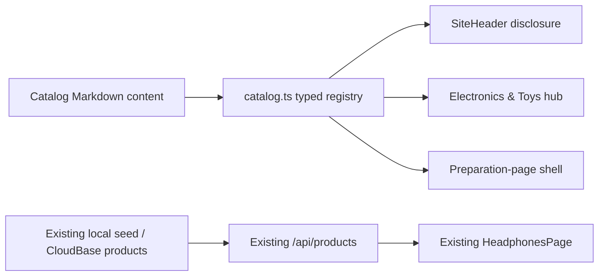

# Catalog Category Expansion — Phase 1 Low-Level Design

> Status: Proposed for architecture approval
> Scope: Menu redesign, basic family-page UI, current Headphones seed verification
> No implementation starts before approval

## 1. Phase 1 Outcome

Phase 1 is a storefront-only presentation slice:

- Replace the flat Headphones navigation item with an accessible `Electronics & Toys` disclosure.
- Add a basic hub and three honest in-preparation pages.
- Keep the current `/headphones/` data flow and use the existing six local seed products to verify populated UI.
- Hide VIP pricing and “sign in to unlock VIP” copy from active storefront/auth presentation, as already decided.

This phase does not establish a permanent cross-family data model or complete Admin CRUD.

## 2. Risk Ordering

### Implement now: reversible and low risk

- Static menu labels and destinations.
- Static Astro page shells.
- Existing Headphones UI and seed-data verification.
- Empty/in-preparation states with an OEM enquiry CTA.
- Presentation-only VIP suppression.

### Defer until client/parallel-work confirmation

| Deferred decision | Why it is high risk |
|---|---|
| `productFamily`, migrations, API family filter | Crosses database, public API, Admin, and Alibaba contracts |
| Admin category tabs/forms/permissions/deletion | Changes operational workflow and authorization |
| Alibaba mapping/import | Owned by the active Alibaba branch and external contract |
| Breadcrumb/JSON-LD/SEO metadata integration | `feat/seo-phase-3-metadata` is modifying the same metadata surfaces |
| SKU detail routes/slugs/redirects | Creates permanent URL and redirect obligations |
| Final public category names/URLs | Client may rename `Misc` or the hierarchy |
| VIP API/field/role removal | Requires a separate cross-file audit after Alibaba pricing is stable |

## 3. Architecture

Use a static, typed presentation registry. It drives the Header, hub, and preparation pages but never crosses into storage or APIs.



Only `/headphones/` requests products. The new hub and preparation pages issue zero catalog requests.

### Presentation contract

```ts
export type CatalogFamilyKey = 'headphones' | 'ai-gadgets' | 'toys' | 'misc';

export interface CatalogFamilyContent {
  key: CatalogFamilyKey;
  label: string;
  href: string;
  summary: string;
  availability: 'catalog' | 'in-preparation';
  availabilityLabel: string;
  meta: { title: string; description: string };
}

export interface CatalogContent {
  locale: 'en-US';
  menu: { label: string; viewAllLabel: string };
  hub: {
    meta: { title: string; description: string };
    eyebrow: string;
    heading: string;
    intro: string;
    enquiryLabel: string;
  };
  preparation: { eyebrow: string; statusLabel: string; enquiryLabel: string };
  families: readonly CatalogFamilyContent[];
}
```

Family order is canonical: Headphones, AI Gadgets, Toys, Other Electronics & Toys. `getCatalogContent(locale): CatalogContent` falls back to `en-US`; `getCatalogFamily(key, locale): CatalogFamilyContent` throws for an unknown key.

Contract source files:

- `apps/site/src/i18n/catalog.ts`
- `apps/site/src/i18n/content/catalog/en-US.md`

Prohibited consumers:

- `packages/shared/**`
- `apps/functions/**`
- `apps/local-server/**`
- `apps/site/src/islands/admin/**`
- Alibaba modules

The key is not a proposed database field. No property may be called `productFamily` in Phase 1 code.

## 4. Routes And Publication Boundary

| Route | Behavior | Phase 1 robots | Production publication |
|---|---|---|---|
| `/headphones/` | Existing populated catalog | Existing behavior | Existing route remains live |
| `/electronics-toys/` | Static hub | `noindex,follow` | Block until client confirms name/URL |
| `/ai-gadgets/` | In-preparation state | `noindex,follow` | Block until client confirms name/URL |
| `/toys/` | In-preparation state | `noindex,follow` | Block until client confirms name/URL |
| `/misc/` | Display “Other Electronics & Toys” | `noindex,follow` | Block until client confirms name/URL |

New route names are for local and controlled test-preview review. They are excluded from sitemap and must not be included in a production hosting upload until the client confirms the taxonomy and URLs.

Noindex does not make route removal free. If a route is ever uploaded and later renamed, delivery must add it to the targeted hosting-prune list and verify deployed 404 behavior; redirects may still be required if users have received the URL.

## 5. Metadata Boundary

Do not add breadcrumbs or BreadcrumbList in Phase 1. That keeps this branch away from the active SEO metadata branch and avoids publishing a hierarchy before client approval.

Extend `BaseLayout.astro` only enough to express `noindex,follow`:

```ts
type RobotsPolicy = 'index,follow' | 'noindex,follow' | 'noindex,nofollow';
```

Backward compatibility:

- Existing `noindex=true` remains `noindex,nofollow`.
- Explicit `robots="noindex,follow"` emits that exact value.
- Both noindex modes continue suppressing social/schema output.

Sitemap exclusions live in a dedicated `CATALOG_PREVIEW_PATHS` set in `astro.config.ts`; do not add public preview pages to the private/API `robots.txt` Disallow list.

Before implementation, rebase onto the latest approved SEO metadata changes. If `BaseLayout.astro`, `public-metadata.test.ts`, or `astro.config.ts` changed, re-derive this seam instead of resolving conflicts mechanically.

## 6. Global Navigation

### Source ownership

The existing flat entry is produced by `apps/site/src/i18n/content/en-US.md`. Phase 1 removes that `Headphones` nav record there and renders one catalog disclosure from the typed catalog registry.

`SiteHeader.astro` imports `getCatalogContent()` internally because the taxonomy is global navigation content. Existing Header call sites and props remain unchanged. The implementing MIU must not add a hidden `/headphones` string filter inside the Header.

The disclosure markup and behavior remain in `SiteHeader.astro`; no React island or prop-plumbing layer is introduced.

Desktop:

- Native `<details>/<summary>` in the measured nav lane.
- Hub plus four family links.
- Enter/Space/click use native toggle behavior; hover only styles.
- Escape closes and restores focus to summary.
- Outside click closes but keeps the clicked target's focus.
- Tabbing out closes without stealing focus.
- Current route has `aria-current="page"` and a non-color marker.

Mobile:

- Native nested disclosure inside the existing outer mobile disclosure.
- Same server-rendered links, usable without JavaScript.
- Opening the outer menu moves focus to the first actionable menu control; Escape closes it and restores focus to the hamburger.
- Following a link closes the outer disclosure through the existing handler.
- Toggle and rows are at least 44×44 CSS pixels.

Responsive fit:

- Closed summary participates in `desktopFits()` measurement.
- Absolutely positioned panel does not affect width measurement.
- Validate guest and authenticated states at 1024, 1360, and 1440.

## 7. Page Components

### `CatalogFamilyCard.astro`

Props:

```ts
interface Props {
  family: CatalogFamilyContent;
}
```

Renders label, summary, availability text, and anchor. It renders no product image until approved family-specific media exists, and no SKU, price, MOQ, inventory, certification, or review claim.

### `CatalogFamilyPage.astro`

Props:

```ts
interface Props {
  site: SiteContent;
  family: CatalogFamilyContent & { availability: 'in-preparation' };
}
```

Renders Header, Footer, one H1, family summary, honest preparation message, and OEM enquiry CTA. It has no React island, product grid, API request, breadcrumb, or structured data. It passes `robots="noindex,follow"` to `BaseLayout`.

### Hub

`electronics-toys.astro` renders:

- Header and Footer.
- One H1 and short introduction.
- Four `CatalogFamilyCard` entries in a 2×2 desktop / one-column mobile layout.
- OEM enquiry CTA.
- No Featured Products section in Phase 1, because the seed contains only Headphones.
- `robots="noindex,follow"`.

### Headphones

No route-shell or data-flow change in Phase 1:

- Preserve `/headphones/` canonical and metadata integration.
- Preserve `/api/products` without a family query.
- Preserve grouping, loading, initial error/retry, load more, missing-media fallback, in-page detail, and focus restoration.
- Add no breadcrumb until the SEO integration phase.

## 8. Local Seed Validation

Do not change `apps/local-server/src/seed.ts`.

Use a clean temporary `LOCAL_DB_FILE` so `seedIfEmpty` creates the existing six published Headphones:

- AuraBeat Pro Studio
- AuraBeat Classic
- WorkComm Mono
- WorkComm Duo
- SonicAir 5
- SonicAir Move

Separate test contracts:

1. `catalog-category.spec.ts` is deploy-safe: routes, menu, empty states, VIP absence, no-JS, responsive containment. It never asserts database contents.
2. `catalog-category-local-seed.spec.ts` is local-only. It requires `E2E_EXPECT_LOCAL_SEED=1` before any request, then fails unless the six exact products render. It is never run against a deploy preview.

No test may inspect live data and then decide to skip.

## 9. VIP Presentation

The user already approved presentation suppression. Phase 1 implements it without backend cleanup.

### Active Headphones content

Update `apps/site/src/i18n/content/headphones/en-US.md`:

- Remove VIP from metadata description.
- Remove `vipLabel` and `vipLockedLabel` from active list/detail content contracts.
- Keep public wholesale/unit-price and enquiry copy.

Keep `vipLabel` and `vipLockedLabel` as required deprecated properties on `HeadphonesContent` for cross-branch compile compatibility, but set both active Markdown values to empty strings. The active detail renderer does not render them, so no VIP copy appears in built/hydrated output. Permanent type-field removal and any legacy-component deletion belong to the later VIP cleanup after rebasing and re-auditing all branches that may reintroduce hidden routes.

### Detail renderer

`HeadphonesProductDetail`:

- Keeps the existing `registered` prop temporarily for compile compatibility but ignores it for rendering; permanent prop removal belongs to later VIP cleanup.
- For unlinked/manual products, renders wholesale/public price or quote behavior without VIP value/label/lock.
- Retains Alibaba-linked price routing exactly as implemented.

`HeadphonesPage` remains unchanged, including passing the now-ignored `registered` value and keeping session identity in the fetch-reset key. API/auth behavior is not changed.

Required test consumer:

- Update `alibaba-routing-render.test.ts`, which currently passes `registered` and asserts the old VIP amount for an unlinked product. Keep all Alibaba-linked routing assertions.

### Auth marketing copy

`AuthShell.astro` removes “Sign in to unlock VIP pricing” and replaces it with neutral account/OEM enquiry language. Registration/login behavior is unchanged.

### Explicitly untouched

- `vipPrice` types/storage/API projection.
- `member`, `canSeeVipPricing`, JWT/session logic.
- Admin fields/forms.
- `PriceBlock` shared/legacy component.
- `ProductDetail` legacy component; Phase 1 neither deletes nor wires it.
- Alibaba compatibility fields and branches.

## 10. E2E And CI Wiring

Create:

- `tests/e2e/catalog-category.spec.ts` — deploy-safe UI contract.
- `tests/e2e/catalog-category-local-seed.spec.ts` — local-only seed contract.

Update root `package.json`:

```json
"test:e2e:public": "playwright test tests/e2e/public.spec.ts tests/e2e/catalog-category.spec.ts"
```

Existing workflows already invoke `test:e2e:public`; updating the script ensures the deploy-safe catalog contract cannot be omitted. The local-seed spec is intentionally excluded from this script.

Repository policy still requires running the deploy-safe suite against the deployed test/preview URL before merge. The current deployed E2E workflow is not assumed to run automatically on every PR; execution must be recorded in `PHASE1_EXECUTION.md`.

## 11. Build And Deployment Impact

- Four static Astro routes and small server-rendered components.
- No new dependency, environment variable, database migration, function, API route, or CloudBase SDK use.
- Static route outputs must not be uploaded to production before client URL/name approval.
- Site production build is mandatory because sitemap output changes.
- If the routes are deployed to a test environment, smoke them there; production smoke waits until publication approval.

## 12. Cross-File Traces

```yaml
cross-file-reasoning:
  scope: Phase 1 planned files
  symbols-traced:
    - name: CatalogFamilyKey
      type: presentation-value
      trace: catalog Markdown -> catalog.ts -> SiteHeader/hub/family routes
      prohibited-consumers: shared, functions, local-server, Admin, Alibaba
      verdict: PASS
    - name: catalog preview routes
      type: route
      trace: pages/*.astro -> root effective URL -> Header/hub links -> canonical -> sitemap exclusion
      publication-gate: client URL/name approval
      verdict: PASS
    - name: robots policy
      type: metadata-contract
      trace: BaseLayout prop -> robots meta -> separate sitemap exclusion -> robots.txt remains unchanged
      verdict: PASS
    - name: VIP presentation
      type: conditional-coupling
      trace: Headphones content/types -> detail renderer -> Alibaba routing test -> built HTML/auth copy
      backend-contract: unchanged
      verdict: PASS
    - name: test:e2e:public
      type: CI-command
      trace: package.json -> e2e/deploy workflows -> deploy-safe specs only
      verdict: PASS
  failure-mode-matches: []
  verdict: PASS
```

## 13. Implementation Prerequisites

1. Rebase onto latest approved `main` plus the SEO metadata work that will land before implementation.
2. Re-read `BaseLayout.astro`, `public-metadata.test.ts`, `astro.config.ts`, and `SiteHeader.astro` after rebase.
3. Re-run a target-worktree repository-wide search for `ProductDetail`, `vipLabel`, and `vipLockedLabel`; stop and re-plan if the rebased branch introduces an active hidden route or another public renderer.
4. If the client has not approved category names/URLs, limit deployment to local or controlled test review.
5. Stop and re-plan if implementation needs a schema, API, Admin, Alibaba, SKU route, breadcrumb, or redirect change.

## 14. Approval Gate

Approval authorizes only this presentation slice. It does not approve any deferred schema, API, Admin, Alibaba, SEO hierarchy, permanent URL, or permission decision.
