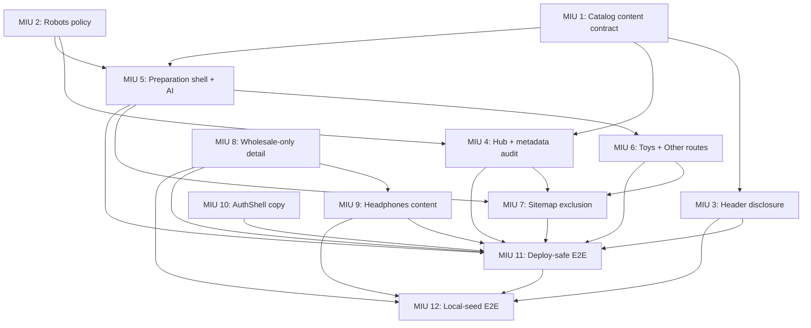

# Catalog Category Expansion — Phase 1 MIU Breakdown

> Status: Proposed for architecture approval
> Architecture source: `LOW_LEVEL_DESIGN.md`
> TDD first; no implementation starts before approval

## Product Tasks

1. Replace the flat Headphones navigation item with an Electronics & Toys menu.
2. Add a basic hub and in-preparation family pages.
3. Preserve the existing populated Headphones catalog and validate it with the current local seed.
4. Hide active public VIP pricing and registration-benefit copy without backend cleanup.

## Dependency DAG



## Technical MIUs

### MIU 1: Catalog presentation content loader and family registry

**Block:** FRONTEND
**Files:** `apps/site/src/i18n/catalog.ts`, `apps/site/src/i18n/content/catalog/en-US.md`, `apps/site/src/i18n/catalog-content.test.ts`
**Type:** new-file
**Depends on:** none

**What it does:**

- Defines `CatalogFamilyKey`, `CatalogFamilyContent`, and the complete `CatalogContent` interface from `LOW_LEVEL_DESIGN.md`, including canonical family order and metadata.
- Exposes `getCatalogContent(locale): CatalogContent` with `en-US` fallback and `getCatalogFamily(key, locale): CatalogFamilyContent` that throws for unknown keys, using the existing eager Markdown pattern.
- Keeps the registry presentation-only: no `productFamily`, database field, API query, source category, SKU, price, inventory, or Product schema.

**Build/Deploy/Runtime impact:**

- Build-time content only; no runtime request, dependency, environment, API, database, or deploy change.
- Node tests validate raw frontmatter; Astro/Vite compilation proves `import.meta.glob` loader resolution.

**Test plan (TDD — write first):**

- Parse raw frontmatter and assert ordered keys `headphones`, `ai-gadgets`, `toys`, `misc`, unique trailing-slash hrefs, availability tokens, and non-empty authored `availabilityLabel` values.
- Assert titles are at most 60 characters, descriptions at most 160, and serialized content excludes `productFamily`, `vipPrice`, inventory, ratings, and reviews.
- Assert the typed union, complete `CatalogContent` shape, locale fallback, and unknown-key throw are present; compile the actual loader with Astro.

**Done when:**

- Raw content tests and all existing site tests pass.
- Site typecheck and production build compile both loader exports.

---

### MIU 2: BaseLayout explicit robots policy

**Block:** FRONTEND
**Files:** `apps/site/src/layouts/BaseLayout.astro`, `apps/site/src/lib/public-metadata.test.ts`
**Type:** modify-existing
**Depends on:** none

**What it does:**

- Adds `RobotsPolicy = 'index,follow' | 'noindex,follow' | 'noindex,nofollow'` and optional `robots?: RobotsPolicy` to `BaseLayout`.
- Resolves explicit robots first, legacy `noindex=true` second, and public default last; both noindex modes suppress social/schema output.
- Revalidates this seam after rebasing the active SEO metadata work; no breadcrumb or JSON-LD is added.

**Build/Deploy/Runtime impact:**

- Static head output only; no runtime, dependency, environment, or deploy change.
- Overlaps active SEO metadata files, so rebase and focused conflict review are mandatory.

**Test plan (TDD — write first):**

- Source/AST assert the exact union, precedence, and backward mapping `noindex=true -> noindex,nofollow`.
- Assert default public pages remain indexable and both noindex policies suppress social/schema output by inspecting BaseLayout branches.
- Use Astro typecheck/build as proof that invalid robots values cannot be passed by real pages.

**Done when:**

- Existing metadata tests pass with unchanged private/public meaning.
- Site typecheck and production build pass after current SEO changes are rebased.

---

### MIU 3: SiteHeader catalog disclosure and nav-source replacement

**Block:** FRONTEND
**Files:** `apps/site/src/components/SiteHeader.astro`, `apps/site/src/i18n/content/en-US.md`, `apps/site/src/header-catalog-source-contract.test.ts`
**Type:** modify-existing
**Depends on:** MIU 1

**What it does:**

- Removes the flat Headphones nav record from `apps/site/src/i18n/content/en-US.md`; `SiteHeader.astro` imports `getCatalogContent()` from `apps/site/src/i18n/catalog.ts` internally, avoiding changes to existing callers.
- Renders desktop and mobile native disclosures from the same registry: hub plus four family links, current-route indication, 44px targets, and no hover-only opening.
- Extends the script for desktop Escape/outside/focus-leave closure and mobile focus transfer: opening focuses the first actionable menu control; Escape restores hamburger focus.
- Keeps measured switching, account controls, link-close behavior, and no-JS navigation; no hidden `/headphones` filter is introduced.

**Build/Deploy/Runtime impact:**

- Global Header markup/script changes on every public page; no new island or dependency.
- Trigger width can move 1360px layouts to mobile; browser validation belongs to MIU 11.

**Test plan (TDD — write first):**

- Assert site Markdown has no flat Headphones nav record and Header imports the MIU 1 contract instead of duplicating labels/URLs.
- Source-assert one desktop and one mobile disclosure, exact five destinations per variant, current-page semantics, 44px classes, and no hidden route filter.
- Source-assert Escape/outside/focus-leave handlers plus mobile open/Escape focus transfer; no-JS links remain literal anchors.

**Done when:**

- Header source/content tests and all existing site tests pass without modifying Header call sites.
- Site typecheck and production build pass.

---

### MIU 4: ElectronicsAndToys hub, family cards, and dynamic route metadata audit

**Block:** FRONTEND
**Files:** `apps/site/src/components/CatalogFamilyCard.astro`, `apps/site/src/pages/electronics-toys.astro`, `apps/site/src/lib/public-metadata.test.ts`
**Type:** new-file
**Depends on:** MIUs 1, 2

**What it does:**

- `CatalogFamilyCard` accepts `{ family: CatalogFamilyContent }` from `apps/site/src/i18n/catalog.ts` and renders label, summary, authored `availabilityLabel`, and anchor only.
- Hub consumes `CatalogContent` from `apps/site/src/i18n/catalog.ts`, `OEM_INQUIRY_HREF` from `apps/site/src/lib/site-navigation.ts`, and MIU 2 robots policy; renders Header/Footer, one H1, four cards, and enquiry CTA.
- Refactors `public-metadata.test.ts` from a hardcoded route list to dynamically audit every existing routable top-level page for bounded unique metadata and valid BaseLayout bindings, while retaining required baseline routes.
- Renders no product media, fake inventory, Featured Products, API request, SKU, price, MOQ, review, or certification.

**Build/Deploy/Runtime impact:**

- One static route and one server component; no runtime product request/backend deploy.
- Local/test-preview only pending client approval; sitemap exclusion lands in MIU 7 before integration completion.

**Test plan (TDD — write first):**

- Assert family-card API and hub contract imports; assert one H1, four family records with authored availability labels, enquiry CTA, bounded metadata, and `robots="noindex,follow"`.
- Assert dynamic metadata test discovers actual routable pages rather than requiring future missing files.
- Assert absence of fetch/product arrays/cards/prices/MOQ/SKU and compile the new route with Astro.

**Done when:**

- Metadata and site tests pass immediately with only the hub route present.
- Site typecheck and production build pass; browser/layout tests wait for MIU 11.

---

### MIU 5: CatalogFamilyPage shell and AI Gadgets route

**Block:** FRONTEND
**Files:** `apps/site/src/components/CatalogFamilyPage.astro`, `apps/site/src/pages/ai-gadgets.astro`, `apps/site/src/catalog-category-phase1-contract.test.ts`
**Type:** new-file
**Depends on:** MIUs 1, 2

**What it does:**

- `CatalogFamilyPage` accepts `{ site: SiteContent; family: CatalogFamilyContent & { availability: 'in-preparation' } }`, consuming types from `site.ts` and `catalog.ts`.
- Shell consumes `OEM_INQUIRY_HREF` from `apps/site/src/lib/site-navigation.ts`, renders Header/Footer, one H1, summary, preparation message, CTA, and MIU 2 `noindex,follow`; no breadcrumb/JSON-LD.
- AI route is a thin `getCatalogFamily('ai-gadgets')` consumer with no route-local product/copy array.

**Build/Deploy/Runtime impact:**

- One static route/component; no API, database, dependency, function, or runtime request.
- Local/test-preview only pending client approval; sitemap exclusion lands in MIU 7.

**Test plan (TDD — write first):**

- Assert exact component props and contract-source imports; AI route resolves the typed key and duplicates no family copy.
- Assert H1, preparation copy, OEM CTA, canonical, noindex, and absence of fetch/API/client directive/product facts/breadcrumb/schema.
- Run dynamic metadata audit from MIU 4 to prove adding this actual route does not break route inventory.

**Done when:**

- Contract, metadata, and all site tests pass with AI route present.
- Site typecheck and production build pass; browser/layout tests wait for MIU 11.

---

### MIU 6: Toys and Other family route consumers

**Block:** FRONTEND
**Files:** `apps/site/src/pages/toys.astro`, `apps/site/src/pages/misc.astro`, `apps/site/src/catalog-category-phase1-contract.test.ts`
**Type:** new-file
**Depends on:** MIU 5

**What it does:**

- Adds thin consumers of `apps/site/src/components/CatalogFamilyPage.astro` and `apps/site/src/i18n/catalog.ts` for `toys` and `misc`.
- Displays `Other Electronics & Toys` from the registry without declaring a storage/SEO contract.
- Uses MIU 5 shell and its `apps/site/src/lib/site-navigation.ts` enquiry contract; no route-local copy/product arrays.

**Build/Deploy/Runtime impact:**

- Two static routes; no runtime/API/database/dependency change.
- Local/test-preview only pending client approval; sitemap exclusion lands next.

**Test plan (TDD — write first):**

- Assert both routes delegate to shared shell, resolve exact typed keys, and contain no duplicated copy/product arrays.
- Assert exact H1s, metadata, noindex, CTA, and absence of API/product facts/breadcrumb/schema.
- Run dynamic metadata audit and compile both routes.

**Done when:**

- Contract, metadata, and all site tests pass with all four new routes present.
- Site typecheck and production build pass; browser/layout tests wait for MIU 11.

---

### MIU 7: Catalog preview sitemap exclusion contract

**Block:** INFRASTRUCTURE
**Files:** `apps/site/astro.config.ts`, `apps/site/src/catalog-indexing-contract.test.ts`
**Type:** modify-existing
**Depends on:** MIUs 4, 5, 6

**What it does:**

- Adds dedicated `CATALOG_PREVIEW_PATHS` for the exact four route files from MIUs 4–6 and excludes them from sitemap separately from private paths.
- Cross-checks each actual route uses `robots="noindex,follow"`; leaves robots.txt unchanged and Headphones in sitemap.
- Adds no redirect, lastmod, hreflang, Product schema, or publication approval.

**Build/Deploy/Runtime impact:**

- Production sitemap output changes; real site build mandatory.
- No runtime/dependency/environment/API/function/robots.txt change.

**Test plan (TDD — write first):**

- Assert exact four actual route files match the preview set and each page's robots usage.
- Build and assert sitemap excludes previews, retains Headphones, and robots.txt does not Disallow previews.
- Assert either-side drift fails focused contract test.

**Done when:**

- Indexing/site tests, site typecheck, and real production build pass.
- Generated sitemap and unchanged robots.txt satisfy the contract.

---

### MIU 8: HeadphonesProductDetail wholesale-only rendering

**Block:** FRONTEND
**Files:** `apps/site/src/islands/shop/HeadphonesProductDetail.tsx`, `apps/site/src/islands/shop/headphones-detail-render.test.ts`, `apps/site/src/islands/shop/alibaba-routing-render.test.ts`
**Type:** modify-existing
**Depends on:** none

**What it does:**

- Keeps `registered` in `HeadphonesProductDetailProps` for compile compatibility but omits it from function destructuring and every rendering reference; unlinked products render public/wholesale price or quote without VIP value/label/lock.
- Updates both direct render-test consumers. Alibaba-linked routing and no-legacy-fallback assertions remain intact.
- Leaves HeadphonesPage, Product types, API projection, roles, Admin, PriceBlock, and Alibaba data contracts unchanged.

**Build/Deploy/Runtime impact:**

- Active detail rendering only; no API/auth/database/dependency/function change.

**Test plan (TDD — write first):**

- Render wholesale `$15.50` and VIP `$13.20`; assert wholesale remains and VIP amount/label/lock/login are absent for both registered values.
- Assert Alibaba fixed/range/tiered/negotiable/unavailable routing remains and never falls back.
- Assert unit price, MOQ, enquiry CTA, detail/back focus markers remain.

**Done when:**

- Detail/Alibaba routing/all site tests pass.
- Site typecheck and production build pass without signature changes.

---

### MIU 9: Headphones active-content VIP suppression

**Block:** FRONTEND
**Files:** `apps/site/src/i18n/headphones.ts`, `apps/site/src/i18n/content/headphones/en-US.md`, `apps/site/src/i18n/headphones-content.test.ts`
**Type:** modify-existing
**Depends on:** MIU 8

**What it does:**

- Removes VIP from metadata and sets active Markdown `vipLabel`/`vipLockedLabel` values to empty strings so no VIP copy is serialized into hydration props.
- Keeps both TypeScript properties required but marks them deprecated for cross-branch compile compatibility; permanent type removal and legacy-component cleanup remain deferred.
- Updates the complete real-interface content fixture while preserving hero provenance, public/wholesale labels, enquiry, recovery, and metadata bounds; leaves storage/API/role/Admin/ProductDetail/PriceBlock/Alibaba contracts untouched.

**Build/Deploy/Runtime impact:**

- Static metadata/content and hydration-prop change only; no backend/auth/deploy config.

**Test plan (TDD — write first):**

- Assert active frontmatter values for vipLabel/vipLockedLabel are empty and metadata contains no VIP pricing/registration benefit, while type source marks both required keys deprecated.
- Assert complete typed fixture retains wholesale/public pricing, hero source hashes/dimensions, OEM CTA, and recovery copy.
- Build and scan Headphones HTML/hydration output for absence of VIP strings.

**Done when:**

- Content, metadata, detail, catalog, Alibaba routing, and all site tests pass.
- Site typecheck and production build pass with narrowed content shape.

---

### MIU 10: AuthShell neutral account/OEM copy contract

**Block:** FRONTEND
**Files:** `apps/site/src/components/AuthShell.astro`, `apps/site/src/auth-shell-source-contract.test.ts`
**Type:** modify-existing
**Depends on:** none

**What it does:**

- Replaces VIP registration-benefit copy with neutral account and OEM enquiry wording.
- Preserves brand link, responsive two-panel shell, slot, title/footer output, and all auth behavior.

**Build/Deploy/Runtime impact:**

- Static copy shared by login/register/reset pages; no auth/API/dependency change.

**Test plan (TDD — write first):**

- Assert no case-insensitive VIP/member-price/unlock-pricing wording remains.
- Assert neutral copy, slot, brand home link, responsive classes, and title output remain.
- Build and scan auth outputs for no VIP copy.

**Done when:**

- Focused/all site tests pass.
- Site typecheck and production build pass.

---

### MIU 11: Deploy-safe catalog browser contract and public-gate wiring

**Block:** TESTING
**Files:** `tests/e2e/catalog-category.spec.ts`, `tests/e2e/public.spec.ts`, `package.json`
**Type:** new-test
**Depends on:** MIUs 3, 4, 5, 6, 7, 8, 9, 10

**What it does:**

- Adds environment-independent tests for disclosures, routes, empty states, VIP absence, no-JS, mobile focus transfer, and responsive containment.
- Updates `test:e2e:public` to include both specs; existing e2e/deploy workflows consume this script.
- Measures and asserts Header geometry established by MIU 3, including summaries and links; this MIU does not change production Header code or assume catalog DB contents.

**Build/Deploy/Runtime impact:**

- Test script/E2E only; no production runtime.
- Deployed test/preview execution required before merge; production publication remains prohibited until client URL approval.

**Test plan (TDD — write first):**

- Desktop 1360/1440 tests Enter/Space/click, Escape focus return, outside/focus-leave closure, active marker, five links, no collision.
- Mobile 320/390/768/1024 tests hamburger focus transfer/return, nested disclosure, 44px targets, no history entry, no overflow.
- Routes test H1/canonical/noindex/no fake products/no product requests on preparation pages/no VIP copy/no-JS/no console errors.
- Under `prefers-reduced-motion: reduce`, assert disclosure/page transitions are disabled and Headphones focus scrolling uses non-smooth behavior.

**Done when:**

- Updated public script passes locally and against controlled deployed test/preview URL.
- Fresh root `pnpm typecheck` (including E2E), lint, tests, and production build pass.

---

### MIU 12: Clean-local-seed Headphones browser contract and execution record

**Block:** TESTING
**Files:** `tests/e2e/catalog-category-local-seed.spec.ts`, `docs/catalog-category-expansion/PHASE1_EXECUTION.md`
**Type:** new-test
**Depends on:** MIUs 3, 8, 9, 11

**What it does:**

- Requires `E2E_EXPECT_LOCAL_SEED=1` before page/request creation and fails if absent; never data-dependent skips.
- Against clean temporary DB, asserts six existing products, three groups, unique cards, detail/Back focus, error/retry, and missing-media fallback without editing seed.
- Records local results plus MIU 11 deploy-safe results and explicit production-deploy prohibition pending client URLs.

**Build/Deploy/Runtime impact:**

- Local test/documentation only; excluded from deploy-safe script.

**Test plan (TDD — write first):**

- Assert exact six names/groups and fail on any mismatch.
- Assert detail/Back/public pricing/no VIP behavior.
- Intercept initial 503/retry and missing media/fallback; no duplicate requests or layout shift.

**Done when:**

- Local-only suite passes from deleted temp DB and is absent from deploy commands.
- Execution doc records fresh root typecheck, lint, tests, build, local seed E2E, screenshots, and MIU 11 deployed test/preview E2E.

## Scope Fence

Reject Phase 1 changes under:

- `packages/shared/**`, `apps/functions/**`, `apps/local-server/src/seed.ts`
- `apps/site/src/islands/admin/**`, Alibaba modules
- SKU route/slug/redirect/breadcrumb/JSON-LD files
- Product-family database/API fields
- VIP storage/API/role/Admin cleanup

## Validation Commands

```bash
pnpm --filter @vibelingan-channel/site test
pnpm --filter @vibelingan-channel/site typecheck
pnpm --filter @vibelingan-channel/site build
pnpm test:e2e:public -- --project=chromium
```

Clean local seed, separate terminals:

```bash
export LOCAL_DB_FILE="$TMPDIR/channel-catalog-category-phase1.json"
rm -f "$LOCAL_DB_FILE"
pnpm --filter @vibelingan-channel/local-server dev
```

```bash
PUBLIC_CB_HOST=localhost:3002 pnpm --filter @vibelingan-channel/site dev --host 127.0.0.1 --port 4321
```

```bash
E2E_SITE_URL=http://127.0.0.1:4321 E2E_EXPECT_LOCAL_SEED=1 \
  pnpm exec playwright test tests/e2e/catalog-category-local-seed.spec.ts --project=chromium
```

Final gates:

```bash
pnpm typecheck
pnpm lint
pnpm test
pnpm build
```

Deploy-safe test environment gate:

```bash
E2E_SITE_URL=<deployed-test-url> pnpm test:e2e:public -- --project=chromium
```

## Architecture Approval

**APPROVE ARCHITECTURE** — approval authorizes MIUs 1–12 only. No implementation starts until confirmed.
