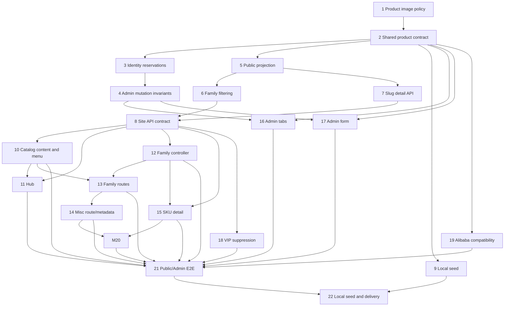

# Catalog Category Expansion — V1.1 MIU Breakdown

> Requirement source: client PDF V1.1 (`b3804c067e947e8447ac6fed4eae0d1207345c1479a415f44e8e0a87fcc05d56`)
> Single branch: `feat/catalog-category-design`
> Method: TDD, contract-first DAG, one independently compilable MIU at a time

## Dependency DAG

## MIU 1: Product-specific nine-image policy

**Block:** BACKEND

**Files:** `packages/shared/src/media.ts`, `packages/shared/src/media.test.ts`

**Type:** modify-existing

**Depends on:** none

**What it does:**

- Adds `PRODUCT_IMAGE_MAX_COUNT = 9` as the V1.1 products policy.
- Retains `CATALOG_IMAGE_MAX_COUNT = 18` for Overstock and legacy shared normalization, preventing image visibility/refcount regressions.

**Build/Deploy/Runtime impact:**

- Policy vocabulary only; runtime wiring begins in MIU 2.
- No dependency, artifact, API, database, or deploy configuration change.

**Test plan (TDD — write first):**

- Assert the product policy equals 9.
- Assert the legacy catalog/Overstock policy remains 18 and existing normalization/write tests remain unchanged.

**Done when:**

- Shared tests and shared typecheck pass.
- Site tests, root workspace typecheck, E2E typecheck, and lint pass without changing current runtime behavior.

## MIU 2: Shared product identity and lifecycle contract

**Block:** BACKEND

**Files:** `packages/shared/src/collections.ts`, `packages/shared/src/catalog-product.ts`, `packages/shared/src/catalog-product.test.ts`

**Type:** new-file

**Depends on:** MIU 1

**What it does:**

- Defines `ProductFamily`, slug/SKU normalization, reserved-slug validation, legacy Headphones family resolution, and draft/publish/archive state validation.
- Adds products fields `productFamily`, optional `category`, `skuCode`, `slug`, `archived`; products use `PRODUCT_IMAGE_MAX_COUNT` while Overstock retains 18.
- Registers hidden server-managed `catalogProductIdentities` reservation collection and marks `vipPrice` deprecated/hidden from generic Admin form metadata.

**Build/Deploy/Runtime impact:**

- Changes shared schemas consumed by Admin, local server, public function, and Alibaba function builds.
- No storage migration is executed; legacy drafts remain readable/writable under explicit compatibility rules.

**Test plan (TDD — write first):**

- Accept a legacy unpublished Headphones row and resolve its family without mutation; reject unknown families and invalid/reserved slugs.
- Reject publication without family, slug, SKU code, description, or image; reject archived+published; accept a complete nine-image product and reject ten.
- Assert Alibaba fields and identity reservations are read-only/hidden from generic CRUD.

**Done when:**

- Shared tests and typecheck pass, including existing Alibaba collection snapshots or deliberately updated additive expectations.
- All workspace typechecks compile the additive schema.

## MIU 3: Atomic catalog identity reservation repository

**Block:** BACKEND

**Files:** `packages/db/src/adapter.ts`, `packages/db/src/cloudbase-adapter.ts`, `apps/functions/admin/src/catalog-product-identities.ts`

**Type:** new-file

**Depends on:** MIU 2

**What it does:**

- Defines one `saveCatalogProductWithIdentities` state transition over the product row and
  deterministic normalized `slug` / case-folded `skuCode` rows.
- CloudBase runs the complete transition in one multi-collection transaction; local development
  runs the same plan in one file-backed critical section.
- Supports create, identity change, legacy partial-identity repair, same-owner idempotency, and
  owner-checked stale identity release without process-local compensation.
- Adds a thin Admin repository that generates create IDs, canonicalizes identity input, and maps
  storage results to domain errors. It exposes no generic Admin route.
- The DB facade export and local JSON adapter are secondary seam consumers validated by the focused
  integration tests, not separate contract owners in this MIU.

**Build/Deploy/Runtime impact:**

- Extends the DB adapter/facade and adds Admin-function repository logic over it.
- Admin function bundle/cold-start context must compile; no new package or environment variable.

**Test plan (TDD — write first):**

- A real `JsonFileAdapter` race yields one saved product and one conflict, persists one owner per
  identity, and remains correct after reopening the file.
- The installed CloudBase SDK probe proves post-write callback failure aborts and transaction
  conflict retries the complete callback before one commit.
- Conflict/corrupt reservation paths write nothing; identity change writes new values before
  owner-checked old release; legacy malformed sibling identities do not strand valid old rows.
- Admin repository tests pin ID generation, canonical slug storage, normalized reservation keys,
  result/error mapping, and missing/invalid identity behavior.

**Done when:**

- Focused DB/local/Admin tests, SDK contract probe, and Admin function typecheck pass.
- Root tests/typecheck and function artifact build remain green.

## MIU 4: Admin product mutation invariants

**Block:** BACKEND

**Files:** `apps/functions/admin/src/handler.ts`, `apps/functions/admin/src/handler.test.ts`, `apps/functions/admin/src/catalog-product-identities.ts`

**Type:** modify-existing

**Depends on:** MIU 3

**What it does:**

- Routes product create/update through identity reservation and the shared lifecycle validator while leaving other generic collections unchanged.
- Defaults create to draft/non-archived; archive forces unpublish; unarchive returns to draft.
- Rejects generic `vipPrice` writes and all Alibaba read-only fields without clearing existing stored values.

**Build/Deploy/Runtime impact:**

- Changes Admin API product mutations and local-server parity because local delegates to the same handler.
- Admin function build/package/cold-start smoke required; no new endpoint or secret.

**Test plan (TDD — write first):**

- Create defaults draft; incomplete publish rejects; complete publish succeeds; archive unpublishes; unarchive remains draft.
- Duplicate slug/SKU returns conflict and stores one product; non-product CRUD remains byte-compatible.
- VIP/Alibaba forged writes reject while ordinary curated fields update.
- Admin and contributor may publish/unpublish/archive; viewer/member/blank/anonymous/suspended/invalid sessions are denied with no product or reservation mutation.

**Done when:**

- Admin tests/typecheck and local-server typecheck pass.
- Root tests and packaged Admin cold-start smoke pass.

## MIU 5: Public product projection and legacy fallback

**Block:** BACKEND

**Files:** `apps/functions/public-api/src/handler.ts`, `apps/functions/public-api/src/http-adapter.test.ts`

**Type:** modify-existing

**Depends on:** MIU 2

**What it does:**

- Adds `productFamily`, `skuCode`, and `slug` to the public allowlist and suppresses archived products.
- Projects missing-family `wired|office|bluetooth` rows as Headphones without mutating storage.
- Applies the product-specific nine-image projection while preserving Overstock's 18-image contract and current Alibaba private-key stripping.

**Build/Deploy/Runtime impact:**

- Additive public product response; public function and local parity builds change.
- Authorization/cache headers and VIP legacy projection remain unchanged.

**Test plan (TDD — write first):**

- Anonymous product list/detail exposes identity and at most nine ordered images, never `imageIds`, timestamps, archived rows, or VIP.
- Legacy Headphones projection adds family in response while adapter store remains unchanged.
- Overstock still projects up to 18 images and Alibaba source private keys remain absent.

**Done when:**

- Public API tests/typecheck pass.
- Public function package/cold-start smoke and root tests pass.

## MIU 6: Public family and subcategory filtering

**Block:** BACKEND

**Files:** `apps/functions/public-api/src/handler.ts`, `apps/functions/public-api/src/http-adapter.ts`, `apps/functions/public-api/src/http-adapter.test.ts`

**Type:** modify-existing

**Depends on:** MIU 5

**What it does:**

- Parses a closed-set `productFamily` query and composes it with subcategories, search, pagination, publication, and archive filters.
- Includes legacy missing-family rows only for Headphones through a bounded compatibility merge with stable `_id` ordering and dedupe.

**Build/Deploy/Runtime impact:**

- Adds a query option to existing list route; no new route or dependency.
- Public function and local-server integration tests/builds required.

**Test plan (TDD — write first):**

- Each family filter returns only that family; unknown family rejects; Headphones subcategory filters independently.
- Headphones includes legacy rows, other families do not; pages contain no duplicates and preserve stable order/total.
- Search plus family plus page size composes without bypassing publication/archive gates.

**Done when:**

- Public API focused/all tests and typecheck pass.
- Root tests and function artifact smoke pass.

## MIU 7: Published SKU slug detail endpoint

**Block:** BACKEND

**Files:** `apps/functions/public-api/src/handler.ts`, `apps/functions/public-api/src/http-adapter.ts`, `apps/functions/public-api/src/http-adapter.test.ts`

**Type:** modify-existing

**Depends on:** MIU 5

**What it does:**

- Adds `GET /api/products/slug/:slug`, reusing the public projection and legacy family fallback.
- Serves only published, non-archived products; existing ID detail remains compatibility-only.

**Build/Deploy/Runtime impact:**

- Adds one public-function route accepted in gateway-prefixed and stripped shapes.
- Public function bundle/local parity tests and artifact smoke required.

**Test plan (TDD — write first):**

- Published slug returns 200; unknown, unpublished, and archived slugs return identical 404 contracts.
- Encoded/invalid slugs cannot alter routing; Alibaba private keys and VIP remain absent anonymously.
- Gateway-prefixed and stripped slug paths resolve identically.

**Done when:**

- Public API and local parity tests/typechecks pass.
- Packaged public function cold-start smoke passes.

## MIU 8: Site catalog DTO and fetch helpers

**Block:** FRONTEND

**Files:** `apps/site/src/islands/shop/catalog-types.ts`, `apps/site/src/islands/shop/api.ts`, `apps/site/src/islands/shop/api.test.ts`

**Type:** modify-existing

**Depends on:** MIUs 6–7

**What it does:**

- Adds family/slug/SKU fields and family query typing to the browser contract.
- Adds family list, slug detail, and same-family related-product helpers with media normalization capped at nine for products.
- Preserves current token lookup, AbortSignal, pagination, and Alibaba pricing DTO.

**Build/Deploy/Runtime impact:**

- Browser request shapes change; no dependency or deploy config.
- Site test/typecheck/build contexts required.

**Test plan (TDD — write first):**

- Assert exact encoded family/category/search/page query and slug path encoding.
- Assert token is read per request and AbortError propagates.
- Assert product media stops at nine while response order/primary image remain stable.

**Done when:**

- Focused/all site tests and site typecheck pass.
- Site production build passes.

## MIU 9: Full-family local seed fixtures

**Block:** INTEGRATION

**Files:** `apps/local-server/src/seed.ts`, `apps/local-server/src/seed.test.ts`

**Type:** modify-existing

**Depends on:** MIU 2

**What it does:**

- Preserves six existing Headphones and adds clearly synthetic local-only AI Gadgets, Toys, and Misc products with unique identity and max-nine images.
- Keeps one legacy no-family Headphones fixture for compatibility tests; includes no video or VIP values on new products.

**Build/Deploy/Runtime impact:**

- Local development database only; no production migration or asset upload.
- Local-server tests/typecheck required.

**Test plan (TDD — write first):**

- Assert all four families, unique normalized slug/SKU, draft/published intent, and no product exceeds nine images.
- Assert six original Headphones remain and one legacy row lacks family intentionally.
- Assert new fixtures include no `vipPrice` or video field.

**Done when:**

- Local seed tests and local-server typecheck pass.
- Clean temporary DB boots deterministically.

## MIU 10: Catalog content registry and accessible global menu

**Block:** FRONTEND

**Files:** `apps/site/src/i18n/catalog.ts`, `apps/site/src/i18n/content/catalog/en-US.md`, `apps/site/src/components/SiteHeader.astro`

**Type:** new-file

**Depends on:** MIU 8

**What it does:**

- Defines typed family/menu/hub/list/detail copy and category media references.
- Replaces flat Headphones nav with desktop/mobile native disclosures using one registry.
- Supports keyboard, Escape/focus return, outside/focus-leave close, no-JS links, active state, and 44px targets.

**Build/Deploy/Runtime impact:**

- Global Header markup/script changes on all public pages; no new dependency.
- Site production build and global Header browser tests required.

**Test plan (TDD — write first):**

- Raw content test asserts exactly four families and valid assets/routes; no video/VIP copy.
- Header source/render test asserts one desktop/mobile disclosure, five links, semantic active state, and no duplicate flat Headphones item.
- No-JS source contains ordinary anchors; focus handlers exist for Escape/mobile open.

**Done when:**

- Site content/header tests, typecheck, and production build pass.
- Existing public page Header contract remains contained.

## MIU 11: Electronics & Toys hub and Featured Products

**Block:** FRONTEND

**Files:** `apps/site/src/pages/electronics-toys.astro`, `apps/site/src/components/CatalogFamilyCard.astro`, `apps/site/src/islands/shop/FeaturedProducts.tsx`

**Type:** new-file

**Depends on:** MIUs 8, 10

**What it does:**

- Renders one H1, introduction, four image-backed family links, quote CTA, and API-backed Featured Products.
- Featured states are loading/error/retry/empty/real data and never fabricate product claims.

**Build/Deploy/Runtime impact:**

- New static route and one hydrated list request; no backend change.
- Site tests/typecheck/build and browser verification required.

**Test plan (TDD — write first):**

- Assert exactly four family cards with approved/fallback media dimensions and destinations.
- Assert featured loading/error/retry/empty/real states and public card fields; no VIP/video.
- Assert one H1, bounded metadata, CTA, and no horizontal overflow in E2E.

**Done when:**

- Focused/all site tests, typecheck, and build pass.
- Hub browser smoke passes at mobile/desktop.

## MIU 12: Shared family catalog controller and grid

**Block:** FRONTEND

**Files:** `apps/site/src/islands/shop/CatalogFamilyPage.tsx`, `apps/site/src/islands/shop/CatalogFamilyGrid.tsx`, `apps/site/src/islands/shop/catalog-family-render.test.ts`

**Type:** new-file

**Depends on:** MIU 8

**What it does:**

- Owns family fetch, AbortController/generation, filters, pagination, retry, dedupe, and URL-backed card links.
- Grid renders primary image, name, SKU/model, description, MOQ, Alibaba/public price or quote, and no VIP.
- Headphones receives three subcategories; other families omit unconfigured filter bars.

**Build/Deploy/Runtime impact:**

- New React island shared by four routes; no dependency.
- Site tests/typecheck/build required.

**Test plan (TDD — write first):**

- Stale/aborted responses cannot commit; filter resets page; overlapping pages dedupe and keep order.
- Loading/error/retry/empty/success/load-more render mutually exclusive accessible states.
- Cards contain required fields/stable SKU links and no VIP/video; missing image/price fall back correctly.

**Done when:**

- Focused state/render tests and all site tests pass.
- Site typecheck/build pass.

## MIU 13: Four family route shells

**Block:** FRONTEND

**Files:** `apps/site/src/pages/headphones.astro`, `apps/site/src/pages/ai-gadgets.astro`, `apps/site/src/pages/toys.astro`

**Type:** modify-existing

**Depends on:** MIUs 10, 12

**What it does:**

- Preserves Headphones URL/hero while switching catalog list to the shared family controller.
- Adds AI Gadgets and Toys shells with typed content, family key, one H1, canonical, and quote CTA.

**Build/Deploy/Runtime impact:**

- Two new static routes and one existing route update.
- Site metadata tests/typecheck/build required.

**Test plan (TDD — write first):**

- Assert route family keys, one H1, unique metadata, correct canonical, and no duplicated route-local copy.
- Assert Headphones retains hero and wired/office/bluetooth filters.
- Assert all shells pass the shared content/API contract and no VIP/video copy.

**Done when:**

- Route/content/metadata tests, site typecheck, and build pass.
- Existing `/headphones/` smoke remains green.

## MIU 14: Other Electronics route and metadata inventory

**Block:** FRONTEND

**Files:** `apps/site/src/pages/misc.astro`, `apps/site/src/lib/public-metadata.test.ts`, `apps/site/astro.config.ts`

**Type:** new-file

**Depends on:** MIU 13

**What it does:**

- Adds Misc route with public label Other Electronics & Toys.
- Updates dynamic public route metadata audit and sitemap inclusion/exclusion based on actual published family content.

**Build/Deploy/Runtime impact:**

- New static route and sitemap output change.
- Real site production build required.

**Test plan (TDD — write first):**

- Assert unique bounded metadata, one H1, canonical, and correct family key/label.
- Assert sitemap includes hub/populated families and excludes empty/noindex families.
- Assert all public top-level routes are audited without hardcoded stale inventory.

**Done when:**

- Metadata/indexing tests, site typecheck, and production build pass.
- Generated sitemap matches contract.

## MIU 15: SKU detail shell, gallery, and related products

**Block:** FRONTEND

**Files:** `apps/site/src/pages/products/item.astro`, `apps/site/src/islands/shop/SkuDetailPage.tsx`, `apps/site/src/islands/shop/sku-detail-render.test.ts`

**Type:** new-file

**Depends on:** MIUs 8, 12

**What it does:**

- Reads slug query, loads detail, and renders max-nine ordered gallery, facts, MOQ, public/Alibaba price or quote, OEM content/enquiry, and related same-family products.
- Renders loading/not-found/error/retry and suppresses absent sections, VIP, video, and unapproved claims.

**Build/Deploy/Runtime impact:**

- New static page shell plus detail/related API requests.
- Site tests/typecheck/build and browser verification required.

**Test plan (TDD — write first):**

- Nine images preserve primary/order; tenth never renders; missing image uses stable fallback.
- Published product renders identity/facts/quote; missing/archived returns not-found UI; retry recovers.
- Related products share family, exclude current ID, and links preserve stable slug query.

**Done when:**

- Focused/all site tests, typecheck, and build pass.
- Direct/share/back browser journeys pass.

## MIU 16: Admin Products family tabs

**Block:** FRONTEND

**Files:** `apps/site/src/islands/admin/CollectionView.tsx`, `apps/site/src/islands/admin/product-family-tabs.test.ts`, `packages/shared/src/query.ts`

**Type:** modify-existing

**Depends on:** MIUs 2, 4

**What it does:**

- Adds All/four-family tabs only inside Products, stored in URL query and composed with search/filter/sort/page.
- Tab switch resets page/selection; New carries family context; mobile uses scrollable tabs/select.
- Existing Admin/DB adapter consumers forward the shared query contract and are verified as seams;
  section metadata remains unchanged except for the already-established Products label.

**Build/Deploy/Runtime impact:**

- Admin React UI plus one optional closed-set Admin list argument.
- Shared `ListQuery`, Admin request validation, repository forwarding, CloudBase, local, and test adapters must apply family independently from the user's flat AND/OR filter.
- No new route, collection, migration, or dependency.

**Test plan (TDD — write first):**

- Tab filter composition, URL recovery, reset page/selection, and All cross-family behavior.
- Non-product collections render no family tabs and retain existing queries.
- Unknown families and family filters on non-product collections reject; legacy Headphones matches remain compatible.
- Family composes as `family AND search AND (user filter)` even when the user filter is OR.
- Mobile tab control fits and remains keyboard accessible.

**Done when:**

- Focused/all site tests and site typecheck pass.
- Admin browser tab journey passes.

## MIU 17: Admin product form and nine-image management

**Block:** FRONTEND

**Files:** `apps/site/src/islands/admin/RecordForm.tsx`, `apps/site/src/islands/admin/ImageManager.tsx`, `apps/site/src/islands/admin/product-form.test.ts`

**Type:** modify-existing

**Depends on:** MIUs 2, 4

**What it does:**

- Shows product family/subcategory/identity/content/media/pricing/lifecycle fields with family prefill and incompatible-category clearing.
- Hides VIP input; separates Alibaba read-only status; labels first image primary and limits products to nine.
- Shows server publish/uniqueness errors at relevant fields.

**Build/Deploy/Runtime impact:**

- Admin create/edit UI only.

**Test plan (TDD — write first):**

- Correct product fields visible; VIP/Alibaba editable controls absent; other collection forms unchanged.
- Family change clears Headphones-only category and announces tab move.
- Nine image slots, primary ordering, over-limit block, publish validation, and server error mapping.

**Done when:**

- Focused image/form and all site tests/typecheck pass.
- Admin create/edit browser smoke passes.

## MIU 18: Public and auth VIP presentation suppression

**Block:** FRONTEND

**Files:** `apps/site/src/islands/shop/HeadphonesProductDetail.tsx`, `apps/site/src/i18n/content/headphones/en-US.md`, `apps/site/src/components/AuthShell.astro`

**Type:** modify-existing

**Depends on:** MIU 8

**What it does:**

- Removes VIP values/labels/locks and registration-benefit copy from active public/auth surfaces.
- Preserves legacy field/type/API/role and Alibaba pricing renderer.

**Build/Deploy/Runtime impact:**

- Public/auth rendering and hydrated copy only; no backend change.

**Test plan (TDD — write first):**

- Anonymous/member renders are VIP-free and identical for public manual pricing while public/Alibaba price or quote remains.
- Built Headphones/auth HTML contains no VIP/unlock copy.
- Alibaba routing modes remain unchanged and never fall back to legacy values.

**Done when:**

- Existing/focused site tests, typecheck, and build pass.
- Browser VIP-negative checks pass.

## MIU 19: Alibaba compatibility regression suite

**Block:** TESTING

**Files:** `apps/functions/alibaba-catalog-sync/src/linking.test.ts`, `apps/functions/alibaba-catalog-sync/src/promotion.test.ts`, `packages/shared/src/alibaba-collections.test.ts`

**Type:** new-test

**Depends on:** MIU 2

**What it does:**

- Pins V1.1 curated ownership without changing Alibaba API calls, scheduler, auth, or worker implementation.
- Verifies identity/lifecycle additions remain server-safe/read-only where required.

**Build/Deploy/Runtime impact:**

- Test-only, but Alibaba package/function typecheck/build contexts must pass.

**Test plan (TDD — write first):**

- Unmapped category creates no product and never defaults Misc; mapped draft remains unpublished.
- Promotion patch contains only Alibaba-owned fields and preserves family/category/slug/SKU/images/published/archived.
- Generic Admin cannot write Alibaba fields; no new endpoint/scheduler config appears.

**Done when:**

- Alibaba package/function/shared tests and typechecks pass.
- Alibaba function build/package smoke passes.

## MIU 20: Catalog SEO and breadcrumb contract

**Block:** FRONTEND

**Files:** `apps/site/src/layouts/BaseLayout.astro`, `apps/site/src/lib/catalog-seo.ts`, `apps/site/src/lib/catalog-seo.test.ts`

**Type:** new-file

**Depends on:** MIUs 14–15

**What it does:**

- Adds visible-hierarchy BreadcrumbList and real-data-only Product/Offer schema helpers after rebasing current SEO metadata work.
- Provides bounded unique metadata, canonical, one-H1 and noindex decisions for family/SKU shells.
- Emits no placeholder ratings/reviews/inventory/warranty or Product schema for empty/missing data.

**Build/Deploy/Runtime impact:**

- Static head/JSON-LD output; overlaps SEO branch and requires conflict re-derivation.
- Site production build required.

**Test plan (TDD — write first):**

- Visible breadcrumb items equal BreadcrumbList positions/URLs.
- Product schema emits only approved real fields and omits unsupported claims; empty/unpublished emits none.
- Titles/descriptions/canonicals/noindex/sitemap contracts remain bounded and unique.

**Done when:**

- Catalog/public metadata/social tests, site typecheck, and build pass after rebase.
- Structured-data browser/source checks pass.

## MIU 21: Public and Admin E2E workflows

**Block:** TESTING

**Files:** `tests/e2e/catalog-category.spec.ts`, `tests/e2e/catalog-admin.spec.ts`,
`scripts/run-catalog-admin-local-e2e.mjs`, `package.json`, `.github/workflows/e2e.yml`,
`.github/workflows/deploy-test.yml`

**Type:** new-test

**Depends on:** MIUs 10–20

**What it does:**

- Adds deploy-safe public journeys, deployed non-mutating Admin UI journeys, and an opt-in real Admin
  lifecycle confined to a runner-owned disposable local database; wires explicit scripts/workflows.
- Uses run-ID records and whole-database teardown. Mutation requires credentials, explicit opt-in,
  loopback URLs, local health mode, and exact runner-provided temporary DB identity; missing inputs fail
  rather than skip.

**Build/Deploy/Runtime impact:**

- Test scripts/workflow wiring plus optional local-server readiness diagnostics used only by the
  disposable runner. Public and non-mutating Admin UI suites run against deployed test/preview;
  product mutation never runs against shared CloudBase.

**Test plan (TDD — write first):**

- Public: menu keyboard/mobile/no-JS, hub/families/filter/pagination, SKU/gallery/related, error/fallback, VIP absence, responsive/reduced-motion.
- Admin UI (deployed, non-mutating): tab/filter/edit/move presentation, nine images, field errors,
  upload busy state, VIP hidden.
- Admin lifecycle (disposable local DB): create draft, family list/move, duplicate identity error,
  publish/public detail/fallback, unpublish/not-found, archive, whole-DB cleanup.
- Assert new specs are included in CI/deploy commands and fail path when opt-in credentials are absent.

**Done when:**

- E2E typecheck, deploy-safe local browser suites, disposable local lifecycle, and deployed preview
  public/Admin UI suites pass.
- Root typecheck/lint/tests/build remain green.

## MIU 22: Local full-family seed and delivery verification

**Block:** INTEGRATION

**Files:** `tests/e2e/catalog-local-seed.spec.ts`, `docs/catalog-category-expansion/EXECUTION.md`, `docs/catalog-category-expansion/COMPATIBILITY.md`

**Type:** new-test

**Depends on:** MIUs 9, 21

**What it does:**

- Validates four families and legacy Headphones from a deleted temporary local DB without data-dependent skip.
- Records cross-branch reconciliation, exact SHAs, test/build/E2E evidence, publication/deploy outcome, and residual risks.
- Performs final cross-file review, secret scan, deploy-preview verification, production smoke when approved, and remote delivery.

**Build/Deploy/Runtime impact:**

- Delivery gate; no new feature behavior.
- All package/function/site build and runtime contexts are exercised.

**Test plan (TDD — write first):**

- Explicit local-seed opt-in fails if absent and asserts exact deterministic families/legacy fallback when present.
- Compatibility checklist fails on Alibaba/SEO/shared-contract drift or missing validation evidence.
- Deployed smoke asserts release SHA, public routes, API filters/detail, image bounds, Admin auth, and no VIP leakage.

**Done when:**

- Full tests/typecheck/lint/build, function artifacts, local E2E, preview E2E, and approved production smoke are green and recorded.
- HEAD is independently reviewed/blessed, pushed to the single remote feature branch, and PR status is reported.

## MIU 23 — Restore catalog visibility and the product detail journey on legacy data

**Status:** Complete (`65ba453`, `25d06f6`).

**Block:** FRONTEND

**Files:** `apps/site/src/islands/shop/CatalogFamilyGrid.tsx`, `apps/site/src/islands/shop/CatalogFamilyPage.tsx`, `apps/site/src/islands/shop/catalog-family-render.test.ts`

**Type:** modify-existing

**Depends on:** MIU 22

**Why:** The deployed catalog is entirely legacy rows created before slugs existed. The V1.1
shell filtered the grid by slug and routed the detail journey exclusively through a slug URL,
so published products vanished and no product had a detail page. See REMEDIATION.md R1, R2.

**What it does:**

- Render every product the API returns; a slug decides only whether a card links out.
- Restore in-page detail expansion keyed by product id, with the focus lifecycle the previous
  headphones page defined (heading focus on open, origin-card focus on Back).
- Extend the catalog detail content contract with the labels the shared detail band renders.

**Build/Deploy/Runtime impact:**

- Storefront rendering only; no schema, API, dependency, or deployment topology change.
- Site static build and hydrated catalog runtime are affected and were verified.

**Test plan (TDD — write first):**

- A grid given products with a blank slug and with no slug property renders both, links
  neither, and keeps pagination reachable.
- Clicking a slug-less card opens `data-product-detail` for that id; Back restores card focus.

**Done when:**

- The deployed headphones family renders its published legacy products and each card opens its detail band.
- Site tests/typecheck/build and browser focus/Back behavior pass against the deployed payload shape.

## MIU 24 — Make the catalog card self-contained and the header lane deterministic

**Status:** Complete (`d6972a5`, `182ff6d`, `d63138e`, `1b16b74`, `8f64659`).

**Block:** FRONTEND

**Files:** `apps/site/src/islands/shop/CatalogFamilyGrid.tsx`, `apps/site/src/components/SiteHeader.astro`, `apps/site/src/islands/admin/CollectionView.tsx`

**Type:** refactor

**Depends on:** MIU 23

**Why:** The grid painted its own background to fake separators, so empty tracks rendered as
grey blocks; card regions drifted with copy length; and the header chose its lane from a
different width API than its stylesheet, so the two disagreed at the breakpoint. See
REMEDIATION.md R3, R4, R5, R6.

**What it does:**

- Card owns its border and is a full-height flex column with fixed regions; grid paints
  nothing and uses ordinary gaps.
- Reserve the account island's footprint; choose the header lane in CSS at the 1360px
  threshold; the script evaluates the same media query rather than `window.innerWidth`.
- Cap admin table text at two clamped lines with the full value in a title tooltip.

**Build/Deploy/Runtime impact:**

- Presentation/hydration only; no data, route, dependency, or deployment topology change.
- Static Astro build plus Chromium/WebKit runtime layout/focus behavior are affected and verified.

**Test plan (TDD — write first):**

- Header geometry counts a top-level nav item as an anchor or the catalog disclosure summary.
- Navigation is available with JavaScript disabled in both lanes.
- Lane transition across the threshold closes the mobile disclosure and moves focus to the
  equivalent desktop destination.

**Done when:**

- Grid background is transparent with an uneven row and card/media/title/action measurements align.
- Nav position is stable before/after hydration and header/nav suites pass in Chromium and WebKit.

## MIU 25 — Align the deployed browser suite with the approved design

**Status:** Complete (`1e4f3ff`, `2dcce50`, `b897b7b`, `b06c17c`, `dcbc8f2`).

**Block:** TESTING

**Files:** `tests/e2e/public.spec.ts`, `scripts/smoke-cloudbase-deploy.mjs`, `.github/workflows/deploy-test.yml`

**Type:** modify-existing

**Depends on:** MIU 24

**Why:** Eight deployed tests still described the pre-expansion site, and the smoke asserted
inventory rather than contract. See REMEDIATION.md R7, R8, R9.

**What it does:**

- Spec discovery succeeds with no environment; opt-in lanes skip on their static flag and fail
  on missing credentials once enabled.
- Smoke requires non-emptiness only for families declared populated and probes slug detail only
  when a slug exists.
- Nav, admin section, back-label, eyebrow, and image-cap assertions restated against the
  approved design; component gaps found this way fixed rather than asserted away.

**Build/Deploy/Runtime impact:**

- CI, CloudBase test deployment smoke, and deployed browser validation behavior change.
- No application runtime contract changes; CI and Deploy Test runs verify the affected contexts.

**Test plan (TDD — write first):**

- `pnpm test:e2e --list` enumerates every spec with no environment variables set.
- The admin capacity scenario is expressed at the V1.1 nine-image product cap.

**Done when:**

- CI/spec discovery and deployed smoke pass with no false inventory assumptions.
- Deployed public and catalog browser suites pass end to end with recorded run evidence.

## MIU 26 — Manual quantity-tier contract and optional publication identity

**Status:** Complete (commit recorded in `EXECUTION.md`).

**Block:** BACKEND

**Files:** `packages/shared/src/manual-catalog-pricing.ts`, `packages/shared/src/catalog-product.ts`, `packages/shared/src/collections.ts`

**Type:** new-file

**Depends on:** MIU 25

**What it does:**

- Adds strict manual-owned pricing with USD/CNY currency and at most four ordered quantity tiers in
  integer minor units; unknown keys, invalid bounds, overlap, duplicate starts, and non-final open
  tiers fail closed.
- Registers the field as writable without changing Alibaba-owned or legacy scalar pricing.
- Makes SKU/slug optional publication metadata while keeping supplied-value normalization and identity
  uniqueness; establishes Headphones-only subcategory write validation.

**Build/Deploy/Runtime impact:** shared runtime contract consumed by Admin, public API, and site.

**Test plan (TDD — write first):**

- Accept 1–4 valid ordered tiers and blank SKU/slug publication; preserve legacy scalar fields.
- Reject unknown keys, invalid amounts/quantities, overlap/duplicate starts/non-final open tiers,
  malformed supplied identities, and non-Headphones subcategory writes.

**Done when:**

- Shared tests/typecheck pass with red-to-green evidence for validator/publication/category boundaries.
- Assumption/cross-file audit reports no Alibaba ownership or historical-data compatibility drift.

## MIU 27 — Structured Admin tier editor and family-aware form

**Status:** Complete (commit recorded in `EXECUTION.md`).

**Block:** FRONTEND

**Files:** `apps/site/src/islands/admin/QuantityTierPricingEditor.tsx`, `apps/site/src/islands/admin/RecordForm.tsx`, `apps/site/src/islands/admin/product-form.test.ts`

**Type:** new-file

**Depends on:** MIU 26

**What it does:**

- Adds an accessible structured editor (currency, 1–4 quantity tiers, add/remove, inline
  errors) instead of raw JSON while leaving scalar MOQ/unit/wholesale fields in place.
- Hides Subcategory unless family is Headphones, clears it accessibly on transition, and omits stale
  category from non-Headphones payloads.
- Removes publication-only red errors for blank SKU/slug while preserving conflict errors when supplied.

**Build/Deploy/Runtime impact:** Admin React island only; generic product mutation contract reused.

**Test plan (TDD — write first):**

- Add/remove/clear tier rows and submit exact minor-unit payload while preserving scalar fields.
- Reject invalid tiers accessibly; hide/omit Subcategory outside Headphones; show optional identity
  labels and preserve supplied identity conflict errors.

**Done when:**

- Focused Admin tests plus site typecheck/lint pass.
- Chromium mobile/desktop visual and keyboard/focus journeys pass with no overflow or overlap.

## MIU 28 — Public projection, strict decode, and shared pricing presentation

**Status:** Complete (commit recorded in `EXECUTION.md`).

**Block:** INTEGRATION

**Files:** `apps/functions/public-api/src/handler.ts`, `apps/site/src/islands/shop/api.ts`, `apps/site/src/islands/shop/QuantityTierPricingBlock.tsx`

**Type:** modify-existing

**Depends on:** MIU 26

**What it does:**

- Projects only validated manual pricing, strips stale category from non-Headphones rows, and keeps
  invalid stored pricing from dropping otherwise-readable legacy products.
- Strictly decodes the new nested contract in the browser.
- Renders tier summary/table across cards and detail surfaces with precedence Alibaba → manual tiers →
  scalar fallback; optional SKU/slug do not gate publication, and JSON-LD uses manual AggregateOffer
  only on an addressable slug detail.

**Build/Deploy/Runtime impact:** public function payload plus catalog rendering/schema.

**Test plan (TDD — write first):**

- Project valid manual tiers and omit malformed storage/stale non-Headphones category; strict decoder
  accepts the canonical shape and rejects invalid nested keys/bounds.
- Render all four families with Alibaba → manual tiers → scalar precedence; verify legacy scalar parity,
  slugless inline detail, and addressable AggregateOffer behavior.

**Done when:**

- Public API/site tests, typechecks, function build, package, and cold-start artifact smoke pass.
- Chromium/WebKit card/detail/SEO checks pass for linked, tiered, scalar-only, and slugless products.

## MIU 29 — Full human validation and test deployment

**Status:** Complete (commit and deployment evidence recorded in `EXECUTION.md`).

**Block:** TESTING

**Files:** `tests/e2e/catalog-admin.spec.ts`, `tests/e2e/catalog-category.spec.ts`, `docs/catalog-category-expansion/EXECUTION.md`

**Type:** new-test

**Depends on:** MIUs 27–28

**What it does:**

- Runs disposable Admin create/edit/publish for a non-Headphones slugless tier-priced product and a
  Headphones→other-family category clear, with cleanup.
- Performs Chromium/WebKit, no-JS, reduced-motion, mobile/desktop, empty/partial/full/long/missing-media,
  visual alignment, keyboard/focus, API/function/build/secret/deployed smoke validation.
- Merges only the reviewed final SHA into `test` and waits for CI, deploy, public E2E, catalog E2E.

**Build/Deploy/Runtime impact:** full repository and CloudBase test environment.

**Test plan (TDD — write first):**

- Real disposable Admin journeys create/edit/publish tier-priced slugless and family-transition products,
  assert storefront/API results, and clean up in `finally`.
- Full static/unit/function/Chromium/WebKit/deployed lanes assert exact release identity, visual states,
  no skipped credentialed lane, no secret leakage, and no console/network failures.

**Done when:**

- Every local/full human validation gate passes with recorded commands, counts, screenshots, and risks.
- Reviewed SHA deploys to `test`; CI, smoke, public E2E, and catalog E2E pass with recorded run IDs.
