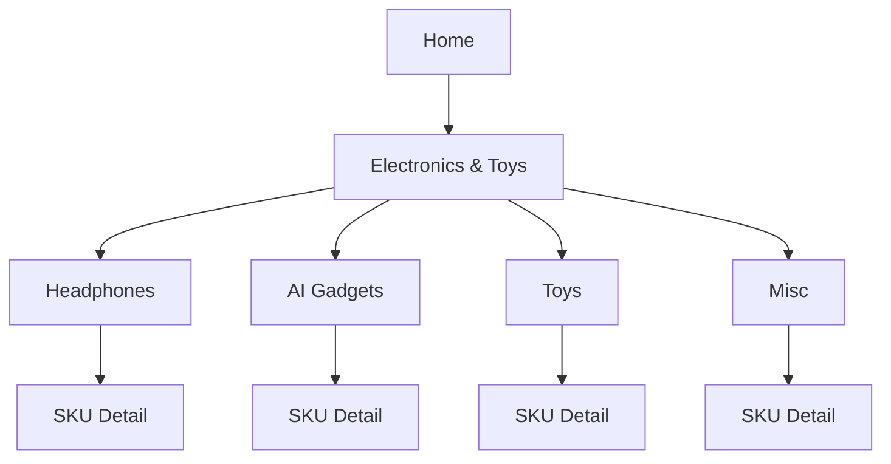
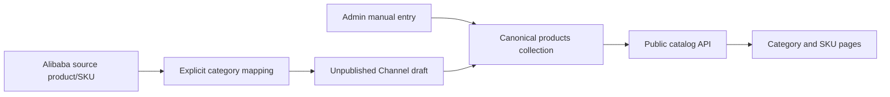

# Electronics & Toys Catalog Expansion

> 客户确认稿 · 2026-08-19
> 本文件定义需求与 UI 方向，不代表功能已经上线。

## 1. 确认结论

网站商品结构从目前单一的 Headphones 扩展为三级：

```text
Electronics & Toys
├── Headphones
│   ├── Office
│   ├── Bluetooth
│   └── Wired
├── AI Gadgets
├── Toys
└── Misc（公开名称待确认）
    └── SKU 商品
```

首期遵循以下规则：

1. 一条商品记录代表一个可独立发布的 SKU；颜色、尺寸等多规格变体留待后续。
2. 四个产品族使用同一套商品字段、卡片和详情页，不复制四套后台或 API。
3. Headphones 现有 Office / Bluetooth / Wired 保留为该产品族的子分类。
4. 每个 SKU 有独立、可分享、可被搜索引擎抓取的详情 URL。
5. 后台支持人工新增、编辑、发布和下架；未来 Alibaba 导入也写入同一个商品库。
6. Alibaba 只负责来源、价格和同步状态，不覆盖 Channel 人工维护的名称、文案、分类、图片、URL 和发布状态。

## 2. 用户与目标

### 公开网站访客

- 从顶部菜单快速进入 Electronics & Toys 或任一产品族。
- 浏览某产品族下的 SKU，并按可用子分类筛选。
- 打开独立 SKU 页面查看图片、型号、描述、MOQ、可公开价格和询盘入口。
- 在移动端与桌面端都能理解当前位置并返回上一级。

### 后台运营人员

- 在一个 Products 工作区管理全部商品。
- 使用 `All / Headphones / AI Gadgets / Toys / Misc` 快速切换产品族。
- 手工新增商品时继承当前 Tab 的产品族，减少重复选择。
- 区分人工可编辑字段和 Alibaba 只读来源字段。
- 安全地下架商品，不误删仍被公开页面或图片引用的记录。

## 3. 信息架构与 URL

### 推荐 URL

| 页面 | URL | 说明 |
|---|---|---|
| Electronics & Toys 总览 | `/electronics-toys/` | 四个产品族入口与精选 SKU |
| Headphones | `/headphones/` | 保留现有 canonical，不做迁移 |
| AI Gadgets | `/ai-gadgets/` | 新产品族页 |
| Toys | `/toys/` | 新产品族页 |
| Misc | `/misc/` | 名称确认后可调整显示文案；内部 key 保持 `misc` |
| SKU 详情 | `/products/{slug}/` | 稳定 URL，不因改产品族而变化 |

不采用 `/products/{family}/{slug}/`，因为商品未来可能被重新分类；稳定 SKU URL 可以避免重定向和 Alibaba 重新映射造成的链接变化。

### 页面层级



产品族页和 SKU 页都显示可见面包屑；SKU 页面示例：

```text
Home / Electronics & Toys / Headphones / WorkComm Mono
```

Headphones 的 Office / Bluetooth / Wired 是筛选条件，不额外进入面包屑，避免形成不必要的第四层 URL。

## 4. 公开网站 UI

### 4.1 桌面顶部菜单（Phase 1）

当前 Header 很紧凑，不把四个类别全部塞进顶栏。将单独的 `Headphones` 链接替换为一个可点击的 `Electronics & Toys` 菜单。

```text
┌──────────────────────────────────────────────────────────────────────────┐
│ CHANNEL      OEM Development   Electronics & Toys ▾   Success Stories   │
│                              ┌───────────────────────────────┐           │
│                              │ View all products          →  │           │
│                              ├───────────────┬───────────────┤           │
│                              │ Headphones    │ AI Gadgets    │           │
│                              │ Toys          │ Misc          │           │
│                              └───────────────┴───────────────┘           │
└──────────────────────────────────────────────────────────────────────────┘
```

交互要求：

- 点击、Enter 或 Space 打开；不依赖 hover。
- Escape、点击外部或焦点离开菜单时关闭。
- 使用 Escape 主动关闭时，焦点回到 `Electronics & Toys` 触发器；点击外部或正常 Tab 离开时保留用户选择的新焦点，不强制抢回。
- 当前产品族有清楚的 active 状态，但颜色不是唯一提示。
- 每个链接至少 44×44 px 可点击区域。

### 4.2 移动菜单（Phase 1）

沿用现有汉堡菜单，在其中加入一层 accordion，不做复杂的多级抽屉。

```text
┌──────────────────────────────┐
│ CHANNEL                  [×] │
├──────────────────────────────┤
│ OEM Development              │
│ Electronics & Toys       [−] │
│   All products               │
│   Headphones                 │
│   AI Gadgets                 │
│   Toys                       │
│   Misc                       │
│ Success Stories              │
│ Sign in                      │
└──────────────────────────────┘
```

- 展开 accordion 不写入浏览器历史；点击页面链接后 Back 正常返回上一页面。
- 菜单打开后焦点进入菜单，关闭后回到汉堡按钮。
- 汉堡按钮与每一行都达到 44×44 px。

### 4.3 Electronics & Toys 总览页（Phase 1 基础 UI）

该页不是营销 Landing Page，而是进入商品目录的工作入口。

Phase 1 只显示标题、简短介绍、询价入口和四个**无产品图**的分类入口。Headphones 标记为可浏览，其他三类标记为准备中；不显示 breadcrumb、Featured Products 或未批准的分类图片。

以下是客户确认分类与内容后的**后续完整版方向，不属于 Phase 1**：

```text
Breadcrumb

Electronics & Toys                         [Request a Quote]
Explore product families available for OEM / ODM development.

┌───────────────────────┐  ┌───────────────────────┐
│ Headphones            │  │ AI Gadgets            │
│ Image + short summary │  │ Image + short summary │
│ Browse category →     │  │ Browse category →     │
└───────────────────────┘  └───────────────────────┘
┌───────────────────────┐  ┌───────────────────────┐
│ Toys                  │  │ Misc                  │
│ Image + short summary │  │ Image + short summary │
│ Browse category →     │  │ Browse category →     │
└───────────────────────┘  └───────────────────────┘

Featured products
[SKU] [SKU] [SKU] [SKU]
```

- Phase 1 采用桌面 2×2、移动端单列，卡片只显示分类文字与状态。
- 后续只有在客户提供并批准分类图片、简介和 SEO 文案后，才升级成带图完整版。
- 没有正式商品或文案的产品族只显示准备中状态，并使用 `noindex,follow` 且不进入 sitemap。

### 4.4 产品族页（后续完整版；Phase 1 只保留现有 Headphones + 其他三类准备中页面）

Phase 1 不重构 Headphones 商品卡和详情交互，也不为其他三类伪造商品。Headphones 继续使用当前页面和本地 seed；AI Gadgets、Toys、Other 只显示标题、准备中说明和询价 CTA。

以下商品网格、真实详情链接和 URL 分页属于后续数据/API/SKU 阶段：

```text
Home / Electronics & Toys / Headphones

Headphones
Family-specific introduction and approved proof points.

[All] [Office] [Bluetooth] [Wired]          24 models

┌─────────────┐ ┌─────────────┐ ┌─────────────┐
│ image       │ │ image       │ │ image       │
│ Product     │ │ Product     │ │ Product     │
│ SKU code    │ │ SKU code    │ │ SKU code    │
│ Description │ │ Description │ │ Description │
│ MOQ / Price │ │ MOQ / Quote │ │ MOQ / Price │
│ View →      │ │ View →      │ │ View →      │
└─────────────┘ └─────────────┘ └─────────────┘

                    [Previous] 1 2 3 [Next]
```

- Headphones 显示现有三个子分类；其他产品族没有子分类时不显示空筛选栏。
- 商品卡片主操作改为真实 `<a>` 链接，不再只用按钮打开同页弹层。
- 缺少公开价格时显示 `Request a quote`，不显示 `$0`、空白或假价格。
- 分页必须有真实 URL；`Load more` 只能作为渐进增强。

### 4.5 SKU 详情页（后续阶段，不在 Phase 1）

```text
Home / Electronics & Toys / Headphones / WorkComm Mono

┌─────────────────────────┐  WorkComm Mono
│                         │  WC-15
│    Product gallery      │  Short product description
│                         │
└─────────────────────────┘  MOQ: 300 units
                             Price: $11.00 / Request a quote
                             [Request OEM Quote]

Product details
Series · Model type · Description · approved specifications

OEM / ODM options
Only approved, product-specific content

Related products
[SKU] [SKU] [SKU]
```

- 每个详情页有唯一 title、description、H1、canonical 和可见面包屑。
- 缺失字段直接隐藏相应区块，不虚构库存、评分、评论、保修或认证。
- Product/Offer Schema 只在服务端真实字段满足条件时输出。
- Slug 修改必须保留旧 slug 到新 URL 的单跳 301 映射。

### 4.6 页面状态

所有产品族页必须设计并测试以下状态：

| 状态 | UI 行为 |
|---|---|
| Loading | 保留卡片尺寸的 skeleton，不显示虚假商品信息 |
| 产品族暂无商品 | 显示产品族说明和询盘 CTA；不显示空网格 |
| 筛选无结果 | 显示 `No products match this filter` 和清除筛选按钮 |
| API/页面错误 | 显示重试操作；不无限停留在 `Loading…` |
| 分页失败 | 保留已加载商品，仅在分页控件旁提示并允许重试 |
| 图片缺失 | 沿用品牌化占位图，并保留固定宽高避免布局跳动 |

## 5. Admin UI（后续阶段，不在 Phase 1）

### 5.1 导航与列表

后台侧栏只保留一个 `Products` 入口，不能建立五个指向同一 collection 的侧栏项。产品族作为工作区内部 Tab。

```text
┌───────────────┬──────────────────────────────────────────────────────┐
│ Dashboard     │ Products                              [New product] │
│ Products  ●   │                                                      │
│ Overstock     │ [All] [Headphones] [AI Gadgets] [Toys] [Misc]       │
│ OEM Requests  │                                                      │
│ Alibaba Sync  │ [Search products____________] [Filters] [Status ▾]  │
│               │                                                      │
│               │ □ Image  Product / SKU  Family  MOQ  Status Actions │
│               │ □ ...                                               │
└───────────────┴──────────────────────────────────────────────────────┘
```

- 默认进入 `All`；Tab 状态写入 URL query，刷新与浏览器 Back 后仍可恢复。
- 切换 Tab 时重置页码并清空批量选择，避免操作不可见商品。
- 搜索、筛选、排序和分页始终叠加当前产品族条件。
- `All` 可跨产品族搜索；首期批量发布/下架限制在当前 Tab，批量硬删除不提供。
- 可选增强：Tab 显示总数，但必须来自独立聚合数据，不能用当前页数量推算。

### 5.2 新建与编辑

```text
New product

Classification
Product family *   [Headphones ▾]
Subcategory        [Office ▾]

Identity
Product name *     [________________]
SKU code *         [________________]
URL slug *         [________________]

Merchandising
Series             [________________]
Model name/type    [________________]
Description *      [________________]
Images *           [Image manager]

Commercial
MOQ                [________]
Public price       [________] or Request a quote

Source (read-only when linked)
Alibaba status · source · last synced at

[Save draft]                            [Publish]
```

行为规则：

- 从某产品族 Tab 点击 New product 时预填该产品族；从 All 新建时先选择产品族。
- 改产品族时，若现有子分类不适用则清空并提示。
- 商品移动到其他产品族后，保存成功提示其将出现在另一个 Tab。
- 新商品默认草稿。发布前至少要求名称、SKU code、slug、产品族、描述和主图。
- 人工字段与 Alibaba 只读字段视觉分组，禁止把同步字段伪装成普通输入框。
- 已发布 SKU 先下架/归档，不在普通编辑流中硬删除。
- 本次新建/编辑表单不显示 `vipPrice`；不设计 VIP 申请、审批、升级或会员价格入口。

### 5.3 Admin 移动端

- 小屏将固定侧栏替换为顶部 section selector。
- 产品族 Tab 可横向滚动；375 px 下也可降级为原生 select。
- 宽表格改为精简行/卡片，页面整体不得横向溢出。
- 新建/编辑使用可访问 dialog：焦点锁定、Escape 关闭、错误播报、首个错误聚焦、关闭后焦点恢复。

## 6. 商品数据设计（后续阶段，内部建议，待确认）

> 说明：`productFamily` 不是当前系统或 Alibaba 分支已有的字段，是本次为了同时表达“四个产品大类”和“Headphones 内部分类”提出的建议名称。实施前可以调整字段名，但需要保留这两个独立层级。

### 6.1 统一商品记录

| 字段 | 首期规则 | 所有权 |
|---|---|---|
| `productFamily`（暂定名称） | 建议新增；必填：`headphones / ai-gadgets / toys / misc` | Channel 人工维护；Alibaba 仅通过明确映射设置草稿初值 |
| `category` | 保留现字段，UI 标为 Subcategory；Headphones 可用 `wired / office / bluetooth` | Channel 人工维护 |
| `skuCode` | 必填、唯一、稳定的客户可见 SKU 编码 | Channel 人工维护 |
| `slug` | 必填、唯一；用于 `/products/{slug}/` | Channel 人工维护 |
| `name` | 必填 | Channel 人工维护 |
| `series / modName / modType` | 继续沿用 | Channel 人工维护 |
| `description` | 发布前必填 | Channel 人工维护 |
| `imageIds` | 继续沿用；发布前至少一张主图 | Channel 人工维护 |
| `moq / unitPrice / wholesalePrice` | 手工商品可继续维护；公开页面只显示允许公开的价格或 `Request a quote` | Channel 人工维护 |
| `vipPrice` | **Deprecated**：本次前台和后台表单均不使用；底层字段暂时保留，避免破坏旧数据，Alibaba 接入稳定后另行删除 | 仅旧数据兼容，不接受新录入 |
| `published` | 新建默认 false | 现有发布权限，待客户确认是否增加审批 |
| `alibaba*` | 保持 provider-prefixed、只读、可解除关联 | 同步服务维护 |

为降低与 Alibaba 分支合并难度，首期不强制把数据库字段 `category` 重命名为 `subcategory`。只在产品概念和 UI 中明确它是三级子分类；建议新增一个独立字段承载四个二级产品族，`productFamily` 只是本稿中的暂定技术名称。

### 6.2 VIP 价格退场规则

- 本次分类扩展不实现或延续 VIP 价格体验。
- 前台商品卡、分类页和 SKU 页不显示 VIP 价格，也不显示 `Sign in to view VIP price` 等引导。
- 新分类页面不读取 `member` 角色来决定价格展示。
- Admin 商品新建/编辑表单隐藏 `vipPrice`，不允许新增或修改该值。
- 数据库/API 中的旧 `vipPrice` 字段暂时保留为 deprecated，仅为了不破坏历史记录和 Alibaba 尚未接管的旧路径。
- Alibaba 价格接入稳定并完成旧数据确认后，另开清理任务永久删除已经隐藏/停用的 VIP 前台代码、角色权限判断、API 投影和底层字段。

### 6.3 Alibaba 兼容边界



必须保持：

- 未映射的 Alibaba 类目不创建 Channel 商品，也不自动归入 Misc。
- 导入只创建草稿，不自动发布。
- 人工名称、描述、slug、产品族、子分类、图片和发布状态优先，后续同步不得覆盖。
- Alibaba 来源商品、offer、同步记录和分类映射继续保存在独立集合。
- Storefront 只消费统一公开商品 contract，不读取 Alibaba 原始 payload、source category 或 source ID。
- 同步移除或解除关联后，SKU URL 与人工内容保持不变。

## 7. SEO / GEO 兼容规则

1. 所有公开 URL 使用 trailing slash，并在 sitemap、canonical 和内部链接中保持一致。
2. `/headphones/` 保留，不为分类扩展制造旧页迁移。
3. Phase 1 新分类路由只用于本地/受控测试预览，使用 `noindex,follow` 且不进入 sitemap；客户确认名称和 URL 前不发布到生产。
4. 每页一个可见 H1；title ≤ 60 字符，description ≤ 160 字符。
5. Phase 1 不增加 breadcrumb 或 `BreadcrumbList`，等 SEO metadata 分支落地且客户确认层级后统一接入。
6. Product/Offer Schema 只使用真实、已发布、可公开字段；Phase 1 不新增 Product/Offer Schema。
7. `lastmod` 只能来自经过审核的内容更新时间，不使用 build time 或 Alibaba sync time。
8. 目前只设计英文路由和内容。没有批准的翻译页面前，不添加 hreflang。
9. SKU URL、下架后的 sitemap/Schema 行为和永久移除策略均属于后续阶段。

## 8. 范围边界

### Phase 1 包含

- 桌面和移动端 Electronics & Toys 菜单改造。
- Electronics & Toys 总览页基础 UI。
- AI Gadgets、Toys、Other Electronics & Toys 的真实“准备中”页面状态。
- 现有 Headphones 页面和本地六条 seed 商品的 UI 验证。
- 前台隐藏 VIP 价格和登录解锁 VIP 的文案。
- 响应式、键盘、触屏、无 JavaScript 和基础错误/图片缺失状态验证。

### Phase 1 不包含

- `productFamily`、数据库迁移、API family filter 或 Alibaba mapping。
- Admin 产品族 Tab、商品表单、发布权限、删除或批量操作改造。
- SKU 独立详情路由、slug、redirect、永久 URL 或 Product Schema。
- Breadcrumb/`BreadcrumbList`；它们随 SEO metadata 集成后续处理。
- 购物车、支付、订单、库存、多规格、比较、收藏、评分或评论。
- VIP 字段、API、角色、Admin 或 Alibaba 兼容逻辑的永久删除。
- AI Gadgets、Toys、Other 的虚构 SKU 或未获客户批准的产品资料。

## 9. 验收标准

### Phase 1 验收

- [ ] 顶部菜单在键盘、鼠标和触屏下都能进入四个产品族，且不依赖 hover。
- [ ] `/headphones/` 保持现有 canonical；四个新增预览路由使用 trailing slash、`noindex,follow` 且不进 sitemap。
- [ ] Headphones 的 Office / Bluetooth / Wired 只作为子分类筛选，不和四个产品族混用。
- [ ] 现有本地 seed 的六个 Headphones 商品、三个子分类、详情展开和返回焦点行为保持可用。
- [ ] AI Gadgets、Toys、Other 页面不伪造商品，只显示准备中状态和 OEM 询价入口。
- [ ] Headphones 覆盖 loading、初始错误/重试、空数据、分页失败和图片缺失状态。
- [ ] 新分类页面和活跃 Headphones/Auth 展示不出现 VIP 价格或登录解锁 VIP 的入口。
- [ ] 375 / 768 / 1024 / 1440 px 无不合理横向滚动、文字重叠或操作目标过小。
- [ ] 页面通过键盘焦点、Escape、44×44 px target 和 reduced-motion 检查。

### 后续阶段验收（不阻塞 Phase 1）

- [ ] 每个已发布 SKU 可通过批准的稳定 URL 独立打开，并输出真实服务端内容。
- [ ] 可见 breadcrumb 与 `BreadcrumbList` 在 SEO metadata 集成阶段表达相同层级。
- [ ] Admin 提供 `All + 四产品族` Tab；Tab 与搜索/筛选/分页组合结果正确。
- [ ] Admin 商品表单隐藏 `vipPrice` 并停止新录入；底层旧字段仅兼容历史数据。
- [ ] 新建 SKU 默认草稿，缺少发布必填字段时不能发布。
- [ ] 已发布 SKU 不能在普通列表中直接硬删除，需先下架/归档。
- [ ] Alibaba 导入不覆盖人工内容、不自动发布、不把未映射商品放入 Misc。

## 10. 客户待确认

推荐默认值已经写入 [CLIENT_CONFIRMATION.md](CLIENT_CONFIRMATION.md)，客户只需对有异议的项目标注修改。
