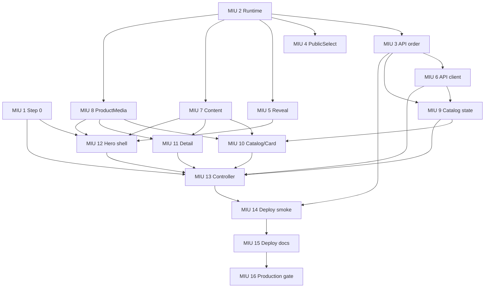

# Home Form And Headphones UI Repair - MIU Breakdown

> Phase 4 tracked implementation contract. G3/G4 are approved and implementation is in progress.
> The repository-level phased-execution rule still requires an approval after every implementation
> phase listed below.

## Current Status And Resume Boundary

- G1 requirements, G2 UI design, G3 architecture, and G4 test plan are approved. The user's
  2026-07-30 instruction to correct the reviewed screens and begin implementation is the gate
  transition recorded in the canonical execution log.
- The P0 visibility slice is already committed/deployed at `741b0af`: asynchronous Headphones
  groups no longer use `.reveal`, and browser coverage proves visible cards plus basic detail
  open/return. Do not reimplement or revert that slice.
- MIU 5 below now means **site-wide reveal hardening only**. Its Headphones assertion protects the
  deployed P0; the runtime Headphones wrappers must remain free of `.reveal`.
- The SY-T8 18-image publication was operational evidence rather than MIU 8 completion. MIU 8 now
  owns completed Gallery sizing, four-preview `View All`, fallback, selected/disclosure focus, and
  request budgets. Detail-heading focus and Back-to-origin focus remain pending in MIU 13.
- Current per-MIU status is owned by the tracked execution log and Git history; this breakdown
  defines scope, order, and acceptance criteria rather than duplicating progress state.
- MIU 14 implementation exists across `ce19963` + `27c70c0`; MIU 15 at `3feeb60`; MIU 16 at `26a636a`.
  Treat them as pre-existing complete implementations whose assertions/docs must be revalidated
  after the assembled change. Edit them only if that revalidation exposes a real delta.
- `docs/home-form-headphones-ui-fix/home-form-headphones-ui-fix-execution.md` is the canonical
  tracked status source. It is seeded with P0 and the three pre-existing deployment checkpoints;
  `doc-writer` updates it at every remaining MIU boundary.

## Mandatory Execution Prelude For Every MIU

This section extends the mandatory 8-field MIU format with an executable technology/best-practice
gate. It does not replace `/dev-pipeline:implement`; it makes that command's STEP 0-4.5 requirements
visible in the handoff.

Before the first edit of each MIU, the executor must:

1. Run the current feature breakdown through
   `validate-miu-breakdown.sh`; a malformed MIU is fixed here, never improvised in code.
2. Reconcile status against the tracked execution doc plus git history. Local `.claude/*.json` is
  only a pointer.
3. If `.claude/project-context.json` is absent in a fresh clone, rerun the project detector to
  regenerate it; then read it and invoke `skill-router`. Create/append local
  `.claude/agent-events.jsonl` with the selected/absent sources as required by the router. Neither
  local file is durable feature evidence.
4. Load every matching installed best-practice source **before writing code**. For this feature:
  - any `.tsx` React MIU: pinned invocation `vercel:react-best-practices` (the VS Code-discovered
    wrapper is named `vercel-react-best-practices`);
   - reusable component/API design: `vercel-composition-patterns`;
   - visible UI/CSS/Astro surface: `ui-ux-pro-max` plus the current
     `web-design-guidelines` audit source;
   - frontend async state, Tailwind breakpoints, media, or E2E selectors: the matching
     `engineering-craft` catalog group;
   - protected media, CloudBase function, or refcount behavior: `cloudbase` and the repository's
     CloudBase contract gate;
   - unit/integration/browser tests: `nodejs-testing` plus current Playwright docs/tooling.
5. For pinned missing sources, use the recorded fallback rather than silently skipping:
   - `astro-idioms` -> current Astro 6 docs through Context7;
   - `typescript-best-practices` -> current TypeScript docs through Context7 and strict checks;
   - `playwright-e2e` -> current Playwright docs/tooling;
   - TanStack Query/Tailwind changes -> current package docs through Context7.
6. Read only the detailed rule files named for that MIU in the matrix below. Record
   `applied`, `not applicable`, or `rejected with reason` in the tracked execution log. Loading a
   skill without applying or explicitly rejecting its relevant rules does not satisfy this gate.
7. Write the failing focused test first, implement only the approved files/contract, and run the
  narrowest executable check. After the diff exists, run assumption-checker and load
  `cross-file-reasoning` for the seven mandatory boundary traces before marking the MIU complete.

There is no separate `/dev-pipeline:technology` command in the installed plugin. The authoritative
technology mechanism is `skill-router` plus `/dev-pipeline:implement` STEP 0/1. This breakdown names
their required outputs so execution remains safe even in a fresh session.

### React And Frontend Practice Policy

Apply rules by evidence, not by fashion:

- Derive values during render; do not mirror props/current state into effects
  (`rerender-derived-state-no-effect`).
- Put interaction-specific state changes in event handlers, not effects
  (`rerender-move-effect-to-event`).
- Use primitive/narrow effect dependencies and abort stale async work
  (`rerender-dependencies`, frontend-async-state stale-closure rules).
- Keep pointer/transient DOM values in refs when they must not render. In this design automatic
  pointer tracking is removed, so no replacement tracker should be added
  (`rerender-use-ref-transient-values`).
- Use `Set`/`Map` for repeated ID membership/lookups and immutable reducer updates
  (`js-set-map-lookups`, `js-tosorted-immutable` where sorting is actually needed).
- Render gallery/list content only after user intent through ordinary conditional rendering.
- Do **not** add `memo`, `useMemo`, or `useCallback` by default. This repository has no verified
  React Compiler configuration; measured render cost and existing team style decide.
  `rerender-simple-expression-in-memo` explicitly rejects memoizing simple primitive work.
- Do **not** import Next.js/RSC/Suspense-server patterns into this Astro static + React-island page.
  The applicable boundary is static Astro shell, `client:load`, browser effects, and stable HTML.
- Mark `bundle-conditional` and `rendering-content-visibility` **not applicable** for the approved
  implementation: Gallery is conditionally rendered in the existing bundle, and 12 cards/18
  thumbnails do not justify chunking or content-visibility without new profiling evidence.
- Do **not** add SWR/TanStack migration, virtualization, image transforms, or dependencies without
  measured need and an approved architecture change. Twelve-card pages and eighteen conditional
  thumbnails are below the current virtualization threshold.

### Exact Skill And Rule Registry

The matrix below uses these exact IDs. The executor opens the named path before editing the MIU;
category/skill landing pages alone are insufficient.

| ID | Pinned invocation / exact source |
|---|---|
| `VR-derived` | `vercel:react-best-practices` -> `rules/rerender-derived-state-no-effect.md` |
| `VR-event` | `vercel:react-best-practices` -> `rules/rerender-move-effect-to-event.md` |
| `VR-deps` | `vercel:react-best-practices` -> `rules/rerender-dependencies.md` |
| `VR-functional` | `vercel:react-best-practices` -> `rules/rerender-functional-setstate.md` |
| `VR-ref` | `vercel:react-best-practices` -> `rules/rerender-use-ref-transient-values.md` |
| `VR-memo` | `vercel:react-best-practices` -> `rules/rerender-simple-expression-in-memo.md` |
| `VR-map` | `vercel:react-best-practices` -> `rules/js-set-map-lookups.md` |
| `VR-conditional` | `vercel:react-best-practices` -> `rules/rendering-conditional-render.md` |
| `VC-variants` | `vercel-composition-patterns` -> `rules/patterns-explicit-variants.md` |
| `VC-booleans` | `vercel-composition-patterns` -> `rules/architecture-avoid-boolean-props.md` |
| `EC-async` | `engineering-craft` -> `categories/frontend-async-state/rules/orphan-promise-and-stale-closure.md` |
| `EC-css` | `engineering-craft` -> `categories/frontend-design-system-drift/rules/silent-css-class-vacuum.md` |
| `EC-aria` | `engineering-craft` -> `categories/accessibility-state-sync/rules/aria-lockstep-and-viewport-clamp.md` |
| `EC-e2e` | `engineering-craft` -> `categories/e2e-test-resilience/rules/selector-coupling-and-blast-radius.md` |
| `EC-grep` | `engineering-craft` -> `categories/grep-for-siblings/rules/api-rename-cross-cut-grep.md` |
| `EC-config` | `engineering-craft` -> `categories/config-drift/rules/env-deploy-parity-test.md` and `rules/validator-runbook-parity.md` |
| `EC-build` | `engineering-craft` -> `categories/process/rules/build-validation-before-commit.md` |
| `EC-deploy` | `engineering-craft` -> `categories/process/rules/post-merge-deploy-verification.md` |
| `EC-review` | `engineering-craft` -> `categories/workflow/rules/self-review-before-push.md` |
| `NT-factory` | `nodejs-testing` -> `rules/test-factory-pattern.md` and `rules/test-complete-mocks.md` |
| `NT-behavior` | `nodejs-testing` -> `rules/test-no-implementation-details.md`, `rules/test-edge-cases.md`, and `rules/test-async-errors.md` |
| `CTX-Astro` | missing `astro-idioms` -> Context7 current Astro 6 docs |
| `CTX-TS` | missing `typescript-best-practices` -> Context7 current TypeScript docs + strict checks |
| `CTX-PW` | missing `playwright-e2e` -> current Playwright docs/tooling |

### Per-MIU Technology And Best-Practice Matrix

| MIU | Required sources/rules before edit | Concrete technical decisions to apply | Explicit non-goals / evidence |
|---:|---|---|---|
| 1 | `CTX-TS`, `EC-grep`, `EC-build`, `EC-review` | Prove each symbol dead across direct use, strings, tests, and route content; behavior-preserving cleanup only | No component redesign or formatting churn; separate cleanup commit |
| 2 | `CTX-TS`, `EC-config`, `EC-build` | Trace root engine -> CI site build and CloudBase function runtime as separate consumers; executable parity test | Never derive function runtime from root `engines`; no dependency upgrade |
| 3 | `CTX-TS`, `NT-factory`, `NT-behavior`, `cloudbase` | Contract-source ordering; explicit `_id asc`; typed 55-item factory; role/projection negatives; package/cold-start artifact proof | No response-shape change, new index, or snapshot-consistency claim |
| 4 | `CTX-Astro`, `EC-css`, `EC-aria`, `EC-e2e`, ui-ux-pro-max, web-design-guidelines | One real native control; semantic label/name/required/form; capability-gated `base-select`; 44px options; visible focus; no-JS/native fallback | No React island, duplicate hidden input, page-local listbox, or new library |
| 5 | `EC-css`, `EC-e2e`, `CTX-PW`, web-design-guidelines | Default-visible global reveal; reduced-motion; observer/no-JS failure safety; preserve deployed Headphones `.reveal` removal | Do not re-open P0 or add MutationObserver; no permanent opacity-zero path |
| 6 | `CTX-TS`, `NT-behavior` | Forward optional `AbortSignal`, read current token per call, preserve `CatalogPage`, normalize media URLs, expose abort rejection | Effect dependencies/generation guards belong to MIU 13; no retry, preload, or data-library migration |
| 7 | `CTX-TS`, `CTX-Astro`, ui-ux-pro-max | One typed content source; exact image provenance; no absolute URL/bytes; content ownership tests | No route-local copy duplication or new proof/advantage content |
| 8 | `VR-derived`, `VR-event`, `VR-ref`, `VR-memo`, `VR-conditional`, `VC-variants`, `EC-async`, `EC-aria`, `EC-e2e`, `CTX-PW`, ui-ux-pro-max, web-design-guidelines | Pure fallback reducer; derive active source; stable 520px `object-contain`; selected/focus states; four lazy previews; inline `View All`; no pointer state | No hover pan, modal, dynamic import, image variants, retries, or memoization without profiler evidence |
| 9 | `VR-derived`, `VR-functional`, `VR-map`, `CTX-TS`, `NT-factory`, `NT-behavior` | Pure reducer; functional immutable updates; `Set`/`Map` dedupe; generation rejects stale commits; derive `hasMore` | No effect-maintained derived state, global store, or snapshot promise |
| 10 | `VR-derived`, `VR-conditional`, `VR-memo`, `VC-variants`, `VC-booleans`, `EC-aria`, `EC-e2e`, ui-ux-pro-max, web-design-guidelines | Explicit loading/error/empty/success components; semantic button; stable media/text tracks; live regions; busy Load More | No boolean-prop matrix, duplicated product/pricing logic, or `.reveal` |
| 11 | `VR-conditional`, `VC-variants`, `VC-booleans`, `EC-aria`, ui-ux-pro-max, web-design-guidelines | Presentational detail API; focusable heading; semantic Back; enquiry anchors use `OEM_INQUIRY_HREF`; compose Gallery | No modal, login gate, local InquiryForm, or simulated durable success |
| 12 | `CTX-Astro`, `VR-conditional`, `EC-css`, `EC-e2e`, `cloudbase`, ui-ux-pro-max, web-design-guidelines | SSR-discoverable hero; only hero high priority; ordered gated fallback; intrinsic geometry; exact mobile order; remove static bands | No `client:only`, copied bytes, second catalog fetch, decorative halo/frame, or RSC pattern |
| 13 | `VR-derived`, `VR-event`, `VR-deps`, `VR-functional`, `VR-ref`, `VR-map`, `VC-variants`, `EC-async`, `EC-aria`, `EC-e2e`, `CTX-PW` | Thin controller; abort stale requests; narrow dependencies; generation guards; event-driven detail/Load More; focus origin ref; 12-item pages | No monolith recreation, effect-derived state, automatic retries, or hidden gallery mounting |
| 14 | `NT-behavior`, `EC-build`, `EC-deploy` | **Pre-existing across `ce19963` + `27c70c0`:** rerun `/headphones` 200, `/overstock` 404, no-tautology, body-drain, release/runtime smoke; edit only on red | No invented exactly-once source-test claim or site-only deploy assumption |
| 15 | `EC-build`, `EC-deploy` | **Pre-existing at `3feeb60`:** revalidate current deployment docs against smoke and gated media topology | Do not rewrite dated historical OEM records |
| 16 | `EC-build`, `EC-deploy` | **Pre-existing at `26a636a`:** revalidate canonical production gate and superseded-history wording | Documentation only; no mutation unless drift is proven |

### Visual And Performance Verification Contract

- This tracked section is the portable visual/performance contract: it names every required state,
  viewport, request budget, media limit, and follow-up threshold without depending on local design
  artifacts.
- Every UI MIU must run focused behavior tests; assembled UI then runs
  `/dev-pipeline:verify-visual` against **all** spec states, not only the default success screen.
- Required captures: Product Category default/focus/open/invalid/native fallback; hero desktop and
  390px mobile; catalog loading/error/empty/success/load-more-error; detail collapsed/compact/View
  All/fallback; reduced motion; keyboard focus cycle.
- Performance work is bounded and evidence-driven: one 12-item catalog request, abort stale calls,
  one primary card image each, no gallery before detail, active + at most four previews before
  View All, native lazy loading/async decode, stable dimensions, and only hero high priority.
- Record browser resource requests and transferred bytes at 390px and 1440px. If the measured page
  still misses the LCP budget after these changes, open a separate image CDN/variant decision; do
  not hide infrastructure work inside a UI MIU.

### Per-MIU Test Deployment Loop

The user approved implementation with an inspectable test result after each MIU. For every
runtime-affecting MIU:

1. write the red test, implement, simplify, run focused validation, assumption/cross-file checks,
  and review the exact diff;
2. create one MIU-specific commit only after that cycle is green;
3. fast-forward or otherwise land that exact reviewed SHA on the allowlisted `test` branch without
  mixing the next MIU;
4. wait for Deploy Test to finish, require the deployed health release ID to match the reviewed
  SHA, and run the MIU's narrow public/browser smoke;
5. report the custom-domain URL and visible change so the user can inspect it before the next
  visible MIU starts.

Pure tests/docs/revalidation MIUs do not manufacture a deployment; they still receive an isolated
commit and validation record. A contract-only runtime MIU may produce no visible pixel difference,
but its exact SHA still lands on test and the report says that explicitly. A failed deployment or
smoke blocks the next MIU.

## Level 1 Product Tasks

1. Give Product Category one reusable, intentional public-form control on the homepage and `/oem`.
2. Restore a visible, complete-on-demand Headphones product catalog without changing role visibility or VIP entitlement.
3. Replace the Headphones hero placeholder with reviewed gated product media and remove duplicated marketing/proof sections.
4. Make product media, async states, detail focus, and persistent OEM enquiry navigation resilient.
5. Preserve `/headphones` deployment acceptance and verify affected published-image references read-only without weakening the media gate or mutating historical drift.
6. Align the site build engine with the locked Astro toolchain while retaining the separately configured CloudBase function runtime.

## Module Breakdown

- **Infrastructure:** Node build-floor declaration and CloudBase runtime separation.
- **Public form:** reusable styled-native select and shared ProjectForm integration.
- **Animation safety:** default-visible site reveal behavior.
- **Public catalog API:** stable page ordering with unchanged projection and entitlement.
- **Storefront client:** abortable page requests, media fallback, and deterministic Load More state.
- **Headphones content and shell:** typed copy/provenance, gated hero media, responsive composition, and focused route content.
- **Headphones island:** catalog/card/detail presentation, pagination, focus lifecycle, and persistent enquiry links.
- **Deployment:** current route smoke and portable deployment documentation.

## Technical MIUs

## MIU 1: Headphones dead-surface Step 0 cleanup

Block: FRONTEND

Files: apps/site/src/islands/shop/HeadphonesPage.tsx, apps/site/src/pages/headphones.astro, apps/site/src/headphones-source-contract.test.ts

Type: refactor

Depends on: none

What it does:
- Removes only the unused `PageStrings` declarations `heroEyebrow`, `heroHeading`, `heroBody`, `heroBadges`, `detailHeading`, and `unitPriceLabel`, plus their dead `pageStrings` entries where present.
- Leaves every rendered section, fetch, pricing branch, media URL, and enquiry behavior unchanged; this is the mandatory cleanup before structural edits to both files over 300 LOC.

Build/Deploy/Runtime impact:
- Site source only; no dependency, route, payload, build command, or runtime behavior changes.
- This cleanup is a mandatory separate commit and does not deploy independently.

Test plan (TDD - write FIRST):
- Add one failing source-contract assertion that rejects the four unused hero keys in the `HeadphonesPage.tsx` `PageStrings` interface, and a second failing assertion that rejects `detailHeading`/`unitPriceLabel` from both the interface and route-local `pageStrings` object.
- Mechanically prove each deleted symbol has no consumer in direct references, strings, tests, or route content; then run the existing site tests, Astro check, and Biome before and after.

Done when:
- The two files contain none of the proven dead declarations and no unrelated line is changed.
- `pnpm --filter @vibelingan-channel/site test`, `pnpm --filter @vibelingan-channel/site typecheck`, and focused Biome checks pass.

## MIU 2: Node build-floor and function-runtime contract

Block: INFRASTRUCTURE

Files: package.json, scripts/runtime-contract.test.mjs

Type: modify-existing + new-test

Depends on: none

What it does:
- Changes the root development/build engine to `node >=22.12.0`, matching lock-resolved Astro 6.4.6 rather than the stale `>=20.0.0` claim.
- Registers a root test that verifies CI Node 22.13 satisfies the build floor while `scripts/deploy-cloudbase-test.mjs` independently keeps the function runtime default `Nodejs20.19`.

Build/Deploy/Runtime impact:
- Changes package-manager engine eligibility for local and CI site builds; developers below Node 22.12 receive an explicit incompatibility.
- Does not change CloudBase function code or runtime. Existing deploy smoke remains the runtime authority after assembled deployment.

Test plan (TDD - write FIRST):
- Add a failing test asserting root `engines.node` is `>=22.12.0` and every site-build workflow Node version satisfies it.
- Assert the CloudBase deploy script still defaults function runtime to `Nodejs20.19`; fail if root engine is reused as the function runtime.

Done when:
- The runtime-contract test is part of `pnpm test:deploy-smoke` or another root test script executed by CI and passes.
- Install, repository typecheck, function package/artifact smoke, and site build pass on Node 22.12+ without modifying CloudBase runtime configuration.

## MIU 3: Stable public catalog page ordering

Block: BACKEND

Files: apps/functions/public-api/src/handler.ts, apps/functions/public-api/src/http-adapter.test.ts

Type: modify-existing

Depends on: MIU 2

What it does:
- Adds explicit `_id asc` ordering to existing published catalog list queries while preserving the `{items,total,page,pageSize}` response envelope.
- Leaves public field allowlisting, current-user row revalidation, Authorization variance, image URL projection, and `vipPrice` attachment rules unchanged.

Build/Deploy/Runtime impact:
- Changes the `public-api` function artifact and user-visible default ordering; no schema, index, route, environment variable, or response-shape change.
- The function is packaged and smoke-tested after this MIU, then deployed only with the assembled release because the current deploy flow deploys both functions and the site together.

Test plan (TDD - write FIRST):
- Add a failing 55-item fixture assertion that page 1 and page 2 are individually `_id asc` and concatenate to the full stable fixture set.
- Assert anonymous/viewer/member/contributor/admin published IDs remain equal for a response, and only currently entitled member/contributor/admin bodies contain `vipPrice`.

Done when:
- Public API tests and function typecheck pass, including existing suspension, demotion, revocation, cache, and projection negatives.
- Function packaging and cold-start artifact smoke pass without a new CloudBase resource or index contract.

## MIU 4: PublicSelect and ProjectForm native integration

Block: FRONTEND

Files: apps/site/src/components/form/PublicSelect.astro, apps/site/src/components/ProjectForm.astro, tests/e2e/public.spec.ts

Type: new-file

Depends on: MIU 2

What it does:
- Adds a reusable Astro component that renders exactly one visible native select with typed options, label association, `name`, `required`, `form`, hint/error references, branded closed-control styling, and a decorative chevron.
- Uses capability-gated customizable-select CSS (`base-select`, picker, open and selected states) where supported; unsupported browsers retain the classic native picker without JavaScript or duplicate controls.
- Replaces ProjectForm's inline select branch while preserving literal `Other`, `form.elements` serialization, validation/reporting, direct COS upload, and `submitProject` payload behavior for both consumers.

Build/Deploy/Runtime impact:
- Site build and deployment only; no JavaScript dependency, lockfile, backend, payload, or route change.
- Without JavaScript the select remains visible, labelled, and selectable; the existing JSON/upload form submission remains JavaScript-dependent.

Test plan (TDD - write FIRST):
- Add failing Playwright assertions on homepage and `/oem` for one visible labelled `category` select, literal `Other`, required validation focus, and platform-native option selection.
- Assert JavaScript-enabled submission serializes exactly one category value; with JavaScript disabled assert only control visibility/selection, not form submission.

Done when:
- Focused Playwright form tests, site tests, Astro check, Biome, and site build pass.
- Existing OEM upload spec can still use `selectOption('Headphones')` and the secure upload/submission source contracts remain intact.

## MIU 5: Default-visible reveal animation contract

Block: FRONTEND

Files: apps/site/src/styles/global.css, tests/e2e/public.spec.ts

Type: modify-existing

Depends on: MIU 2

What it does:
- Makes `.reveal` visible by default and moves opacity/translation into an optional one-time animation applied only after observer registration.
- Keeps the current one-time IntersectionObserver and explicitly adds no MutationObserver, so late client content and no-JavaScript content cannot remain transparent.

Build/Deploy/Runtime impact:
- Site-wide CSS behavior changes for every reveal consumer; no persistent observer, dependency, or backend change.
- Reduced-motion users receive immediately visible content with no reveal animation.

Test plan (TDD - write FIRST):
- Add a failing browser assertion against a static `.reveal` consumer with `IntersectionObserver` unavailable; it must compute to opacity 1 before any observer class mutation.
- Keep the deployed Headphones computed-visibility assertion as an already-green P0 regression, then disable JavaScript and emulate reduced motion in separate checks for representative static reveal content and horizontal overflow.

Done when:
- Focused visibility tests pass in normal, no-JavaScript, observer-unavailable, and reduced-motion modes.
- Site tests, Astro check, Biome, and production build pass without a MutationObserver implementation.

## MIU 6: Abortable catalog page client

Block: FRONTEND

Files: apps/site/src/islands/shop/api.ts, apps/site/src/islands/shop/api.test.ts, apps/site/src/test/factories/catalog.ts

Completed implementation note: `apps/site/src/lib/api-url.ts` and `apps/site/package.json` were
required as reviewed deviations for Node test imports and shell-independent nested test discovery;
the execution log retains that exact five-file historical result.

Type: modify-existing + new-test

Depends on: MIU 3

What it does:
- Extends `fetchCatalog` with an optional AbortSignal while retaining explicit `page` and `pageSize` query parameters and the existing `CatalogPage` client type.
- Forwards the current session token on each request and preserves media URL normalization; it does not invent a shared DTO or snapshot contract.
- Consumes the existing `/api/products` `{items,total,page,pageSize}` envelope maintained by `apps/functions/public-api/src/handler.ts`; MIU 6 must not guess or redefine the backend shape.

Build/Deploy/Runtime impact:
- Site bundle only; no dependency or wire-shape change.
- Superseded controller requests can be aborted before their result commits.

Test plan (TDD - write FIRST):
- Mock fetch and assert page 2/page size 48 produce the exact query, forward the AbortSignal, and normalize returned image URLs.
- Change mocked session storage between calls and assert Authorization changes; abort a request and assert no successful catalog result is returned.

Done when:
- API unit tests, site tests, Astro check, and Biome pass.
- Existing ProductGrid and detail callers compile with the optional signal addition.

## MIU 7: Typed Headphones content and gated hero provenance

Block: FRONTEND

Files: apps/site/src/i18n/headphones.ts, apps/site/src/i18n/content/headphones/en-US.md, apps/site/src/i18n/headphones-content.test.ts

Type: modify-existing + new-test

Depends on: MIU 2

What it does:
- Expands the Headphones content contract with hero/proof, loading/error/retry/empty/load-more, detail navigation, and persistent OEM CTA copy.
- Stores one product identity plus an ordered set of three reviewed gated image IDs, 800x800 dimensions, and SHA-256 provenance; stores no bytes and no absolute service URL.

Build/Deploy/Runtime impact:
- Site content/build only; hero bytes continue through the existing gated public image route.
- No API, schema, environment variable, or static media asset is added.

Test plan (TDD - write FIRST):
- Add failing source-of-truth assertions for the exact ordered image IDs, product identity, dimensions, and all three source SHA-256 values.
- Assert required retry/load-more/empty/CTA copy exists and no advantage, quality, certification, or client-section content contract is introduced.

Done when:
- Content tests, site tests, Astro check, Biome, and site build pass.
- Later page/island consumers can use one typed content object instead of route-local PageStrings.

## MIU 8: ProductMedia and Gallery fallback reducer

Block: FRONTEND

Files: apps/site/src/islands/shop/ProductMedia.tsx, apps/site/src/islands/shop/Gallery.tsx, apps/site/src/islands/shop/product-media.test.ts

Reviewed closure boundary: the three files above remain the core component contract. Immutable
review proved that completing the approved behavior also required three separately validated
phases, each within the repository's five-file cap:

1. core implementation plus `HeadphonesPage.tsx` caller wiring and the tracked execution record;
2. durable browser coverage in `tests/e2e/public.spec.ts` plus Gallery compatibility cleanup in
  `ProductDetail.tsx` and `OverstockDetail.tsx`;
3. removal of the retired `zoomHint` field from the Headphones/Overstock typed locale contracts.

This is the explicit reviewed ownership waiver for MIU 8. It does not move pagination, request
generation, detail-heading focus, Back focus restoration, or hero composition out of MIUs 9-13.

Type: new-file

Depends on: MIU 2

What it does:
- Adds a stable-aspect product media component with a pure ordered-source reducer, meaningful alt handling, inspectable `object-contain` presentation, and a terminal branded fallback.
- Migrates Gallery main media and thumbnails to the same source/fallback contract without changing protected media URLs or authorization.
- Caps the centered desktop main frame at 520px, removes automatic hover magnification/panning, and preserves responsive contained media without page-level overflow.
- Mounts the active gallery image and at most four lazy, low-priority thumbnail previews on detail open; a `View All` control explicitly reveals any remaining thumbnails in a bounded wrapping layout rather than a viewer/modal.
- Uses existing gated original media only. No Data万象 URL transform or persistent derivative is introduced.
- At medium detail widths, thumbnail previews and expanded `View All` media wrap inside a bounded `min-width: 0` track; they never widen the product-detail band.

Build/Deploy/Runtime impact:
- Site bundle only; no route, dependency, or media-gate change.
- Failed sources advance once and terminate, preventing error loops and layout collapse.

Test plan (TDD - write FIRST):
- Unit-test the pure reducer: each failed source advances once, duplicate failures do not advance twice, and exhaustion reaches a terminal fallback.
- Server-render the static branches and assert reserved geometry, alt semantics, and empty-list fallback; use mounted browser coverage for source-list reset.
- Render more than four gallery images and assert only four thumbnail previews are initially present, then all are available inline after `View All` without dialog semantics.
- In browser coverage at 390, 768, 1024, and 1440 widths, assert the frame maximum, `object-contain`, visible focus/selected state, and `scrollWidth <= clientWidth` before and after expansion.
- Move a fine pointer across the main frame and assert no image opacity, scale, position, background, or scroll offset changes; under reduced motion assert detail navigation is not smooth-scrolled.

Done when:
- Media unit tests, site tests, Astro check, Biome, and site build pass.
- The public browser suite forces a gated-style 404, observes the terminal fallback without another request loop, and proves Gallery state resets when the ordered source list changes.

## MIU 9: Headphones Load More state reducer

Block: FRONTEND

Files: apps/site/src/islands/shop/headphonesCatalogState.ts, apps/site/src/islands/shop/headphonesCatalogState.test.ts

Type: new-file

Depends on: MIU 3, MIU 6

What it does:
- Defines deterministic state for loaded products, total, next page, request generation, initial/loading-more/error status, and current active product ID.
- Models offset pagination as eventual consistency: appends unseen IDs in first-seen order, discards duplicates, and never exposes a fetch-all or snapshot claim.

Build/Deploy/Runtime impact:
- Site bundle only; pure state module with no browser/global dependency.
- No API or persistent storage change.

Test plan (TDD - write FIRST):
- Assert overlapping pages beyond 48 items append each `_id` once and preserve first-seen order while `hasMore` follows loaded unique count versus total.
- Assert auth-generation reset clears page state and a stale or aborted generation cannot commit products or errors after reset.

Done when:
- Reducer unit tests, site tests, Astro check, and Biome pass.
- The reducer expresses initial error and load-more error separately so loaded cards remain usable after a recoverable later-page failure.

## MIU 10: HeadphonesCatalog and HeadphonesProductCard render contract

Block: FRONTEND

Files: apps/site/src/islands/shop/HeadphonesCatalog.tsx, apps/site/src/islands/shop/HeadphonesProductCard.tsx, apps/site/src/islands/shop/headphones-catalog-render.test.ts

Type: new-file

Depends on: MIU 7, MIU 8, MIU 9

What it does:
- Renders mutually exclusive loading, actionable error/retry, OEM-linked empty, and grouped success states from the typed content and state reducer contracts.
- Renders semantic in-page expansion buttons with ProductMedia, existing PriceBlock entitlement behavior, stable text tracks, result progress, and explicit busy/disabled Load More.
- Keeps card hierarchy restrained: product identity remains strongest, unit price is display 14px/600, and `View details` is 12px/500.
- Consumes the content contract from `apps/site/src/i18n/headphones.ts`, media contract from `apps/site/src/islands/shop/ProductMedia.tsx`, and state contract from `apps/site/src/islands/shop/headphonesCatalogState.ts`; it does not redeclare those shapes.

Build/Deploy/Runtime impact:
- Site bundle only; no new package, route, or `.reveal` dependency.
- Components remain presentational until controller wiring in MIU 13.

Test plan (TDD - write FIRST):
- Use React server rendering to assert each async branch is structurally exclusive, includes the correct live-region/retry/empty semantics, and groups cards by category.
- Assert Load More appears only when loaded unique IDs are below total and duplicate product IDs produce one card in output.
- Browser-assert card price/action computed font weights are 600/500 and shared-header brand, nav, and account regions do not overlap on `/headphones` at 768/1024/1280/1440px.

Done when:
- Render-contract tests, state tests, site tests, Astro check, Biome, and site build pass.
- Component props consume the MIU 7 content and MIU 9 state contracts without duplicating either shape.

## MIU 11: HeadphonesProductDetail presentational contract

Block: FRONTEND

Files: apps/site/src/islands/shop/HeadphonesProductDetail.tsx, apps/site/src/islands/shop/headphones-detail-render.test.ts

Type: new-file

Depends on: MIU 7, MIU 8

What it does:
- Renders ProductMedia/Gallery, specifications, existing PriceBlock entitlement behavior, a focus-target heading, and a Back callback.
- Renders every enquiry command as an anchor to `OEM_INQUIRY_HREF` from `apps/site/src/lib/site-navigation.ts`; no modal, login prerequisite, or simulated durable success is present.
- Keeps long title/description/spec labels and values inside responsive `min-width: 0` tracks so 768-1024px detail layouts wrap rather than clip or widen the page.
- Consumes `HeadphonesContent` from `apps/site/src/i18n/headphones.ts` and the media contract from `apps/site/src/islands/shop/ProductMedia.tsx`/`Gallery.tsx`; focus movement remains outside this presentational component.

Build/Deploy/Runtime impact:
- Site bundle only; no route, backend, or enquiry payload change.
- Focus movement and return remain controller responsibilities tested in MIU 13.

Test plan (TDD - write FIRST):
- Use React server rendering to assert gallery/spec/pricing structure, focus-target heading, and Back control are present for a complete product.
- Assert enquiry links resolve to `/#oem-inquiry`, and output contains no InquiryForm, `/login`, or simulated-success text.

Done when:
- Detail render tests, media tests, site tests, Astro check, Biome, and site build pass.
- Empty/failed media still reserves detail geometry and renders the terminal fallback.

## MIU 12: Headphones Astro hero and focused shell

Block: FRONTEND

Files: apps/site/src/pages/headphones.astro, tests/e2e/public.spec.ts

Type: refactor

Depends on: MIU 1, MIU 5, MIU 7, MIU 8

What it does:
- Builds all reviewed hero URLs through `apiMediaUrl('/api/images/<id>')`, SSR-renders the primary through `ProductMedia client:load`, advances through the ordered gated backups on failure, reserves declared 800x800 geometry, and implements the approved desktop/mobile order.
- Switches the existing island to `client:load`, adds a no-JavaScript catalog recovery link, and removes static Quality, Certifications, and Global Clients bands while temporarily retaining the existing island prop wiring until MIU 13.
- Consumes hero provenance/copy from `apps/site/src/i18n/headphones.ts` and fallback behavior from `apps/site/src/islands/shop/ProductMedia.tsx`; no route-local duplicate contract is introduced.
- Does not edit `SiteHeader.astro`; it preserves the shared responsive overflow/mobile-menu contract and protects it with `/headphones` viewport regression coverage.

Build/Deploy/Runtime impact:
- Site deployment; hero bytes remain behind the public image function and retain refcount revocation.
- No copied asset, absolute service URL, authorization relaxation, or second catalog request.

Test plan (TDD - write FIRST):
- Add failing Playwright assertions that `client:load` SSR content exists, the reviewed gated image/fallback occupies the correct mobile order, and 390x844 exposes the Product Line hint without overflow.
- Force the first gated source to 404 and assert the second reviewed source renders; force all reviewed sources to 404 and assert the terminal fallback without a request loop.
- Assert the page omits static quality, certification, and client bands while retaining header, matrix mount, and footer.

Done when:
- Focused hero/shell Playwright checks, site tests, Astro check, Biome, and production build pass.
- Gated hero 200 shows real product media; forced 404 shows fallback and never a copied static product image. Choosing a public marketing derivative later requires a revised G3/MIU rather than an implementation-time substitution.

## MIU 13: HeadphonesPage Load More and focus controller

Block: FRONTEND

Files: apps/site/src/islands/shop/HeadphonesPage.tsx, apps/site/src/pages/headphones.astro, tests/e2e/public.spec.ts

Type: refactor

Depends on: MIU 1, MIU 6, MIU 7, MIU 9, MIU 10, MIU 11, MIU 12

What it does:
- Replaces the monolith with HeadphonesCatalog and HeadphonesProductDetail; resets page 1 on local auth identity change, aborts superseded calls, and issues user-triggered Load More page requests.
- Uses a 12-item initial/page size, lazy primary card media, and interaction-gated gallery mounting so the current 36 gallery references do not become initial image requests.
- Keeps the gallery preview bounded to four thumbnails until `View All`; no Data万象 transform or generated image variant is added.
- Records the originating card, focuses the detail heading after expansion, restores card focus on Back, removes advantages and InquiryForm, removes route-local PageStrings, and omits all React `.reveal` usage.
- Browser coverage at 768 and 1024px pins long detail copy, spec-value wrapping, bounded thumbnail layout, and `scrollWidth <= clientWidth` before and after `View All`.
- Consumes `fetchCatalog`/`CatalogPage` from `apps/site/src/islands/shop/api.ts`, reducer state from `headphonesCatalogState.ts`, content from `apps/site/src/i18n/headphones.ts`, and presentation contracts from `HeadphonesCatalog.tsx`/`HeadphonesProductDetail.tsx`.

Build/Deploy/Runtime impact:
- Site deployment; every request uses the current token and the server revalidates the current user row.
- Offset pages remain eventual consistency with ID deduplication; no snapshot or fetch-all promise is introduced.

Test plan (TDD - write FIRST):
- Add failing Playwright route-mock assertions for initial/auth-reset page 1, user-triggered page 2, busy disablement, ID deduplication, and preservation of loaded cards after a recoverable load-more error.
- Use keyboard interaction to assert card -> detail-heading focus -> Back -> origin-card focus, then assert all enquiry links resolve to `OEM_INQUIRY_HREF` and the advantage section is absent.
- Capture resource requests and assert one initial catalog call with `pageSize=12`, no gallery request before detail selection, no more than the active image plus four thumbnail previews after detail selection, and no high-priority image other than the hero.

Done when:
- Focused controller/catalog/detail Playwright checks plus all related unit tests, Astro check, Biome, and site build pass.
- `HeadphonesPage.tsx` imports no InquiryForm, declares no route copy, renders no advantages, and contains no `.reveal` class.

## MIU 14: CloudBase Headphones route smoke revalidation

Block: INTEGRATION

Files: scripts/smoke-cloudbase-deploy.mjs, scripts/cloudbase-nosql-resources.test.mjs

Type: modify-existing

Depends on: MIU 3, MIU 13

What it does:
- Revalidates the route-smoke implementation shipped across `ce19963` and `27c70c0`: `/headphones` has a real 200 assertion, `/overstock` remains 404, and the later contract test rejects the removed tautological placeholder.
- Changes these files only if assembled validation demonstrates real drift; otherwise records the existing implementation as green without manufacturing a diff.

Build/Deploy/Runtime impact:
- No new impact when green; this is an assembled acceptance checkpoint over the existing smoke.
- A discovered correction would affect deployed smoke acceptance and must be reviewed as a deviation before editing.

Test plan (TDD - write FIRST):
- Run the existing source-contract assertions for a `/headphones` 200 expectation and no tautological placeholder, plus the deployed `/overstock` 404 smoke.
- Assert release-ID, function-runtime, portfolio media, response-body drain, and the assembled deployed route remain green after MIU 13.

Done when:
- `pnpm test:deploy-smoke` passes and the smoke script parses under Node 22.12+.
- The assembled deployed smoke reaches the real Headphones route and naturally exits after draining response bodies.

## MIU 15: Current deployment documentation revalidation

Block: INTEGRATION

Files: docs/CLOUDBASE_DEPLOYMENT_DESIGN.md, docs/CLOUDBASE_DEPLOYMENT_EXECUTION.md, docs/CICD_DESIGN.md

Type: modify-existing

Depends on: MIU 14

What it does:
- Revalidates the current route documentation already reconciled in `3feeb60`: `/headphones` is live, `/overstock` remains retired, and product media uses the gated public API.
- Changes documentation only if the assembled implementation makes an existing statement false; dated OEM-refresh history remains untouched.

Build/Deploy/Runtime impact:
- Documentation only; no build artifact or runtime change.
- Portable deployment handoff now matches the executable smoke introduced by MIU 14.

Test plan (TDD - write FIRST):
- Assert each current document already states Headphones 200 and Overstock 404 without claiming public bucket access or bypassed refcount gating.
- Cross-check links/commands against MIU 14's executable smoke; a green result produces no documentation edit.

Done when:
- `git diff --check` passes and scoped documentation grep has zero contradictory current-route statements.
- Links and commands in the three documents still resolve to existing repository files/scripts.

## MIU 16: Canonical production-readiness route revalidation

Block: INTEGRATION

Files: docs/CICD_PRODUCTION_PLAN.md

Type: modify-existing

Depends on: MIU 15

What it does:
- Revalidates the canonical production-readiness disposition already reconciled in `26a636a`: `/headphones` is active and `/overstock` remains retired.
- Changes the canonical plan only if the preceding smoke/documentation checkpoints expose drift; historical dual-404 records remain truthful and unchanged.

Build/Deploy/Runtime impact:
- Documentation only; no build artifact, workflow, CloudBase resource, or runtime change.
- The production gate no longer instructs a future operator to re-retire Headphones after the executable smoke has restored it.

Test plan (TDD - write FIRST):
- Assert the canonical plan already states Headphones `200`, Overstock `404`, and classifies the earlier dual-404 state as superseded history.
- Compare it with MIU 14 smoke and MIU 15 current docs; a green result produces no edit.

Done when:
- `git diff --check` passes and the canonical production plan agrees with MIU 14 smoke plus the three current deployment documents updated by MIU 15.
- Historical records under `docs/oem-refresh/` and `docs/oem-phase-1-5/` remain unchanged and continue to describe their original deployed acceptance truthfully.

## Implementation Phase Groups

| Phase | MIUs | Distinct files | Required stop |
|---|---|---:|---|
| A - Step 0 | 1 | 3 | Separate cleanup commit, focused validation, explicit approval |
| B - Runtime and API order | 2-3 | 4 | Full affected typecheck/package smoke, explicit approval |
| C - Form and reveal | 4-5 | 4 | Focused Playwright + site validation, explicit approval |
| D1 - Catalog client | 6 | 5 actual implementation files | Unit/API tests + site validation, explicit approval |
| D2 - Typed content | 7 | 3 implementation files; 5 including tracked records | Content tests + site validation, explicit approval |
| E - Media and state | 8-9 | 5 | Unit/render tests + site validation, explicit approval |
| F - Catalog and detail presentation | 10-11 | 5 | SSR render tests + site validation, explicit approval |
| G - Hero shell and controller | 12-13 | 3 | Exact-viewport Playwright + site validation, explicit approval |
| H - Deployment revalidation | 14-15 | 5 maximum, normally 0 edited | Root smoke/doc checks + assembled validation, explicit approval |
| I - Production gate revalidation | 16 | 1 maximum, normally 0 edited | Canonical-route consistency + diff checks, explicit approval |

No phase may begin before the preceding phase has been validated and explicitly approved. G4 approves the complete test plan, not a waiver of this repository-level phased-execution rule.

## Post-Deploy Operational Gate: Product-Scoped Media Verification

This is not a TDD code MIU and never authorizes a global write.

- Re-read every image referenced by the affected published product and require the exact aggregate
  published-reference count for those IDs.
- Smoke every projected image as 200 `image/*` with non-zero bytes, plus the browser card/detail
  path and anonymous field projection.
- Record known unrelated historical global dry-run drift as a quarantined baseline. The assembled
  feature must introduce no new discrepancy beyond that baseline.
- Do not run a global backfill, mutate old quarantined media, weaken the public gate, or manually
  write counters as part of this feature. Any future cleanup needs a separate exact-list design and
  explicit approval.

## Dependency Graph

## Deployment And Commit Boundaries

- MIU 1 is the mandatory separate Step 0 cleanup commit.
- Later code remains reviewable per MIU; phase commits may not combine public-api behavior with unrelated site refactors.
- The assembled test deployment updates both functions and the site because that is the existing deployment topology; there is no invented public-api-only deployment.
- The post-deploy media repair is an explicitly approved operational action, not a code commit.