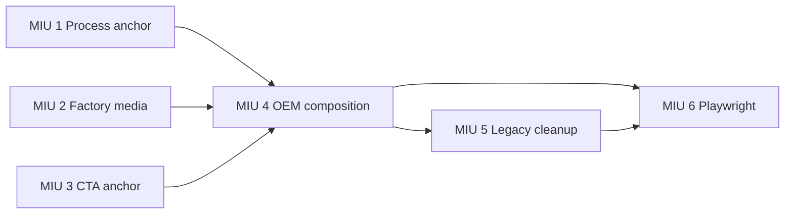

# OEM Homepage Content Sync — MIU Breakdown

## Scope Lock

### Goal

Make `/oem` use the current homepage narrative and existing homepage section components while preserving OEM-specific factory media, deep links, SEO metadata, and the complete inquiry form workflow.

### UI Decision

`DESIGN_NOT_REQUIRED`. Do not create new layouts or components. Reuse the existing public-site design exactly.

### Source Of Truth

- Shared marketing copy: `apps/site/src/i18n/content/en-US.md`
- OEM-only content: metadata, `submit`, and `factoryVideo` in `apps/site/src/i18n/content/oem/en-US.md`
- Homepage behavior must remain unchanged.

### Required Page Order

1. `AIHero`
2. `ServiceGridSection`
3. `OemProcessSection`
4. `FactorySection`
5. `OurTeamSection`
6. `WhyChooseUsSection`
7. `QualityTestingSection`
8. `CertificationsSection`
9. `CTASection`

### Explicit Non-Goals

- No new UI/UX design, CSS theme, component library, route, backend, collection, API, dependency, or asset.
- No changes to `apps/site/src/pages/index.astro` or `apps/site/src/i18n/content/en-US.md`.
- No changes to form field names, product-category options, upload behavior, `/api/admin`, or `/oem_submit_result`.
- No independent copywriting. Shared text must come from the homepage content object.
- No removal or rename of `/oem#submit` or `/oem#process`.

## Level 1 Product Tasks

- **PT-1 — Shared-section compatibility:** allow existing homepage process, factory, and CTA sections to accept the minimum OEM route overrides without changing homepage defaults.
- **PT-2 — OEM narrative synchronization:** replace the legacy OEM composition with the current homepage section sequence and content.
- **PT-3 — Legacy claim retirement:** remove unused OEM-only marketing content and types so old claims cannot silently return.
- **PT-4 — Journey verification:** prove narrative parity, OEM exceptions, deep-link compatibility, form preservation, and responsive behavior.

## Level 2 Technical MIUs

### MIU 1: `OemProcessSection` optional anchor contract

  Block:        FRONTEND
  Files:        `apps/site/src/components/OemProcessSection.astro`, `apps/site/src/i18n/brand-logo.test.ts`
  Type:         modify-existing
  Depends on:   none

  What it does:
  - Add optional prop `sectionId?: string`; render `id={sectionId}` only when supplied.
  - When `sectionId` exists, add `aria-labelledby={`${sectionId}-heading`}` to the section and the matching ID to its `h2`.
  - Add `scroll-mt-[var(--spacing-header)]` only when `sectionId` is supplied, so `/oem#process` is not hidden beneath the fixed header and the no-ID homepage markup/classes remain unchanged.
  - Keep the current homepage call valid without editing `index.astro`; omitted `sectionId` must preserve the existing homepage structure and styling.

  Build/Deploy/Runtime impact:
  - Static HTML contract only. No dependency, asset, client JavaScript, API, function, environment, or deploy configuration change.

  Test plan (TDD — write FIRST):
  - Add a source-contract assertion that the component declares optional `sectionId?: string`, binds the supplied value to the section and heading relationship, and includes the fixed-header scroll margin.
  - Assert `index.astro` still calls `<OemProcessSection process={oemProcess} />` without an OEM-specific prop and is not modified by this MIU.

  Done when:
  - A consumer can create a working `#process` target without copying the component.
  - Focused site tests pass and the site typecheck compiles the optional prop.

### MIU 2: `FactorySection` optional media override

  Block:        FRONTEND
  Files:        `apps/site/src/components/FactorySection.astro`, `apps/site/src/i18n/brand-logo.test.ts`
  Type:         modify-existing
  Depends on:   none

  What it does:
  - Add optional prop `media?: { src: string; poster: string; posterWidth: number; posterHeight: number; caption?: string; label?: string }` alongside the existing `factory` prop.
  - Use `media.src` and `media.poster` when supplied; otherwise retain the exact homepage defaults `/media/oem/factory-video.mp4` and `/media/oem/factory-video-poster.jpg`.
  - For an override, render the poster fallback `` inside `<video>` with `width={media.posterWidth}`, `height={media.posterHeight}`, and alt text from `media.label ?? media.caption ?? ''`; expose the video label with `aria-label`.
  - Render `media.caption` below the video only when provided. Keep the existing `#factory`, stats, gallery, autoplay/muted/loop/playsinline behavior, and photo registry unchanged.

  Build/Deploy/Runtime impact:
  - Reuses already tracked assets; adds no build weight or network origin.
  - Generated `/oem` video source changes when the override is passed. Homepage runtime and static output must remain unchanged.

  Test plan (TDD — write FIRST):
  - Assert the media override controls the rendered `<source src>` and `poster`, preserves intrinsic fallback image dimensions and accessible text, and renders a supplied caption once.
  - Assert both existing homepage default paths remain in the component fallback and `index.astro` still passes no media override.

  Done when:
  - `/oem` can render `/media/oem-factory.mp4` with `/media/factory-oem.webp` without duplicating a factory video.
  - Focused site tests, site typecheck, and site build pass.

### MIU 3: `CTASection` optional route-local section ID

  Block:        FRONTEND
  Files:        `apps/site/src/components/CTASection.astro`, `apps/site/src/i18n/brand-logo.test.ts`
  Type:         modify-existing
  Depends on:   none

  What it does:
  - Add optional prop `sectionId?: string`, defaulting to the current `oem-inquiry`.
  - Derive both the section `id` and heading ID/`aria-labelledby` from `sectionId`.
  - Do not alter `cta.description`, `submit` data, `ProjectForm`, `action="/api/admin"`, or `resultPath="/oem_submit_result"`.

  Build/Deploy/Runtime impact:
  - Static anchor contract only. Form validation, direct upload, submission API, redirect, and homepage behavior remain unchanged.

  Test plan (TDD — write FIRST):
  - Assert a supplied `sectionId="submit"` produces matching section and heading IDs.
  - Assert the default remains `oem-inquiry` and the component still passes `/api/admin`, `/oem_submit_result`, all fields, and all success/error copy to `ProjectForm`.

  Done when:
  - `/oem#submit` can target the reused CTA form while `/#oem-inquiry` remains unchanged.
  - Focused site tests and site typecheck pass.

### MIU 4: `/oem` shared homepage composition

  Block:        INTEGRATION
  Files:        `apps/site/src/pages/oem.astro`, `apps/site/src/i18n/brand-logo.test.ts`
  Type:         refactor
  Depends on:   MIU 1, MIU 2, MIU 3

  What it does:
  - Replace `PageHero`, `CardGrid`, `ProcessTimeline`, `ReasonList`, manual `Section`, and direct `MediaVideo` composition with the nine shared components in the exact required order above.
  - Read all shared narrative values from `getSiteContent(DEFAULT_LOCALE)`. Read only `meta`, `submit`, and `factoryVideo` from `getOemContent(DEFAULT_LOCALE)`.
  - Treat missing `factoryVideo` as a build-time content error in this MIU: throw a descriptive error before constructing the media override. Do not silently fall back to the homepage factory media on `/oem`.
  - Build an OEM-local hero object from `site.hero` with only these link overrides: primary `href: '#submit'`; secondary `href: '#factory'`. Do not mutate shared content.
  - Pass `sectionId="process"` to `OemProcessSection`; pass all `factoryVideo` fields plus `label: factoryVideo.caption` to the `FactorySection` media override; pass `sectionId="submit"` to `CTASection`.
  - Keep `ServiceGridSection` at `id="what-we-do"`, keep `BaseLayout` metadata sourced from OEM `meta`, and remove the obsolete inline fragment-scroll script; native fragment navigation plus `scroll-mt` is the contract.

  Build/Deploy/Runtime impact:
  - Replaces `/oem` static HTML with the larger homepage section composition and its existing media references.
  - No backend/function deployment. Normal Astro build and static hosting deployment only.

  Test plan (TDD — write FIRST):
  - Assert `oem.astro` imports and renders each required shared component exactly once and in the required order; assert legacy composition imports are absent.
  - Assert the page wires `#submit`, `#factory`, `#process`, `#what-we-do`, OEM media, OEM metadata, and the existing form contract exactly as specified.
  - Assert `index.astro` and homepage `content/en-US.md` have no branch diff.

  Done when:
  - `/oem` presents the current homepage narrative and only the documented OEM-specific exceptions.
  - Focused site tests, site typecheck, and site build pass.

### MIU 5: Legacy `OemContent` marketing-contract cleanup

  Block:        FRONTEND
  Files:        `apps/site/src/i18n/oem.ts`, `apps/site/src/i18n/content/oem/en-US.md`, `apps/site/src/i18n/brand-logo.test.ts`
  Type:         refactor
  Depends on:   MIU 4

  What it does:
  - Remove the unused `hero`, `oneStop`, `capabilities`, `process`, and `whyUs` fields from `OemContent` and remove their corresponding content blocks.
  - Retain the exported `IconCard`, `WorkflowStep`, `ProcessStep`, and `Reason` interfaces because the preserved legacy components `CardGrid`, `WorkflowChain`, `ProcessTimeline`, and `ReasonList` still import them. Retiring those components/types is outside this task.
  - Retain only OEM `meta`, `submit`, and `factoryVideo` content required by the recomposed page and shared homepage form.
  - Change `factoryVideo?:` to required `factoryVideo:` in `OemContent` and replace the stale deferred/CDN comment with the active contract: `/oem` requires this checked-in OEM video/poster pair and MIU 4 fails the build if content is missing.
  - This removes the inactive claims `100+ Supply Chain Partners`, Flexible MOQ, Dedicated Project Manager, AQL, RoHS, and “six primary product families” from the OEM content source.
  - Preserve `submit.fields` exactly, including all current Product Category options, file accept types, labels, and validation hints.

  Build/Deploy/Runtime impact:
  - Build-time content model becomes smaller. No runtime, route, data, API, asset, or deployment topology change.

  Test plan (TDD — write FIRST):
  - Assert the removed field names and prohibited claim strings no longer exist in active OEM content or `OemContent`.
  - Assert the four component prop interfaces remain exported, and metadata, every form field name/category option, upload accept list, success copy, OEM video path, poster path, and intrinsic poster dimensions remain unchanged.

  Done when:
  - The site compiles with the reduced contract and no consumer references a removed field or interface.
  - Focused site tests, all site unit tests, site typecheck, and site build pass.

### MIU 6: OEM composition and deep-link Playwright acceptance

  Block:        TESTING
  Files:        `tests/e2e/public.spec.ts`
  Type:         modify-existing
  Depends on:   MIU 4, MIU 5

  What it does:
  - Add focused browser acceptance for shared narrative content, OEM-specific media, deep links, form preservation, prohibited legacy claims, and responsive rendering.
  - Replace every `#capabilities` URL and locator in the OEM reveal-test block, including tests that navigate to plain `/oem` and locate `#capabilities` separately, with the retained `#process` section. Preserve the original no-JS, missing-observer, reduced-motion, transition-end, and timeout assertions.
  - Do not weaken or remove existing `shared Product Category`, no-JS form, OEM upload, or mutation coverage.

  Build/Deploy/Runtime impact:
  - Test-only. Run against a built local preview with matching `SITE_URL`/`E2E_SITE_URL`, then against the deployment preview before merge.

  Test plan (TDD — write FIRST):
  - Assert `/oem` renders the homepage Hero, two workflow cards, ten process steps, four factory stats, five Why Choose Us stories, quality section, certification section, and one inquiry form.
  - Assert `/oem#process` and `/oem#submit` resolve to visible targets below the fixed header; assert `#submit` contains the real form.
  - Assert `/oem` renders exactly one factory video with `/media/oem-factory.mp4` and `/media/factory-oem.webp`; assert `/` retains its original factory media.
  - Assert OEM body text excludes `100+ Supply Chain Partners`, Flexible MOQ, Dedicated Project Manager, AQL, RoHS, and the six-family marketing introduction.
  - At 390, 768, 1024, and 1440 px, assert no page-level horizontal overflow and verify workflow, process, factory gallery, Why Choose Us, certifications, and file input remain visible and contained.
  - Assert `/` still has `#oem-inquiry`, its original hero links/content, and no OEM-local anchor overrides.

  Done when:
  - The focused OEM plus reveal tests pass against local preview, and the full `tests/e2e/public.spec.ts` Chromium spec passes against a deployed site/API preview pair; no title grep used for the full deployed run.
  - `pnpm --filter @vibelingan-channel/site test`, direct workspace typecheck, `pnpm lint`, and `pnpm --filter @vibelingan-channel/site build` all pass.

## Dependency DAG



## Cross-File Contract Checklist

- `#submit`: producer `CTASection sectionId`; consumers Portfolio CTA, OEM upload E2E, mutation E2E.
- `#process`: producer `OemProcessSection sectionId`; consumer Portfolio CTA.
- `#what-we-do`: producer existing `ServiceGridSection`; consumer primary navigation.
- Factory media: producer OEM `factoryVideo`; consumer `FactorySection media`; homepage fallback must remain unchanged.
- Form contract: producer OEM `submit`; consumers homepage and OEM `CTASection`/`ProjectForm`; category values and upload behavior must remain unchanged.
- Removed OEM fields: grep all direct references, type references, string literals, tests, and generated-content assertions before deletion.

## Required Validation Commands

Use the repository's installed pnpm directly; do not run root aliases that shell through interactive `npx pnpm` downloads.

```bash
pnpm --filter @vibelingan-channel/site test
pnpm -r --filter "./packages/**" --filter "./apps/**" typecheck
pnpm typecheck:e2e
pnpm lint
SITE_URL=http://127.0.0.1:4325 pnpm --filter @vibelingan-channel/site build
pnpm --filter @vibelingan-channel/site preview --host 127.0.0.1 --port 4325
E2E_SITE_URL=http://127.0.0.1:4325 pnpm exec playwright test tests/e2e/public.spec.ts -g "OEM|static reveal|below-fold reveal|shared Product Category"
# Full public acceptance: the agent/CI environment must supply a matching deployed site/API pair.
: "${E2E_SITE_URL:?Set the deployed preview site URL}"
: "${E2E_API_URL:?Set the matching deployed preview API URL}"
pnpm exec playwright test tests/e2e/public.spec.ts
git diff --exit-code origin/main -- apps/site/src/pages/index.astro apps/site/src/i18n/content/en-US.md
```

Run the preview command in a persistent terminal, then run focused Playwright in another terminal. The full public spec requires a matched deployed site/API pair because it includes unmocked public API checks; do not point it at static Astro preview alone. Before push, run the full self-review/blessing flow required by the repository hooks. Do not bypass it.