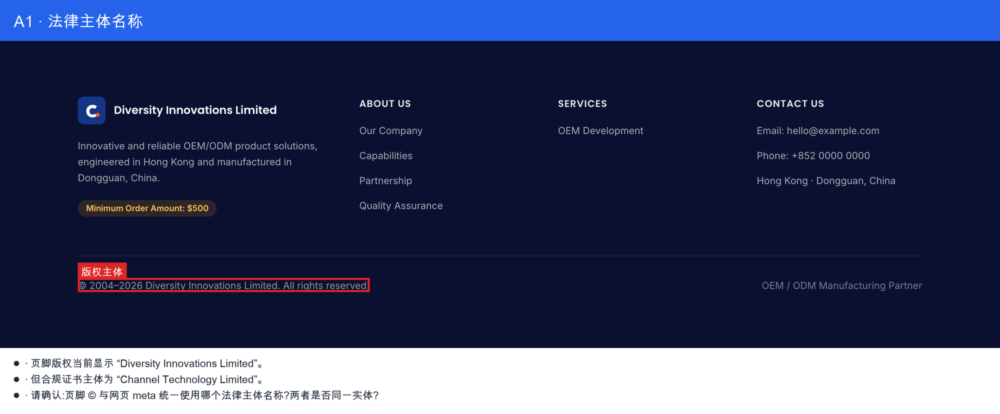
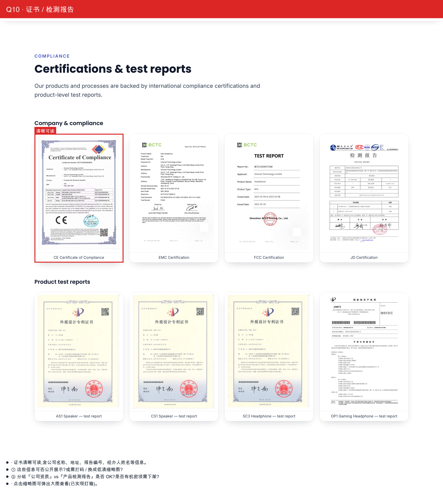
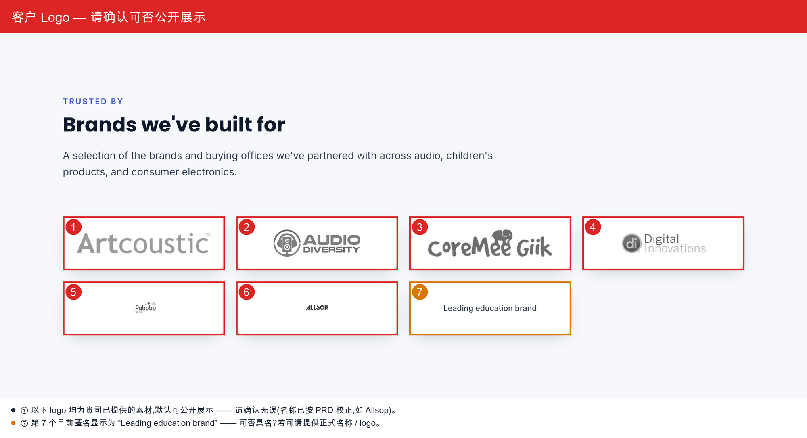

# OEM 站改造 — 技术设计与 MIU 分解

> Feature: `oem-refresh` ｜ 需求来源: [docs/OEM服务宣传站-需求确认总表.docx](../OEM服务宣传站-需求确认总表.docx) + 新版 PRD
> 目标分支: 基于**已更新的 `dev/albertli`** 开 `feat/oem-refresh`（当前 HEAD 在 `fix/image-upload-storage-design`，非本设计基线）。
> 本文件是 **设计 + MIU 分解**，不含代码。实现走 dev-pipeline（plan→implement→review→test→deliver）。

> **Route contract superseded 2026-07-27:** 本文记录 2026-07-02 OEM refresh 当时隐藏
> `/headphones` 与 `/overstock` 的设计。后续 `90bd06e` 已恢复 `/headphones`（HTTP 200 +
> public navigation）；`/overstock` 继续保持 retired/404。下文双路由隐藏与 404 内容仅作历史记录。

---

## 0. 一句话结论：是"替换"还是"技术设计"？

**两者都有，且技术设计占比更大。** 纯内容/素材替换约 40%（logo、首页文案、OEM 文案、公司名、工厂视频素材）；需要真正技术设计约 60%（**隐藏两板块的路由策略**、**新建"公司案例"页 + 4 个新组件 + 新 i18n 模块**、**视频组件**）。**本期不需要新建后端集合**（若客户案例走静态 i18n；见 §2 假设）。

---

## 1. 已确认方向（客户拍板，设计前提）

- 采用新版 PRD；本站 = 纯 OEM/ODM 服务宣传（3 个独立官网的第一个）。
- 现有 channel 框架保留；老内容按新素材替换。
- headphones、overstock：**UI 隐藏 + 逻辑不可触达，代码保留不删除**。
- 技术栈延续腾讯云 CloudBase；另两板块后续各自独立成站。

---

## 2. 待确认项 —— 已按最合理理解落位（flagged，客户回复后可调）

| # | 问题 | 本设计采用的假设（默认值） | 若客户改口的影响 |
|---|---|---|---|
| A1 | 公司对外名称 | 展示品牌用 **Diversity Innovations**（与 Logo 一致）；页脚法律主体标 **Channel Technology Limited**（证书/早期文案主体） | 仅改 i18n 文案字符串 + meta，无结构影响 |
| A2 | 本期页面范围 | **本期 = 首页 + OEM 页 + 公司案例页**；拆解 Lab / 蓝海概念 / AI 估价器 **推迟到二期** | 二期页面各是独立 PT，届时再分解 MIU |
| A3 | 公司案例数据形态 | 本期走**静态 i18n**（沿用 OEM 页模式），**不新建 CMS 集合**；后台自助管理案例推到二期 | 若要本期就 CMS 化 → 增 3 个集合 + admin CRUD（+6~8 MIU） |
| A4 | 后台 products/overstock 集合 | **保留**（数据留给未来两个独立站复用）；只在**公开站**隐藏 | 若要一并下线后台 → 另开 MIU |
| A5 | 多语言 | 本期**纯英文**（早期 10+ 语言随合并方案作废） | 二期加 /zh、/ja 路由 |
| A6 | 首页 hero | **保留现有 4K 科技动画**；OEM.mp4 作 OEM 页**内嵌工厂视频**（非 hero） | 若 hero 要换实拍 → 改 HeroVideo 源 + 需 1080p 素材 |

---

## 3. 变更分类：纯替换 vs 需技术设计

| 变更 | 类型 | 说明 |
|---|---|---|
| Logo 换真实矢量 | 🟢 纯替换 | 已提取 SVG（`docs/assets/oem-questions/logo-extracted.svg`），换资源 + 改 `brand.logo` |
| 公司名（品牌/法律主体） | 🟢 纯替换 | 改 i18n 字符串；跨文件（meta 标题用 `brand.name`） |
| 首页公司简介/团队文案 | 🟢 纯替换 | 改 `en-US.md` 段落文案 |
| OEM 页文案（保留结构） | 🟢 纯替换 | 仅公司名等字符串 |
| 隐藏 headphones/overstock | 🟠 需设计 | 路由如何"去掉但留码"、清除所有内链、sitemap 联动 |
| 工厂图 → 内嵌视频 | 🟠 需设计 | 新 `MediaVideo` 组件；大文件对构建/CDN 的影响 |
| 公司案例页（客户 logo/案例/证书） | 🔴 需设计 | 新页面 + 新 i18n 模块 + 4 个新组件 |
| 拆解 Lab / 蓝海 / AI 估价器 | 🔴 需设计（二期） | 新集合 + 博客/3D/多步表单/邮件——独立立项 |

---

## 4. 高层设计（HLD）——关键技术决策

### 4.1 隐藏策略（去掉但留码）
Astro 把 `src/pages/**` 自动变路由；**文件名前缀 `_` 的文件不生成路由但代码保留**。故：
- `headphones.astro → _headphones.astro`、`headphone-item.astro → _headphone-item.astro`；overstock 同理。
- 文件留在原目录，**import 路径不变**，代码零改动，`@astrojs/sitemap` **自动不再收录**这两条路由。
- 同步清除所有**内链**（nav、footer Products 列、首页 hero 的 "Browse Overstock" CTA）。按"修类不修点"（Rule 11）：一次删干净所有引用，而非逐条重定向。
- **后台 products/overstock 集合与 admin 不动**（A4）。

### 4.2 公司案例页（静态 i18n，沿用现有模式）
完全复用 OEM 页的成熟模式：`i18n/portfolio.ts`（`import.meta.glob` 加载 `content/portfolio/*.md` frontmatter）→ `portfolio.astro` 组装组件。**不引入后端集合**（A3）。新组件：`LogoWall`、`CaseGrid`/`CaseCard`、`CertificateGallery`。TWS 音箱那款素材 → 作为一个 STAR 案例卡片。

### 4.3 二期（本期不做，仅登记）
- 拆解 Lab：`teardowns` 集合 + 列表/详情页 + Newsletter（Mailchimp/HubSpot）+ 繁中→英翻译。
- 蓝海概念：`concepts` 集合 + 3D 查看器（`<model-viewer>`/three.js，需 .glb）+ 合作模式询盘弹窗。
- AI 估价器：多步表单 + 报价矩阵 + 邮件 + 线索入库。
- 案例 CMS 化：`cases`/`customers`/`certificates` 集合 + admin CRUD。

---

## 5. Level 1 — 产品任务

- **PT-1** 隐藏 headphones / overstock（保留代码）
- **PT-2** 品牌换真身（Logo + 公司名）
- **PT-3** 首页内容刷新（公司简介 + 团队 + 工厂视频）
- **PT-4** 新建"公司案例 / Success Stories"页
- **PT-5**（二期）拆解 Lab / 蓝海 / AI 估价器 —— 本文件不分解

---

## 6. Level 2 — 技术 MIU

> 测试现状：`.ts`（i18n 加载器/util）走 `tsx --test`（node:test），可真单测；`.astro` 无组件单测台，测试 = `astro check`（类型）+ `astro build` 产物断言（路由有/无）。各 MIU 已据此写测试计划。

### PT-1 隐藏

```
MIU 1: 去路由 — headphones 页改 _ 前缀
  Block:      FRONTEND
  Files:      apps/site/src/pages/headphones.astro → _headphones.astro,
              apps/site/src/pages/headphone-item.astro → _headphone-item.astro
  Type:       refactor（git mv 重命名）
  Depends on: none
  What it does:
    - 文件加 `_` 前缀，Astro 不再生成 /headphones、/headphone-item 路由；代码原样保留。
    - 目录不变，内部 import（../islands/...、../i18n/...）无需改动。
  Build/Deploy/Runtime impact:
    - 构建产物不再有 headphones 路由；`@astrojs/sitemap` 自动不收录。无新依赖、无运行时改动。
  Test plan (TDD):
    - `astro build` 后断言 dist 无 `headphones/index.html`（产物脚本 grep）。
    - `astro check` 通过（_ 文件仍参与类型检查，不得编译报错）。
  Done when:
    - 构建无该路由；文件仍存在且类型检查通过。
```

```
MIU 2: 去路由 — overstock 页改 _ 前缀
  Block:      FRONTEND
  Files:      apps/site/src/pages/overstock.astro → _overstock.astro,
              apps/site/src/pages/overstock-item.astro → _overstock-item.astro
  Type:       refactor
  Depends on: none
  What it does / impact / test / done: 同 MIU 1（对 overstock 两页）。
```

```
MIU 3: 清除隐藏板块的所有内链（nav / footer / hero CTA）
  Block:      FRONTEND
  Files:      apps/site/src/i18n/content/en-US.md
  Type:       modify-existing
  Depends on: none（/portfolio 目标与 MIU 12 协调）
  What it does:
    - nav.items 删除 Headphones、Overstock 两项。
    - footer "Products" 列删除 headphones/overstock 链接（或整列改为"服务/案例"）。
    - hero.secondaryCta 由 "Browse Overstock → /overstock" 改为 "View our work → /portfolio"。
  Build/Deploy/Runtime impact: none（纯内容）。
  Test plan (TDD):
    - node:test on i18n/site.ts：getSiteContent('en-US').nav.items 不含 href '/headphones'、'/overstock'。
    - footer 列不含这两个 href。
    - 仓库 grep '/headphones|/overstock' 仅命中 `_`-前缀文件（无活链接）。
  Done when:
    - 单测green；全站无指向隐藏页的活链接。
```

### PT-2 品牌

```
MIU 4: 真实 Logo 资源 + 品牌字段
  Block:      FRONTEND
  Files:      apps/site/public/media/logo-diversity.svg（新，来自 logo-extracted.svg）,
              apps/site/src/i18n/content/en-US.md（brand.logo / brand.name / footer.legal）
  Type:       new-file + modify
  Depends on: none
  What it does:
    - 落地矢量 Logo；brand.logo=/media/logo-diversity.svg。
    - brand.name = "Diversity Innovations"（A1）；footer.legal 标法律主体 "Channel Technology Limited"。
  Build/Deploy/Runtime impact: none（静态资源 + 文案）。
  Test plan (TDD):
    - node:test：getSiteContent().brand.logo 指向新资源；brand.name 为约定值。
    - astro check：SiteHeader 引用 brand.logo 不报错。
  Done when: 单测green；build 中 Logo 正常引用。
```

### PT-3 首页内容

```
MIU 5: 首页文案换真身（公司简介 + hero）
  Block:      FRONTEND
  Files:      apps/site/src/i18n/content/en-US.md
  Type:       modify-existing
  Depends on: MIU 4
  What it does:
    - sections（heritage/capabilities/partnership）正文替换为 OEM服务介绍/PPT 真实文案。
    - 修正 hero.subheading 拼写 "Develoopment" → "Development"。
  Build/Deploy/Runtime impact: none。
  Test plan (TDD):
    - node:test：sections[].body 含新公司简介关键词；无 "Develoopment"。
  Done when: 单测green。
```

```
MIU 6: 团队照片资源接入首页
  Block:      FRONTEND
  Files:      apps/site/public/media/team/*（新，压缩后）,
              apps/site/src/i18n/content/en-US.md（heritage.section.image）
  Type:       modify-existing
  Depends on: MIU 5
  What it does:
    - 团队照片转 .webp 压缩落 public/media/team/；heritage 板块 image 指向真实团队图（替换 section-heritage.png 占位）。
  Build/Deploy/Runtime impact: 新增图片增构建体积（可控，KB 级）。
  Test plan: node:test 断言 section.image 路径为新资源；astro build 通过。
  Done when: 首页"关于我们"显示真实团队图。
```

```
MIU 7: MediaVideo 组件 + OEM 工厂视频接入 OEM 页
  Block:      FRONTEND
  Files:      apps/site/src/components/MediaVideo.astro（新）,
              apps/site/public/media/factory-oem.mp4（新，来自 OEM.mp4）,
              apps/site/src/pages/oem.astro（接入）
  Type:       new-file
  Depends on: none
  What it does:
    - MediaVideo props { src, poster?, caption? }：<video muted autoplay loop playsinline preload=metadata> + 图注。
    - OEM 页"能力/工厂"板块用它替换原工厂静图（对应《修改内容》"工厂图改真实视频"）。
  Build/Deploy/Runtime impact:
    - **⚠ OEM.mp4 约 18MB、960×720、码率偏低**：直接进 public/ 会显著增大构建产物与 CloudBase 静态托管/CDN 负担；播放偏糊。
      建议实现时**转码压缩**（H.264/webm，≤1080p）；并向客户索取高清版（见总表视频问题）。
      若走 CloudBase 存储直链而非打进 dist，需在设计评审确认（构建上下文变化点）。
  Test plan (TDD):
    - astro check：MediaVideo 类型正确；oem.astro 引用无误。
    - 容器渲染/产物断言：输出含 <video muted autoplay ... src=factory-oem>。
  Done when: OEM 页显示内嵌工厂视频；build 通过；产物体积已评估。
```

### PT-4 公司案例页

```
MIU 8: portfolio i18n 加载器 + 内容骨架
  Block:      FRONTEND
  Files:      apps/site/src/i18n/portfolio.ts（新）,
              apps/site/src/i18n/content/portfolio/en-US.md（新）
  Type:       new-file
  Depends on: none
  What it does:
    - 镜像 oem.ts：PortfolioContent { meta, hero, customers[], cases[], certificates[] }；
      getPortfolioContent(locale) 用 import.meta.glob('./content/portfolio/*.md') 加载 frontmatter。
    - 内容含：合作客户（含代称标记 anonymized）、STAR 案例（含 TWS 音箱案例）、证书（分 company/product 两类）。
  Build/Deploy/Runtime impact: none。
  Test plan (TDD):
    - node:test：getPortfolioContent('en-US') 返回 customers/cases/certificates 三数组非空；
      缺 locale 时回退默认并不抛（或按 oem.ts 语义抛错——与之一致）。
  Done when: 加载器单测green，类型编译通过。
```

```
MIU 9: LogoWall 组件（客户 Logo 墙）
  Block:      FRONTEND
  Files:      apps/site/src/components/LogoWall.astro（新）
  Type:       new-file
  Depends on: MIU 8
  What it does:
    - props { logos: {src, name, anonymized?}[] }：响应式灰度网格；anonymized 项显示代称文字（如 "Leading UK Audio Brand"）而非 logo。
    - 素材落 public/media/portfolio/customers/*。
  Build/Deploy/Runtime impact: 图片增体积（KB 级，压缩 .webp）。
  Test plan: astro check；容器渲染断言渲染 N 个 img + 对匿名项渲染代称文本。
  Done when: 客户墙可渲染，匿名逻辑正确。
```

```
MIU 10: CaseGrid + CaseCard 组件（STAR 案例）
  Block:      FRONTEND
  Files:      apps/site/src/components/CaseGrid.astro（新）, apps/site/src/components/CaseCard.astro（新）
  Type:       new-file
  Depends on: MIU 8
  What it does:
    - CaseCard props { title, image, situation, task, action, result, metrics: {label,value}[] }。
    - CaseGrid 遍历 cases 渲染卡片；TWS 音箱案例（设计→开模→量产→包装）为其中一张。
  Build/Deploy/Runtime impact: none（素材同上目录）。
  Test plan: 容器渲染断言 STAR 四段 + metrics 高亮数值渲染。
  Done when: 案例卡片渲染完整，含 TWS 案例。
```

```
MIU 11: CertificateGallery 组件（证书 + 灯箱）
  Block:      FRONTEND
  Files:      apps/site/src/components/CertificateGallery.astro（新）
  Type:       new-file
  Depends on: MIU 8
  What it does:
    - props { certs: {src, label, kind: 'company'|'product'}[] }：按 kind 分两组网格；点击用原生 <dialog> 放大。
    - 素材落 public/media/portfolio/certs/*。
  Build/Deploy/Runtime impact: none。
  Test plan: 容器渲染断言两分组 + 每证书一个可触发的 <dialog>。
  Done when: 证书分组展示 + 点击放大可用。
```

```
MIU 12: portfolio.astro 页面组装 + 导航入口
  Block:      FRONTEND
  Files:      apps/site/src/pages/portfolio.astro（新）,
              apps/site/src/i18n/content/en-US.md（nav 增 "Success Stories → /portfolio"）
  Type:       new-file + modify
  Depends on: MIU 8, 9, 10, 11, 3
  What it does:
    - 用 getPortfolioContent 组装 PageHero + LogoWall + CaseGrid + CertificateGallery。
    - nav 增入口；与 MIU 3 的 hero CTA "/portfolio" 对齐。
  Build/Deploy/Runtime impact: 新增 /portfolio 路由，自动进 sitemap。
  Test plan (TDD):
    - astro build 产物含 portfolio/index.html。
    - node:test：getSiteContent().nav 含 href '/portfolio'。
    - 全站无死链（/portfolio 目标存在）。
  Done when: /portfolio 可访问、导航可达、各板块渲染、build 通过。
```

---

## 7. 依赖 DAG 与建议顺序

```
PT-1  MIU1 ─┐        PT-2  MIU4 ── MIU5 ── MIU6      PT-4  MIU8 ─┬─ MIU9 ─┐
      MIU2 ─┼─(独立)                                             ├─ MIU10 ┼─ MIU12
      MIU3 ─┘        PT-3  MIU7（独立）                          └─ MIU11 ┘   ↑
                                                                     MIU3 ────┘(CTA 对齐)
```
建议批次：**批 1** 隐藏(1,2,3) → **批 2** 品牌+首页(4,5,6,7) → **批 3** 案例页(8→9/10/11→12)。每批 ≤5 文件、独立可验收（符合用户级"分阶段执行"规则）。

---

## 8. 跨文件核对 & 风险

**跨文件（改前必查）**
- `/headphones`、`/overstock` 的所有引用：nav、footer、hero CTA、任意组件/页面 → 全清（MIU 3 + grep 兜底）。
- `brand.name` 被 `BaseLayout` 标题 `${meta.title} — ${brand.name}` 引用 → 改名自动传导到所有页 meta。
- `@astrojs/sitemap`：隐藏页/新页自动增删，无需手改 sitemap。
- admin / `packages/shared/collections.ts`：**不动**（products/overstock 数据保留）。

**风险**
- **OEM.mp4 低清且大（18MB / 960×720）**：务必转码压缩；建议向客户要 1080p/16:9 高清版（已列入总表问题）。
- **公司名（A1）未定**：改名涉及多处字符串，建议 **Q1 定后再做 MIU 4/5**，或先用默认值、定后一次性替换。
- **.astro 无组件单测台**：本设计以 `astro check` + 构建产物断言兜底；若要真正组件单测，可加一条基础设施 MIU（`astro:container` 测试台），属可选、勿在本期临时插入。
- **A2/A3 若客户要本期就上二期页面或 CMS 化案例** → 需追加集合与多个 MIU，工作量显著上升。

---

## 9. 交付物与下一步
- 本设计 = dev-pipeline 的 Phase 2–4 产出（HLD + Level1 + Level2 MIU）。
- 建议：`/dp-pipeline` 从**批 1（隐藏）**起实现——这批完全确定、零客户依赖，可立即动工；批 2/3 的公司名(A1)、页面范围(A2) 定了再推进。

---

## 10. Implementation Review - OEM Refresh (2026-07-02)

Scope: `dev/albertli/try01` commits `8ad0a60..e2eaa50`, i.e. the OEM-refresh work
after the OEM/private-media upload merge: hidden headphones/overstock routes,
real brand/team media, OEM factory media block, marketing-video policy, and the
new Success Stories page. Review used the current code plus rendered preview
checks; it intentionally does not re-open the earlier MIU-08 storage/upload work
already reviewed in `docs/IMAGE_UPLOAD_STORAGE_DESIGN.md`.

Verdict: **approve with changes**. The branch is structurally sound and the
hidden-route/branding/portfolio skeleton work builds cleanly, but MIU 7 and MIU
11 are not yet fully delivered as designed. Treat OR-1 as a release blocker
unless the factory video is explicitly deferred in product scope; OR-2 should be
fixed before calling Success Stories complete.

### 10.1 Findings

| # | Severity | Cause / layer | Issue | Recommended fix |
|---|---|---|---|---|
| OR-1 | P1 | Mixed: requirement + verification gap; content/i18n + route verification | The OEM page does not actually render a factory video. `apps/site/src/i18n/content/oem/en-US.md` sets `factoryVideo.src: ''`, and `MediaVideo` falls back to an `` when `src` is empty. Rendered `/oem` has **0** `<video>` elements and 1 `factory-oem.webp` poster image, so MIU 7's "OEM factory video" done condition is not met. | Host the approved/transcoded factory clip outside the static site build (CloudBase Storage/CDN per the new marketing-video policy), set `factoryVideo.src`, and add a rendered route assertion that `/oem` emits a `<video>` when the content includes a video URL. If the clip is not available, mark MIU 7 as explicitly deferred and change the page/caption to avoid implying video delivery. |
| OR-2 | P2 | Frontend issue + verification gap; feature component | `CertificateGallery` does not implement the designed lightbox. The design requires each certificate to open in a native `<dialog>`, but `apps/site/src/components/CertificateGallery.astro` renders static figures only. Rendered `/portfolio` has **0** `<dialog>` elements and **0** buttons, so certificates/test reports cannot be enlarged or inspected. | Wrap each thumbnail in an accessible button, render a keyboard-closeable `<dialog>` with the full certificate image and label, and add component/render coverage that proves two groups render and each cert has an enlargement control. |
| OR-3 | P3 | Frontend issue; component/content contract | New marketing thumbnails omit intrinsic `width`/`height` attributes in `LogoWall`, `CertificateGallery`, and the `MediaVideo` poster fallback. CSS aspect ratios keep the layout mostly stable, but this still violates the current web interface image guideline and leaves unnecessary CLS risk for the new `/portfolio` media wall. | Add dimensions to the portfolio content model or component-level asset metadata and pass `width`/`height` onto all generated `` tags; keep `loading="lazy"` for below-fold images. |

### 10.2 What Passed

- Hidden storefront routes behave as intended: rendered preview returned `404`
  for `/headphones` and `/overstock`, while `/`, `/oem`, and `/portfolio`
  returned `200`.
- `astro build` generated 8 public pages and included `/portfolio/index.html`;
  hidden headphones/overstock pages were not emitted.
- Responsive smoke at 390, 768, and 1440 px found no horizontal overflow on `/`,
  `/oem`, or `/portfolio`.
- Brand/logo/team media and portfolio asset references are present on disk; the
  focused site tests cover the content/asset references.
- The marketing-video policy is documented and uses a non-bundled storage/CDN
  direction, which is the right shape for the future factory-video upload path.

### 10.3 Verification Run

- `pnpm --filter @vibelingan-channel/site test` - pass (6 tests).
- `pnpm typecheck` - pass; Astro reported 0 errors, with existing React
  `FormEvent` deprecation hints only.
- `pnpm build` - pass; 8 static pages generated.
- `pnpm lint` - pass.
- `pnpm verify:cloudbase-sdk` - pass; confirms the CloudBase SDK storage contract
  and that `wx-server-sdk` still does not expose `getUploadMetadata`.
- Preview DOM checks on `http://127.0.0.1:4325`: `/oem` has 0 videos and 1 factory
  poster image; `/portfolio` has 8 certificate images, 0 dialogs, and 0 main
  buttons; `/headphones` and `/overstock` return 404.

### 10.4 Response (2026-07-02)

All three findings addressed on `dev/albertli/try01`:

- **OR-1 (factory video) — resolved as explicit deferral.** No HD factory clip
  is available yet (client question open) and the repo has no transcode path, so
  MIU 7's *video* is deferred. The `/oem` capabilities block ships the real
  `factory-oem.webp` facility **photo** via `MediaVideo` (poster-only), which
  upgrades to an inline `<video>` with a one-line content change (set
  `factoryVideo.src` to a CloudBase storage/CDN URL) once the clip is uploaded.
  Content + interface comments record the deferral; `public.spec.ts` asserts the
  poster renders and **no** `<video>` is emitted while `src` is empty.
- **OR-2 (certificate lightbox) — implemented.** `CertificateGallery` now wraps
  each thumbnail in an accessible `<button>` that opens a native `<dialog>`
  (Esc + focus-trap via `showModal()`, backdrop-click + close-button to
  dismiss). `public.spec.ts` proves both groups render, every certificate has an
  enlarge control, and a certificate opens then closes.
- **OR-3 (intrinsic image dimensions) — implemented.** Measured `width`/`height`
  added to the portfolio content model and applied across `LogoWall`,
  `CertificateGallery`, and the `MediaVideo` poster to reserve layout space.

Also fixed during verification (the original review only checked a local
preview): the CloudBase **deploy did not prune** removed files, so the retired
`/headphones` and `/overstock` pages kept serving on the test CDN.
`deployWebApp()` now prunes retired paths after upload, and the deploy smoke
asserts they return 404.

Route contract superseded 2026-07-27 by `90bd06e`: `/headphones` was restored
and is no longer pruned; `/overstock` remains the retired 404 route.

### 10.5 Review Round 2 (2026-07-02)

Review of `d910bfa..d9f8225` on `dev/albertli/try01`. Verdict:
**accepted; no new blockers found.**

- OR-1 is now a product-scope deferral rather than a hidden implementation gap:
  the OEM page intentionally renders the facility poster while `factoryVideo.src`
  is empty, and the content/type comments plus Playwright coverage make that
  contract explicit.
- OR-2 is implemented: `/portfolio` renders one accessible enlargement trigger
  and native `<dialog>` per certificate, with Escape-close behavior verified.
- OR-3 is implemented: rendered `/portfolio` no longer has marketing ``
  elements missing `width`/`height`, and the OEM factory poster reserves its
  intrinsic dimensions.
- The static-hosting prune is the right targeted fix for retired paths
  lingering after additive uploads. It is code-reviewed here; live acceptance
  still depends on the next CloudBase deploy smoke proving `/headphones` and
  `/overstock` return 404 in the deployed test environment.

Verification run:

- `pnpm --filter @vibelingan-channel/site test` - pass (6 tests).
- `pnpm typecheck` - pass; Astro reported 0 errors, with existing React
  `FormEvent` deprecation hints only.
- `pnpm build` - pass; 8 static pages generated.
- `pnpm lint` - pass.
- `pnpm verify:cloudbase-sdk` - pass.
- Focused Playwright local preview:
  `E2E_SITE_URL=http://127.0.0.1:4325 pnpm exec playwright test tests/e2e/public.spec.ts -g "core pages render|Success Stories certificates|OEM factory block"`
  - pass (3 tests). Full public API smoke was not run locally because it needs a
  deployed or local API base URL.
- Manual browser DOM checks on local preview: `/`, `/oem`, `/portfolio` return
  200; `/headphones` and `/overstock` return 404; `/portfolio` has 8 certificate
  triggers and 8 dialogs; dialog opens and closes with Escape; no main marketing
  images are missing intrinsic dimensions; no horizontal overflow at 390, 768,
  or 1440 px.

### 10.6 Review Round 3 (2026-07-02)

Review of `6b983c5..be3d047` on `dev/albertli/try01`. Verdict:
**approve with one policy-alignment finding.** The current UI behavior is sound:
the factory video renders, the MOQ badge is gone, Allsop labeling is corrected,
and the pruned client-question list is focused.

| # | Severity | Cause / layer | Issue | Recommended fix |
|---|---|---|---|---|
| OR-4 | P2 | Mixed: design-policy drift + deployment risk; media delivery / docs | The factory video is now wired and works, but it is committed under `apps/site/public/media/oem-factory.mp4` and served as a static-hosting asset (`/media/oem-factory.mp4`, 7,201,197 bytes). That contradicts the canonical marketing-video policy in `docs/IMAGE_UPLOAD_STORAGE_DESIGN.md` ("CloudBase Storage direct COS POST; served by URL (never bundled in the site build)") and the `MediaVideo` comment that says video files are intentionally not bundled into Astro. It is not a rendering blocker, but it leaves future maintainers with two incompatible delivery rules and can grow static hosting deploy/CDN cost as videos change. | Before final release, choose and document one rule: either move the factory clip to CloudBase Storage/CDN and keep `factoryVideo.src` as that URL, or explicitly amend the canonical media policy to allow small launch marketing videos in static hosting with a size budget, ownership note, and prune/deploy implications. |

What passed:

- `/oem` now emits exactly one muted autoplay looping `<video>` with source
  `/media/oem-factory.mp4`; local preview serves it as `video/mp4` with content
  length `7201197`.
- Rendered crop keeps the factory scene visible; the source is 960×720 H.264,
  130.7 seconds, ~441 kbps.
- `/`, `/oem`, `/portfolio` render 200; `/headphones` and `/overstock` render
  404 locally.
- `/portfolio` still has 8 certificate triggers and 8 dialogs; no main
  marketing images are missing intrinsic dimensions.
- No horizontal overflow at 390, 768, or 1440 px across `/`, `/oem`, and
  `/portfolio`.

Verification run:

- `pnpm --filter @vibelingan-channel/site test` - pass (6 tests).
- `pnpm typecheck` - pass; Astro reported 0 errors, with existing React
  `FormEvent` deprecation hints only.
- `pnpm build` - pass; 8 static pages generated.
- `pnpm lint` - pass.
- `pnpm verify:cloudbase-sdk` - pass.
- Focused Playwright local preview:
  `E2E_SITE_URL=http://127.0.0.1:4325 pnpm exec playwright test tests/e2e/public.spec.ts -g "core pages render|Success Stories certificates|OEM factory block|OEM factory block renders"`
  - pass (3 tests). Full public API smoke was not run locally because it needs a
  deployed or local API base URL.

---

## 11. 客户待澄清问题（图文汇总）

> 已按 **PRD**（`Diversity_Technology_Website_Upgrade_Specification.pdf`）+ 客户《修改内容》+ 素材逐条核对。
> **素材已明确的直接落地（不再问）**、**PRD 已答的不再问**，下面只列**真正还需客户确认**的问题。
> 截图取自测试站实况并已勾画标注，可直接发客户。标注源图见 `docs/assets/oem-questions/`。

### 11.1 已按素材落地（无需确认，已做进站点）

- **工厂视频**：客户提供的 `OEM.mp4`（`替换视频.zip`）已压缩接入 `/oem`（解决 review OR-1；客户《修改内容》要求“OEM 工厂图改真实场景视频”）。
- **客户 logo “AS Audio” → “Allsop”**（PRD 明确“美國 Allsop”）。
- **删除页脚 `Minimum Order Amount: $500`**（客户《修改内容》“删除USD500”）。

### 11.2 PRD / 素材已明确（无需再问）

| 曾经列过的疑问 | 已有答案 |
|---|---|
| 多语言 | PRD：首期纯英文，二期繁体中文 + 日文，`/en/ /zh/` 路由 |
| 版权年份 | PRD：公司 **2004 年**成立 |
| 后台 CMS | PRD：动态页面（案例 / 拆解 / 概念）**要求建 CMS**（属二期） |
| MOQ / $500 | 客户《修改内容》：**删除** |
| “JD” 证书标签 | 客户素材文件本身即命名 `JD certification.png`，非错标 |
| 二期页面（拆解 Lab / 蓝海 / AI 估价器） | PRD 明确要做，属**二期**（本期先做 主页 + OEM + 案例） |

### 11.3 真正待客户确认（4 项）

#### ① 公司名称（页脚 / meta）—— 三处不一致



- PRD 用 `Diversity Technology Limited`；证书 / OEM服务介绍用 `Channel Technology Limited`；**当前网站**用 `Diversity Innovations Limited`。
- 统一使用哪个法律主体名称？是否为两个实体（贸易主体 vs 制造 / 证书主体）？

#### ② 真实联系方式

（见上图橙框）当前为占位符：`hello@example.com`、`+852 0000 0000`、地址仅 “Hong Kong · Dongguan”。请提供真实 email / 电话 / 地址。

#### ③ 证书 / 检测报告可读信息



- 证书**清晰可读**，含公司名称、地址、报告编号、经办人姓名 —— 可否公开？或需打码 / 换低清缩略图？
- 分组「公司资质」vs「产品检测报告」是否 OK？是否有机密项需下架？

#### ④ 客户 logo 公开与匿名



- 已提供的 logo 默认可公开展示 —— 请确认无误（名称已按 PRD 校正）。
- 第 7 个（教育机构）目前匿名为 “Leading education brand” —— 可否具名？
