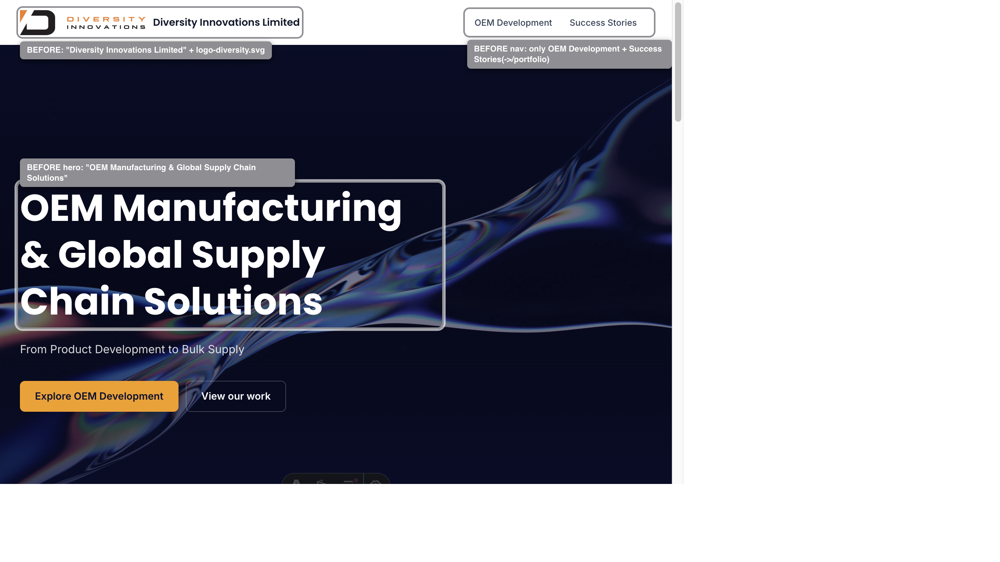
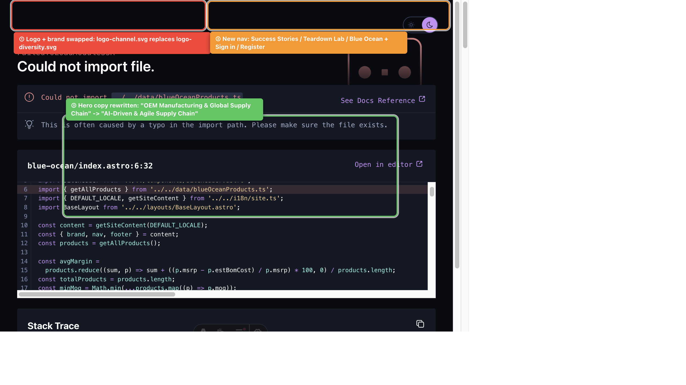

# Doc 1 — OEM Phase 1 分支变更对比 / Branch Change Comparison

> **一句话总结 (TL;DR):** `dev/albertli/oem-phase1` 分支只有 **1 个 commit**，做了三件事：①把品牌从 *Diversity Innovations* 换成 *Diversity Technology*（AI 供应链定位）②把首页从「3 段静态介绍」重构成「7 段营销落地页」③新增三大内容板块页面（公司案例 / 市场拆解 / 蓝海产品）＋对应后台数据集合。**但支撑三大板块的数据文件没有提交上来，导致三个页面全部 500**（详见 Doc 2）。

| | |
|---|---|
| **PR branch** | `dev/albertli/oem-phase1` |
| **Compared against** | `fix/enhance-features-vip`（你当前的工作分支） |
| **Commit** | `a770d61` — *feat: OEM Phase 1 — homepage restructure + 3 new content sections* |
| **Diff size** | 23 files changed, +2,113 / −62 |
| **验证方式** | 独立起了两个 dev server（before `:4321` / after `:4331`），逐页对比截图 + 逐文件读 diff |

---

## 变更 1 — 品牌重塑 / Brand Identity Swap

| 项目 | Before (`fix/enhance-features-vip`) | After (`oem-phase1`) |
|---|---|---|
| 公司名 | Diversity **Innovations** Limited | Diversity **Technology** Limited |
| Logo 文件 | `logo-diversity.svg` | `logo-channel.svg`（"CHANNEL" 字标） |
| 定位语 | OEM / ODM Manufacturing Partner | AI-Driven Supply Chain & Product Incubation |
| 邮箱 | hello@example.com | hello@diversity-tech.com |
| 新增标识 | — | 头部 & 页脚新增 **"Minimum Order Amount: $500"** |

**Before ⤵**

**After ⤵**

---

## 变更 2 — 首页重构 / Homepage Restructure

首页从 **3 段简单介绍** 变成 **7 段完整落地页**。

| Before（3 段） | After（7 段 / 组件） |
|---|---|
| Hero: "OEM Manufacturing & Global Supply Chain Solutions" | `AIHero` — "Empowering Global Brands via AI-Driven & Agile Supply Chain" |
| "Who we are — 20+ years of trusted manufacturing" | `AIShowcase` — 4 张 AI 能力卡（Trend Insight / Cost Matrix / Supplier Optimization / Agile Logistics） |
| "What we make — From audio devices to home products" | `ServiceGridSection` — "One-Stop OEM/ODM Development" 4 卡 |
| "How we help — Built for speed, quality, growth" | `TeardownTeaser` — Teardown Lab 预告 + 3 组统计 |
| | `BlueOceanTeaser` — 3 张概念产品卡 |
| | `FactorySection` — "20+ years" + 4 组统计（2004 / 20+ / 50+ / 100%） |
| | `CTASection` — "Ready to develop your next product?" |

> 注：旧的 `sections` 内容模型没有删除，在 `site.ts` 里被标记为 `sections?`（legacy，保留向后兼容，新首页不再使用）。

---

## 变更 3 — 导航 / Navigation

| | Before | After |
|---|---|---|
| 主导航 | OEM Development · Success Stories(→`/portfolio`) | Success Stories · Teardown Lab · Blue Ocean · OEM Development |
| 认证入口 | 帐户菜单岛（AccountMenu） | Sign in(→`/login`) · Register(→`/register`) |
| 页脚 | About / Services / Contact | Company(4 links) / Products(Headphones·Overstock·Admin) / Contact |

---

## 变更 4 — 三大新页面 / Three New Page Groups

| 板块 | 路由 | 页面 | 说明 |
|---|---|---|---|
| 公司案例 (Success Stories) | `/success-stories` | index only | 客户案例展示（无详情页） |
| 市场案例拆解 (Teardown Lab) | `/teardown-lab` + `/teardown-lab/[slug]` | 列表 + 详情 | 硬件拆解 / BOM 成本分析报告 |
| 蓝海产品 (Blue Ocean) | `/blue-ocean` + `/blue-ocean/[slug]` | 列表 + 详情 | 原创概念产品展示 |

> ⚠️ **这三组页面目前全部返回 HTTP 500** —— 因为它们 import 的 `src/data/*.ts` 数据文件没有被提交。详见 **Doc 2 (Bug #1)**。这也正是你要做的「内容录入」的落点。

---

## 变更 5 — 新增组件 / New Components (10)

`AIHero` · `AIShowcase` · `ServiceGridSection` · `TeardownTeaser` · `BlueOceanTeaser` · `FactorySection` · `CTASection` · `CaseStudyCard` · `TeardownCard` · `ProductConceptCard`

---

## 变更 6 — 后台数据集合 / New Admin Collections (3)

在 `packages/shared/src/collections.ts` 注册了 3 个新集合（后台可 CRUD）：

| 集合 | label | 关键字段 |
|---|---|---|
| `successStories` | Success Stories | title, client, category, summary, situation/task/action/result (STAR), capabilities, metrics(json), published |
| `teardownReports` | Teardown Reports | title, **slug**, product, category, retailPrice, estBomCost, estMargin, moq, summary, overview, marketAnalysis, hardwareTeardown, bomBreakdown(json), riskAnalysis, published |
| `blueOceanProducts` | Blue Ocean Products | name, **slug**, tagline, category, msrp, estBomCost, moq, summary, marketGap, techSpecs(json), bomBreakdown(json), partnershipTiers(json), published |

> 说明：后台集合已经就绪，但**前台页面读的不是后台数据，而是本地 `src/data/*.ts` 静态文件**（这些文件缺失）。目前这两条数据链路是脱节的 —— 见 Doc 2 与后续资料分析文档。

---

## 变更 7 — 内容模型 / i18n Content Model

- `apps/site/src/i18n/site.ts`：新增类型 `IconCard` / `StatItem` / `ProductTeaserItem`，`SiteContent` 增加 `aiShowcase / services / teardownTeaser / blueOceanTeaser / factorySection / ctaSection` 六个板块字段。
- `apps/site/src/i18n/content/en-US.md`：填入上述新板块的英文文案（品牌名、导航、hero、4 张 AI 卡、服务卡、统计数字、3 个蓝海产品名等）。

---

## 变更 8 — 非网站改动（本次不看）/ Out-of-scope (tooling)

以下 4 个文件属于研发工具 / agent 文档，与网站功能无关（你说过「AI 内容不算」，这里一并列出仅供知情）：
`CLAUDE.md` · `docs/agents/domain.md` · `docs/agents/issue-tracker.md` · `docs/agents/triage-labels.md`

---

## 完整文件清单 / Full File Inventory (23)

**网站相关 (19)**
- Pages: `index.astro`(改) · `success-stories/index.astro` · `teardown-lab/index.astro` · `teardown-lab/[slug].astro` · `blue-ocean/index.astro` · `blue-ocean/[slug].astro`
- Components (10): 见变更 5
- Content: `i18n/site.ts` · `i18n/content/en-US.md`
- Data model: `packages/shared/src/collections.ts`

**工具/文档 (4):** `CLAUDE.md` · `docs/agents/{domain,issue-tracker,triage-labels}.md`

**⚠️ 应该有却缺失的文件 (3) — 这是本次最大的问题:**
- `apps/site/src/data/successStories.ts`
- `apps/site/src/data/teardownReports.ts`
- `apps/site/src/data/blueOceanProducts.ts`
