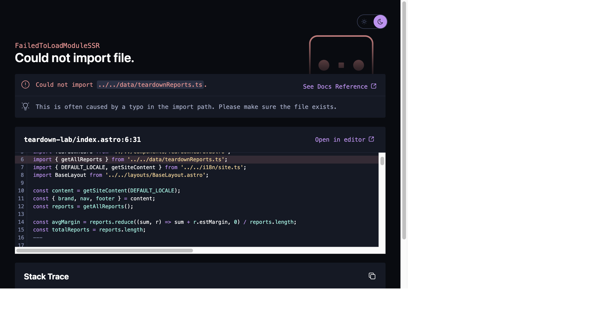

# Doc 2 — OEM Phase 1 缺陷报告 / Bug Report

> **一句话总结 (TL;DR):** 这个分支**不能直接上线**。有 1 个致命 bug（三大新页面全部 500，`astro build` 会直接失败）和 1 个中等 UI bug（蓝海卡片价格标签压住标题），外加 2 个小问题。

| # | 严重度 | 问题 | 影响面 |
|---|---|---|---|
| 1 | 🔴 **Critical / Blocker** | 三个新页面 import 的数据文件缺失 → HTTP 500 | `/success-stories` `/teardown-lab` `/blue-ocean` 及其详情页；`astro build` 整体失败 |
| 2 | 🟠 **Medium** | 首页蓝海卡片：价格标签压住产品标题 | 首页 `BlueOceanTeaser`，多张卡片 |
| 3 | 🟡 Minor | 内容文件里 "Sign In" 指向 `/admin`，实际渲染成 `/login`+`/register` | 头部导航，认知不一致 |
| 4 | 🟡 Minor | 前台静态数据 与 后台集合 两条数据链路脱节 | 架构一致性 |

**验证方式:** 独立 worktree checkout `oem-phase1` → `pnpm install` → `astro dev :4331` → 逐页访问 + 读 dev server 日志 + `git ls-tree` 确认文件是否存在（两条独立证据链交叉验证）。

---

## 🔴 Bug #1 — 三大新页面全部 500（Blocker）

### 现象
访问以下任一页面都返回 **HTTP 500 `FailedToLoadModuleSSR`**：
- `/teardown-lab`（及 `/teardown-lab/[slug]`）
- `/blue-ocean`（及 `/blue-ocean/[slug]`）
- `/success-stories`



### 根因（已确认，两条独立证据）
页面和卡片组件 import 了本地静态数据模块，但**整个 `apps/site/src/data/` 目录从未被提交进这个分支**：

```
apps/site/src/pages/teardown-lab/index.astro:6   import { getAllReports } from '../../data/teardownReports.ts'
apps/site/src/pages/blue-ocean/index.astro:6     import { getAllProducts } from '../../data/blueOceanProducts.ts'
apps/site/src/pages/success-stories/index.astro:6 import { caseStudies, ... } from '../../data/successStories.ts'
apps/site/src/components/TeardownCard.astro:8     import type { TeardownReport } from '../data/teardownReports.ts'
apps/site/src/components/ProductConceptCard.astro:9 import type { BlueOceanProduct } from '../data/blueOceanProducts.ts'
apps/site/src/components/CaseStudyCard.astro:10  import type { CaseStudy } from '../data/successStories.ts'
```

- **证据 A（运行时）** — dev server 日志：
  `[ERROR] Could not import '../../data/teardownReports.ts'. … Please make sure the file exists.`（三个文件各报一次）
- **证据 B（静态）** — `git ls-tree -r origin/dev/albertli/oem-phase1 -- apps/site/src/data/` 返回**空**，该目录在 commit 与其父提交里都不存在。

### 影响面（Blast Radius）
1. 三大板块页面（正是本次 OEM Phase 1 的核心）**完全打不开**。
2. 首页导航里 4 个链接除 OEM 外**全部指向 500 页面**。
3. **`astro build` 会直接失败** → 现状**无法部署**。dev server 首页能开，只是因为首页没直接 import 这些 data 文件；一旦构建静态站点，缺失模块立即让整个 build 挂掉。

### 修复方向
补齐这 3 个数据模块（`getAllReports()` / `getAllProducts()` / `caseStudies` 等导出 + `TeardownReport` / `BlueOceanProduct` / `CaseStudy` 类型）。**这正好就是你要做的「内容录入」** —— 用客户 `OEM网页资料` 里的真实内容来填充这三个文件（详见即将产出的资料分析文档）。

> 数据字段的形状可直接参照 `packages/shared/src/collections.ts` 里已注册的 `successStories` / `teardownReports` / `blueOceanProducts` 三个集合定义，保持前后台字段一致。

---

## 🟠 Bug #2 — 蓝海卡片：价格标签压住标题（Medium）

### 现象
首页 `BlueOceanTeaser` 板块，产品卡右上角的价格徽章（`$199` / `$229`）**压在产品标题文字上面**。标题只要够长（末词顶到右边），就会被徽章盖住：


- ❌ "SomniFlow AI Sleep Pods" 被 `$199` 压住
- ❌ "AeroSense AI Sports Headband" 被 `$229` 压住（"Headband" 被盖）
- ✅ "LumiCogni Desktop AI Hologram" 因为第一行较短、标题换行，刚好躲开

### 根因
`apps/site/src/components/BlueOceanTeaser.astro`：价格徽章是 `class="absolute right-4 top-4"` 绝对定位，而标题 `<h3>` **没有预留右侧内边距**，所以标题文字会铺满整个宽度、跑到徽章底下。

```astro
<div class="absolute right-4 top-4 ...">{product.msrp}</div>   <!-- 绝对定位徽章 -->
<h3 class="font-display text-xl font-bold text-ink">{product.name}</h3>  <!-- 无 pr-*，会被盖住 -->
```

### 修复方向
给 `<h3>` 加右侧留白（例如 `pr-16`），或把徽章放进正常文档流，或给卡片顶部加内边距把徽章单独一行。
> 参考：列表页用的 `ProductConceptCard.astro` 用的是正常流式布局（徽章在独立一行），不会有这个问题——但那个页面现在被 Bug #1 挡着打不开。

---

## 🟡 Bug #3 — "Sign In" 导航目标不一致（Minor）

`i18n/content/en-US.md` 里头部导航写的是 `{ label: Sign In, href: '/admin', emphasis: true }`，但实际页面渲染出来的是认证岛（AccountMenu）的 **Sign in→`/login`** 和 **Register→`/register`**。内容配置与实际渲染对不上，建议统一（要么走 `/login`，要么走 `/admin`）。

---

## 🟡 Bug #4 — 前后台数据链路脱节（Minor / 架构）

后台在 `collections.ts` 注册了 `successStories` / `teardownReports` / `blueOceanProducts` 三个可 CRUD 集合，但前台页面读的是本地 `src/data/*.ts` 静态文件，**两者并不相通**。当前阶段你要的是「纯展示 + 内容录入」，用静态文件没问题；但要留意：日后想让运营在后台改这些内容，还需要把前台页面从「读静态文件」改成「读后台集合」。现在先记一笔，避免以后踩坑。

---

## 结论 / Bottom line
- **必须先修 Bug #1** 才能谈「基础功能可用」——而修它的方式就是用客户资料做内容录入。
- **Bug #2** 是纯 UI，几行 CSS 即可修。
- **Bug #3 / #4** 是小问题，可延后。
