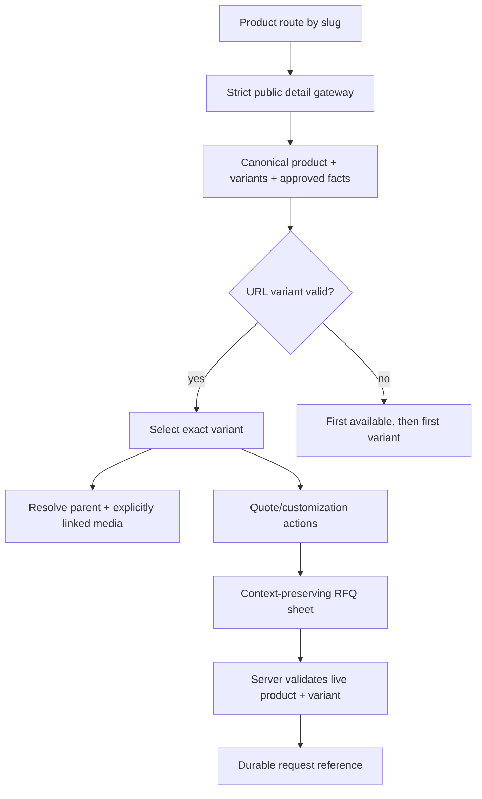
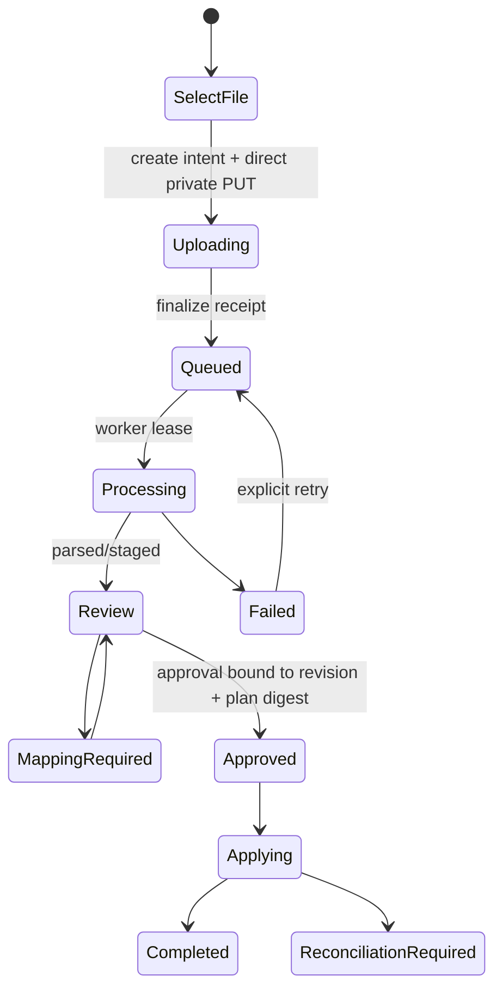

# Dianxiaomi import + Catalog storefront UI integration HLD

Date: 2026-09-02  
Status: HLD approved; detailed LLD/MIU planning complete; **no frontend implementation or branch merge in this document**

Detailed artifacts:

- `IMPORT-STOREFRONT-UI-TECHNOLOGY-CHOICES-2026-09-02.md`
- `IMPORT-STOREFRONT-UI-LOW-LEVEL-DESIGN-2026-09-02.md`
- `IMPORT-STOREFRONT-UI-MIU-BREAKDOWN-2026-09-02.md`
- `IMPORT-STOREFRONT-UI-TASK-REGISTRY.json`

## 0. Decision

Implement the approved product-detail/RFQ experience on top of the in-progress family-neutral Catalog architecture, not by extending the old Headphones components or copying the prototype into production.

Do **not** merge `origin/refactor/catalog-architecture-hardening@759a214` into `origin/feat/dianxiaomi-excel-import@0cf5526` now:

- the refactor has released MIUs 01–11 of 49; MIU 12 is the sole active MIU and is release-blocked until `Gallery.tsx` delegates effective-URL normalization, deduplication, ordering and the nine-item bound to `createCatalogMediaState`;
- its route/controller, family adapters, application state, media journey, legacy contract retirement and deployment gates are not finished;
- the only current mechanical file overlap is `apps/functions/public-api/src/handler.ts`, but it is a semantic collision: the refactor makes the strict public projection authoritative while the import branch attaches variants directly inside the legacy handler;
- the refactor's strict `PublicProductSchema` currently has no variants, approved structured specifications or RFQ context, so a blind merge would either reject imported payloads or reintroduce duplicate schema authority.

Design now against the stable seams already established by the refactor. Implement public storefront work only after those seams receive the additive variant/spec/RFQ contract and the route composition owner is ready. The independent Admin import review surface can proceed earlier, but production upload/apply actions are still blocked by their backend/runtime MIUs.

## 1. Verified baseline and correction to scope

### What is already complete enough to reuse

- provider-neutral `CatalogSourceAdapter<Input>` and candidate contracts;
- real Dianxiaomi/Lazada workbook parsing and calibrated aliases;
- grouping of 312 rows into 77 parent products and 289 variants;
- store listing provenance and non-summing inventory reconciliation;
- source identity, deterministic links, staging, local publish planning and local product/variant writes;
- category mapping seam, media fetch policy and local media migration proof;
- a read-only Admin import preview and public variant projection prototype;
- focused tests and green branch CI at `0cf5526`.

### What is not complete

- the Admin page cannot upload a workbook, create/finalize a private upload intent, start/cancel/retry a durable import, approve a revision or apply a reviewed plan;
- no production private CloudBase Run parser/worker/dispatcher path exists;
- imported media is not yet in the production CloudBase private/public lifecycle;
- `candidate.attributes` and description parse evidence are discarded when the current local publisher writes `products`; the approved structured specification UI therefore has no public durable source yet;
- public imported variants are not rendered by the production storefront; the import branch only adds the DTO/API attachment;
- the existing generic `InquiryForm` simulates success with no backend, while `submitProject` persists a generic OEM project and cannot preserve trusted product/variant context;
- category mappings, USD policy, test-environment deployment and exact CloudBase acceptance remain open.

Conclusion: the parser/adapter/domain core is strong, but the production backend and approved UI flow are **not** merely a small frontend-backend wiring task.

## 2. Design source and non-production artifacts

The interaction source is the approved Option 2 product-detail/RFQ prototype currently present only in the separate, dirty import worktree:

- `docs/dianxiaomi-excel-import/PRODUCT-DETAIL-UX-RESEARCH.md`
- `docs/dianxiaomi-excel-import/product-detail-rfq-prototype/`

Those files are design evidence, not production code. The prototype's client-only data-state switcher, simulated success, hard-coded Xiaomi facts and public “source conflicts requiring review” block must not ship.

The production design must preserve these approved behaviors:

- one selected variant, not all variants as equal cards;
- explicit option controls plus optional compact all-SKU disclosure;
- gallery-to-variant switching only when the imported mapping is explicit;
- conservative structured descriptions with all unparsed text retained;
- distinct selected-variant RFQ and customization paths;
- coherent full/partial/main-data-missing layouts;
- mobile-first variant access and a context-preserving bottom-sheet RFQ.

## 3. DESIGN SPECIFICATION

### 3.1 Purpose Statement

Give a B2B buyer a trustworthy view of one canonical Channel product, its selectable SKU variants, sourced specifications, availability and quote/customization paths, while giving an operator an auditable import/review workflow that never guesses missing or conflicting source data.

### 3.2 Aesthetic Direction

Use the existing Channel visual language: **precision industrial editorial**. Product imagery and verified facts receive quiet white space and strong hierarchy; Channel navy conveys engineering authority; amber is reserved for the primary commercial action. Warnings use restrained semantic colors and stay in Admin. The public page should feel like a credible manufacturing catalog, not a consumer marketplace clone or a generic dashboard.

### 3.3 Color Palette

Use existing tokens only:

| Role | Token | Value |
| --- | --- | --- |
| Primary brand/action | `brand-700` | `#2f3da3` |
| Strong brand | `brand-800` | `#1f2a73` |
| Dark surface | `brand-950` / `surface-dark` | `#0b1030` |
| Primary RFQ accent | `accent-500` | `#f59e0b` |
| Accent hover | `accent-400` | `#ffb820` |
| Text | `ink` | `#0f172a` |
| Secondary text | `ink-soft` | `#334155` |
| Muted text | `ink-muted` | `#64748b` |
| Alternate surface | `surface-alt` | `#f6f8fc` |

Semantic warnings/errors/success reuse existing slate/amber/rose/emerald scales. No new one-off brand palette is introduced.

### 3.4 Typography

- Headings and product names: existing `font-display` = Poppins 500/600/700.
- Body, forms and technical rows: existing `font-sans` = Inter 400/500/600.
- SKU and digests: existing monospace utility only where auditability benefits.
- Long imported prose uses Inter with a readable line length and never a dense full-width paragraph wall.

The project already loads these brand fonts; this is an intentional brand-system override, not a new font decision.

### 3.5 Layout Strategy

- Desktop product detail: max-width existing `--width-container`; media and commercial configuration use a 1.08/0.92 two-column hero; specifications follow in a secondary 0.65/1.35 grid.
- Tablet: one-column hero, then highlights and structured specifications.
- Mobile: title/summary, main media, horizontal gallery, **visible variant-change control**, SKU/availability, sticky RFQ bar, then compact specification accordions. The prototype's `display:none` mobile variant controls are not acceptable; use a `Change variant` trigger that opens an accessible option sheet or inline scrollable option groups.
- Admin: retain the existing responsive `DashboardShell`; use feature-specific import pages inside its content area rather than a new shell.

## 4. User-visible flows

### 4.1 Public product detail



Rules:

1. `?variant=<publicVariantId>` is the shareable selection state. Invalid or archived IDs fall back deterministically and never reveal private source IDs.
2. Each option group renders as an accessible radio/toggle group. Impossible combinations are disabled; unavailable complete variants remain identifiable but cannot be quoted without an explicit out-of-stock policy.
3. Choosing a variant updates SKU, option summary, exact inventory when present, quote context and explicitly linked featured media.
4. A gallery item changes the variant only when it carries an unambiguous `variantId` or option-value link. Parent/lifestyle/packaging media only changes the active image.
5. A compact `View all SKUs` disclosure remains available for procurement users; it is not the primary interaction.

### 4.2 Structured description

Render only operator-approved public structures:

- 4–8 sourced highlights;
- specification groups as label/value definition rows;
- description paragraphs/bullets that were not classified as specs;
- one collapsed `Additional details` area for supported but lower-priority fields;
- no internal finding codes, raw source URLs, supplier account/store names or contradictory values on the public page.

Conflicts and unmatched fragments remain visible in Admin review. A conflict prevents that field from becoming a public fact; it does not silently choose one value.

### 4.3 RFQ and customization

`Request a quote` and `Ask about customization` share a shell but are distinct intents:

| Intent | Required context | Buyer input |
| --- | --- | --- |
| `variant_quote` | product, selected variant, SKU/options, image, current availability | quantity, target delivery date, contact/company/country |
| `customization` | product and current variant as reference, not a promise | customization type, free brief, estimated quantity, contact/company/country |

Do not redirect to `/#oem-inquiry` and lose context. Do not reuse the client-only `InquiryForm` simulated success. Do not overload `oemProjects`: a greenfield OEM drawing/project and a quote for an existing SKU have different lifecycle, fields and sales meaning.

Create a dedicated `catalogQuoteRequests` boundary. The browser submits only identifiers and buyer-entered data; the server re-reads the published product and variant, validates availability/selection, and stores a server-derived immutable display snapshot. This prevents a caller from forging product name, SKU, image or price in the sales record.

## 5. Missing-data rendering contract

| Data state | Public rendering | Admin rendering |
| --- | --- | --- |
| Main media absent | stable aspect-ratio dashed placeholder; no broken image; RFQ can still proceed if policy allows | missing-media finding and source retry status |
| Some gallery media absent | render only available thumbnails; no blank slots | show expected roles/URLs and per-item migration status |
| Variant image absent | keep parent gallery; option selection changes SKU/stock but not image | explicit “no variant-media mapping” fact |
| Short description absent | omit the prime blurb and move directly to verified configuration; one compact note only if needed for client review | show missing/fallback provenance |
| Specs partially present | render only populated rows/groups; keep lower-priority present data under Additional details | show every parsed/unparsed field and warnings |
| Specs entirely absent | keep section heading plus one calm empty state; no empty accordion rows | show supported empty fields and raw-description state |
| Optional XLSX cell empty | no main-layout slot; optional field may appear as `Not provided` only inside collapsed Additional details | always visible with source column identity |
| Inventory unknown/conflicting | no number; show `Availability to be confirmed` | preserve snapshots and conflict values |
| No variants | hide selector and all-SKU disclosure; product-level RFQ remains available | identify product as single-configuration |

Empty-state components must maintain geometry without inventing data. The public page never displays “0” for missing inventory, a placeholder marketing claim, or a guessed variant image.

## 6. Target data contracts

### 6.1 Staged/Admin review contract

Extend the provider-neutral staged candidate without exposing it directly to the storefront:

```ts
interface ParsedDescriptionEvidence {
  rawDescription: string;
  paragraphs: string[];
  highlights: Array<{ text: string; sourceRef: string }>;
  specifications: Array<{
    group: string;
    normalizedKey: string;
    originalLabel: string;
    value: string;
    sourceRef: string;
  }>;
  unmatchedFragments: Array<{ text: string; sourceRef: string }>;
  conflicts: Array<{ normalizedKey: string; candidates: string[]; sourceRefs: string[] }>;
  parserVersion: string;
}
```

Extraction remains deterministic and conservative: dedicated columns win; recognized key boundaries split values; unknown fragments are preserved; conflicting values never auto-promote.

### 6.2 Canonical operator-approved data

Do not publish the staged evidence object wholesale. Add an operator-owned approved view to the canonical product, for example:

```ts
interface CatalogContentBlocks {
  highlights?: string[];
  descriptionBlocks?: Array<
    | { kind: 'paragraph'; text: string }
    | { kind: 'bulletList'; items: string[] }
  >;
  specificationGroups?: Array<{
    key: string;
    label: string;
    rows: Array<{ key: string; label: string; value: string }>;
  }>;
}
```

The exact field name must be settled with the Catalog refactor owner. It is operator-owned on repeat import, just like title/description/category/image order: later source observations create review diffs instead of overwriting approved B2B copy.

### 6.3 Strict public summary/detail schemas

The refactor's `@vibelingan-channel/shared/catalog` remains the only public contract owner. Keep the list contract lean and byte-compatible. Add a strict detail schema that extends the summary with bounded variants and approved content, then update the detail projection and browser gateway through that owner:

```ts
interface PublicVariant {
  id: string;
  sku: string;
  optionValues: Record<string, string>;
  inventory?: number;
  images?: string[];
}

type PublicProductSummary = PublicProduct;

interface PublicProductDetail extends PublicProductSummary {
  variants?: PublicVariant[];
  content?: CatalogContentBlocks;
}
```

`GET /api/products` continues to return summaries without variants/content. `GET /api/products/:id` and the slug route return `PublicProductDetail`. Bounds are mandatory: variant count, option count/length, public media count, groups/rows/text length. Unknown keys continue to fail closed. Store listings, source CNY prices, source account/store IDs, inventory snapshots, raw findings and raw supplier URLs remain private.

## 7. Frontend module boundaries

```text
apps/site/src/catalog/
  infrastructure/
    catalog-api.ts                 # strict list/detail decode only
    catalog-quote-api.ts           # submit/retry receipt only
  application/
    catalog-detail-state.ts        # fetch + selected variant + URL state
    catalog-quote-state.ts         # sheet steps and submission state
  presentation/
    CatalogDetail.tsx              # family-neutral composition shell
    CatalogMediaGallery.tsx        # MIU 12-compatible media journey
    CatalogVariantSelector.tsx     # option matrix; no fetch
    CatalogSkuDisclosure.tsx       # subordinate all-SKU view
    CatalogSpecifications.tsx      # approved groups/empty states
    CatalogQuoteSheet.tsx          # variant_quote/customization steps
  families/
    catalog-family-adapter.ts      # labels, grouping and category copy only
```

Principles:

- infrastructure owns HTTP/envelope/schema decode;
- application state owns request generations, aborts, stale-response guards, selected variant and URL synchronization;
- presentation receives family-neutral view models and callbacks; it does not import Dianxiaomi, Alibaba or concrete family modules;
- family adapters provide labels, fact grouping and empty copy, never fetching or React state;
- imported source facts become canonical/public contracts before presentation; UI does not parse raw description text or XLSX fields;
- `CatalogDetail` must accept injected quote actions/slots or callbacks. It must stop owning the hard-coded `OEM_INQUIRY_HREF` redirect.

## 8. Admin import interaction architecture

The current `CatalogImportPage` is a one-page, first-100-items read-only viewer. The production flow becomes:



Admin pages/components:

- `CatalogImportJobsPage`: job history, status, retry/cancel, source digest and release identity;
- `CatalogImportUploadPanel`: file selection, limits, upload progress and finalize recovery;
- `CatalogImportJobSummary`: source/output counts, currency warning and phase status;
- `CatalogImportReviewTable`: cursor pagination, filters, bulk selection and compact rows;
- `CatalogImportProductDrawer`: product, variants, inventory evidence, media preview, description/spec evidence and findings;
- `CatalogCategoryMappingPanel`: source category → Channel family/category decision;
- `CatalogPublishPlanPanel`: create/update/blocked counts, immutable plan digest and approval;
- `CatalogApplyResult`: per-item result, reconciliation required and public verification links.

Leaf components do not call `fetch`. A `CatalogImportGateway` owns typed actions. Private/unpublished media is fetched through an authenticated preview route and rendered as a Blob object URL; URLs are revoked on replacement/unmount. Supplier/COS URLs are never placed in the production Admin DOM.

## 9. API interactions

| User action | API contract | Durable effect |
| --- | --- | --- |
| Choose workbook | none; local type/size hint only | none |
| Start upload | `createCatalogImportUploadIntent` | pending intent/object key |
| Upload bytes | signed raw PUT to exact private object | private bytes only |
| Finalize | `completeCatalogImportUpload` with exact receipt | queued job, measured size/hash |
| Watch job | `getCatalogImportJob` / paged list, polling with backoff | none |
| Review items | `listCatalogImportItems(cursor, filters)` | none |
| Preview media | authenticated byte route | none; browser-local Blob only |
| Map category | generic/explicit mapping mutation | operator mapping revision |
| Preview publish | `planCatalogImport(jobId, revision)` | immutable plan/digest only |
| Approve | `approveCatalogImport(jobId, revision, planDigest)` | approval audit |
| Apply | `applyCatalogImport(jobId, revision, approvalId)` | async canonical writes |
| Submit RFQ | `submitCatalogQuoteRequest` | durable server-derived request + reference |

Every state-changing action is server-authorized. The UI displays backend-derived action availability; it does not guess that a job is approvable from client-side counts.

## 10. Responsive and accessibility requirements

- Minimum supported width: 320 px; acceptance at 390×844 and 1440×1024.
- No horizontal page overflow. Wide audit tables use contained horizontal scroll with visible row identity; public SKU selection does not require a table scroll.
- Mobile always exposes a `Change variant` action. The selected configuration and RFQ CTA remain visible in the sticky bar without hiding the selector permanently.
- Touch targets are at least 44×44 CSS px.
- Option groups use radios or equivalent `aria-pressed` controls with text labels; color alone never conveys selection.
- Variant/SKU/inventory changes use a restrained live region; focus remains on the triggering control.
- RFQ sheet is a real dialog with focus trap, Escape/backdrop close, restored trigger focus, scroll lock and reduced-motion support.
- Accordions use `aria-expanded`; collapsed panels have zero visible height and are removed from the accessibility tree. No “leaked” first line below a closed header.
- Loading, error, empty, stale/retry and success states are specified for every remote interaction.

## 11. Branch and conflict strategy

### Current facts

| Workstream | Remote SHA | Status |
| --- | --- | --- |
| Dianxiaomi import | `0cf5526` | draft PR #29; CI green; production runtime/UI gaps remain |
| Catalog refactor | `759a214` | MIUs 01–11/49 released; MIU 12 active but release-blocked on Gallery delegation; no deployment authorized |
| Common base | `9ddda855` | branches have 71 vs 41 unique commits |

### Recommendation

1. **Do not merge either feature branch into the other now.**
2. Give the Catalog refactor owner this HLD as an interface requirement. Reserve one later MIU to extend the shared strict schema/projection/gateway with variants and approved content, and one to replace the hard-coded OEM CTA with injected RFQ actions.
3. Continue backend import production MIUs independently; Admin-only files have low current overlap with the refactor.
4. When the Catalog refactor's schema, route/controller and media journey are released and its branch has review/CI evidence, merge it to `main` first (or to an explicitly approved integration base).
5. Update the import branch from that reviewed base. Resolve `public-api/handler.ts` by preserving `projectPublicProduct` as the only projection owner and adding batched variants through that contract; do not keep the import branch's independent `PublicVariant`/legacy DTO authority.
6. Implement storefront/RFQ components on the updated import/integration branch. Do not copy `HeadphonesProductDetail` or the standalone prototype styles.
7. Retain one PR/workstream for the integrated import + storefront release if that is the user's release model; use MIU commits inside it, not extra overlapping feature PRs.

Waiting for all refactor work before doing any useful work is unnecessary. The safe split is:

- can proceed in parallel: partner inquiry, import worker/backend, Admin job/review components behind stable local interfaces, RFQ domain/API design;
- must wait for/refine with the refactor: public product schema, public projection, `CatalogDetail`, media journey, family-neutral route/controller and final storefront integration.

## 12. Technical MIUs

### MIU UI-01 - Freeze import/storefront contracts

- **Runtime problem:** strict refactor schema rejects import variants; current import handler has duplicate projection authority.
- **Data:** bounded PublicVariant + approved content schemas; private source evidence stays outside public projection.
- **Fix:** extend shared schema, projection and gateway atomically; characterization tests prove old products remain byte-compatible.
- **Tests:** strict unknown-key rejection; batched variants; unknown/conflict inventory omission; no source/private fields; legacy product parity.

### MIU UI-02 - Preserve structured description evidence

- **Runtime problem:** `candidate.attributes`/parse evidence disappear during publication, so UI would need to reparse prose.
- **Fix:** deterministic extraction with provenance/conflicts in staging; explicit operator approval into canonical content blocks.
- **Tests:** real workbook fixtures, colon/URL/ratio boundaries, conflicting duplicate keys, unmatched-fragment preservation, repeat-import operator ownership.

### MIU UI-03 - Family-neutral variant selection state

- **Runtime problem:** flat SKU cards and no production storefront variant interaction.
- **Fix:** pure option-matrix/selection reducer, URL restoration and explicit media mapping.
- **Tests:** default selection, invalid URL variant, impossible combinations, shared gallery image does not change SKU, explicit variant image does.

### MIU UI-04 - Product detail presentation

- **Runtime problem:** old Headphones detail and current generic detail lack variants/spec/empty-state composition.
- **Fix:** deepen `CatalogDetail` via family-neutral slots/components, preserving refactor dependency rules.
- **Tests:** full/partial/main-missing/no-variant states, no internal findings, no horizontal overflow source assertions.

### MIU UI-05 - Durable catalog RFQ

- **Runtime problem:** existing catalog inquiry simulates success; OEM redirect loses product/variant context.
- **Fix:** `catalogQuoteRequests` schema and unauthenticated, rate-limited, idempotent submit action that re-resolves product/variant and records a server-derived snapshot.
- **Tests:** forged context ignored, unpublished/archived product denied, invalid variant denied, duplicate submit idempotent, quote vs customization validation, email failure does not erase durable receipt.

### MIU UI-06 - Responsive RFQ sheet

- **Runtime problem:** buyer must retain selected configuration across a multi-step mobile flow.
- **Fix:** controlled state machine for requirements → contact → review → durable receipt, with trigger-focus restoration.
- **Tests:** validation/focus/escape/backdrop/reduced motion; selected variant survives open/back/retry; no simulated success.

### MIU UI-07 - Production Admin import journey

- **Runtime problem:** current Admin is read-only and first-page-only; no upload/approve/apply flow.
- **Fix:** typed gateway + job state machine + cursor review + revision/digest-bound approval. Private media uses authenticated bytes and revoked Blob URLs.
- **Tests:** stale async response guard, parent blocked during upload, object URL cleanup, action availability from server, pagination/filter correctness, retry/cancel boundaries.

### MIU UI-08 - Browser and integration gate

- **Runtime problem:** source/render tests cannot prove responsive interaction or deployed API compatibility.
- **Fix:** real workbook in local/test environment, exact release build, desktop/mobile Playwright journeys, then bounded test deployment only after authorization.
- **Tests/evidence:** 77 products/289 variants acceptance, representative no-image/partial/full products, quote receipt, admin preview/apply, 390×844 and 1440×1024 screenshots, Chromium + WebKit, no console/hydration error.

## 13. Business boundary correction

| Boundary | Decision |
| --- | --- |
| Ownership | source account/store provenance stays private; Channel canonical product and operator-approved content are independent |
| Actor | public buyer may submit RFQ; admin reviews/applies imports; worker/dispatcher mutate source staging; contributor permissions remain a separate explicit policy |
| Durable data | source evidence, staged candidates, approval, canonical product/variants and quote receipt are durable; browser selection and Blob URLs are ephemeral |
| Money/value | source CNY is never rendered as approved website USD; quote is not a committed sale/price |
| Time/concurrency | job revision/approval digest, worker lease, idempotent apply and RFQ idempotency arbitrate races |
| Storage | source workbook/media remain private until approved lifecycle; object and DB writes require compensation/reconciliation |
| External provider | Dianxiaomi/Alibaba/CDN failures create findings/retries, never invented facts or destructive absence conclusions |
| User-visible truth | public page shows only approved data; unknown/conflicting inventory has no numeric promise; successful RFQ means a durable reference exists |

Correction result: `needs-design` only for USD pricing policy, who may approve/apply, RFQ sales SLA/status lifecycle and whether out-of-stock variants accept enquiries. These must be confirmed before the relevant implementation MIU; all other UI boundaries above are sufficiently defined.

## 14. Implementation acceptance gates

No frontend workstream is complete until all of the following are true:

1. shared schema/projection/gateway is single-owner and strict;
2. old/manual/Alibaba/imported product payloads pass compatibility tests;
3. full, partial, media-missing, specs-missing, no-variant and conflict states render intentionally;
4. product/variant/media/RFQ interactions are verified in a real browser at desktop and mobile sizes;
5. RFQ success corresponds to a durable backend reference, not a timeout simulation;
6. private source/media fields never appear in public responses or DOM;
7. local real-workbook counts remain 312/77/289 and public rendering is sampled across all four families;
8. test-environment mutation happens only after explicit environment/release authorization; production remains separately gated.
