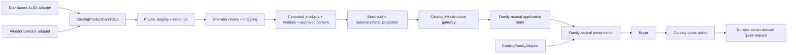
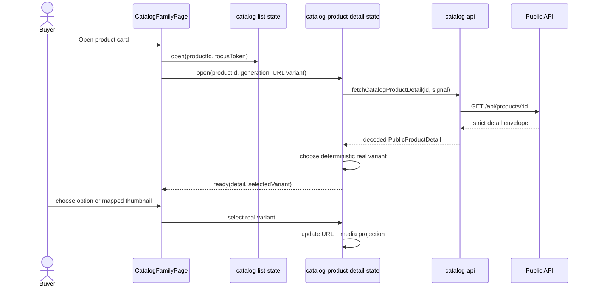
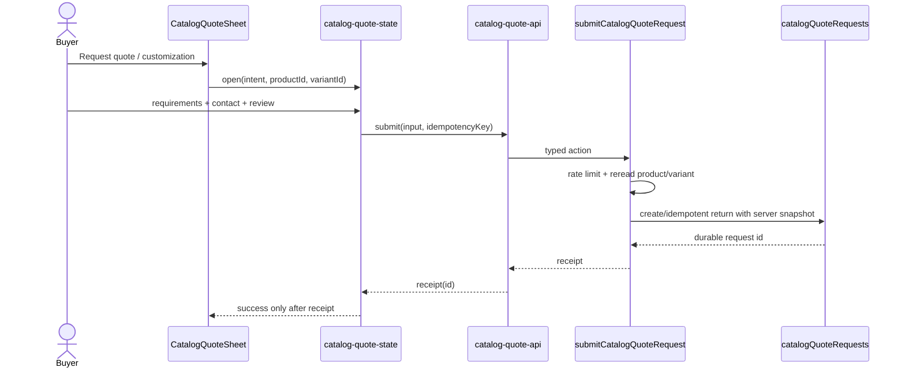
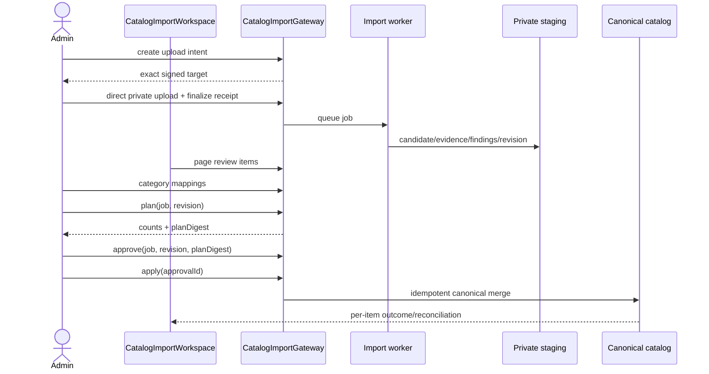

# Dianxiaomi import + Catalog storefront UI low-level design

Date: 2026-09-02  
Status: design-only; implementation, merge, deployment and data mutation are out of scope  
Companion HLD: `IMPORT-STOREFRONT-UI-INTEGRATION-HLD-2026-09-02.md`  
Companion MIUs: `IMPORT-STOREFRONT-UI-MIU-BREAKDOWN-2026-09-02.md`  
Technology choices: `IMPORT-STOREFRONT-UI-TECHNOLOGY-CHOICES-2026-09-02.md`

## 0. Verified implementation baselines

| Workstream | Verified remote head | Design consequence |
| --- | --- | --- |
| Dianxiaomi import | `origin/feat/dianxiaomi-excel-import@0cf5526` | Reuse the provider-neutral candidate, identity, staging, inventory and publication services. Replace its independent public variant DTO after integration. |
| Catalog refactor | `origin/refactor/catalog-architecture-hardening@759a214` | MIUs 01–11 are released. MIU 12 is active but cannot release until `Gallery.tsx` delegates effective-URL normalization/deduplication/bounding to `createCatalogMediaState`. |
| Catalog refactor common base | `origin/main@78506d5` | No feature-to-feature merge is performed by this design task. |

Observed from the real workbook acceptance already committed on the import branch: 312 source rows, 77 parent products and 289 variants. Those counts are regression evidence for the importer, not a storefront pagination contract.

## 1. Architectural decision

The storefront is provider-neutral. Dianxiaomi, Alibaba and future adapters end at source observation/staging. They never select a React component, route, family or public field directly.



The dependency direction remains the refactor's direction:

```text
route/controller -> family adapter + application + presentation -> public contracts
infrastructure -> public contracts
source adapter -> import contracts -> staging/publish service -> canonical catalog
```

Forbidden reverse edges:

- presentation must not import Dianxiaomi/Alibaba modules, fetch, routes or concrete family adapters;
- application must not import React, Astro, content files or concrete family adapters;
- family adapters must not import React, application state, HTTP or source adapters;
- public projection must not expose source accounts, stores, raw supplier URLs, findings or inventory snapshots;
- browser code must not parse raw XLSX description text into product claims.

## 2. Ownership map and seams

| Module | Owns | Does not own |
| --- | --- | --- |
| `@vibelingan-channel/catalog-import` | source-neutral candidates, description evidence, deterministic extraction | canonical/public DTOs, UI copy |
| import publish service | identity binding, source-to-canonical merge, operator-owned-field preservation | storefront layout, pricing policy |
| `@vibelingan-channel/shared/catalog` | strict public summary/detail schemas and bounds | database reads, React |
| `project-public-product.ts` | canonical product to public summary projection | variants query, HTML/UI |
| `project-public-product-detail.ts` | detail-only variants/content composition | list payload, source DTOs |
| `catalog-api.ts` | HTTP, envelope and strict schema decoding | React state, family copy |
| `catalog-list-state.ts` | list query/page/open/back/focus | variant matrix, quote flow |
| `catalog-product-detail-state.ts` | detail generation, selected variant, URL command state | React, family labels |
| `catalog-media.ts` | effective URL normalization, dedupe, order, nine-item bound, failures | variant semantics |
| `catalog-variant-media.ts` | selected-variant source ordering and unambiguous image-to-variant links | URL normalization/deduplication |
| `CatalogFamilyAdapter` | labels, supported facts, grouping, empty copy | state, fetching, JSX |
| presentation components | accessible rendering of supplied view models | provider logic, raw parsing |
| quote action | authorization/rate limit/idempotency/server-derived snapshot | trusting product context from browser |

The list state and product-detail state are intentionally separate. Refactor MIU 21 can continue to own query/filter/page/open/back. The import UI adds a complementary detail module keyed by the selected `_id`; it does not fork or replace `catalog-list-state.ts`.

## 3. Network and canonical contracts

### 3.1 Keep list summaries lean

`GET /api/products` continues to decode with the existing strict `CatalogPageSchema`. It does not include `variants` or `content`. This avoids sending up to 50 variants for every card and preserves old products byte-for-byte.

Both detail routes return a strict detail contract:

- `GET /api/products/:id`
- `GET /api/products/slug/:slug`

The `_id` route remains sufficient. A missing slug is never a visibility filter.

### 3.2 Strict public detail types

Normative target shape:

```ts
const PublicVariantSchema = z.object({
  id: nonEmptyString,
  sku: nonEmptyString,
  optionValues: z.record(nonEmptyString, nonEmptyString),
  inventory: nonNegativeInt.optional(),
  images: z.array(nonEmptyString).max(9).optional(),
}).strict();

const PublicCatalogContentSchema = z.object({
  highlights: z.array(nonEmptyString).max(8).optional(),
  descriptionBlocks: z.array(z.discriminatedUnion('kind', [
    z.object({ kind: z.literal('paragraph'), text: nonEmptyString }).strict(),
    z.object({ kind: z.literal('bulletList'), items: z.array(nonEmptyString).min(1).max(12) }).strict(),
  ])).max(12).optional(),
  specificationGroups: z.array(z.object({
    key: nonEmptyString,
    label: nonEmptyString,
    rows: z.array(z.object({
      key: nonEmptyString,
      label: nonEmptyString,
      value: nonEmptyString,
    }).strict()).min(1).max(32),
  }).strict()).max(12).optional(),
}).strict();

const PublicProductDetailSchema = PublicProductSchema.extend({
  variants: z.array(PublicVariantSchema).max(50).optional(),
  content: PublicCatalogContentSchema.optional(),
}).strict();
```

Additional field bounds are mandatory in the implementation: option count, option label/value length, SKU length, block text length and total decoded payload. Empty arrays are omitted by projection; they are not sent as meaningless data.

The detail projection queries variants for one product only, sorts by canonical `position` then stable id, and adds only:

- `id` from canonical variant id;
- `sku`;
- trimmed non-empty `optionValues`;
- exact non-conflicting reconciled `inventory`, otherwise no number;
- public image routes already gated by the catalog media lifecycle.

It never returns `sourceRegularPrice`, `sourcePromotionPrice`, store listing data, reconciliation alternatives or external keys.

### 3.3 Structured content has two lifetimes

Private, source-owned evidence is append/revision scoped:

```ts
interface CatalogContentEvidence {
  sourceText?: string;
  paragraphs: EvidenceText[];
  highlights: EvidenceText[];
  specifications: EvidenceFact[];
  unmatchedFragments: EvidenceText[];
  conflicts: EvidenceConflict[];
  parserVersion: string;
}

interface EvidenceText {
  text: string;
  sourceRef: string; // sheet/header/row or provider field path
}

interface EvidenceFact extends EvidenceText {
  groupKey: string;
  normalizedKey: string;
  originalLabel: string;
  value: string;
}
```

Canonical `catalogContent` is operator-owned. It contains only approved public blocks. A re-import writes a new evidence revision and diff; it does not overwrite approved content. Existing plain `description` remains compatible and is used when `catalogContent` is absent.

### 3.4 Conservative extraction rules

Generic HTML parsing is delegated to `sanitize-html` and `html-to-text` behind the import package's existing description-normalization interface. The libraries own tolerant markup parsing, tag balancing, entities, sanitization and structural text projection; Channel still owns allowed tags/zero attributes, placeholders, input bounds, source references and the following fact-promotion policy. Sanitized supplier HTML remains private evidence and is never rendered directly.

Extraction is deterministic and claim-preserving:

1. Dedicated columns and parsed `attributes` win over prose.
2. Only recognized label boundaries split a fact: line start or explicit list/table cell followed by a delimiter.
3. URL schemes, time values, ratios, model numbers and sentences containing a colon are not split by the colon alone.
4. Unknown text is preserved as an unmatched fragment.
5. Two distinct values for the same normalized key form a conflict; neither becomes a public fact automatically.
6. Empty/filler cells become absent evidence, never `0`, `No`, `Unknown` or marketing copy.
7. No LLM-generated adjective, inference or completion is allowed in the import path.

The renderer receives approved blocks. It never runs these rules in the browser.

## 4. Storefront component architecture

```text
CatalogFamilyPage                         route/controller composition root
├── CatalogGrid                           existing family-neutral list presentation
│   └── CatalogCard                       summary only
└── CatalogProductDetailController        React effects; selected product id -> detail
    ├── CatalogDetail                     family-neutral layout shell
    │   ├── CatalogMediaGallery            consumes refactor catalog-media state
    │   ├── CatalogVariantSelector         primary option-matrix interaction
    │   ├── CatalogSelectedConfiguration   selected SKU/options/availability summary
    │   ├── CatalogSkuDisclosure           compact secondary all-SKU disclosure
    │   ├── CatalogContent                 paragraphs/highlights only
    │   ├── CatalogSpecifications          populated grouped facts + empty state
    │   └── CatalogQuoteActions            injected intent callbacks
    └── CatalogQuoteSheet                  controlled dialog, rendered by controller
```

`CatalogDetail` stays provider- and family-neutral. It receives slots/view models and no longer imports `OEM_INQUIRY_HREF`.

Suggested props after refactor ownership is available:

```ts
interface CatalogDetailProps {
  product: CatalogDetailProduct;
  pricing: CatalogPricingDecision;
  facts: CatalogDetailFacts;
  media: ReactNode;
  configuration?: ReactNode;
  content?: ReactNode;
  specifications?: ReactNode;
  actions: {
    primaryLabel: string;
    onPrimary: () => void;
    secondaryLabel?: string;
    onSecondary?: () => void;
  };
  onBack: () => void;
}
```

This is a presentation seam, not a source-specific conditional. Existing families may omit the optional slots and retain the same structure.

## 5. Detail application state

### 5.1 State and commands

```ts
interface CatalogProductDetailState {
  selectedProductId?: string;
  generation: number;
  status: 'idle' | 'loading' | 'ready' | 'error' | 'not-found';
  detail?: PublicProductDetail;
  selectedVariantId?: string;
  selectionOrigin?: 'default' | 'url' | 'option' | 'thumbnail';
  error?: 'network' | 'invalid-response';
}

type CatalogProductDetailCommand =
  | { type: 'open'; productId: string; generation: number; requestedVariantId?: string }
  | { type: 'loaded'; generation: number; detail: PublicProductDetail }
  | { type: 'failed'; generation: number; reason: CatalogProductDetailState['error'] }
  | { type: 'notFound'; generation: number }
  | { type: 'selectOption'; axis: string; value: string }
  | { type: 'selectVariant'; variantId: string; origin: 'url' | 'thumbnail' }
  | { type: 'close' };
```

The controller increments `generation`, aborts the previous request and dispatches only with the request's generation. The reducer rejects stale generations. Closing detail restores the list state's saved focus token; detail state does not own list pagination.

### 5.2 Deterministic default and invalid URLs

Default variant order:

1. valid `?variant=<publicVariantId>` belonging to the product;
2. first variant with a known positive inventory;
3. first variant in canonical position order;
4. no selected variant for a no-variant product.

An invalid, archived or foreign variant id is removed from the URL via `replaceState`; it is not a 404 for the product.

The shareable URL uses public variant id, not supplier SKU. Selection updates the query with `replaceState` by default; direct share/open still restores it.

### 5.3 Option matrix

`buildVariantMatrix(variants)` derives axes and combinations from non-empty `optionValues`. `selectVariantOption` chooses a complete real variant only; it never constructs a synthetic SKU.

- If a choice keeps more than one candidate, preserve the existing choices and choose the first canonical valid completion.
- A control is disabled only when no real variant can complete the tentative combination.
- Missing values are represented by the absence of an axis on that variant; no `Unknown` option is invented.
- The selected configuration always shows SKU and known inventory. Unknown/conflicting inventory renders `Availability to be confirmed`.

## 6. Variant-aware media seam

Refactor MIU 12 remains the only owner of effective URL normalization, deduplication, the nine-item limit, active index and failure advance. This feature adds semantics before that module:

```ts
interface VariantMediaProjection {
  orderedSources: readonly string[];
  variantBySource: ReadonlyMap<string, string>; // only unambiguous links
}

function projectVariantMedia(
  productImages: readonly string[],
  variants: readonly PublicVariant[],
  selectedVariantId?: string,
): VariantMediaProjection;
```

Ordering before the media owner applies final normalization/bounding:

1. selected variant images;
2. parent/product images;
3. first explicit image for each remaining variant in canonical variant order;
4. remaining explicit variant images.

An effective URL is linked to a variant only if exactly one variant owns it and it is not also a parent image. Clicking an unambiguous thumbnail selects that variant. Parent, lifestyle, packaging, duplicate or ambiguous media changes only the active image. Selecting a variant with no explicit media keeps the parent gallery.

## 7. Description/specification rendering

`CatalogContent` renders approved blocks:

- highlights only when one or more exist;
- paragraph and bullet blocks in stored order;
- no raw HTML injection;
- no empty title or explanatory placeholder in the primary copy area.

`CatalogSpecifications` receives already-grouped rows from canonical content/family projection. It renders:

- populated priority groups first;
- lower-priority supported rows in a collapsed `Additional details` accordion;
- a single calm empty state when every group is empty;
- no empty row, no leaked accordion content and no raw finding/conflict text.

Accordion contract:

- render one native `<details>` with an immediately nested `<summary>`; do not duplicate expanded state in React;
- the closed details content has zero layout height and is absent from normal focus/navigation;
- expanded height is content-driven; no clipped fixed `max-height` animation or preview strip;
- use the optional `name` grouping only when product design requires one-open-at-a-time behavior;
- keep the summary label semantically simple and test Chromium/WebKit keyboard and screen-reader naming;
- no preview line is intentionally exposed beneath the closed header.

## 8. Missing-data layout contracts

| Scenario | Prime area | Secondary area | CTA |
| --- | --- | --- | --- |
| Complete | selected variant media, name, price/quote decision, options | highlights, grouped specs, SKU disclosure | quote + customization |
| Main media missing | fixed-ratio branded neutral placeholder | no blank thumbnails | remains available if product is published |
| Some media missing/failed | only valid unique thumbnails; failure advances | no reserved blank cells | unchanged |
| Variant media missing | parent gallery remains | selected SKU/options still change | selected variant retained |
| Description missing | omit copy block | specs move up without gap | unchanged |
| Specs partial | populated rows only | present low-priority data in Additional details | unchanged |
| Specs absent | one bounded empty-state card | no empty accordion | unchanged |
| No variants | no selector/configuration card | no all-SKU disclosure | product-level quote only |
| Inventory unknown/conflicting | `Availability to be confirmed` | never show `0 available` | policy-neutral quote remains |
| Optional source cell empty | no prime slot | Admin shows source cell as empty; public omits it | unchanged |

The same DOM and state source is used at all breakpoints. Mobile is not a separate product-detail implementation.

## 9. Responsive behavior

### Desktop, `>= 1024px`

- two-column media/information grid;
- configuration and CTA remain in the information column;
- specifications span the information width or a full-width lower section according to content density;
- maximum content width remains the existing catalog token.

### Mobile, `320px–1023px`

- media, identity, selected configuration, option controls, content/specifications flow vertically;
- a sticky bottom summary shows selected SKU/option summary and the primary quote action;
- `Change variant` scrolls/focuses the first option group; the sticky bar never substitutes for the selector;
- dialog becomes a bottom sheet at narrow widths but retains dialog semantics/focus trap;
- touch targets are at least 44×44 CSS pixels;
- no horizontal page overflow; long SKUs and values wrap with `overflow-wrap:anywhere`.

Acceptance viewports: 390×844 and 1440×1024, plus a 320 px source/geometry guard.

## 10. Catalog RFQ boundary

`Request a quote` and `Ask about customization` use one shell and two explicit intents:

```ts
type CatalogQuoteIntent = 'variant_quote' | 'customization';

interface SubmitCatalogQuoteInput {
  idempotencyKey: string;
  intent: CatalogQuoteIntent;
  productId: string;
  variantId?: string;
  quantity?: number;
  targetDeliveryDate?: string;
  customizationTypes?: string[];
  customizationBrief?: string;
  contact: {
    name: string;
    email: string;
    company: string;
    country: string;
    whatsapp?: string;
  };
}
```

The browser sends identifiers and buyer-entered fields only. The server re-reads the currently published/non-archived product and verifies that the variant belongs to it. It stores a bounded immutable snapshot:

```ts
interface CatalogQuoteProductSnapshot {
  productId: string;
  productName: string;
  productFamily: ProductFamily;
  variantId?: string;
  sku?: string;
  optionValues?: Record<string, string>;
  publicImagePath?: string;
  availabilityAtSubmission: 'known-available' | 'known-unavailable' | 'unknown';
  publicPricingMode: CatalogPricingDecision['source'];
}
```

No browser-supplied name, SKU, image, inventory or price is trusted. Rate limiting and idempotency happen before notification. A successful response contains a durable request reference. Email/notification failure is recorded for retry and does not delete the accepted request.

The initial storage status is `new`. Further sales lifecycle values and SLA copy remain a business gate; the UI must not promise `within 24 hours` until approved for catalog quotes.

### Quote sheet state

```ts
type QuoteStep = 'requirements' | 'contact' | 'review' | 'submitting' | 'receipt';

interface CatalogQuoteState {
  open: boolean;
  intent: CatalogQuoteIntent;
  step: QuoteStep;
  productId?: string;
  variantId?: string;
  submissionGeneration: number;
  idempotencyKey: string;
  receiptId?: string;
  error?: 'network' | 'invalid' | 'stale-product' | 'rate-limited';
}
```

`react-hook-form` owns the field draft, touched/dirty state, focus-to-error and field messages. The shared Zod quote schema, connected through `@hookform/resolvers/zod`, owns shape/bounds and intent-specific validation. The application state above owns only workflow identity, steps, stable retry idempotency and a durable receipt.

`CatalogQuoteSheet` wraps a native `<dialog>` opened with `showModal()`. Desktop styling is a centered dialog and mobile styling is a bottom sheet; both use the same element and form. Opening snapshots the current public product/variant identifiers into application state. Back/forward preserves form values. A variant changed behind the sheet requires explicit refresh/review before submit; silent substitution is forbidden.

## 11. Admin import architecture

Feature-specific Admin code lives under `apps/site/src/islands/admin/catalog-import/`. It does not extend the refactor's generic `RecordForm`, `CollectionView`, `FilterBuilder` or `QuantityTierPricingEditor`.

```text
CatalogImportWorkspace                    controller/island
├── CatalogImportJobList                  job selection/history
├── CatalogImportUploadPanel              create intent -> PUT -> finalize
├── CatalogImportJobSummary               counts, revision, warnings, progress
├── CatalogImportReviewTable              cursor rows + filters
│   └── CatalogImportProductDrawer        variants/media/evidence/findings
├── CatalogCategoryMappingPanel           source taxonomy -> Channel family/category
├── CatalogPublishPlanPanel               create/update/blocked + plan digest
└── CatalogApplyResult                    per-item result/reconciliation
```

Leaf components receive data/callbacks and do not call `fetch`. `catalog-import-api.ts` is the transport gateway. The existing Admin `QueryClientProvider` remains the sole server-state owner: feature query hooks own job/item/plan fetching, polling, cancellation, caching and mutation invalidation. `catalog-import-workspace-state.ts` owns only selected job/drawer state, direct-upload transfer phase and the exact reviewed `jobId + revision + planDigest` identity. It does not duplicate remote response data or mutation state.

`CatalogImportReviewTable` reuses the existing `@tanstack/react-table` dependency for columns, sorting and row selection. Pagination/filtering remain server-side through query keys and cursor contracts; no all-variant client materialization or new virtualization dependency is introduced.

### Admin state invariants

- A parent form cannot finalize while direct upload is in flight.
- Query keys include job id, revision, cursor and filters, so a response cannot overwrite a different selection; terminal jobs return `false` from the polling interval.
- Approval binds exact `jobId + revision + planDigest`.
- Apply requires the server-reported approval id; client counts never imply approval.
- A partial/failed worker run cannot use absence as a deletion/unpublish signal.
- Private source media is read through an authenticated byte route, displayed with a Blob object URL and revoked on replacement/unmount.
- Supplier/COS URLs are not inserted into the production DOM.

## 12. Data flows

### 12.1 Open and configure a product



### 12.2 Submit a catalog quote



### 12.3 Import review/apply



## 13. Compatibility and migration

### Legacy product compatibility

- Oldest published product with only `_id`, `name` and `productFamily` remains list/detail visible.
- Missing slug affects canonical URL enhancement only, never detail access.
- Missing variants/content omits the relevant sections without an error.
- Existing plain description remains rendered until approved content exists.
- Existing pricing resolution remains the canonical pricing owner.

### Import branch reconciliation

After updating to the reviewed refactor base:

1. remove the import handler's independent `PublicVariant` DTO;
2. remove list-wide `attachVariants` from `GET /api/products`;
3. move detail variant composition behind `PublicProductDetailSchema` and the canonical projection seam;
4. keep its existing privacy and exact-inventory characterization tests, rebased onto the strict detail contract;
5. do not copy legacy `ProductDetail`, `HeadphonesProductDetail` or prototype layout logic.

### Source coexistence

Provider adapters may produce different evidence completeness, but the canonical/public contract is one shape. Alibaba- and Dianxiaomi-sourced products therefore use the same detail, variant, media, specification and quote components. A provider-specific field is either normalized into an approved canonical field or stays private; it never creates a provider-specific storefront page.

## 14. Parallel-work and merge protocol

| Area | Parallel now | Coordination condition |
| --- | --- | --- |
| Conservative extraction pure module/tests | Yes | New import-package files only; no public schema/UI edits |
| Variant option-matrix pure module/tests | Design complete; implementation after integration branch exists | New files; import only shared detail types |
| RFQ schema/backend | After RFQ collection/lifecycle minimum is approved | No `CatalogDetail` edit required |
| Import-specific Admin gateway/state/components | After production backend action contracts are frozen | Stay under `admin/catalog-import/`; do not edit generic Admin refactor files |
| Shared public detail schema/projection/gateway | No concurrent edits | Start after reviewed refactor integration base or explicit exact-file ownership transfer |
| Variant media | No while refactor MIU 12 is active | Wait for MIU 12 release and `Gallery.tsx` delegation proof |
| `CatalogDetail` slot/action change | Sequential | Refactor MIU 11 released, but integrate only on reviewed refactor base |
| Route/controller integration | Sequential | Wait for refactor MIUs 15–22 or explicit ownership transfer |
| Shared browser E2E/release files | Sequential | Run after both implementations consolidate |

No implementation MIU activates unless live local/remote refs and worktree paths are re-read immediately before work. Exact files reserved by another active MIU are not edited.

## 15. Verification strategy

Every implementation MIU follows red -> green -> refactor and records exact commands. The consolidated gate includes:

- strict contract tests for unknown/private keys, bounds and summary/detail separation;
- importer tests against the real workbook counts 312/77/289;
- oldest/manual/Alibaba/imported product fixtures;
- detail reducer tests for stale generations, URL restore and real-combination selection;
- media tests for effective URL dedupe, nine-item bound, explicit/ambiguous mapping and failures;
- rendering tests for full, partial, media-missing, specs-missing and no-variant states;
- quote tests for forged context, product/variant mismatch, idempotency, rate limiting and durable receipt;
- Admin tests for upload/finalize blocking, cursor paging, stale responses, approval digest and Blob URL revocation;
- Playwright at 390×844 and 1440×1024, with DOM geometry plus screenshots, console/hydration failure capture and no real third-party submission;
- package typecheck/build and the refactor architecture verifier.
- locked dependency license/engine review, `pnpm audit --prod`, bundle comparison and proof that HTML libraries do not enter browser chunks.

Deployment, CloudBase data mutation and real notification sending remain separate authorization gates.

## 16. Remaining business gates

These do not block the component/data-flow design, but they block their respective mutation/release MIUs:

1. roles allowed to approve and apply an import;
2. website USD calculation/publication policy;
3. catalog RFQ status lifecycle, recipients and response-time promise;
4. whether known out-of-stock variants accept RFQs and what copy is shown.

Until resolved, source CNY is not presented as website USD, RFQ status starts only as `new`, no response-time claim is rendered, and unknown inventory is never turned into zero.

## 17. Strongest surviving design risk

The refactor's MIUs 15–22 currently define planned, not yet released, adapter/application/controller interfaces. This LLD deliberately follows their documented dependency direction and exact-file plan, but cannot prove their final function/prop signatures before they exist. Immediately before DXUI-11 or DXUI-12 activates, re-read the released implementations and update this LLD/registry if the actual seam differs. Do not preserve this document's proposed signature by adding a compatibility wrapper that would create a second policy owner.
