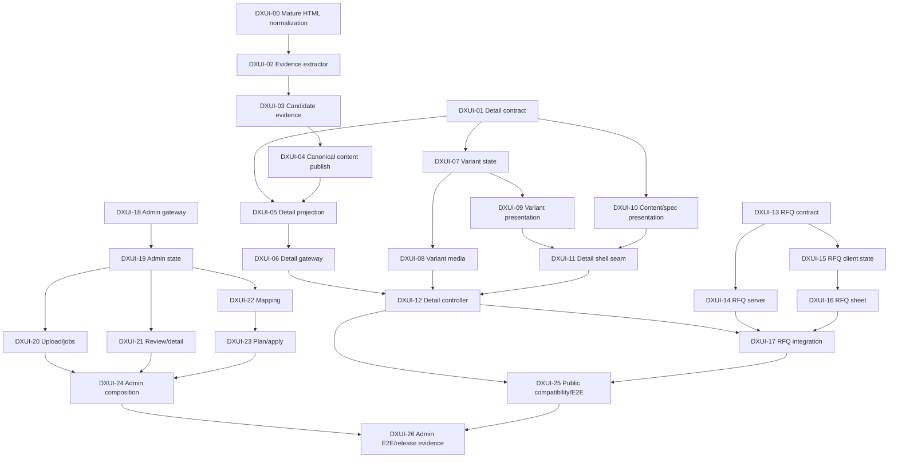

# Dianxiaomi import + Catalog storefront UI MIU breakdown

Date: 2026-09-02  
Status: detailed implementation design; all MIUs are `planned` or `blocked`, none is active  
LLD: `IMPORT-STOREFRONT-UI-LOW-LEVEL-DESIGN-2026-09-02.md`
Technology choices: `IMPORT-STOREFRONT-UI-TECHNOLOGY-CHOICES-2026-09-02.md`

## 0. Objective and non-goals

Deliver one provider-neutral Catalog experience in which imported products use the approved variant selector, structured content, resilient empty states and contextual RFQ flow, while Admin can eventually upload/review/approve/apply a real import.

This plan does not merge branches, implement code, deploy, mutate CloudBase data or send real notifications. Each future activation must re-read live refs/worktrees and reserve exact files.

## 1. External gates

| Gate | Meaning | Blocks |
| --- | --- | --- |
| `G-CAT-BASE` | Reviewed Catalog refactor integration base exists; exact local and remote SHA recorded | shared contract/projection/gateway and existing presentation edits |
| `G-CAT-MEDIA` | Refactor MIU 12 released after `Gallery.tsx` delegates effective URL normalization/dedupe/order/nine-item bound | variant-media integration |
| `G-CAT-ROUTE` | Refactor MIUs 15–22 released or exact files explicitly transferred | route/controller integration |
| `G-IMPORT-ACTIONS` | production upload/job/review/approval/apply actions and response schemas are frozen | Admin mutation UI |
| `G-RFQ-BIZ` | catalog quote lifecycle, recipients, SLA copy and out-of-stock policy approved | RFQ mutation/release, not pure UI/state design |
| `G-IMPORT-ROLE` | roles allowed to approve/apply confirmed | Admin approval/apply activation |
| `G-DEPLOY` | exact release and environment mutation/deployment explicitly authorized | deployed E2E/data verification |

Current blocker facts:

- `origin/refactor/catalog-architecture-hardening@759a214`: MIUs 01–11 released; MIU 12 active and release-blocked.
- `origin/feat/dianxiaomi-excel-import@0cf5526`: import backend/local proof exists, but production worker/media and complete Admin mutation journey do not.
- No public integration MIU edits refactor-owned files concurrently.

## 2. Dependency graph

## 3. File ownership and parallel lanes

### Safe new-file lane after plan approval

- mature source-description normalization (DXUI-00) before evidence extraction;
- `packages/catalog-import/src/catalog-content-evidence.ts` and its tests;
- `apps/site/src/catalog/application/catalog-variant-state.ts` and its tests;
- quote domain/state files, after `G-RFQ-BIZ` where behavior depends on policy;
- import-specific files under `apps/site/src/islands/admin/catalog-import/`, after API contracts are frozen.

### Sequential-only lane

- `packages/shared/src/catalog/index.ts`;
- `apps/functions/public-api/src/handler.ts` and canonical projection files;
- `apps/site/src/catalog/infrastructure/catalog-api.ts`;
- `apps/site/src/catalog/presentation/CatalogDetail.tsx`;
- `apps/site/src/catalog/application/catalog-media.ts` / `ProductMedia.tsx` / `Gallery.tsx`;
- `apps/site/src/catalog/application/catalog-list-state.ts`;
- `apps/site/src/islands/shop/CatalogFamilyPage.tsx`;
- shared Catalog E2E/release files.

These files activate only after their refactor owner releases or explicitly transfers them.

## 4. MIUs

### DXUI-00 — Replace the hand-written HTML parser

- **State:** `planned`; run before DXUI-02.
- **Exact files:** `packages/catalog-import/package.json`, `packages/catalog-import/src/descriptions.ts`, `packages/catalog-import/src/descriptions.test.ts`, `pnpm-lock.yaml`.
- **Runtime problem:** the import branch hand-implements malformed HTML tokenization, balancing, entity decoding, sanitization and text projection—generic parser/security infrastructure outside Channel's domain.
- **Data/lifetime/scope:** import-time private description normalization only; `sanitize-html` and `html-to-text` must never enter browser chunks.
- **Constraint:** preserve the existing exported normalization result and placeholder policy; zero source attributes; scripts/styles/forms/embedded content dropped; bounded input/depth/nodes; sanitized HTML remains private evidence.
- **Chosen fix:** delegate tolerant markup parsing/sanitization to `sanitize-html` and structural text projection to a compiled `html-to-text` converter behind the current deep interface.
- **Rejected:** another custom tokenizer, regex sanitization, browser DOM emulation, or direct supplier HTML rendering.
- **TDD:** run the current hostile/malformed/entity/placeholder corpus unchanged first; add input/depth/node limit cases, result compatibility fixtures and real-workbook normalized-count comparison before deleting scanner code.
- **Commands:** `pnpm install --frozen-lockfile=false && pnpm --filter @vibelingan-channel/catalog-import test && pnpm --filter @vibelingan-channel/catalog-import typecheck && pnpm audit --prod`.
- **Invariant/done:** generic HTML grammar/security is library-owned; every remaining custom rule is visibly Channel policy; locked license/engine/audit and runtime-size evidence are recorded.

### DXUI-01 — Canonical public product-detail contract

- **State:** `blocked` on `G-CAT-BASE`.
- **Exact files:** `packages/shared/src/catalog/index.ts`, `packages/shared/src/catalog/index.test.ts`.
- **Runtime problem:** the refactor owns a strict summary schema with no variants/content; the import branch owns a second ad hoc variant DTO and adds variants to list payloads.
- **Data/lifetime/scope:** `PublicProduct` remains the list summary. Add strict bounded `PublicVariantSchema`, `PublicCatalogContentSchema` and `PublicProductDetailSchema` for detail responses only.
- **Constraint:** shared catalog remains the single schema owner; unknown/private keys fail closed; oldest products remain valid.
- **Chosen fix:** additive detail schema extending the summary; omit empty optional arrays; explicit count/text bounds.
- **Rejected:** loosening `PublicProductSchema`, `z.any`, provider-specific unions, or variants on every list card.
- **TDD:** first assert summary rejects `variants`, detail accepts valid bounded data, detail rejects source/store/price evidence and over-limit values, and oldest summary/detail fixtures still parse.
- **Command:** `pnpm --filter @vibelingan-channel/shared test && pnpm --filter @vibelingan-channel/shared typecheck`.
- **Invariant/done:** a public payload has one strict owner; list responses stay lean and legacy-compatible.

### DXUI-02 — Conservative catalog-content evidence extractor

- **State:** `planned`; new-file lane; depends on DXUI-00.
- **Exact files:** `packages/catalog-import/src/catalog-content-evidence.ts`, `packages/catalog-import/src/catalog-content-evidence.test.ts`, `packages/catalog-import/src/index.ts`.
- **Runtime problem:** current fallback flattens title/attributes into prose, while approved UI needs sourced paragraphs/highlights/spec rows/conflicts without browser reparsing.
- **Data/lifetime/scope:** pure in-memory `CatalogContentEvidence`; source refs and parser version travel into private staging.
- **Constraint:** deterministic and provider-neutral; consume normalized text/structure through the DXUI-00 interface; no network/DB/LLM/HTML rendering.
- **Chosen fix:** classify explicit list/table/line boundaries supplied by the mature parser, normalize known labels, preserve unmatched fragments, quarantine conflicting normalized keys.
- **Rejected:** colon-only splitting, broad regex heuristics, LLM completion, or rendering sanitized supplier HTML directly.
- **TDD:** dedicated columns beat prose; URLs/time/ratios remain intact; duplicate equal facts dedupe; conflicting facts quarantine; filler/empty data stays absent; row order cannot change output.
- **Command:** `pnpm --filter @vibelingan-channel/catalog-import test && pnpm --filter @vibelingan-channel/catalog-import typecheck`.
- **Invariant/done:** every promoted fact can be traced to supplied data; no invented claim is possible.

### DXUI-03 — Attach evidence to provider-neutral candidates

- **State:** `planned`; depends on DXUI-02.
- **Exact files:** `packages/catalog-import/src/contracts.ts`, `packages/catalog-import/src/grouping.ts`, `packages/catalog-import/src/grouping.test.ts`.
- **Runtime problem:** candidate attributes/description provenance are available during grouping but no structured evidence survives into staging.
- **Data/lifetime/scope:** optional `contentEvidence` on `CatalogProductCandidate`; source-owned and revision-scoped, never canonical/public by itself.
- **Constraint:** grouping remains row-order invariant and every future provider can supply the same shape.
- **Chosen fix:** derive product-level evidence only after canonical family values are selected; merge source refs/conflicts deterministically.
- **Rejected:** Dianxiaomi-only fields in the contract or recalculating evidence during publication/UI render.
- **TDD:** shuffled rows produce identical evidence; sibling authored description outranks generated fallback; variants remain 289 for the real acceptance fixture; conflicts retain all refs.
- **Command:** `pnpm --filter @vibelingan-channel/catalog-import test`.
- **Invariant/done:** staging contains source-neutral evidence while 312/77/289 grouping behavior is unchanged.

### DXUI-04 — Persist approved canonical content without re-import overwrite

- **State:** `planned`; depends on DXUI-03 and later integration base review.
- **Exact files:** `packages/shared/src/collections.ts`, `apps/functions/admin/src/catalog-import-publish.ts`, `apps/functions/admin/src/catalog-import-publish.test.ts`.
- **Runtime problem:** publication currently discards attributes/evidence and only seeds plain description; no durable approved structure can feed the UI.
- **Data/lifetime/scope:** private staged evidence plus operator-owned canonical `catalogContent`; source revisions produce review diffs.
- **Constraint:** repeat import must preserve operator edits, category, images and approved B2B content; no CNY-to-USD projection.
- **Chosen fix:** register a validated bounded canonical field, add it to operator-owned product fields, seed only explicitly approved content, and retain source evidence in import items.
- **Rejected:** copying the entire evidence blob to public product, auto-approving conflicts, or overwriting approved content on replay.
- **TDD:** first import can write approved blocks; repeat import preserves them byte-for-byte; unapproved/conflicting facts do not enter the product; existing plain description remains compatible.
- **Command:** `pnpm --filter @vibelingan-channel/shared test && pnpm --filter @vibelingan-channel/fn-admin test`.
- **Invariant/done:** source facts and Channel-approved B2B copy have separate ownership and histories.

### DXUI-05 — Detail-only public projection and variant query

- **State:** `blocked` on DXUI-01, DXUI-04 and `G-CAT-BASE`.
- **Exact files:** `apps/functions/public-api/src/catalog/project-public-product-detail.ts`, `apps/functions/public-api/src/catalog/project-public-product-detail.test.ts`, `apps/functions/public-api/src/handler.ts`.
- **Runtime problem:** import branch `attachVariants` expands every list result and bypasses the refactor's strict projection owner.
- **Data/lifetime/scope:** one product read plus its canonical variant rows; response is ephemeral public detail.
- **Constraint:** `_id`/slug visibility gates match existing public rules; max 50 variants; exact inventory only; no N+1 list query.
- **Chosen fix:** keep `projectPublicProduct` for the summary, compose detail through a sibling projector, query variants only for id/slug detail endpoints, validate final `PublicProductDetailSchema`.
- **Rejected:** retaining independent `PublicVariant`, returning all variants in list, or exposing source prices/store snapshots.
- **TDD:** list remains byte-identical; id and slug detail are equal; variant order is stable; conflict/unknown inventory omitted; forged private fields absent; unpublished/archived records 404.
- **Command:** `pnpm --filter @vibelingan-channel/fn-public-api test && pnpm --filter @vibelingan-channel/fn-public-api typecheck`.
- **Invariant/done:** all public detail data passes the canonical strict projector once.

### DXUI-06 — Strict browser detail gateway

- **State:** `blocked` on DXUI-01, DXUI-05 and `G-CAT-BASE`.
- **Exact files:** `apps/site/src/catalog/infrastructure/catalog-api.ts`, `apps/site/src/catalog/infrastructure/catalog-api.test.ts`, `apps/site/src/test/factories/catalog.ts`.
- **Runtime problem:** the gateway only decodes summary pages; legacy API helpers own a second hand-written decoder.
- **Data/lifetime/scope:** network detail envelope becomes `PublicProductDetail`; media paths are resolved once at the infrastructure boundary.
- **Constraint:** no React/family imports; same auth entitlement header behavior; invalid response fails closed.
- **Chosen fix:** add `fetchCatalogProductDetailById` and slug equivalent using the shared schema; map product and variant media via `apiMediaUrl` without changing schema ownership.
- **Rejected:** casting JSON, reusing legacy `isProduct`, or parsing only fields the current UI happens to show.
- **TDD:** valid full/oldest/partial detail decode; unknown/private/over-limit payload rejection; 404 vs network vs invalid-response distinction; AbortSignal forwarded.
- **Command:** `pnpm --filter @vibelingan-channel/site test && pnpm --filter @vibelingan-channel/site typecheck`.
- **Invariant/done:** browser accepts exactly the server's public detail contract and nothing wider.

### DXUI-07 — Pure real-variant selection module

- **State:** `planned` after DXUI-01 types are available; new-file lane.
- **Exact files:** `apps/site/src/catalog/application/catalog-variant-state.ts`, `apps/site/src/catalog/application/catalog-variant-state.test.ts`.
- **Runtime problem:** flat SKU cards do not model option axes, impossible combinations, URL restoration or unknown inventory.
- **Data/lifetime/scope:** ephemeral browser state derived solely from bounded public variants.
- **Constraint:** pure TypeScript; no React, fetch, family copy or synthesized variants.
- **Chosen fix:** `buildVariantMatrix`, deterministic default selection and command reducer over real variant ids.
- **Rejected:** storing independent axis state that can name a non-existent SKU, selecting by supplier id, or converting absent values to `Unknown`.
- **TDD:** valid URL variant; invalid URL fallback; first known-positive inventory then first canonical variant; disabled impossible choice; duplicate option labels; no variants; inventory 0 vs absent.
- **Command:** `pnpm --filter @vibelingan-channel/site test`.
- **Invariant/done:** every selected configuration corresponds to exactly one returned canonical variant.

### DXUI-08 — Variant-media semantic projection

- **State:** `blocked` on DXUI-07 and `G-CAT-MEDIA`.
- **Exact files:** `apps/site/src/catalog/application/catalog-variant-media.ts`, `apps/site/src/catalog/application/catalog-variant-media.test.ts`.
- **Runtime problem:** thumbnail clicks cannot safely select a variant, and duplicate/parent images can falsely imply a SKU mapping.
- **Data/lifetime/scope:** ephemeral ordered source list plus unambiguous effective-source-to-variant map.
- **Constraint:** `createCatalogMediaState` remains the only URL normalize/dedupe/order-bound/failure owner.
- **Chosen fix:** order selected variant, parent and remaining variant sources before delegating; link a source only when exactly one variant owns it and no parent owns it.
- **Rejected:** reimplementing media dedupe/cap, selecting a variant from ambiguous lifestyle media, or blanking the gallery when variant media is absent.
- **TDD:** selected media first; parent fallback; shared URL not linked; unique variant URL linked; nine-item final owner still applies; selection survives failed images.
- **Command:** `pnpm --filter @vibelingan-channel/site test` plus the released MIU-12 media tests.
- **Invariant/done:** image clicks change SKU only with explicit unambiguous evidence.

### DXUI-09 — Variant selector and subordinate SKU disclosure

- **State:** `planned`; depends on DXUI-07.
- **Exact files:** `apps/site/src/catalog/presentation/CatalogVariantSelector.tsx`, `apps/site/src/catalog/presentation/CatalogSkuDisclosure.tsx`, `apps/site/src/catalog/presentation/catalog-variant-render.test.ts`.
- **Runtime problem:** showing all SKU cards at once is dense and unclear, especially on mobile.
- **Data/lifetime/scope:** presentation-only option axes, selected configuration and compact procurement disclosure.
- **Constraint:** family-neutral; no fetch/provider logic; text labels and 44 px targets; disclosure is secondary.
- **Chosen fix:** radio/pressed option groups, selected SKU/availability summary and collapsed all-SKU list.
- **Rejected:** desktop-only table, color-only swatches, hiding variant access behind the gallery, or separate mobile state.
- **TDD:** selected/disabled semantics, keyboard navigation, long labels/SKUs, unknown inventory copy, no-variant omission and all-SKU expansion.
- **Command:** `pnpm --filter @vibelingan-channel/site test && pnpm --filter @vibelingan-channel/site typecheck`.
- **Invariant/done:** a buyer can identify and change the exact real variant at every supported width.

### DXUI-10 — Approved content and resilient specification presentation

- **State:** `planned`; depends on DXUI-01.
- **Exact files:** `apps/site/src/catalog/presentation/CatalogContent.tsx`, `apps/site/src/catalog/presentation/CatalogSpecifications.tsx`, `apps/site/src/catalog/presentation/catalog-content-render.test.ts`.
- **Runtime problem:** one prose chunk is unreadable; empty/partial data can leave broken sections or leaked accordion content.
- **Data/lifetime/scope:** public approved content only; presentation has no source evidence.
- **Constraint:** no raw HTML injection, fake placeholders or internal conflicts/findings; collapsed content removed from layout/a11y tree.
- **Chosen fix:** render paragraphs/bullets, populated definition rows, lower-priority `Additional details`, and one bounded all-empty state.
- **Rejected:** browser parsing, rendering every supported empty field in prime layout, or exposing a preview line beneath a closed accordion.
- **TDD:** complete/partial/all-empty data; zero empty rows; `hidden` collapsed panel; `aria-expanded`/`aria-controls`; long values wrap; raw HTML renders as text.
- **Command:** `pnpm --filter @vibelingan-channel/site test`.
- **Invariant/done:** absent data changes density, not structure or truthfulness.

### DXUI-11 — Deepen the family-neutral detail shell

- **State:** `blocked` on DXUI-09, DXUI-10 and `G-CAT-BASE`; sequential owner of refactor MIU-11 files.
- **Exact files:** `apps/site/src/catalog/presentation/CatalogDetail.tsx`, `apps/site/src/catalog/presentation/catalog-detail.test.ts`.
- **Runtime problem:** current shell has no configuration/content/spec slots and hard-codes `OEM_INQUIRY_HREF`.
- **Data/lifetime/scope:** family-neutral React slots and intent callbacks; no quote draft or provider fields live in the shell.
- **Constraint:** retain existing pricing/facts/media/back semantics and family-neutral dependency graph.
- **Chosen fix:** additive optional slots plus injected primary/secondary actions; remove hard-coded navigation from the presentation owner.
- **Rejected:** Dianxiaomi conditional, copying `HeadphonesProductDetail`, or making the shell own RFQ network state.
- **TDD:** legacy omitted-slot parity; supplied slots render in approved order; actions invoke callbacks; no `OEM_INQUIRY_HREF`, source or concrete-family import.
- **Command:** `pnpm --filter @vibelingan-channel/site test && pnpm --filter @vibelingan-channel/site typecheck`.
- **Invariant/done:** the shell composes behavior but does not decide source, family or sales workflow.

### DXUI-12 — Product-detail application/controller integration

- **State:** `blocked` on DXUI-06–DXUI-11, `G-CAT-MEDIA` and `G-CAT-ROUTE`.
- **Exact files:** `apps/site/src/catalog/application/catalog-product-detail-state.ts`, `apps/site/src/catalog/application/catalog-product-detail-state.test.ts`, `apps/site/src/islands/shop/CatalogFamilyPage.tsx`.
- **Runtime problem:** summary selection, async detail fetch, URL variant, media selection and focus restoration have no single orchestrator.
- **Data/lifetime/scope:** ephemeral detail request generation and selection state; list state remains separately owned.
- **Constraint:** controller is the only React/family/application composition root; stale/aborted responses cannot commit.
- **Chosen fix:** pure detail reducer plus controller effects; compose adapter labels/facts with shared presentation and released media state.
- **Rejected:** merging variant logic into `catalog-list-state`, component-local fetches, or route-per-variant.
- **TDD:** open/loading/ready/error/retry/not-found; stale generation ignored; invalid URL repaired; back restores exact origin focus/page; variant-media commands agree.
- **Command:** `pnpm --filter @vibelingan-channel/site test && pnpm --filter @vibelingan-channel/site typecheck && pnpm build`.
- **Invariant/done:** one controller coordinates the flow while every policy remains in its owner module.

### DXUI-13 — Catalog quote domain and storage contract

- **State:** `blocked` on minimum `G-RFQ-BIZ` decisions.
- **Exact files:** `packages/shared/src/catalog-quote.ts`, `packages/shared/src/catalog-quote.test.ts`, `packages/shared/src/collections.ts`.
- **Runtime problem:** current catalog inquiry simulates success; `oemProjects` describes a greenfield OEM project and loses existing product/variant context.
- **Data/lifetime/scope:** durable `catalogQuoteRequests`; browser input schema separated from server-derived product snapshot and audit fields.
- **Constraint:** bounded contact/brief/options, one initial `new` state, no response-time promise or source-private fields.
- **Chosen fix:** dedicated strict input/snapshot/receipt schemas and collection policy.
- **Rejected:** overloading `oemProjects`, storing arbitrary client JSON, or treating quote as a sale/order.
- **TDD:** quote/customization required-field differences; bounds; unknown-key rejection; snapshot cannot be accepted as browser input; initial status is server-managed.
- **Command:** `pnpm --filter @vibelingan-channel/shared test && pnpm --filter @vibelingan-channel/shared typecheck`.
- **Invariant/done:** durable sales intent is distinct from OEM project intake and from product master data.

### DXUI-14 — Durable, server-derived catalog quote action

- **State:** `blocked` on DXUI-13 and `G-RFQ-BIZ`.
- **Exact files:** `apps/functions/admin/src/catalog-quote-submit.ts`, `apps/functions/admin/src/catalog-quote-submit.test.ts`, `apps/functions/admin/src/handler.ts`.
- **Runtime problem:** buyer-visible success currently follows a timeout with no record; client product/SKU context could be forged.
- **Data/lifetime/scope:** public action input, canonical product/variant reads, durable request and idempotent receipt.
- **Constraint:** published/non-archived product; variant belongs to product; rate limiting; idempotency; notifications after persistence.
- **Chosen fix:** reuse existing public-action transport/rate-limit infrastructure but keep a dedicated domain module/action; server creates bounded snapshot.
- **Rejected:** trusting browser name/SKU/image/price, sending email before write, or returning success on notification alone.
- **TDD:** forged fields ignored; foreign/missing variant rejected; unpublished/archived denied; duplicate key returns same receipt; rate limit; email failure leaves retryable durable row.
- **Command:** `pnpm --filter @vibelingan-channel/fn-admin test && pnpm --filter @vibelingan-channel/fn-admin typecheck`.
- **Invariant/done:** success means a durable server-verified request reference exists.

### DXUI-15 — Quote gateway and pure sheet state

- **State:** `planned` after DXUI-13; mutation tests wait for DXUI-14.
- **Exact files:** `apps/site/src/catalog/infrastructure/catalog-quote-api.ts`, `apps/site/src/catalog/application/catalog-quote-state.ts`, `apps/site/src/catalog/application/catalog-quote-state.test.ts`.
- **Runtime problem:** no typed client boundary or retry-safe multi-step state exists.
- **Data/lifetime/scope:** ephemeral intent/steps/product identity/generation/idempotency key; form fields are not duplicated here; receipt is returned by server.
- **Constraint:** latest-generation commits only; product/variant identity preserved across steps and retry; no simulated success or component-owned field validation.
- **Chosen fix:** strict envelope gateway plus pure reducer for workflow identity, requirements/contact/review/submitting/receipt transitions. React Hook Form and the shared Zod schema own field state and validation in DXUI-16.
- **Rejected:** component-local ad hoc states, generating a new idempotency key on every retry, or retaining stale success after identity changes.
- **TDD:** back/forward identity preservation, double submit, stale response, network retry with same key, product/variant change invalidates review; field-validation tests belong to DXUI-16.
- **Command:** `pnpm --filter @vibelingan-channel/site test`.
- **Invariant/done:** UI state cannot claim acceptance without a decoded durable receipt.

### DXUI-16 — Responsive accessible catalog quote sheet

- **State:** `planned`; depends on DXUI-15.
- **Exact files:** `apps/site/package.json`, `apps/site/src/catalog/presentation/CatalogQuoteSheet.tsx`, `apps/site/src/catalog/presentation/catalog-quote-sheet.test.ts`, `pnpm-lock.yaml`.
- **Runtime problem:** redirecting to OEM loses selected configuration; current inquiry modal is not wired to persistence.
- **Data/lifetime/scope:** controlled view of reducer state; no fetch or canonical product trust.
- **Constraint:** native `<dialog>` with desktop dialog/mobile bottom-sheet styling, focus restore, Escape/backdrop, reduced motion and visible validated errors; use the shared Zod 3 contract directly.
- **Chosen fix:** one React Hook Form instance with `@hookform/resolvers/zod`, explicit `variant_quote` and `customization` field sets and a native dialog shell.
- **Rejected:** two drifting forms, a custom `role=dialog` focus trap, component-local validation, hidden OEM redirect, browser alert, or implicit intent from button text.
- **TDD:** Zod intent/cross-field validation, focus-to-first-error, native dialog keyboard/escape/backdrop, 320 px geometry, selected config summary, error associations, receipt reference, no SLA copy before approval and browser-bundle comparison.
- **Command:** `pnpm --filter @vibelingan-channel/site test && pnpm --filter @vibelingan-channel/site typecheck`.
- **Invariant/done:** buyer retains product/variant context through an honest durable flow on mobile and desktop.

### DXUI-17 — RFQ action integration in Catalog controller

- **State:** `blocked` on DXUI-12, DXUI-14, DXUI-16 and `G-CAT-ROUTE`.
- **Exact files:** `apps/site/src/islands/shop/CatalogFamilyPage.tsx`, `apps/site/src/islands/shop/catalog-family-page-render.test.ts`.
- **Runtime problem:** detail actions must open the contextual sheet without adding sales state to presentation or family adapters.
- **Data/lifetime/scope:** controller owns quote reducer/gateway effects; detail shell receives callbacks only.
- **Constraint:** sequential ownership after DXUI-12; no `OEM_INQUIRY_HREF`; no real request in render tests.
- **Chosen fix:** controller snapshots current public ids, supplies two actions, renders controlled quote sheet, refreshes stale identity before submit.
- **Rejected:** direct anchor redirect, family-specific quote component or storing supplier ids in the draft.
- **TDD:** each intent opens correct flow; selected variant persists; no-variant product quote works; invalidated product/variant shows refresh; receipt closes/clears only after acknowledgement.
- **Command:** `pnpm --filter @vibelingan-channel/site test && pnpm build`.
- **Invariant/done:** Catalog actions preserve context without coupling the shell to the quote implementation.

### DXUI-18 — Typed Admin import gateway

- **State:** `blocked` on `G-IMPORT-ACTIONS`.
- **Exact files:** `apps/site/src/islands/admin/catalog-import/catalog-import-api.ts`, `apps/site/src/islands/admin/catalog-import/catalog-import-contracts.ts`, `apps/site/src/islands/admin/catalog-import/catalog-import-api.test.ts`.
- **Runtime problem:** current gateway only reads a small preview and lacks upload/job/action contracts.
- **Data/lifetime/scope:** private authenticated job summaries, cursor items, upload intents, plans, approvals and apply results.
- **Constraint:** strict response decoding; action availability comes from server; no raw supplier/COS URL contract for production preview.
- **Chosen fix:** feature-specific gateway methods for intent/PUT/finalize/jobs/items/media/mapping/plan/approve/apply/retry/cancel.
- **Rejected:** generic collection CRUD for workflow mutations, untyped `unknown as`, or client-derived approvability.
- **TDD:** exact envelope/action payloads, abort propagation, cursor preservation, invalid/private URL rejection and server action-state decoding.
- **Command:** `pnpm --filter @vibelingan-channel/site test`.
- **Invariant/done:** Admin UI cannot bypass the workflow by writing staging/canonical collections directly.

### DXUI-19 — Admin Query policy and local workspace state

- **State:** `blocked` on DXUI-18.
- **Exact files:** `apps/site/src/islands/admin/catalog-import/catalog-import-query.ts`, `apps/site/src/islands/admin/catalog-import/catalog-import-query.test.ts`, `apps/site/src/islands/admin/catalog-import/catalog-import-workspace-state.ts`.
- **Runtime problem:** the original plan duplicated job/item cache, polling, stale-request and mutation state even though Admin already mounts TanStack Query.
- **Data/lifetime/scope:** Query owns remote job/items/plans/mutations; local state owns selected job/drawer, transfer phase and reviewed revision/digest identity; server owns durable truth.
- **Constraint:** query keys include job/revision/cursor/filter; terminal jobs stop polling; exact mutation success invalidates exact key families; parent submit disabled during child upload.
- **Chosen fix:** feature query-key factory, typed query/mutation options and refetch policy plus a small pure UI workspace state.
- **Rejected:** a parallel remote-state reducer, scattered component fetches, optimistic approval, or treating partial job absence as source deletion.
- **TDD:** distinct selections cannot collide; terminal polling stops; filter changes use distinct cursor keys; revision invalidates plan queries/local reviewed digest; missing server capability blocks mutation; upload phase remains local.
- **Command:** `pnpm --filter @vibelingan-channel/site test`.
- **Invariant/done:** UI transitions mirror server state and cannot manufacture a mutation permission.

### DXUI-20 — Upload and import-job navigation

- **State:** `blocked` on DXUI-19 and production upload contract.
- **Exact files:** `apps/site/src/islands/admin/catalog-import/CatalogImportUploadPanel.tsx`, `apps/site/src/islands/admin/catalog-import/CatalogImportJobList.tsx`, `apps/site/src/islands/admin/catalog-import/catalog-import-upload-render.test.ts`.
- **Runtime problem:** operators cannot start/recover an import or select prior jobs.
- **Data/lifetime/scope:** file handle/progress are ephemeral; intent/job ids are server-issued.
- **Constraint:** direct private PUT to exact intent; type/size browser checks are hints; server revalidates; no file bytes in app state after completion.
- **Chosen fix:** controlled upload panel and status-aware job list with retry/cancel only when server allows.
- **Rejected:** base64 workbook through function body, automatic retry after unknown finalize outcome, or immediate apply after upload.
- **TDD:** file reject hints, intent failure, PUT progress, parent blocked while uploading, finalize retry/recovery, job status/action rendering and mobile wrapping.
- **Command:** `pnpm --filter @vibelingan-channel/site test`.
- **Invariant/done:** a visible job exists before any UI claims the workbook was accepted.

### DXUI-21 — Paged import review and product evidence drawer

- **State:** `blocked` on DXUI-19.
- **Exact files:** `apps/site/src/islands/admin/catalog-import/CatalogImportReviewTable.tsx`, `apps/site/src/islands/admin/catalog-import/CatalogImportProductDrawer.tsx`, `apps/site/src/islands/admin/catalog-import/catalog-import-review-render.test.ts`.
- **Runtime problem:** current first-100 row preview hides variants, evidence provenance, conflicts and later pages.
- **Data/lifetime/scope:** cursor-page summaries plus on-demand private product detail; no canonical mutation.
- **Constraint:** reuse existing `@tanstack/react-table`; table leaf has no fetch; remote paging/filtering stay in Query/gateway; raw source media never renders directly; wide data scrolls inside its container.
- **Chosen fix:** TanStack Table row/column/selection model over compact server-paged summaries, with an accessible drawer for parent/variants/inventory/media/content evidence/findings.
- **Rejected:** another table abstraction, one giant table, all 289 variants in initial DOM, a virtualization dependency for paged data, or a public media endpoint for unpublished images.
- **TDD:** cursor/filter behavior, 77-product traversal, 289 variant aggregation, empty/partial/full evidence, conflict visibility, drawer focus restore, Blob URL revoke.
- **Command:** `pnpm --filter @vibelingan-channel/site test`.
- **Invariant/done:** an operator can audit every candidate without exposing private media/source details publicly.

### DXUI-22 — Source-category mapping decision UI

- **State:** `blocked` on DXUI-19 and `G-IMPORT-ROLE` for mutation.
- **Exact files:** `apps/site/src/islands/admin/catalog-import/CatalogCategoryMappingPanel.tsx`, `apps/site/src/islands/admin/catalog-import/catalog-category-mapping.test.ts`.
- **Runtime problem:** unmapped categories cause empty public families/draft blocking, but operators lack an explicit decision surface.
- **Data/lifetime/scope:** durable provider/taxonomy/category-id mapping revision; selection is ephemeral until saved.
- **Constraint:** uses canonical family values and existing shared `Select`; no category inference from product title.
- **Chosen fix:** show source id/name/count/sample, explicit Channel family/category selection and affected plan count.
- **Rejected:** silent misc fallback, hard-coded Dianxiaomi mapping in frontend, or changing every candidate row independently.
- **TDD:** exact family options, unknown source id, empty optional subcategory, saved revision refresh, permission denial and long mobile labels.
- **Command:** `pnpm --filter @vibelingan-channel/site test`.
- **Invariant/done:** every public family assignment is a durable explicit mapping, never a UI guess.

### DXUI-23 — Revision/digest-bound publish plan and apply UI

- **State:** `blocked` on DXUI-22, `G-IMPORT-ACTIONS` and `G-IMPORT-ROLE`.
- **Exact files:** `apps/site/src/islands/admin/catalog-import/CatalogPublishPlanPanel.tsx`, `apps/site/src/islands/admin/catalog-import/CatalogApplyResult.tsx`, `apps/site/src/islands/admin/catalog-import/catalog-import-plan-render.test.ts`.
- **Runtime problem:** operators cannot see create/update/blocked effects or safely bind approval to the reviewed revision.
- **Data/lifetime/scope:** server plan/digest and approval id are durable; open/collapsed rows are ephemeral.
- **Constraint:** apply button uses backend capability and exact approval id; USD remains withheld; partial source never implies unpublish.
- **Chosen fix:** render counts and reasons, require explicit approval confirmation, invalidate on revision change, display per-item/reconciliation outcomes.
- **Rejected:** client-hashed plan, one-click upload-to-publish, or hiding blocked reasons behind a total.
- **TDD:** digest/revision visibility, stale approval denial, mapping invalidation, create/update/blocked totals, CNY warning, partial-source banner and reconciliation results.
- **Command:** `pnpm --filter @vibelingan-channel/site test`.
- **Invariant/done:** the applied mutation is exactly the server plan the operator reviewed.

### DXUI-24 — Admin workspace composition and legacy preview retirement

- **State:** `blocked` on DXUI-20–DXUI-23.
- **Exact files:** `apps/site/src/islands/admin/catalog-import/CatalogImportPage.tsx`, `apps/site/src/islands/admin/catalog-import/CatalogImportSummary.tsx`, `apps/site/src/islands/admin/catalog-import/catalog-import-render.test.ts`.
- **Runtime problem:** current page is a disconnected read-only snapshot and cannot host the production state machine.
- **Data/lifetime/scope:** React controller composes gateway/reducer/leaf components; no new policy.
- **Constraint:** feature-specific Admin path; do not edit refactor-reserved generic Admin components; preserve a read-only mode when mutation actions are unavailable.
- **Chosen fix:** convert Page to the controller/workspace, keep Summary as phase/count view, switch old table/findings consumers to new review flow.
- **Rejected:** merging workflow into `CollectionView`, route duplication or hiding unavailable actions without explanation.
- **TDD:** read-only compatibility, selected-job lifecycle, leaf callback wiring, unavailable-action messages, no component-local fetch and no private URL in rendered DOM.
- **Command:** `pnpm --filter @vibelingan-channel/site test && pnpm --filter @vibelingan-channel/site typecheck && pnpm build`.
- **Invariant/done:** one Admin controller exposes the complete server-authorized flow without coupling generic CRUD to import policy.

### DXUI-25 — Public compatibility, responsive behavior and provider neutrality

- **State:** `blocked` on DXUI-12, DXUI-17 and the refactor integration test owners.
- **Exact files:** `tests/e2e/catalog-product-detail.spec.ts`, `tests/e2e/helpers/catalog-detail-factory.ts`, `apps/site/src/islands/shop/catalog-product-detail-source-contract.test.ts`.
- **Runtime problem:** unit/render tests cannot prove real click/focus/URL/responsive behavior or that all providers/families use one component tree.
- **Data/lifetime/scope:** run-id-scoped test fixtures cleaned in `finally`; no real external quote notification.
- **Constraint:** actual routes/selectors; DOM geometry plus screenshots; console/hydration errors fail; test product ids do not collide.
- **Chosen fix:** browser journeys for oldest/manual/Alibaba/imported fixtures at 390×844 and 1440×1024.
- **Rejected:** title grep, screenshot-only assertions, one family sample, or testing only static prototype HTML.
- **TDD/evidence:** open/back/focus; option and mapped thumbnail selection; ambiguous image no selection; URL restore; all empty-state combinations; RFQ receipt stub; no overflow; accordion fully closed.
- **Command:** `pnpm exec playwright test tests/e2e/catalog-product-detail.spec.ts --project=chromium --project=webkit`.
- **Invariant/done:** the same provider-neutral detail journey works for all four families and historical shapes.

### DXUI-26 — Real workbook/Admin integration and release evidence

- **State:** `blocked` on DXUI-24, DXUI-25 and `G-DEPLOY` for remote mutation.
- **Exact files:** `tests/e2e/catalog-import-admin.spec.ts`, `tests/e2e/helpers/catalog-import-fixture.ts`, `docs/dianxiaomi-excel-import/IMPORT-STOREFRONT-UI-EXECUTION.md`.
- **Runtime problem:** passing unit tests do not prove the customer workbook, production-like media privacy or exact release integration.
- **Data/lifetime/scope:** test-run import job/products/variants/quote receipts use a unique run id and are cleaned in `finally`; production remains untouched.
- **Constraint:** local proof first; exact expected 312/77/289; deployment only after explicit environment/SHA approval; private media preview through authenticated bytes/Blob.
- **Chosen fix:** local full workbook journey, Admin review samples across full/partial/empty cases, then authorized bounded test-environment proof and recorded release identity.
- **Rejected:** synthetic-only workbook, reusing existing client data, public supplier URLs or treating a Cloudflare tunnel as production acceptance.
- **Evidence:** importer count assertion, item pagination reaches 77, variant total 289, four-family samples, plan digest/apply on isolated fixtures, public detail/RFQ flow, browser console clean, exact build/function release SHA.
- **Commands:** `pnpm test && pnpm typecheck && pnpm lint && pnpm build && pnpm package:functions`; then scoped Playwright. Any CloudBase/deploy command requires `G-DEPLOY`.
- **Invariant/done:** completion is supported by real input, durable counts, UI/browser evidence and exact release provenance—not by screenshots alone.

## 5. Activation order

### Parallel design-safe tranche

1. DXUI-00, then DXUI-02 and DXUI-03.
2. DXUI-07 after the shared detail type is available or behind a local test fixture interface.
3. DXUI-13–DXUI-16 after the minimum RFQ business gate.
4. DXUI-18–DXUI-21 after backend action schemas are frozen.

### Refactor-convergence tranche

1. Wait for or explicitly transfer refactor MIU 12 before DXUI-08.
2. Establish `G-CAT-BASE`; execute DXUI-01, DXUI-05 and DXUI-06 sequentially.
3. Execute DXUI-09–DXUI-11 without changing route state.
4. After `G-CAT-ROUTE`, integrate DXUI-12 and DXUI-17.

### Consolidation tranche

1. DXUI-22–DXUI-24 after permissions/actions are real.
2. DXUI-25 local browser compatibility.
3. DXUI-26 real workbook and, only if approved, test-environment release evidence.

## 6. Pre-activation checklist for every MIU

- Restate the MIU's one user-visible/runtime outcome.
- `git fetch --all --prune --tags` and record exact base/remote SHA.
- `git worktree list --porcelain`; confirm the intended worktree and branch.
- Check the current refactor/import task registry for exact-file ownership.
- Write the MIU's failing test before implementation.
- Run the narrow test, then the owning package typecheck/test.
- Inspect the exact diff for provider leaks, duplicate policy owners and historical-shape regressions.
- Record commands/results and only then release the reservation.

## 7. Final acceptance boundary

The feature is not complete merely because the React layout renders. Completion requires:

1. one strict summary/detail contract owner;
2. operator-approved structured content with private evidence retained;
3. real variants selected by option or unambiguous media only;
4. intentional full/partial/empty rendering on mobile and desktop;
5. durable contextual RFQ receipt;
6. authenticated private Admin media preview and revision-bound import apply;
7. real workbook counts 312/77/289 unchanged;
8. exact branch/release/test evidence, with deployment and data mutation separately authorized.
